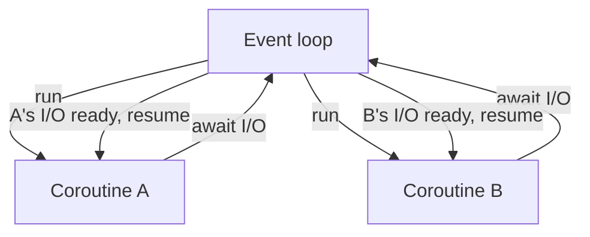

# Async Programming with asyncio

> **TL;DR:** `asyncio` lets a single thread interleave many I/O-bound tasks by suspending each coroutine while it waits, so you can fan out hundreds of API calls concurrently without threads.

---

## Overview
Async programming is the standard way to make I/O-bound Python fast. When your bottleneck is waiting — on network calls to LLM APIs, database reads, or file I/O — `asyncio` lets one thread juggle thousands of in-flight operations by switching to other work whenever one is blocked on I/O. This is the backbone of high-throughput inference gateways and data pipelines that fan out many concurrent requests.

**By the end, you will be able to:**
- Distinguish concurrency from parallelism and choose async for I/O-bound work.
- Define and run coroutines with `async`/`await` and `asyncio.run`.
- Fan out many concurrent I/O calls with tasks and `asyncio.gather`, and avoid blocking pitfalls.

---

## Intuition
Imagine one chef (a single thread) cooking many dishes. Instead of standing idle while a pot boils, the chef starts the next dish and returns when a timer rings. Nothing cooks *faster* individually, but total throughput soars because idle waiting time is reused. `await` is the chef saying "this is boiling, let me do something else meanwhile."

---

## Details

### Concurrency vs parallelism
Concurrency is *dealing with* many tasks by interleaving them; parallelism is *doing* many tasks literally at the same time on multiple cores. `asyncio` gives you concurrency on a single thread — great for I/O-bound work where tasks spend most of their time waiting. It does not give you parallelism and will not speed up CPU-bound work.

### Coroutines, `async` and `await`
A coroutine is a function defined with `async def`. Calling it returns a coroutine object that does nothing until awaited. Inside a coroutine, `await` suspends execution until the awaited operation completes, yielding control back to the event loop meanwhile.

```python
import asyncio


async def fetch_completion(prompt: str) -> str:
    """Simulate an async LLM API call that waits on the network."""
    await asyncio.sleep(0.5)  # non-blocking wait; yields to the loop
    return f"response to: {prompt}"
```

### The event loop
The event loop is the scheduler that runs coroutines, suspends them at each `await`, and resumes them when their awaited I/O is ready. You rarely touch it directly — `asyncio.run` creates a loop, runs your top-level coroutine to completion, and closes the loop.

```python
async def main() -> None:
    result = await fetch_completion("summarize this")
    print(result)


asyncio.run(main())  # entry point; do not call inside a running loop
```

### Tasks and `asyncio.gather`
Awaiting coroutines one by one is sequential. To run them concurrently, schedule them as tasks (or hand them to `asyncio.gather`), which lets the loop interleave their waits.

```python
async def fetch_all(prompts: list[str]) -> list[str]:
    # gather schedules all coroutines and awaits them concurrently,
    # returning results in the original order.
    return await asyncio.gather(*(fetch_completion(p) for p in prompts))
```

### Fanning out many I/O-bound calls
This is the payoff. Ten calls that each wait 0.5s take about 0.5s total when run concurrently, not 5s — because the waits overlap.

```python
async def main() -> None:
    prompts = [f"question {i}" for i in range(10)]
    responses = await fetch_all(prompts)  # ~0.5s total, not ~5s
    print(len(responses))


asyncio.run(main())
```

### When async helps — and when it hurts
Async shines for I/O-bound workloads: many network calls, database queries, or file reads. It does **not** help CPU-bound work (parsing huge files, matrix math), because a busy coroutine never yields to the loop. For CPU-bound work use processes; for blocking libraries, offload to a thread with `asyncio.to_thread`.

### Pitfall: blocking calls
A single synchronous blocking call inside a coroutine freezes the entire event loop — every other task stalls. Never call `time.sleep`, blocking `requests`, or heavy CPU work directly in a coroutine.

```python
import asyncio
import time


async def bad() -> None:
    time.sleep(1)  # WRONG: blocks the whole loop for 1s


async def good() -> None:
    await asyncio.sleep(1)  # yields to the loop
    # For an unavoidable blocking call, offload it:
    # await asyncio.to_thread(blocking_function, arg)
```

## Diagram


## Worked Example
Fan out many LLM API requests concurrently with a semaphore to respect rate limits — the standard pattern for batch inference.

```python
import asyncio


async def call_llm(prompt: str, sem: asyncio.Semaphore) -> str:
    """One rate-limited async request."""
    async with sem:  # cap concurrency to avoid hitting rate limits
        await asyncio.sleep(0.2)  # stand-in for the network round trip
        return f"answer: {prompt}"


async def main() -> None:
    prompts = [f"q{i}" for i in range(50)]
    sem = asyncio.Semaphore(10)  # at most 10 requests in flight
    results = await asyncio.gather(*(call_llm(p, sem) for p in prompts))
    print(f"got {len(results)} responses")


asyncio.run(main())
```

The semaphore bounds concurrency to 10, so you get high throughput without overwhelming the API or breaching rate limits.

## Best Practices
- ✅ Use `asyncio.run` once as the single entry point to your async program.
- ✅ Use `asyncio.gather` (or task groups) to run independent I/O concurrently.
- ✅ Bound concurrency with `asyncio.Semaphore` when calling rate-limited APIs.
- ✅ Offload unavoidable blocking calls with `asyncio.to_thread`.

## Common Mistakes
- ⚠️ Putting `time.sleep` or blocking I/O in a coroutine, freezing the loop — use `await asyncio.sleep` or offload to a thread.
- ⚠️ Awaiting coroutines sequentially in a loop and expecting concurrency — gather them instead.
- ⚠️ Forgetting that calling a coroutine does nothing until it is awaited or scheduled.
- ⚠️ Reaching for async to speed up CPU-bound work — it will not help; use multiprocessing.

## Industry Tips
- 💡 Use an async HTTP client (async-capable libraries) rather than blocking clients inside coroutines, or your concurrency collapses to serial.
- 💡 Prefer `asyncio.gather(..., return_exceptions=True)` (or task groups) so one failed request does not cancel the whole batch.

## Real-World Use Cases
- Fanning out hundreds of concurrent LLM or embedding API calls.
- High-throughput inference gateways and API proxies.
- Concurrent database and cache reads during request handling.
- Web scraping and bulk downloading for dataset collection.

---

## Summary
- Async gives single-thread concurrency, ideal for I/O-bound work and useless for CPU-bound work.
- `async def` defines coroutines; `await` suspends them and yields to the event loop.
- `asyncio.run` starts the loop; `gather` and tasks run coroutines concurrently.
- Never block the loop; offload blocking calls with `asyncio.to_thread`.

## Practice
- [ ] Exercises: [Module 1 Exercises](../exercises/README.md)
- [ ] Self-check: Why does calling `time.sleep(1)` inside a coroutine defeat the purpose of asyncio?

## Further Reading
- 📘 Using Asyncio in Python, Caleb Hattingh
- 📄 [asyncio — Asynchronous I/O](https://docs.python.org/3/library/asyncio.html)
- 📄 [PEP 492 — Coroutines with async and await syntax](https://peps.python.org/pep-0492/)
- 🌐 Real Python — https://realpython.com/

## Related
- [Concurrency: Threading vs Multiprocessing](concurrency.md)
- [Iterators and Generators](iterators-and-generators.md)

---

## Navigation
- ⬆️ [Lessons](README.md)
- 📚 [Module 1 — Python for AI Engineering](../README.md)
- 🏠 [Knowledge Base Home](../../README.md)
