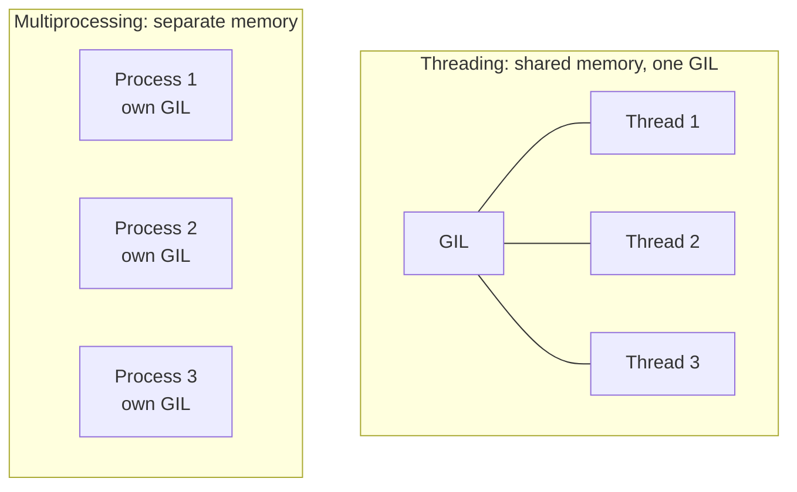

# Concurrency: Threading vs Multiprocessing

> **TL;DR:** Because of the GIL, use threads for I/O-bound work and processes for CPU-bound work; `concurrent.futures` gives a uniform interface for both.

---

## Overview
Choosing the right concurrency model is a core Python engineering skill. The Global Interpreter Lock (GIL) means CPython threads cannot run Python bytecode in parallel, which changes everything about when threads help and when you need processes. In AI engineering you hit this when parallelizing data preprocessing (CPU-bound) versus fetching many files or API responses (I/O-bound).

**By the end, you will be able to:**
- Explain the GIL and its impact on threads.
- Pick threads for I/O-bound and processes for CPU-bound work.
- Use `concurrent.futures` and `multiprocessing`, and decide between threads, processes, and asyncio.

---

## Intuition
Threads share one kitchen (memory) but there is a single microwave (the GIL) that only one cook can use at a time for Python work — great when cooks mostly wait on deliveries (I/O), useless when they all need the microwave (CPU). Processes are separate kitchens with their own microwaves: true parallel cooking, but nothing is shared and moving ingredients between them costs effort.

---

## Details

### The GIL and what it means
The Global Interpreter Lock is a mutex in CPython that allows only one thread to execute Python bytecode at a time. So multiple threads doing pure-Python computation run effectively serially — no speedup on multiple cores. The GIL is released during blocking I/O and inside many C extensions (including NumPy heavy operations), which is exactly why threads still help I/O-bound work.

### Threads for I/O-bound work
When a thread waits on the network or disk, it releases the GIL, letting another thread run. So for downloading files or calling APIs, threads overlap the waiting and boost throughput.

```python
from concurrent.futures import ThreadPoolExecutor
import urllib.request


def download(url: str) -> int:
    """I/O-bound: the GIL is released while waiting on the network."""
    with urllib.request.urlopen(url) as resp:
        return len(resp.read())


urls = ["https://example.com"] * 8
with ThreadPoolExecutor(max_workers=8) as pool:
    sizes = list(pool.map(download, urls))  # downloads overlap
```

### Processes for CPU-bound work
Each process has its own Python interpreter and its own GIL, so CPU-bound work runs truly in parallel across cores. The cost is that data must be serialized (pickled) to cross process boundaries.

```python
from concurrent.futures import ProcessPoolExecutor


def tokenize_count(text: str) -> int:
    """CPU-bound stand-in for heavy per-document preprocessing."""
    return sum(len(w) for w in text.split())


docs = ["lorem ipsum " * 1000 for _ in range(8)]
with ProcessPoolExecutor() as pool:
    counts = list(pool.map(tokenize_count, docs))  # runs on many cores
```

### `concurrent.futures`
`ThreadPoolExecutor` and `ProcessPoolExecutor` share the same API, so you can switch models by changing one class name. Both return `Future` objects; `map` preserves input order, and `submit` plus `as_completed` lets you process results as they finish.

```python
from concurrent.futures import ProcessPoolExecutor, as_completed

with ProcessPoolExecutor() as pool:
    futures = {pool.submit(tokenize_count, d): d for d in docs}
    for fut in as_completed(futures):
        print(fut.result())  # handle results as soon as each is ready
```

### The `multiprocessing` module
`concurrent.futures.ProcessPoolExecutor` is built on `multiprocessing`, which offers lower-level control: `Pool`, `Process`, and IPC primitives like `Queue` and `Pipe`. Reach for it when you need custom worker lifecycles or shared-state constructs; otherwise the executor is simpler and less error-prone.

### Choosing threads vs processes vs asyncio

| Workload | Best choice | Why |
|----------|-------------|-----|
| Many network/API calls | asyncio | Thousands of concurrent waits on one thread, lowest overhead |
| Moderate I/O with blocking libraries | threads | GIL released during I/O; no async rewrite needed |
| CPU-bound (parsing, math, tokenizing) | processes | Sidesteps the GIL for real parallelism |
| Mixed CPU + I/O | processes + async/threads inside | Parallelism plus concurrency |

## Diagram


## Worked Example
Data-parallel preprocessing: clean and count tokens across a corpus using all cores, the standard shape of a preprocessing job before training or indexing.

```python
from concurrent.futures import ProcessPoolExecutor


def preprocess(document: str) -> dict[str, int]:
    """CPU-bound cleaning + counting; runs in a worker process."""
    words = document.lower().split()
    return {"tokens": len(words), "unique": len(set(words))}


def run(corpus: list[str]) -> list[dict[str, int]]:
    # Processes give real parallelism for this CPU-bound map.
    with ProcessPoolExecutor() as pool:
        return list(pool.map(preprocess, corpus, chunksize=64))


if __name__ == "__main__":  # required so child processes can import safely
    corpus = ["The quick brown fox " * 50 for _ in range(1000)]
    stats = run(corpus)
    print(sum(s["tokens"] for s in stats))
```

`chunksize` batches items per worker to amortize the cost of pickling and dispatch — important when each task is small.

## Best Practices
- ✅ Match the model to the bottleneck: threads/async for I/O, processes for CPU.
- ✅ Guard process-pool code with `if __name__ == "__main__":` to avoid re-spawning on import.
- ✅ Use `chunksize` with process pools when tasks are small to cut per-task overhead.
- ✅ Prefer `concurrent.futures` over raw threads/processes for a simpler, uniform API.

## Common Mistakes
- ⚠️ Using threads for CPU-bound work and seeing no speedup — the GIL serializes them; switch to processes.
- ⚠️ Passing huge, unpicklable objects between processes and paying massive serialization cost — send references or file paths instead.
- ⚠️ Omitting the `__main__` guard, causing infinite process spawning on some platforms.
- ⚠️ Sharing mutable state across processes and expecting it to update in the parent — processes have separate memory.

## Industry Tips
- 💡 NumPy, PyTorch, and similar libraries release the GIL inside their C/CUDA kernels, so threads can parallelize array-heavy work more than pure Python suggests.
- 💡 For CPU-bound web/service code, run multiple worker processes (e.g. one per core) rather than fighting the GIL with threads.

## Real-World Use Cases
- Parallel document preprocessing and tokenization across cores.
- Concurrent downloads of datasets, shards, or model weights.
- Batch feature extraction over large corpora.
- Scaling inference servers with multiple worker processes.

---

## Summary
- The GIL prevents parallel Python-bytecode execution, so threads do not speed up CPU-bound work.
- Threads help I/O-bound work because the GIL is released while waiting.
- Processes give true parallelism at the cost of memory isolation and serialization.
- `concurrent.futures` unifies both; asyncio wins for large-scale I/O concurrency.

## Practice
- [ ] Exercises: [Module 1 Exercises](../exercises/README.md)
- [ ] Self-check: Why do threads speed up downloading files but not tokenizing them?

## Further Reading
- 📘 Effective Python, Brett Slatkin
- 📄 [concurrent.futures — Launching parallel tasks](https://docs.python.org/3/library/concurrent.futures.html)
- 📄 [multiprocessing — Process-based parallelism](https://docs.python.org/3/library/multiprocessing.html)
- 🌐 Real Python — https://realpython.com/

## Related
- [Async Programming with asyncio](async-programming.md)
- [Iterators and Generators](iterators-and-generators.md)

---

## Navigation
- ⬆️ [Lessons](README.md)
- 📚 [Module 1 — Python for AI Engineering](../README.md)
- 🏠 [Knowledge Base Home](../../README.md)
