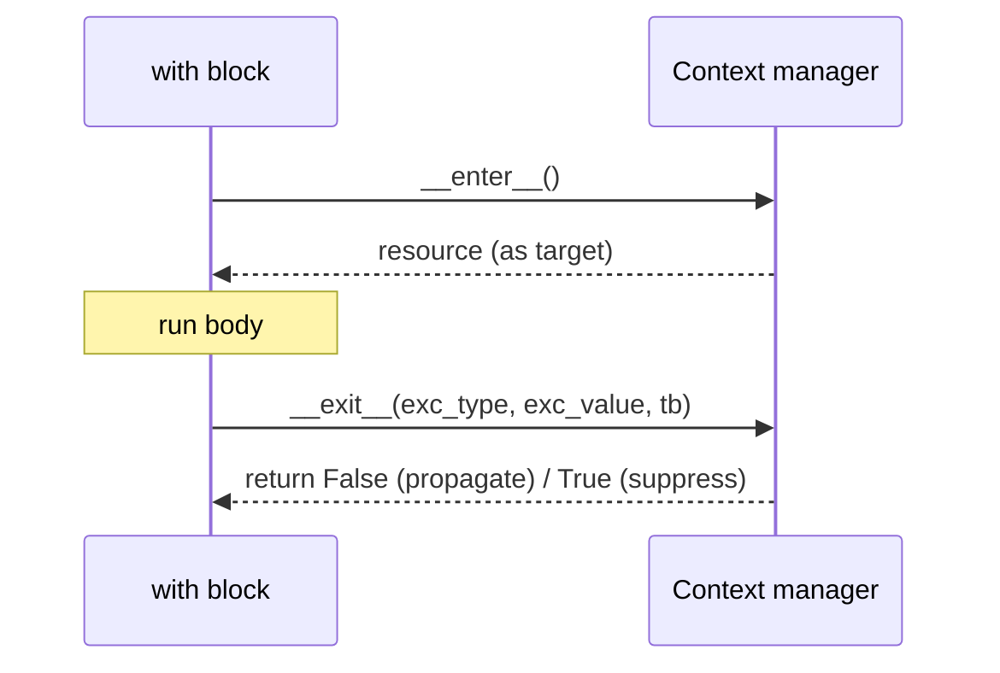

# Context Managers

> **TL;DR:** A context manager guarantees setup and teardown around a block of code — opening and closing files, connections, or temporary state — even when exceptions occur, via the `with` statement.

---

## Overview
Context managers are how Python guarantees cleanup. Whenever you acquire a resource that must later be released — a file handle, a database connection, a GPU state flag, a timer — a context manager ensures release happens even if the body raises. In AI engineering this shows up everywhere, from opening dataset files to `torch.no_grad()` toggling gradient tracking during inference.

**By the end, you will be able to:**
- Explain what the `with` statement guarantees and why it beats manual cleanup.
- Implement the `__enter__`/`__exit__` protocol, including exception handling.
- Write generator-style context managers with `contextlib` and compose several with `ExitStack`.

---

## Intuition
Think of a context manager as a "before and after" bracket around your code. Entering the block runs the setup; leaving it — normally or via an exception — runs the teardown. It is the automatic version of "always remember to close the door behind you," so you never forget even when you leave in a hurry (an error).

---

## Details

### The `with` statement and why
Without `with`, you must manually pair acquire and release, and wrap the body in `try/finally` to survive exceptions. That is verbose and easy to get wrong.

```python
# Fragile: if processing raises, the file may never close.
f = open("data.jsonl")
process(f)
f.close()

# Correct and concise: close() is guaranteed.
with open("data.jsonl") as f:
    process(f)
```

The `with` statement calls the object's `__enter__` on entry (binding its return to the `as` name) and its `__exit__` on exit, regardless of how the block ends.

### The `__enter__` / `__exit__` protocol
Any object implementing these two methods is a context manager.

```python
class DBConnection:
    """Minimal example of the context-manager protocol."""

    def __init__(self, dsn: str) -> None:
        self.dsn = dsn
        self.conn = None

    def __enter__(self):
        self.conn = connect(self.dsn)  # acquire the resource
        return self.conn  # bound to the `as` variable

    def __exit__(self, exc_type, exc_value, traceback) -> bool:
        self.conn.close()  # always runs, even on exception
        return False  # do not suppress exceptions
```

### Exception handling in `__exit__`
`__exit__` receives the exception type, value, and traceback if the block raised, or three `None` values if it exited normally. Return `False` (or `None`) to let any exception propagate; return `True` only when you deliberately want to suppress it. Cleanup code must run before that decision.

```python
def __exit__(self, exc_type, exc_value, traceback) -> bool:
    self.conn.close()
    if exc_type is not None:
        # Log, but re-raise by returning False.
        print(f"rolled back due to {exc_type.__name__}")
    return False
```

### Generator style with `contextlib.contextmanager`
For simple cases, writing a class is overkill. The `@contextmanager` decorator turns a generator into a context manager: code before `yield` is setup, the yielded value is bound to `as`, and code after `yield` is teardown. Wrap the `yield` in `try/finally` so teardown runs on exceptions.

```python
import contextlib
import time


@contextlib.contextmanager
def timer(label: str):
    """Time a block of code, e.g. a batch of model calls."""
    start = time.perf_counter()
    try:
        yield  # control returns to the `with` body here
    finally:
        print(f"{label}: {time.perf_counter() - start:.3f}s")


with timer("inference"):
    run_batch()
```

### Composing with `contextlib.ExitStack`
When the number of resources is dynamic — for example opening a variable list of shard files — `ExitStack` lets you enter many context managers and guarantees all are exited in reverse order.

```python
import contextlib


def open_shards(paths: list[str]):
    with contextlib.ExitStack() as stack:
        files = [stack.enter_context(open(p)) for p in paths]
        merge(files)  # all files closed when the block exits
```

## Diagram


## Worked Example
A common inference pattern: disable gradient tracking and time the run. `torch.no_grad()` is a real, widely-used context manager that temporarily changes global state (gradient tracking) and restores it on exit.

```python
import contextlib
import time

# Illustrative; requires PyTorch installed.
# import torch


@contextlib.contextmanager
def timed(label: str):
    start = time.perf_counter()
    try:
        yield
    finally:
        print(f"{label}: {time.perf_counter() - start:.3f}s")


def run_inference(model, batch):
    # `torch.no_grad()` turns off autograd inside the block and
    # restores the previous setting on exit — a context manager.
    with timed("forward"):  # , torch.no_grad():
        return model(batch)
```

The teardown (restoring gradient state, printing the timer) is guaranteed even if `model(batch)` raises.

## Best Practices
- ✅ Prefer `with` over manual `open`/`close` or `try/finally` for any resource.
- ✅ Put teardown in a `finally` block when using `@contextmanager` so it survives exceptions.
- ✅ Return `False` from `__exit__` unless you have a specific reason to suppress.
- ✅ Use `ExitStack` when the set of resources is only known at runtime.

## Common Mistakes
- ⚠️ Forgetting `try/finally` around `yield` in a `@contextmanager`, so cleanup is skipped on error — always wrap the `yield`.
- ⚠️ Returning a truthy value from `__exit__` by accident, silently swallowing exceptions — return `False`/`None` unless suppression is intended.
- ⚠️ Doing cleanup after a `return` inside the `with` body instead of in `__exit__` — the manager runs regardless of how you leave.

## Industry Tips
- 💡 Many ML and web frameworks expose state changes as context managers (gradient toggles, transactions, request scopes) so state is always restored — model your own resource wrappers the same way.
- 💡 `contextlib.suppress(SomeError)` is a clean, explicit replacement for empty `try/except` blocks.

## Real-World Use Cases
- Opening dataset files and connections during preprocessing.
- Database transactions that commit on success and roll back on error.
- Toggling inference-mode state (e.g. `torch.no_grad()`).
- Timing and profiling code blocks.

---

## Summary
- `with` guarantees `__enter__` runs on entry and `__exit__` runs on exit, even on exceptions.
- `__exit__` receives exception info and decides (via its return value) whether to suppress it.
- `@contextmanager` is a concise generator-based alternative; `ExitStack` composes many managers.
- The pattern underlies real APIs like `torch.no_grad()`.

## Practice
- [ ] Exercises: [Module 1 Exercises](../exercises/README.md)
- [ ] Self-check: What does returning `True` from `__exit__` do, and when is it appropriate?

## Further Reading
- 📘 Effective Python, Brett Slatkin
- 📄 [contextlib — Utilities for with-statement contexts](https://docs.python.org/3/library/contextlib.html)
- 📄 [PEP 343 — The "with" Statement](https://peps.python.org/pep-0343/)
- 🌐 Real Python — https://realpython.com/

## Related
- [Decorators](decorators.md)
- [Logging and Configuration Management](logging-and-configuration.md)

---

## Navigation
- ⬆️ [Lessons](README.md)
- 📚 [Module 1 — Python for AI Engineering](../README.md)
- 🏠 [Knowledge Base Home](../../README.md)
