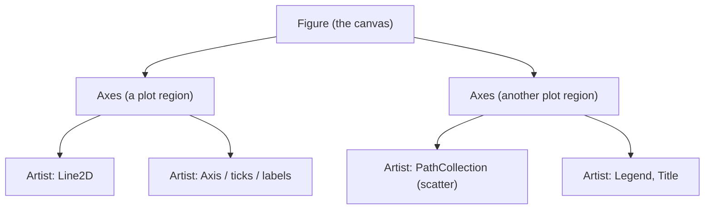

# Data Visualization with Matplotlib and Seaborn

> **TL;DR:** Matplotlib gives you a `Figure`/`Axes` object model you should drive explicitly; Seaborn sits on top of it to turn tidy DataFrames into statistical plots in one line. Together they power fast, honest exploratory data analysis (EDA).

---

## Overview
Before a model sees your data, you look at it — distributions, relationships, outliers, and class balance are all easier to judge as pictures than as tables. Matplotlib is the foundational plotting library in Python; Seaborn is a higher-level layer that produces good-looking statistical charts from `pandas` DataFrames. Knowing where one ends and the other begins keeps your EDA fast and your figures reproducible.

**By the end, you will be able to:**
- Explain the Matplotlib `Figure` → `Axes` → `Artist` object model and why to prefer the explicit OO API over the `pyplot` state machine.
- Produce the core EDA plots (line, scatter, histogram, bar) and lay them out in a grid of subplots.
- Use Seaborn for statistical plots and choose the right chart for a given question.

---

## Intuition
Think of a Matplotlib figure like a physical canvas. The `Figure` is the whole sheet of paper. On it you place one or more `Axes` — each a self-contained plot with its own x/y coordinate system (an `Axes` is *not* a single axis; it is a plotting area). Everything you draw inside — lines, dots, bars, labels, ticks — is an `Artist`. When you keep an explicit handle on the figure and its axes, you always know exactly which plot you are talking to. Seaborn is a "smart assistant" that draws well-designed Artists onto those Axes for you, given a tidy DataFrame and the columns you care about.

---

## Details

### The pyplot state machine vs. the object-oriented API
`matplotlib.pyplot` offers two ways to plot. The **state-machine** style (`plt.plot(...)`, `plt.title(...)`) draws onto an implicit "current axes." It is quick for a throwaway plot but fragile: as soon as you have multiple subplots, "current" becomes ambiguous. The **object-oriented (OO) API** creates explicit `Figure` and `Axes` objects and calls methods on them. Prefer the OO API for anything you will keep, reuse, or compose.

```python
import matplotlib.pyplot as plt

# Preferred: explicit Figure and Axes handles.
fig, ax = plt.subplots(figsize=(6, 4))
ax.plot([1, 2, 3], [10, 8, 12])
ax.set_title("Explicit OO API")   # method on the Axes, no ambiguity
fig.tight_layout()
```

### The object hierarchy
`plt.subplots()` returns a `Figure` and one or more `Axes`. You set data and cosmetics on the `Axes` (`ax.plot`, `ax.set_xlabel`, `ax.legend`) and figure-level concerns on the `Figure` (`fig.suptitle`, `fig.savefig`). Almost every visible element is an `Artist` you can retrieve and tweak.

### Core plot types
Each plot answers a different question. Below, `ax` is an `Axes` from `plt.subplots()`.

```python
import numpy as np

rng = np.random.default_rng(0)
x = np.linspace(0, 10, 100)

fig, ax = plt.subplots()
ax.plot(x, np.sin(x), label="sin")          # line: trend over an ordered axis
ax.scatter(rng.random(50), rng.random(50))  # scatter: relationship between two vars
ax.hist(rng.normal(size=1000), bins=30)     # histogram: distribution of one var
ax.bar(["a", "b", "c"], [3, 7, 2])          # bar: compare categories
ax.legend()
```

### Subplots: a grid of Axes
Pass `nrows`/`ncols` to `plt.subplots()` to get a NumPy array of Axes you index directly.

```python
fig, axes = plt.subplots(nrows=1, ncols=2, figsize=(9, 4))
axes[0].hist(rng.normal(size=500), bins=25)
axes[0].set_title("Distribution")
axes[1].scatter(rng.random(100), rng.random(100))
axes[1].set_title("Relationship")
fig.tight_layout()   # prevent labels from overlapping
```

### Styling, labels, and titles
Untitled axes are a bug, not a style choice. Always label what a reader cannot infer.

```python
fig, ax = plt.subplots()
ax.plot(x, np.cos(x), color="tab:blue", linewidth=2)
ax.set_xlabel("time (s)")
ax.set_ylabel("amplitude")
ax.set_title("Signal over time")
fig.savefig("signal.png", dpi=150, bbox_inches="tight")  # reproducible export
```

### Seaborn: statistical plots on top of Matplotlib
Seaborn wraps Matplotlib. Every Seaborn call ultimately draws Artists onto a Matplotlib `Axes`, and it returns that `Axes`, so you can keep styling with the OO API. Seaborn's advantage is that it understands tidy DataFrames: you name columns, and it handles aggregation, grouping, and color.

```python
import seaborn as sns
import pandas as pd

df = sns.load_dataset("penguins").dropna()

sns.histplot(data=df, x="flipper_length_mm", hue="species")  # distribution by group
sns.boxplot(data=df, x="species", y="body_mass_g")           # spread + outliers
sns.heatmap(df.select_dtypes("number").corr(), annot=True)   # correlation matrix
sns.pairplot(df, hue="species")                              # all pairwise scatters
```

- **`histplot`** — distribution of one variable, optionally split by a categorical `hue`.
- **`boxplot`** — median, quartiles, and outliers per category.
- **`heatmap`** — a matrix (often a correlation matrix) as a color grid.
- **`pairplot`** — a grid of scatter plots for every pair of numeric columns; a fast first look at a dataset.

## Diagram



## Worked Example
You are starting a classification project and need a quick read on a labeled dataset: is a numeric feature distributed differently across classes, and are any features strongly correlated?

```python
import matplotlib.pyplot as plt
import seaborn as sns

df = sns.load_dataset("penguins").dropna()

# One figure, two Axes: distribution by class, and a correlation heatmap.
fig, axes = plt.subplots(nrows=1, ncols=2, figsize=(11, 4))

# Left: is body mass separable by species? (a good sign for a classifier)
sns.histplot(
    data=df, x="body_mass_g", hue="species",
    element="step", ax=axes[0],   # route Seaborn onto a specific Axes
)
axes[0].set_title("Body mass by species")

# Right: which numeric features move together? (redundant features are candidates to drop)
corr = df.select_dtypes("number").corr()
sns.heatmap(corr, annot=True, fmt=".2f", cmap="coolwarm", ax=axes[1])
axes[1].set_title("Feature correlations")

fig.tight_layout()
fig.savefig("eda_overview.png", dpi=150, bbox_inches="tight")
```

The histogram shows whether classes separate on a feature; the heatmap flags redundant features. Both are drawn onto explicit Axes, so the layout and export stay under your control.

## Best Practices
- ✅ Use the OO API (`fig, ax = plt.subplots()`) and pass `ax=` to Seaborn so every plot has a known home.
- ✅ Label axes and add a title on every figure you keep — a plot without units is unreadable.
- ✅ Call `fig.tight_layout()` before saving to stop labels from clipping or overlapping.
- ✅ Seed your random number generator when generating example data so figures are reproducible.

## Common Mistakes
- ⚠️ Mixing `plt.title(...)` (state machine) with multiple subplots titles the wrong axes — use `ax.set_title(...)` instead.
- ⚠️ Choosing a line plot for unordered categories — lines imply an ordered x-axis; use a bar plot for categories.
- ⚠️ Reading a correlation heatmap as causation — correlation only measures linear association, not cause.
- ⚠️ Forgetting `dropna()`/clean input before `pairplot` or `corr`, which can silently distort the picture.

## Industry Tips
- 💡 In notebooks, assign the last plotting call to a variable (e.g. `_ = ax.plot(...)`) to suppress the noisy repr line.
- 💡 `fig.savefig(..., bbox_inches="tight")` produces clean figures for reports and slides without manual cropping.
- 💡 Seaborn's `hue`, `col`, and `row` parameters let you facet by category without writing subplot loops.

## Real-World Use Cases
- EDA before training: checking class balance, feature distributions, and outliers.
- Diagnosing models: plotting learning curves, residuals, and confusion matrices.
- Communicating results to stakeholders with labeled, exportable figures.

---

## Summary
- Matplotlib's model is `Figure` → `Axes` → `Artist`; the explicit OO API avoids the ambiguity of the `pyplot` state machine.
- Line, scatter, histogram, and bar plots each answer a distinct question — match the chart to the question.
- Seaborn draws statistical plots (`histplot`, `boxplot`, `heatmap`, `pairplot`) onto Matplotlib Axes from tidy DataFrames.

## Practice
- [ ] Exercises: [Module 1 Exercises](../exercises/README.md)
- [ ] Self-check: When would you reach for a bar plot instead of a line plot, and why?

## Further Reading
- 📘 Python for Data Analysis, Wes McKinney
- 📄 [Matplotlib documentation](https://matplotlib.org/stable/)
- 📄 [Seaborn documentation](https://seaborn.pydata.org/)
- 🌐 Real Python — https://realpython.com/

## Related
- [Pandas for Data Work](pandas.md)
- [Data Cleaning and Wrangling](data-cleaning-and-wrangling.md)

---

## Navigation
- ⬆️ [Lessons](README.md)
- 📚 [Module 1 — Python for AI Engineering](../README.md)
- 🏠 [Knowledge Base Home](../../README.md)
