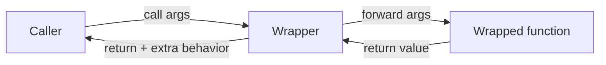

# Decorators

> **TL;DR:** A decorator is a callable that takes a function and returns a new function, letting you inject reusable behavior (timing, caching, logging, retries) without touching the wrapped function's body.

---

## Overview
Decorators are Python's canonical way to add cross-cutting behavior to functions and methods. In AI engineering you reach for them constantly: caching expensive embeddings, timing model calls, retrying flaky LLM API requests, and logging inputs and outputs. Understanding decorators means understanding functions as first-class objects and closures — the two ideas everything else builds on.

**By the end, you will be able to:**
- Write decorators for functions that take arbitrary arguments.
- Build decorator factories that accept their own configuration.
- Choose between function-based and class-based decorators and preserve metadata correctly.

---

## Intuition
Think of a decorator as gift-wrapping. The present (your function) is unchanged inside, but the wrapping adds something on the outside — a label, a bow, a delay before opening. When someone "opens" the gift by calling it, they interact with the wrapping first, which then hands control to the real function and wraps the result on the way back out.

---

## Details

### Functions are objects
In Python, functions are ordinary objects. You can assign them to variables, pass them as arguments, and return them from other functions. This is what makes decorators possible.

```python
def greet(name: str) -> str:
    return f"Hello, {name}"

# Functions can be bound to new names and passed around.
say = greet
print(say("Ada"))  # Hello, Ada
```

### Closures
A closure is a nested function that remembers variables from the scope in which it was created, even after that scope has returned. Decorators use closures to "capture" the wrapped function.

```python
def multiplier(factor: int):
    def multiply(x: int) -> int:
        # `factor` is captured from the enclosing scope.
        return x * factor
    return multiply

double = multiplier(2)
print(double(10))  # 20
```

### Writing a decorator
A decorator is just a function that takes a function and returns a replacement. The `@` syntax is sugar for `func = decorator(func)`.

```python
import functools
import time


def timed(func):
    @functools.wraps(func)  # copies __name__, __doc__, etc. to the wrapper
    def wrapper(*args, **kwargs):
        start = time.perf_counter()
        result = func(*args, **kwargs)
        elapsed = time.perf_counter() - start
        print(f"{func.__name__} took {elapsed:.3f}s")
        return result
    return wrapper


@timed
def embed(text: str) -> list[float]:
    """Pretend this calls an embedding model."""
    time.sleep(0.1)
    return [0.0] * 8
```

### Why `functools.wraps`
Without `functools.wraps`, the returned `wrapper` replaces your function's identity: `embed.__name__` would become `"wrapper"` and its docstring would be lost. That breaks introspection, debugging, and tools that rely on metadata. `functools.wraps` copies the original function's attributes onto the wrapper, so the decorated function still looks like itself.

### Decorating functions with arguments
Using `*args, **kwargs` in the wrapper lets one decorator work for any signature — a function with no arguments, positional arguments, or keyword arguments. This is why the `timed` example above works for `embed(text)` and would equally work for a zero-argument function.

### Decorators that take arguments (decorator factory)
Sometimes you want to configure the decorator itself, for example a retry count. That needs one more layer: an outer function that takes the configuration and returns the actual decorator.

```python
import functools
import time


def retry(attempts: int = 3, delay: float = 1.0):
    """Retry a function on exception, backing off between tries."""
    def decorator(func):
        @functools.wraps(func)
        def wrapper(*args, **kwargs):
            last_exc: Exception | None = None
            for attempt in range(1, attempts + 1):
                try:
                    return func(*args, **kwargs)
                except Exception as exc:  # narrow this in real code
                    last_exc = exc
                    if attempt < attempts:
                        time.sleep(delay * attempt)  # linear backoff
            assert last_exc is not None
            raise last_exc
        return wrapper
    return decorator


@retry(attempts=3, delay=0.5)
def call_llm(prompt: str) -> str:
    """Simulate a flaky network call to an LLM API."""
    ...
```

### Class-based decorators
A class whose instances are callable (via `__call__`) can also act as a decorator. This is handy when you need to hold state across calls, such as a call counter.

```python
import functools


class CountCalls:
    """Decorator that records how many times a function was called."""

    def __init__(self, func):
        functools.update_wrapper(self, func)  # class equivalent of wraps
        self.func = func
        self.count = 0

    def __call__(self, *args, **kwargs):
        self.count += 1
        return self.func(*args, **kwargs)


@CountCalls
def tokenize(text: str) -> list[str]:
    return text.split()


tokenize("a b c")
tokenize("d e")
print(tokenize.count)  # 2
```

### Built-in: `functools.lru_cache`
You rarely need to hand-write a cache. `functools.lru_cache` memoizes results keyed by arguments — ideal for deterministic, expensive, pure functions.

```python
import functools


@functools.lru_cache(maxsize=1024)
def token_count(text: str) -> int:
    """Expensive-ish computation cached by input string."""
    return len(text.split())
```

## Diagram


## Worked Example
Combine caching and timing on an embedding call — a realistic pattern when preprocessing a corpus for a vector store.

```python
import functools
import time


def timed(func):
    @functools.wraps(func)
    def wrapper(*args, **kwargs):
        start = time.perf_counter()
        result = func(*args, **kwargs)
        print(f"{func.__name__} took {time.perf_counter() - start:.4f}s")
        return result
    return wrapper


@timed
@functools.lru_cache(maxsize=10_000)
def embed(text: str) -> tuple[float, ...]:
    """Cache identical texts so we never re-embed duplicates."""
    time.sleep(0.05)  # stand-in for a model/API call
    return tuple(float(len(text)) for _ in range(4))


embed("hello world")  # slow: computed and cached
embed("hello world")  # fast: served from cache
```

Decorators apply bottom-up: `lru_cache` wraps `embed` first, then `timed` wraps the cached version, so the timer measures cache hits and misses alike.

## Best Practices
- ✅ Always use `functools.wraps` (or `functools.update_wrapper`) to preserve the wrapped function's metadata.
- ✅ Prefer `functools.lru_cache` over hand-rolled caches for pure functions.
- ✅ Accept `*args, **kwargs` in wrappers so one decorator handles any signature.
- ✅ Keep decorators focused: one concern per decorator, then stack them.

## Common Mistakes
- ⚠️ Forgetting `functools.wraps`, which erases `__name__` and docstrings — add the decorator to the inner wrapper.
- ⚠️ Confusing a decorator with a decorator factory: if your decorator takes arguments, you need three nested layers, not two.
- ⚠️ Caching non-deterministic or side-effecting functions with `lru_cache`, which returns stale or wrong results — only cache pure functions.
- ⚠️ Catching bare `Exception` in a retry loop and swallowing real bugs — catch the specific network/timeout errors instead.

## Industry Tips
- 💡 Retry decorators should add jitter and exponential backoff for real API calls to avoid thundering-herd retries against rate-limited LLM endpoints.
- 💡 For production, mature libraries (e.g. `tenacity` for retries) already handle backoff, jitter, and exception filtering — reach for them before writing your own.

## Real-World Use Cases
- Wrapping LLM/API calls with retry and backoff logic.
- Memoizing embeddings or tokenization with `lru_cache`.
- Timing and logging model inference latency.
- Registering plugins or tools by decorating handler functions.

---

## Summary
- A decorator takes a function and returns a replacement built with a closure.
- Use `*args, **kwargs` for generality and `functools.wraps` to keep metadata.
- Decorator factories add an outer layer to accept configuration; class-based decorators hold state.
- `functools.lru_cache` is the built-in memoization decorator for pure functions.

## Practice
- [ ] Exercises: [Module 1 Exercises](../exercises/README.md)
- [ ] Self-check: Why does a decorator that takes arguments require three nested functions instead of two?

## Further Reading
- 📘 Fluent Python, Luciano Ramalho
- 📄 [functools — Higher-order functions and operations on callable objects](https://docs.python.org/3/library/functools.html)
- 📄 [PEP 318 — Decorators for Functions and Methods](https://peps.python.org/pep-0318/)
- 🌐 Real Python — https://realpython.com/

## Related
- [Functional Programming in Python](functional-programming.md)
- [Context Managers](context-managers.md)

---

## Navigation
- ⬆️ [Lessons](README.md)
- 📚 [Module 1 — Python for AI Engineering](../README.md)
- 🏠 [Knowledge Base Home](../../README.md)
