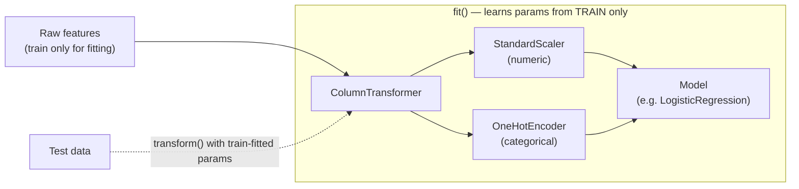

# Feature Engineering

> **TL;DR:** A feature is a measurable input a model learns from; engineering good features often beats swapping algorithms. Scale numerics, encode categoricals, extract signal from dates and text — and fit every transform on the training data only, using a scikit-learn `Pipeline` to make leakage impossible.

---

## Overview
Models learn from features, not raw records. Feature engineering is the craft of transforming clean columns into representations that expose the signal a model can use — and it frequently moves the needle more than a fancier estimator. The single most dangerous mistake here is **data leakage**: letting information from the test set influence the training transforms. This lesson covers the core transformations and shows how scikit-learn's `Pipeline` and `ColumnTransformer` structurally prevent leakage.

**By the end, you will be able to:**
- Explain why features matter and pick the right transform for numeric, categorical, datetime, and text columns.
- Describe and avoid data leakage by fitting transforms on training data only.
- Assemble a leak-proof preprocessing + model workflow with `Pipeline` and `ColumnTransformer`.

---

## Intuition
A model is only as smart as the questions its features let it ask. Raw data often hides the useful question: a timestamp is uninformative, but "is this a weekend?" might be highly predictive. Feature engineering reshapes the data so the pattern becomes easy to see. The catch: whenever a transform *learns* something from data (a mean, a scale, a vocabulary), it must learn it from the training set alone — otherwise the model peeks at answers it will not have in production, and your metrics lie.

---

## Details

### What is a feature, and why engineer it?
A **feature** is a single measurable input column. Engineering matters because most estimators cannot see structure you have not exposed: linear models need scaled inputs, tree models need numeric encodings, and no model can use a raw ISO timestamp well. Better features often beat a better algorithm on the same data.

### Numeric scaling and normalization — and why
Many models are sensitive to feature magnitude:

- **Distance-based** models (k-NN, SVM with RBF, k-means) let large-range features dominate the distance metric.
- **Gradient-based** models (logistic/linear regression, neural nets) converge faster and more stably when features share a scale.

Tree-based models (random forests, gradient boosting) are scale-invariant and generally do not need scaling.

```python
from sklearn.preprocessing import StandardScaler, MinMaxScaler

# StandardScaler: center to mean 0, unit variance. Default choice.
StandardScaler()
# MinMaxScaler: squash to [0, 1]. Useful when you need bounded inputs.
MinMaxScaler()
```

### Encoding categoricals — and the cardinality problem
Models need numbers, so categoricals must be encoded:

- **One-hot encoding** — one binary column per category. Correct for *nominal* (unordered) categories, but the column count explodes with high **cardinality** (many distinct values), causing sparse, memory-heavy matrices.
- **Ordinal encoding** — map categories to integers. Only valid when the categories have a genuine order (e.g. `low < medium < high`); using it on unordered categories invents a false ranking.

```python
from sklearn.preprocessing import OneHotEncoder, OrdinalEncoder

OneHotEncoder(handle_unknown="ignore")  # nominal; ignore unseen test categories
OrdinalEncoder(categories=[["low", "medium", "high"]])  # only for ordered data
```

For very high-cardinality columns (e.g. user ids, zip codes), one-hot becomes impractical; alternatives include grouping rare categories, target/frequency encoding, or learned embeddings.

### Binning
Binning turns a continuous variable into discrete buckets, which can capture non-linear effects for simple models (e.g. age → `child`/`adult`/`senior`).

```python
import pandas as pd

age_bins = pd.cut(df["age"], bins=[0, 12, 18, 65, 120],
                  labels=["child", "teen", "adult", "senior"])
```

### Datetime feature extraction
A raw timestamp is nearly useless; its *components* are informative.

```python
dt = pd.to_datetime(df["timestamp"])
df["hour"] = dt.dt.hour
df["dayofweek"] = dt.dt.dayofweek        # 0 = Monday
df["is_weekend"] = dt.dt.dayofweek >= 5
df["month"] = dt.dt.month
```

### Simple text features
Text must become numeric. At a high level:

- **Bag-of-words** (`CountVectorizer`) — count how often each vocabulary word appears.
- **TF-IDF** (`TfidfVectorizer`) — down-weight words common across all documents, up-weight distinctive ones.

Both learn a *vocabulary from the training corpus*, so they must be fit on train only. These are baselines; dense embeddings and transformers are covered later — see [Machine Learning](../../03-machine-learning/README.md) and the NLP domain.

```python
from sklearn.feature_extraction.text import TfidfVectorizer

TfidfVectorizer(max_features=5000, ngram_range=(1, 2))
```

### Interaction features
Sometimes the signal is in a *combination* of features (e.g. `price_per_room = price / rooms`). Simple models cannot discover such interactions on their own, so create them explicitly when domain knowledge suggests them.

### Data leakage: the critical pitfall
**Data leakage** is when information that would not be available at prediction time influences training. The most common form: fitting a scaler or encoder on the *entire* dataset — including test rows — so the training transform "knows" the test distribution. The rule is absolute: **fit transforms on training data only, then apply the fitted transform to validation/test data.**

```python
# WRONG: scaler sees the whole dataset, including test rows -> leakage.
X_scaled = StandardScaler().fit_transform(X)   # then split afterward

# RIGHT: fit on train, transform test with the train-derived statistics.
scaler = StandardScaler().fit(X_train)
X_train_s = scaler.transform(X_train)
X_test_s = scaler.transform(X_test)
```

### Pipelines and ColumnTransformer prevent leakage
Doing the fit/transform split by hand is error-prone. A scikit-learn `Pipeline` chains transforms and a model into one object; when you call `fit`, every step fits on the training fold only, and `predict` reuses those fitted parameters. `ColumnTransformer` applies different transforms to different columns. Together they make leakage structurally hard — and they behave correctly inside cross-validation automatically.

```python
from sklearn.compose import ColumnTransformer
from sklearn.pipeline import Pipeline
from sklearn.preprocessing import StandardScaler, OneHotEncoder
from sklearn.linear_model import LogisticRegression

numeric = ["age", "income"]
categorical = ["city", "plan"]

preprocess = ColumnTransformer([
    ("num", StandardScaler(), numeric),
    ("cat", OneHotEncoder(handle_unknown="ignore"), categorical),
])

model = Pipeline([
    ("prep", preprocess),
    ("clf", LogisticRegression(max_iter=1000)),
])
```

## Diagram



## Worked Example
Predict a binary outcome from mixed numeric and categorical columns, with a single leak-proof workflow evaluated by cross-validation.

```python
from sklearn.compose import ColumnTransformer
from sklearn.pipeline import Pipeline
from sklearn.preprocessing import StandardScaler, OneHotEncoder
from sklearn.linear_model import LogisticRegression
from sklearn.model_selection import train_test_split, cross_val_score

numeric = ["age", "income"]
categorical = ["city", "plan"]

preprocess = ColumnTransformer([
    ("num", StandardScaler(), numeric),
    ("cat", OneHotEncoder(handle_unknown="ignore"), categorical),
])

clf = Pipeline([
    ("prep", preprocess),
    ("model", LogisticRegression(max_iter=1000)),
])

X_train, X_test, y_train, y_test = train_test_split(
    X, y, test_size=0.2, random_state=0, stratify=y
)

# Each CV fold fits the scaler/encoder on its own training split -> no leakage.
scores = cross_val_score(clf, X_train, y_train, cv=5, scoring="roc_auc")
print(f"CV ROC-AUC: {scores.mean():.3f} +/- {scores.std():.3f}")

clf.fit(X_train, y_train)          # fit preprocessing + model on train
test_auc = clf.score(X_test, y_test)  # test data transformed with train params
```

Because preprocessing lives inside the `Pipeline`, cross-validation refits it per fold and the held-out test set is only ever *transformed* with training-derived parameters.

## Best Practices
- ✅ Put every learned transform inside a `Pipeline`/`ColumnTransformer` so `fit` touches only training data.
- ✅ Scale features for distance- and gradient-based models; skip scaling for tree-based models.
- ✅ Use one-hot for unordered categories and ordinal encoding only when a real order exists.
- ✅ Set `handle_unknown="ignore"` on `OneHotEncoder` so unseen test categories do not crash inference.

## Common Mistakes
- ⚠️ Fitting a scaler/encoder on the full dataset before splitting — classic leakage; fit on train only (a `Pipeline` fixes this).
- ⚠️ Ordinal-encoding unordered categories, which fabricates a false ranking the model may exploit.
- ⚠️ One-hot encoding a high-cardinality column, producing a huge sparse matrix — group rare values or use another encoding.
- ⚠️ Leaving raw timestamps as features — extract components (hour, day-of-week, is_weekend) instead.

## Industry Tips
- 💡 Serialize the whole fitted `Pipeline` (e.g. with `joblib`) so training and serving apply identical preprocessing.
- 💡 A leaked feature often shows up as suspiciously high validation scores that collapse in production — treat "too good" results as a leakage smell.
- 💡 Start with simple, interpretable features; add interactions and fancy encodings only when they earn their keep.

## Real-World Use Cases
- Tabular ML: standardizing and encoding customer or transaction data for classification/regression.
- Text baselines: TF-IDF features for spam or sentiment classifiers before reaching for transformers.
- Time-aware models: deriving calendar features for demand forecasting and anomaly detection.

---

## Summary
- Features are the model's inputs; engineering them often beats changing the algorithm.
- Scale numerics for distance/gradient models, encode categoricals with attention to cardinality and order, and extract signal from dates and text.
- Data leakage — fitting transforms on non-training data — is the critical pitfall; fit on train only.
- `Pipeline` + `ColumnTransformer` make preprocessing leak-proof and correct under cross-validation.

## Practice
- [ ] Exercises: [Module 1 Exercises](../exercises/README.md)
- [ ] Self-check: Why does fitting a `StandardScaler` before the train/test split cause data leakage?

## Further Reading
- 📘 Python for Data Analysis, Wes McKinney
- 📄 [scikit-learn documentation](https://scikit-learn.org/stable/)
- 📄 [pandas documentation](https://pandas.pydata.org/docs/)
- 🌐 Real Python — https://realpython.com/

## Related
- [Data Cleaning and Wrangling](data-cleaning-and-wrangling.md)
- [Machine Learning](../../03-machine-learning/README.md)

---

## Navigation
- ⬆️ [Lessons](README.md)
- 📚 [Module 1 — Python for AI Engineering](../README.md)
- 🏠 [Knowledge Base Home](../../README.md)
