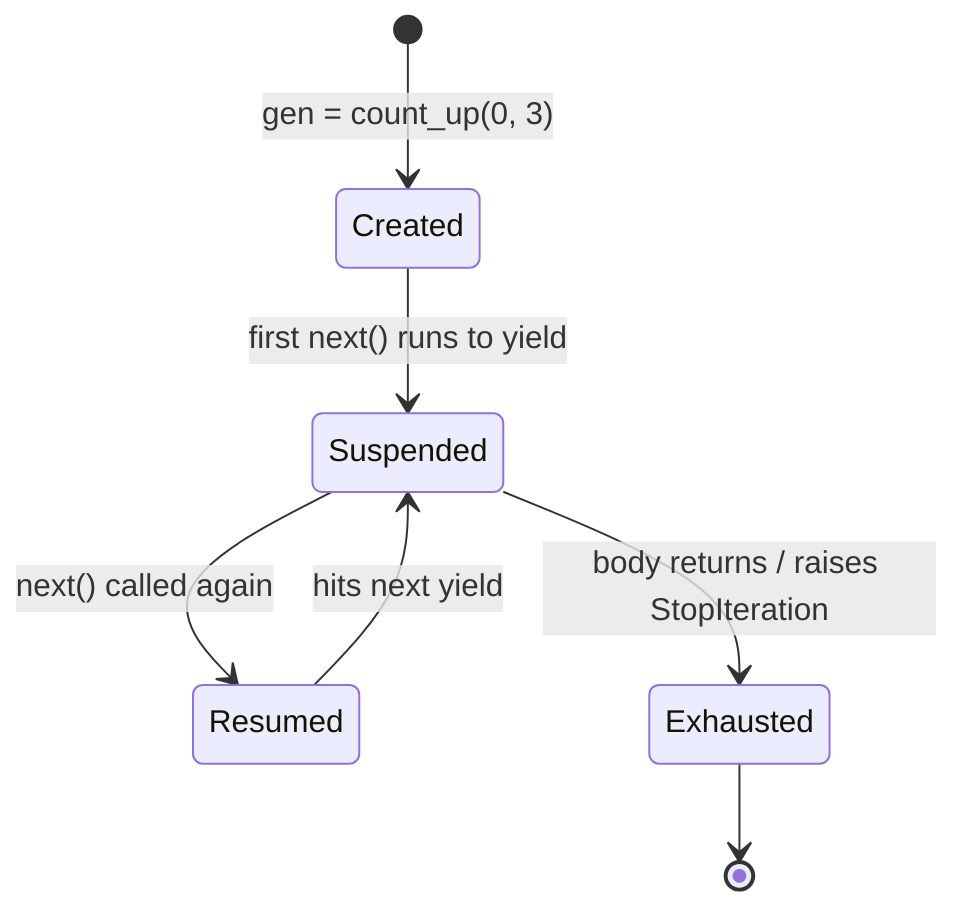

# Iterators and Generators

> **TL;DR:** Iterators produce values one at a time on demand; generators are the easy way to write them with `yield`, giving you lazy, constant-memory streaming that scales to datasets far larger than RAM.

---

## Overview
Training and inference pipelines often process more data than fits in memory. Iterators and generators let you pull records one batch at a time instead of loading everything at once. This lesson explains the iterator protocol, how generators implement it for free, and how to build streaming pipelines that batch records for machine learning.

**By the end, you will be able to:**
- Distinguish an iterable from an iterator and implement the iterator protocol.
- Write generator functions and expressions and explain their laziness.
- Build a memory-efficient streaming pipeline that batches records with `yield` and `yield from`.

---

## Intuition
An iterable is a book; an iterator is a bookmark that remembers your place and knows how to get the next page. You can open many bookmarks into one book, but each bookmark advances independently and, once it reaches the end, it is done. A generator is a function that hands you pages one at a time, pausing its own execution between each — so it never holds the whole book in memory.

---

## Details

### Iterable vs iterator
An **iterable** is anything you can loop over: it implements `__iter__`, which returns a fresh iterator. An **iterator** is the object that actually produces values: it implements `__next__` (and returns itself from `__iter__`). Lists are iterables, not iterators — `iter(mylist)` gives you the iterator.

```python
nums = [1, 2, 3]
it = iter(nums)          # get an iterator from the iterable
print(next(it))          # 1
print(next(it))          # 2
```

### The iterator protocol
To build an iterator by hand you implement `__iter__` (return `self`) and `__next__` (return the next value or raise `StopIteration`).

```python
class CountUp:
    """Iterator yielding integers from start up to (not including) stop."""
    def __init__(self, start: int, stop: int) -> None:
        self._current = start
        self._stop = stop

    def __iter__(self) -> "CountUp":
        return self

    def __next__(self) -> int:
        if self._current >= self._stop:
            raise StopIteration          # signals the loop to end
        value = self._current
        self._current += 1
        return value

print(list(CountUp(0, 3)))               # [0, 1, 2]
```

### Generator functions and yield
A generator function uses `yield`. Calling it returns a generator object without running the body; each `next()` runs until the next `yield`, then suspends, preserving all local state. This is the iterator protocol implemented for you.

```python
def count_up(start: int, stop: int):
    current = start
    while current < stop:
        yield current                    # pause here, resume on next()
        current += 1

print(list(count_up(0, 3)))              # [0, 1, 2]
```

### Generator expressions
A generator expression looks like a comprehension with parentheses. It builds a lazy iterator instead of a full list — ideal for piping into `sum`, `max`, or another stage without allocating an intermediate list.

```python
total = sum(x * x for x in range(1_000_000))   # constant memory, no list built
```

### Laziness and memory efficiency
Generators compute values only when pulled, so memory stays flat regardless of length — even infinite. This is what lets you process a 100 GB log file line by line on a laptop.

```python
from pathlib import Path

def read_lines(path: Path):
    with path.open(encoding="utf-8") as f:
        for line in f:                   # file objects are already lazy iterators
            yield line.rstrip("\n")
```

### yield from
`yield from` delegates to another iterable, yielding all its values. It flattens nested generators cleanly instead of a manual re-yield loop.

```python
def read_many(paths: list[Path]):
    for path in paths:
        yield from read_lines(path)      # stream all files as one sequence
```

### Building streaming pipelines that batch
Models train on batches, but your source is often a one-record-at-a-time stream. A batching generator groups the stream into fixed-size lists without ever materializing the whole dataset.

```python
from itertools import islice
from typing import Iterator, Iterable, TypeVar

T = TypeVar("T")

def batched(source: Iterable[T], size: int) -> Iterator[list[T]]:
    """Yield successive lists of up to `size` items from `source`."""
    it = iter(source)
    while batch := list(islice(it, size)):   # islice pulls at most `size` items
        yield batch
```

## Diagram


## Worked Example
An end-to-end streaming ML preprocessing pipeline: read lines lazily, normalize each, drop empties, and yield training-ready batches — all in constant memory.

```python
from pathlib import Path
from itertools import islice
from typing import Iterator, Iterable

def read_lines(path: Path) -> Iterator[str]:
    with path.open(encoding="utf-8") as f:
        for line in f:
            yield line.rstrip("\n")

def normalize(lines: Iterable[str]) -> Iterator[str]:
    for line in lines:
        cleaned = line.strip().lower()
        if cleaned:                      # skip blanks lazily
            yield cleaned

def batched(source: Iterable[str], size: int) -> Iterator[list[str]]:
    it = iter(source)
    while batch := list(islice(it, size)):
        yield batch

# Compose the stages; nothing is read until we iterate the final generator.
path = Path("corpus.txt")
pipeline = batched(normalize(read_lines(path)), size=32)

for step, batch in enumerate(pipeline):
    train_step(batch)                    # each batch is at most 32 records
```

Peak memory holds one batch, not the file — so the same code runs on a 1 MB or 1 TB corpus.

## Best Practices
- ✅ Use generators for any sequence you consume once, especially large or streamed data.
- ✅ Prefer a generator expression over a list comprehension when feeding an aggregate like `sum`, `any`, or `max`.
- ✅ Use `yield from` to compose and flatten sub-generators instead of manual loops.

## Common Mistakes
- ⚠️ Iterating a generator twice yields nothing the second time — it is exhausted; re-create it or materialize with `list()` if you need to reuse it.
- ⚠️ Calling `len()` on a generator fails — generators have no length; count by consuming, or track size separately.
- ⚠️ Returning inside a generator ends iteration (raises `StopIteration`); it does not yield the returned value.

## Industry Tips
- 💡 Framework data loaders (PyTorch `IterableDataset`, TensorFlow `tf.data`) are built on this exact lazy-iterator model — understanding generators makes them far less mysterious.
- 💡 Generators keep peak memory constant, which is often the difference between a job that fits on one machine and one that OOMs — profile memory, not just speed.

## Real-World Use Cases
- Streaming and batching training data that exceeds RAM.
- Reading and transforming huge log files or JSON-lines datasets line by line.
- Producing tokens incrementally from a model (token-by-token generation streams).

---

## Summary
- An iterable produces iterators; an iterator produces values via `__next__` until `StopIteration`.
- Generators implement the protocol automatically, suspending and resuming at each `yield`.
- Laziness gives constant-memory streaming, which is the foundation of scalable ML data pipelines.

## Practice
- [ ] Exercises: [Module 1 Exercises](../exercises/README.md)
- [ ] Self-check: Why does looping over the same generator object a second time produce no values?

## Further Reading
- 📘 Effective Python, Brett Slatkin
- 📄 [Generators — Python Language Reference](https://docs.python.org/3/reference/expressions.html#yield-expressions)
- 📄 [itertools — Functions creating iterators](https://docs.python.org/3/library/itertools.html)
- 🌐 Real Python — https://realpython.com/

## Related
- [Functional Programming in Python](functional-programming.md)
- [Concurrency: Threading vs Multiprocessing](concurrency.md)

---

## Navigation
- ⬆️ [Lessons](README.md)
- 📚 [Module 1 — Python for AI Engineering](../README.md)
- 🏠 [Knowledge Base Home](../../README.md)
