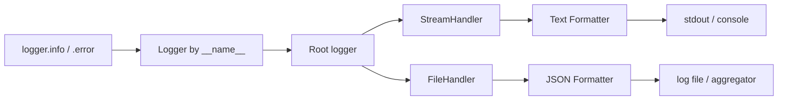

# Logging and Configuration Management

> **TL;DR:** Use the `logging` module (never `print`) configured once at your app's entry point, emit structured logs in production, and keep all configuration — especially secrets — in the environment rather than in code.

---

## Overview
Every AI system you ship needs two operational foundations: visibility into what it is doing (logging) and a clean way to change its behavior across environments without editing code (configuration). Training runs, embedding jobs, and LLM services all fail in production in ways you cannot reproduce locally, so good logs are often your only forensic evidence. Configuration management keeps model names, endpoints, and API keys out of your source tree and lets the same image run in dev, staging, and prod.

**By the end, you will be able to:**
- Configure the `logging` module correctly with loggers, handlers, formatters, and levels.
- Emit structured (JSON) logs suitable for aggregation in production.
- Load configuration from environment variables and `.env` files, keeping secrets out of code and logs.

---

## Intuition
Think of `print` as shouting into a room: everyone hears everything, you cannot turn the volume down, and nothing is recorded. `logging` is more like a company's internal messaging system — messages have a severity ("FYI" vs "the building is on fire"), you can route them to different destinations (console, file, an aggregator), and you can silence entire departments without touching the senders.

Configuration follows the same separation-of-concerns instinct: code is *what* your app does; configuration is *how* it behaves in a given environment. Baking a database URL or API key into code is like soldering the settings dial in place.

---

## Details

### Why `print` is not logging
`print` writes to stdout with no severity, no timestamp, no source, and no way to filter or redirect. You cannot silence it in production without deleting lines, and it gives you no structure to parse later. `logging` solves all of this and is in the standard library.

### The four building blocks
The `logging` module has four core concepts:

- **Logger** — the object you call (`logger.info(...)`). Loggers form a hierarchy by dotted name.
- **Handler** — decides *where* a record goes (console, file, network).
- **Formatter** — decides *how* a record looks (the text layout).
- **Level** — a severity threshold: `DEBUG < INFO < WARNING < ERROR < CRITICAL`.

Always create a module-level logger with `__name__` so records carry their origin and inherit configuration from the root logger:

```python
import logging

# Named after the module; never configured here, only used here.
logger = logging.getLogger(__name__)


def embed_documents(docs: list[str]) -> None:
    """Embed a batch of documents, logging progress at INFO."""
    logger.info("Embedding %d documents", len(docs))
    try:
        # ... call the embedding model ...
        logger.debug("First doc preview: %.40s", docs[0])
    except Exception:
        # exc_info=True attaches the traceback to the log record.
        logger.exception("Embedding batch failed")
        raise
```

Use `%`-style lazy arguments (`"count %d", n`) rather than f-strings so the string is only formatted if the record is actually emitted.

### Configure once, at the entry point
Libraries and modules should only *get* a logger and log to it. **Configuration happens exactly once**, at the application's entry point (`main`, the ASGI startup, the training script top). This avoids duplicate handlers and conflicting formats.

```python
import logging
import sys


def configure_logging(level: str = "INFO") -> None:
    """Configure root logging once at application startup.

    Call this from your entry point only, before other modules log.
    """
    handler = logging.StreamHandler(sys.stdout)
    handler.setFormatter(
        logging.Formatter(
            "%(asctime)s %(levelname)s %(name)s %(message)s"
        )
    )
    root = logging.getLogger()
    root.handlers.clear()  # avoid duplicate handlers on re-entry
    root.addHandler(handler)
    root.setLevel(level)
```

### Structured (JSON) logging for production
Human-readable text is fine for local dev, but log aggregators (Elasticsearch, CloudWatch, Loki) want one JSON object per line so fields are queryable. Emit JSON in production:

```python
import json
import logging


class JsonFormatter(logging.Formatter):
    """Render each log record as a single-line JSON object."""

    def format(self, record: logging.LogRecord) -> str:
        payload = {
            "ts": self.formatTime(record),
            "level": record.levelname,
            "logger": record.name,
            "msg": record.getMessage(),
        }
        if record.exc_info:
            payload["exc"] = self.formatException(record.exc_info)
        return json.dumps(payload)
```

For richer structured logging in real projects, teams commonly adopt `structlog` (https://www.structlog.org/) rather than hand-rolling a formatter.

### The 12-factor config principle
The [Twelve-Factor App](https://12factor.net/config) methodology states that config that varies between deploys (credentials, endpoints, resource handles) belongs in **the environment**, not in code. This gives you one artifact that behaves differently per environment and keeps secrets out of version control.

Read simple values straight from the environment:

```python
import os

# Fail loudly if a required secret is absent — do not default it.
api_key = os.environ["OPENAI_API_KEY"]
model = os.environ.get("LLM_MODEL", "gpt-4o-mini")  # safe default
```

### Loading `.env` and validating config
For local development you keep values in a `.env` file (which is **gitignored**) and load them. Two widely used real tools:

- **`python-dotenv`** (https://pypi.org/project/python-dotenv/) — loads a `.env` file into `os.environ`.
- **`pydantic-settings`** (https://docs.pydantic.dev/latest/concepts/pydantic_settings/) — loads and *validates* config into a typed object.

```python
from pydantic import Field
from pydantic_settings import BaseSettings, SettingsConfigDict


class Settings(BaseSettings):
    """Typed, validated application configuration.

    Values come from environment variables, falling back to a .env file.
    """

    model_config = SettingsConfigDict(env_file=".env", extra="ignore")

    llm_model: str = "gpt-4o-mini"
    max_tokens: int = 512
    openai_api_key: str = Field(...)  # required; no default -> must be set


settings = Settings()  # raises if openai_api_key is missing or malformed
```

Typed settings catch a misspelled or missing variable at startup instead of deep inside a request.

### Never log secrets
Secrets (API keys, tokens, passwords, PII) must never appear in log output, and `.env` files must never be committed. Redact before logging:

```python
def redact(secret: str) -> str:
    """Return a safe preview that never reveals the full secret."""
    return f"{secret[:3]}…{secret[-2:]}" if len(secret) > 5 else "***"

logger.info("Using API key %s", redact(settings.openai_api_key))
```

This mirrors the hard security constraints in the repository's governance — see [Repository Rules](../../.claude/REPOSITORY_RULES.md).

### Log levels in ML pipelines
Choose levels deliberately in training and inference code:

- `DEBUG` — tensor shapes, sample inputs, per-step diagnostics (off in prod).
- `INFO` — lifecycle and progress: "epoch 3/10 started", "loaded 12k rows", metrics per epoch.
- `WARNING` — recoverable oddities: a retry succeeded, a batch was skipped.
- `ERROR` / `CRITICAL` — a job or request failed.

```python
logger.info("epoch=%d train_loss=%.4f val_acc=%.3f", epoch, loss, acc)
```

## Diagram



## Worked Example
An LLM service reads its configuration from the environment, configures JSON logging at startup, and logs a request without leaking the key.

```python
import json
import logging
import sys

from pydantic_settings import BaseSettings, SettingsConfigDict

logger = logging.getLogger(__name__)


class Settings(BaseSettings):
    model_config = SettingsConfigDict(env_file=".env", extra="ignore")
    llm_model: str = "gpt-4o-mini"
    openai_api_key: str  # required


class JsonFormatter(logging.Formatter):
    def format(self, record: logging.LogRecord) -> str:
        return json.dumps(
            {"level": record.levelname, "msg": record.getMessage()}
        )


def main() -> None:
    settings = Settings()  # validates config; fails fast if key missing

    handler = logging.StreamHandler(sys.stdout)
    handler.setFormatter(JsonFormatter())
    root = logging.getLogger()
    root.addHandler(handler)
    root.setLevel("INFO")

    # Log the model, never the key.
    logger.info("Service starting with model=%s", settings.llm_model)


if __name__ == "__main__":
    main()
```

## Best Practices
- ✅ Create one logger per module with `logging.getLogger(__name__)`.
- ✅ Configure logging exactly once, at the application entry point.
- ✅ Emit JSON logs in production so they are queryable in your aggregator.
- ✅ Keep all environment-varying config in the environment (12-factor).
- ✅ Gitignore `.env`; commit a `.env.example` with dummy values only.

## Common Mistakes
- ⚠️ Calling `logging.basicConfig` inside library modules → configure only at the entry point.
- ⚠️ Using f-strings in log calls (`logger.info(f"...")`) → use `%`-style lazy args so filtered records cost nothing.
- ⚠️ Logging full request payloads that contain keys or PII → redact before logging.
- ⚠️ Hard-coding model names or endpoints → read them from settings.
- ⚠️ Defaulting a required secret to an empty string → let a missing secret fail loudly at startup.

## Industry Tips
- 💡 Attach request/trace IDs to log records (via `logging` filters or `structlog` contextvars) so you can follow one request across services.
- 💡 In cloud runtimes, write logs to stdout/stderr and let the platform ship them — do not manage log files yourself (12-factor logs as event streams).
- 💡 Store real secrets in a secrets manager (AWS Secrets Manager, Vault, GCP Secret Manager) and inject them as env vars at deploy time.

## Real-World Use Cases
- Tracking epoch loss and validation metrics during model training.
- Debugging a flaky LLM endpoint by inspecting structured request/latency logs.
- Running the same container in dev and prod, differing only by environment variables.

---

## Summary
- `logging` gives you levels, routing, and structure that `print` cannot.
- Configure logging once at the entry point; modules only get and use loggers.
- Keep config in the environment; validate it with `pydantic-settings`.
- Never log or commit secrets — redact and use a secrets manager.

## Practice
- [ ] Exercises: [Module 1 Exercises](../exercises/README.md)
- [ ] Self-check: Why should `logging.basicConfig` be called at the entry point and not inside imported modules?

## Further Reading
- 📘 The Twelve-Factor App (Adam Wiggins) — https://12factor.net/
- 📄 [Python logging documentation](https://docs.python.org/3/library/logging.html)
- 📄 [pydantic-settings documentation](https://docs.pydantic.dev/latest/concepts/pydantic_settings/)
- 🌐 Real Python — https://realpython.com/
- ▶️ mCoding (YouTube) — https://www.youtube.com/@mCoding

## Related
- [Context Managers](context-managers.md)
- [Python Project Structure and Clean Architecture](project-structure.md)
- Security rules: [Repository Rules](../../.claude/REPOSITORY_RULES.md)

---

## Navigation
- ⬆️ [Lessons](README.md)
- 📚 [Module 1 — Python for AI Engineering](../README.md)
- 🏠 [Knowledge Base Home](../../README.md)
