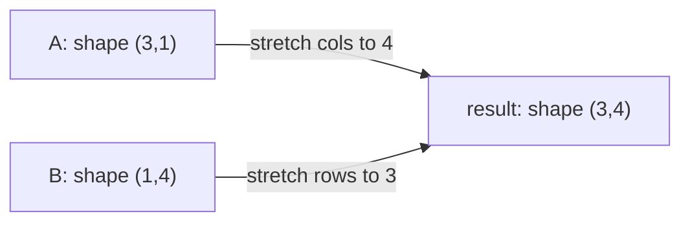

# NumPy for AI Engineering

> **TL;DR:** NumPy gives you a fast, typed, N-dimensional array (`ndarray`) and the vectorized operations that every ML library — from scikit-learn to PyTorch — is built on top of. Think in whole arrays, not loops.

---

## Overview

Almost every numerical workload in AI runs on arrays: feature matrices, weight tensors, token IDs, image pixels. NumPy is the foundational library that defines what an array *is* in Python and how to operate on one efficiently. Understanding it makes pandas, scikit-learn, and the tensor APIs of deep-learning frameworks feel familiar rather than foreign.

**By the end, you will be able to:**

- Create, reshape, index, and slice `ndarray`s while knowing when you have a view vs a copy
- Use broadcasting and vectorization to replace Python loops with fast array expressions
- Apply axis-wise reductions and basic linear algebra for common ML preprocessing

---

## Intuition

A Python `list` is a box of pointers to arbitrary objects scattered across memory. A NumPy `ndarray` is a single, contiguous block of memory holding elements of *one* type, plus a small header describing its shape and how to step through it. That homogeneity is the whole trick: because every element is the same size and laid out end-to-end, NumPy can hand tight loops to optimized C code instead of interpreting Python bytecode per element.

Mentally, picture a spreadsheet that knows its own dimensions and never mixes text with numbers in a numeric column. That discipline is what buys the speed.

---

## Details

### The `ndarray`

The `ndarray` is NumPy's core object. It carries a `shape` (a tuple of dimension sizes), a `dtype` (the element type), and a flat data buffer.

```python
import numpy as np

x = np.array([[1, 2, 3], [4, 5, 6]])
print(x.shape)  # (2, 3) -> 2 rows, 3 columns
print(x.ndim)   # 2 -> number of axes
print(x.dtype)  # int64 (platform-dependent integer type)
```

### Dtypes and why they matter

The `dtype` fixes how many bytes each element uses and how it is interpreted. In AI work this controls both memory and numerical behavior.

```python
weights = np.zeros(1000, dtype=np.float32)  # half the memory of float64
labels = np.array([0, 1, 1, 0], dtype=np.int8)  # tiny integers for class ids
```

- `float32` is the default in most deep-learning frameworks: it halves memory versus `float64` and runs faster on GPUs, at the cost of some precision.
- Integer overflow is silent. An `int8` cannot hold `200`; it wraps around. Choose widths deliberately.

### Creating arrays

```python
np.zeros((2, 3))            # all zeros
np.ones((2, 3))             # all ones
np.full((2, 2), 7.0)        # constant fill
np.arange(0, 10, 2)         # [0 2 4 6 8]
np.linspace(0.0, 1.0, 5)    # 5 evenly spaced points in [0, 1]
np.eye(3)                   # 3x3 identity matrix
```

### Shape and reshape

`reshape` returns a new view with a different shape but the same underlying data (when possible), so it is cheap. Use `-1` to let NumPy infer one dimension.

```python
v = np.arange(12)
m = v.reshape(3, 4)      # 3x4 view, no data copied
batch = v.reshape(-1, 2) # infer rows -> 6x2
```

### Indexing and slicing: views vs copies

**Basic slicing returns a view** — a window onto the original buffer. Writing through it mutates the source. **Fancy indexing** (with an integer or boolean array) returns a **copy**.

```python
a = np.arange(10)
window = a[2:5]     # view
window[0] = 99      # also changes a[2]!

picked = a[[2, 4, 6]]  # fancy indexing -> independent copy
mask = a > 5           # boolean array
big = a[mask]          # copy of elements where mask is True
```

> Term: a **view** shares memory with its parent; a **copy** owns its own memory. Call `.copy()` when you need to mutate without side effects.

### Broadcasting

Broadcasting lets NumPy operate on arrays of different shapes without explicit loops or tiling. NumPy compares shapes from the trailing (rightmost) dimension; two dimensions are compatible when they are equal or one of them is `1`. A size-`1` dimension is stretched to match.

```python
# Standardize a feature matrix: subtract per-column mean, divide by per-column std.
X = np.random.default_rng(0).normal(size=(100, 4))  # 100 samples, 4 features
mean = X.mean(axis=0)   # shape (4,)
std = X.std(axis=0)     # shape (4,)
X_scaled = (X - mean) / std  # (100, 4) - (4,) broadcasts across rows
```

Here `(100, 4)` and `(4,)` align on the trailing axis; the mean vector is applied to every row without a loop.

### Vectorization vs Python loops

A vectorized expression pushes the per-element work into compiled C. A Python `for` loop pays interpreter overhead on every iteration. Vectorized NumPy is typically much faster and shorter.

```python
# Slow: explicit loop
out = np.empty_like(X)
for i in range(X.shape[0]):
    for j in range(X.shape[1]):
        out[i, j] = X[i, j] ** 2

# Fast and clear: one vectorized expression
out = X ** 2
```

### Axis-wise reductions

Reductions collapse an axis. `axis=0` reduces down the rows (per column); `axis=1` reduces across columns (per row). Omitting `axis` reduces the whole array.

```python
scores = np.array([[0.2, 0.5, 0.3], [0.1, 0.7, 0.2]])
scores.sum(axis=1)   # per-row totals -> [1.0, 1.0]
scores.max(axis=1)   # per-row max -> [0.5, 0.7]
scores.argmax(axis=1)  # predicted class index per row -> [1, 1]
```

### Basic linear algebra

The `@` operator is matrix multiplication (PEP 465). `np.dot` computes dot products and matrix products; `np.linalg` holds decompositions and solvers.

```python
W = np.random.default_rng(1).normal(size=(4, 3))  # weights: 4 -> 3
X = np.random.default_rng(2).normal(size=(10, 4)) # batch of 10
logits = X @ W          # (10, 4) @ (4, 3) -> (10, 3)

A = np.array([[3.0, 1.0], [1.0, 2.0]])
b = np.array([9.0, 8.0])
sol = np.linalg.solve(A, b)  # solve Ax = b without inverting A
```

Prefer `np.linalg.solve` over forming `np.linalg.inv(A) @ b`: it is more numerically stable and faster.

### Random generation

Use the modern generator API, `np.random.default_rng`, for reproducible, statistically sound randomness. Seed it for repeatable experiments.

```python
rng = np.random.default_rng(42)
noise = rng.normal(loc=0.0, scale=1.0, size=(3, 3))
sample = rng.integers(low=0, high=10, size=5)
shuffled = rng.permutation(np.arange(10))
```

The older `np.random.seed` / `np.random.rand` global API still works but is discouraged for new code.

### Contiguous memory intuition

An `ndarray` is stored as one flat buffer. By default NumPy uses **C order** (row-major): the last axis varies fastest, so a row's elements sit next to each other in memory. Operations that walk memory contiguously are cache-friendly and fast. Some operations (like `.T` transpose) return a non-contiguous view; call `np.ascontiguousarray` if a downstream routine needs contiguous data.

## Diagram



Broadcasting `(3, 1) + (1, 4)`: each size-`1` axis is stretched to match the other operand, producing a `(3, 4)` result — no data is actually duplicated in memory.

## Worked Example

You have raw model scores for a batch and want the predicted class plus a normalized confidence per sample — a common post-processing step.

```python
import numpy as np

rng = np.random.default_rng(7)
logits = rng.normal(size=(4, 3))  # 4 samples, 3 classes

# Numerically stable softmax: subtract the per-row max before exponentiating.
shifted = logits - logits.max(axis=1, keepdims=True)  # broadcasting keeps (4, 1)
exp = np.exp(shifted)
probs = exp / exp.sum(axis=1, keepdims=True)  # rows now sum to 1

preds = probs.argmax(axis=1)          # predicted class per sample
confidence = probs.max(axis=1)        # confidence of that prediction

print(preds)         # e.g. [2 0 1 2]
print(confidence)    # e.g. [0.51 0.44 0.39 0.62]
assert np.allclose(probs.sum(axis=1), 1.0)  # sanity check
```

The `keepdims=True` argument preserves the reduced axis as size `1`, which lets the subsequent division broadcast cleanly back to the full `(4, 3)` shape.

## Best Practices

- ✅ Think in whole arrays: express operations over entire arrays before reaching for a loop.
- ✅ Pick dtypes deliberately — `float32` for large models, small ints for labels — to control memory.
- ✅ Use `keepdims=True` when a reduction feeds a later broadcast.
- ✅ Seed a `default_rng` per experiment for reproducibility.

## Common Mistakes

- ⚠️ Mutating a slice and being surprised the parent changed — basic slices are views. Call `.copy()` when you need independence.
- ⚠️ Assuming `axis=0` means "rows." It reduces *along* axis 0, i.e. down the rows to give a per-column result. Verify with `.shape`.
- ⚠️ Building `np.linalg.inv(A) @ b`. Use `np.linalg.solve(A, b)` for stability and speed.
- ⚠️ Silent integer overflow with narrow dtypes. Check ranges before choosing `int8`/`int16`.

## Industry Tips

- 💡 The GPU tensors in PyTorch and TensorFlow mirror the NumPy array model — shape, dtype, broadcasting — so mastery here transfers directly to deep-learning code.
- 💡 When profiling shows a hot Python loop over array data, replacing it with a vectorized expression is usually the single biggest, lowest-effort speedup available.

## Real-World Use Cases

- Feature scaling and normalization in preprocessing pipelines
- Batched matrix multiplies for linear layers and attention scores
- Image data as `(height, width, channels)` arrays
- Converting between NumPy arrays and framework tensors at data-loading boundaries

---

## Summary

- The `ndarray` is a typed, contiguous, N-dimensional array; its `shape` and `dtype` define its behavior and memory footprint.
- Broadcasting and vectorization replace loops with fast, readable array expressions.
- Know views vs copies, and use axis-wise reductions and `np.linalg` for ML preprocessing and linear algebra.

## Practice

- [ ] Exercises: [Module 1 Exercises](../exercises/README.md)
- [ ] Self-check: Given `X` of shape `(64, 10)`, what shape does `X.mean(axis=0)` return, and why does `X - X.mean(axis=0)` work without a loop?

## Further Reading

- 📘 *Python for Data Analysis* by Wes McKinney
- 📄 [NumPy documentation](https://numpy.org/doc/stable/)
- 🌐 Real Python — https://realpython.com/
- ▶️ NumPy user guide "Broadcasting" section — https://numpy.org/doc/stable/

## Related

- [Pandas for Data Work](pandas.md)
- [Mathematics Foundations](../../02-mathematics-foundations/README.md)

---

## Navigation
- ⬆️ [Lessons](README.md)
- 📚 [Module 1 — Python for AI Engineering](../README.md)
- 🏠 [Knowledge Base Home](../../README.md)
