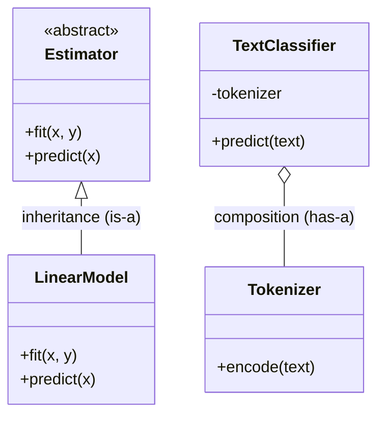

# Object-Oriented Programming in Python

> **TL;DR:** Classes bundle state with behavior; Python's dunder methods, `@property`, `dataclasses`, ABCs, and Protocols let you build clean, typed model and dataset abstractions — and you should reach for composition before inheritance.

---

## Overview
AI systems are full of stateful objects: dataset loaders, model wrappers, tokenizers, feature transformers. Good OOP keeps that state and its behavior in one testable place with a clear interface. This lesson covers the class machinery you actually use in production and the design heuristics that keep it maintainable.

**By the end, you will be able to:**
- Implement the dunder methods that make objects behave like built-ins (`__init__`, `__repr__`, `__eq__`).
- Use `@property`, class methods, static methods, `dataclasses`, and `__slots__` appropriately.
- Choose between inheritance and composition, and define interfaces with `abc` and `typing.Protocol`.

---

## Intuition
A class is a blueprint; an instance is a house built from it. The blueprint defines what every house has (attributes) and what you can do to it (methods). Python takes this further: by implementing "magic" (dunder) methods, your object can plug into the language itself — printing, comparing, iterating — as if it were a built-in type.

---

## Details

### Classes and instances
`__init__` runs at construction to set up instance state. `self` is the instance the method was called on. Attributes assigned in `__init__` are per-instance; attributes assigned in the class body are shared across instances.

```python
class Dataset:
    version = "1.0"                     # class attribute, shared

    def __init__(self, name: str, rows: list[dict]) -> None:
        self.name = name                # instance attributes, per object
        self.rows = rows

    def __len__(self) -> int:
        return len(self.rows)           # enables len(dataset)
```

### Dunder methods
Dunder ("double underscore") methods hook into language operations. `__repr__` gives an unambiguous developer-facing string; `__eq__` defines value equality (and should pair with `__hash__` if instances go in sets/dicts).

```python
class Vector:
    def __init__(self, x: float, y: float) -> None:
        self.x, self.y = x, y

    def __repr__(self) -> str:
        return f"Vector(x={self.x}, y={self.y})"   # eval-able, for debugging

    def __eq__(self, other: object) -> bool:
        if not isinstance(other, Vector):
            return NotImplemented
        return (self.x, self.y) == (other.x, other.y)
```

### @property
`@property` exposes a method as a read-only attribute, letting you compute or validate without changing the caller's syntax. Use it to keep an interface stable while the implementation evolves.

```python
class Embedding:
    def __init__(self, values: list[float]) -> None:
        self._values = values

    @property
    def dim(self) -> int:
        """Dimensionality, derived so it can never drift from the data."""
        return len(self._values)
```

### Class methods vs static methods
A `@classmethod` receives the class (`cls`) and is ideal for alternative constructors. A `@staticmethod` receives nothing special — it is a plain function namespaced under the class.

```python
class Model:
    def __init__(self, weights: list[float]) -> None:
        self.weights = weights

    @classmethod
    def from_zeros(cls, dim: int) -> "Model":
        return cls([0.0] * dim)          # alternative constructor

    @staticmethod
    def is_valid_dim(dim: int) -> bool:
        return dim > 0                   # utility, no instance/class state
```

### Inheritance vs composition (favor composition)
Inheritance models "is-a"; composition models "has-a". Deep inheritance trees are rigid and hard to test. Prefer composition: build a class from smaller collaborators you can swap and mock.

```python
class Tokenizer:
    def encode(self, text: str) -> list[int]:
        return [len(w) for w in text.split()]  # placeholder logic

class TextClassifier:
    """Composes a tokenizer instead of inheriting from one."""
    def __init__(self, tokenizer: Tokenizer) -> None:
        self._tokenizer = tokenizer

    def predict(self, text: str) -> int:
        tokens = self._tokenizer.encode(text)
        return 1 if sum(tokens) > 10 else 0
```

### dataclasses
`@dataclass` generates `__init__`, `__repr__`, and `__eq__` from typed fields, cutting boilerplate for data-holding objects. Use `frozen=True` for immutable, hashable records (e.g. config keys).

```python
from dataclasses import dataclass, field

@dataclass(frozen=True)
class TrainConfig:
    lr: float = 1e-3
    epochs: int = 10
    layers: list[int] = field(default_factory=list)  # mutable default, safely
```

### Abstract base classes
`abc.ABC` with `@abstractmethod` defines an interface that subclasses must implement; instantiating an incomplete subclass raises `TypeError`. Use it when you want enforced contracts and shared base logic.

```python
from abc import ABC, abstractmethod

class Estimator(ABC):
    @abstractmethod
    def fit(self, x: list[float], y: list[float]) -> None: ...

    @abstractmethod
    def predict(self, x: list[float]) -> list[float]: ...
```

### __slots__
`__slots__` replaces the per-instance `__dict__` with a fixed set of attribute descriptors, saving memory and speeding attribute access — valuable when you create millions of small objects.

```python
class Point:
    __slots__ = ("x", "y")             # no __dict__; less memory per instance
    def __init__(self, x: float, y: float) -> None:
        self.x, self.y = x, y
```

### typing.Protocol (structural typing)
A `Protocol` defines an interface by shape, not by inheritance ("duck typing" checked by the type checker). Any object with matching methods satisfies it — no base class required.

```python
from typing import Protocol

class SupportsEncode(Protocol):
    def encode(self, text: str) -> list[int]: ...

def run(encoder: SupportsEncode, text: str) -> list[int]:
    return encoder.encode(text)         # Tokenizer above fits without subclassing
```

## Diagram


## Worked Example
A small model wrapper that composes a tokenizer, exposes a derived property, and provides an alternative constructor — the shape you meet in real inference services.

```python
from dataclasses import dataclass

@dataclass
class WordCountModel:
    threshold: int

    def score(self, tokens: list[int]) -> int:
        return sum(tokens)

    def predict(self, tokens: list[int]) -> int:
        return int(self.score(tokens) >= self.threshold)


class SentimentService:
    def __init__(self, tokenizer: Tokenizer, model: WordCountModel) -> None:
        self._tokenizer = tokenizer
        self._model = model

    @classmethod
    def default(cls) -> "SentimentService":
        return cls(Tokenizer(), WordCountModel(threshold=10))

    def infer(self, text: str) -> int:
        return self._model.predict(self._tokenizer.encode(text))


service = SentimentService.default()
print(service.infer("this movie was absolutely wonderful"))  # 1 or 0
```

## Best Practices
- ✅ Use `@dataclass` for classes that mostly hold data; reach for a full class only when behavior dominates.
- ✅ Always define `__repr__` for objects you will debug or log.
- ✅ Depend on interfaces (`Protocol` or ABC), inject collaborators, and prefer composition for flexibility.

## Common Mistakes
- ⚠️ Defining `__eq__` without `__hash__` makes instances unhashable — set `eq` and `frozen` on a dataclass, or define both explicitly.
- ⚠️ Using a mutable class attribute (e.g. `items = []`) shares it across all instances — use `field(default_factory=list)` or assign in `__init__`.
- ⚠️ Adding `__slots__` then trying to set an undeclared attribute raises `AttributeError` — list every attribute you need.

## Industry Tips
- 💡 `Protocol` lets you type-check third-party objects (a HuggingFace tokenizer, a torch module) against your interface without importing or subclassing them.
- 💡 Frozen dataclasses make excellent experiment configs: they are hashable, comparable, and safe to use as cache keys.

## Real-World Use Cases
- Model and pipeline wrappers that present a uniform `fit`/`predict` interface over different backends.
- Dataset classes that implement `__len__` and `__getitem__` for framework data loaders.
- Immutable config objects passed through a training or serving stack.

---

## Summary
- Dunder methods integrate your objects with Python's built-in operations.
- `dataclasses`, `@property`, class/static methods, and `__slots__` each remove specific boilerplate or overhead.
- Favor composition and interface types (ABC, `Protocol`) over deep inheritance for testable, swappable designs.

## Practice
- [ ] Exercises: [Module 1 Exercises](../exercises/README.md)
- [ ] Self-check: When would you pick a `Protocol` over an abstract base class to define an interface?

## Further Reading
- 📘 Fluent Python, Luciano Ramalho
- 📄 [dataclasses — Data Classes](https://docs.python.org/3/library/dataclasses.html)
- 🌐 Real Python — https://realpython.com/
- ▶️ Real Python — https://realpython.com/

## Related
- [Functional Programming in Python](functional-programming.md)
- [Type Hints and Static Typing](type-hints.md)

---

## Navigation
- ⬆️ [Lessons](README.md)
- 📚 [Module 1 — Python for AI Engineering](../README.md)
- 🏠 [Knowledge Base Home](../../README.md)
