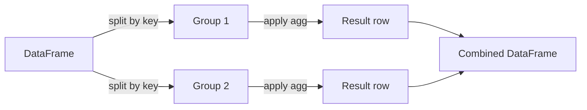

# Pandas for Data Work

> **TL;DR:** Pandas gives you labeled, tabular data structures — `Series` and `DataFrame` — with fast selection, grouping, and joining. It is where most AI datasets are loaded, cleaned, and shaped before they ever reach a model.

---

## Overview

Real ML data rarely arrives as a clean numeric array. It comes as CSVs, database dumps, and event logs with missing values, mixed types, and inconsistent keys. Pandas is the standard tool for wrangling that into model-ready tables. Built on NumPy, it adds row and column *labels*, so you operate on named features instead of raw positions.

**By the end, you will be able to:**

- Load tabular data and select rows and columns safely with `loc` and `iloc`
- Filter, group, and aggregate with the split-apply-combine pattern
- Merge tables, handle missing data, and reduce memory with dtypes and categoricals

---

## Intuition

Think of a `DataFrame` as a dictionary of columns, where every column is a `Series` (a labeled 1-D array) and all columns share one row index. The index is not just row numbers — it is a first-class label you can align and join on. Because columns are NumPy arrays underneath, whole-column operations are vectorized and fast, just as in NumPy.

The mental shift from spreadsheets: you rarely touch one cell at a time. You describe operations over entire columns or groups, and pandas applies them in bulk.

---

## Details

### Series and DataFrame

A `Series` is a one-dimensional labeled array. A `DataFrame` is a two-dimensional table of aligned `Series`.

```python
import pandas as pd

s = pd.Series([0.2, 0.5, 0.3], name="score")

df = pd.DataFrame({
    "user_id": [1, 2, 3],
    "score": [0.2, 0.5, 0.3],
    "label": ["a", "b", "a"],
})
print(df.dtypes)  # per-column types
print(df.shape)   # (3, 3)
```

### Reading data

`read_csv` is the workhorse. Specify dtypes and parse dates up front to save memory and avoid surprises.

```python
df = pd.read_csv(
    "events.csv",
    usecols=["user_id", "timestamp", "amount"],  # read only what you need
    dtype={"user_id": "int32"},
    parse_dates=["timestamp"],
)
```

### Selection with `loc` and `iloc`

- `loc` selects by **label** (index/column names). It is inclusive of the stop label.
- `iloc` selects by **integer position**, like NumPy slicing.

```python
df.loc[0, "score"]           # value at index label 0, column "score"
df.loc[df["score"] > 0.3]    # boolean selection by label
df.iloc[0:2, :]              # first two rows by position
df.iloc[-1]                  # last row
```

#### The `SettingWithCopyWarning` pitfall

Chained indexing like `df[df.score > 0.3]["label"] = "x"` may assign to a temporary copy, so the write silently does nothing. Pandas warns you with `SettingWithCopyWarning`. The fix is a single `loc` call that selects and assigns in one step:

```python
# Risky: chained indexing, may not persist
# df[df["score"] > 0.3]["label"] = "high"

# Correct: one loc call, rows and column together
df.loc[df["score"] > 0.3, "label"] = "high"
```

When you deliberately want a separate table, take an explicit `.copy()`.

### Filtering

Boolean masks filter rows. Combine conditions with `&`, `|`, `~` and parenthesize each clause.

```python
mask = (df["score"] > 0.3) & (df["label"] == "high")
subset = df.loc[mask]

# isin and between are common and readable
df.loc[df["user_id"].isin([1, 3])]
df.loc[df["score"].between(0.2, 0.6)]
```

### Groupby: split-apply-combine

`groupby` splits rows into groups by key, applies an aggregation to each, and combines the results. This is the backbone of feature aggregation.

```python
# Average score and event count per user — classic feature engineering.
features = (
    df.groupby("user_id")
      .agg(mean_score=("score", "mean"),
           n_events=("score", "size"))
      .reset_index()
)
```

Naming outputs via the `agg` tuple syntax keeps column names explicit and readable.

### Merge and join

`merge` combines tables on shared keys, like a SQL join. Choose the `how` deliberately — `left` keeps all rows from the left table, `inner` keeps only matches.

```python
users = pd.DataFrame({"user_id": [1, 2, 3], "country": ["US", "IN", "US"]})

enriched = df.merge(users, on="user_id", how="left")
# validate catches unexpected key duplication
enriched = df.merge(users, on="user_id", how="left", validate="many_to_one")
```

`join` is a convenience wrapper that aligns on the index; `merge` on explicit columns is usually clearer.

### Handling missing data

Missing values appear as `NaN` (or `pd.NA`). Inspect, then decide per column whether to drop or fill.

```python
df.isna().sum()               # count missing per column
df["amount"].fillna(0.0)      # fill numeric gaps with a sensible default
df.dropna(subset=["user_id"]) # drop rows missing a required key
```

Fill with a computed statistic only from training data to avoid leaking information into validation and test sets.

### Vectorized ops vs `apply`

Prefer built-in vectorized operations over `apply` with a Python function. `apply` runs the function row by row in the interpreter and is typically much slower.

```python
# Slow: per-row Python call
df["amount_usd"] = df.apply(lambda r: r["amount"] * 1.1, axis=1)

# Fast: vectorized column arithmetic
df["amount_usd"] = df["amount"] * 1.1
```

Reserve `apply` for genuinely non-vectorizable logic, and prefer `.str` and `.dt` accessors for string and datetime work.

### `astype` and categoricals for memory

Downcasting numeric columns and converting low-cardinality strings to `category` can sharply cut memory on large datasets — important when a table must fit in RAM before training.

```python
df["user_id"] = df["user_id"].astype("int32")
df["label"] = df["label"].astype("category")  # stores codes + a lookup table
```

A `category` stores each distinct value once plus small integer codes, so repeated strings stop dominating memory.

### A note on method chaining

Chaining reads top-to-bottom as a pipeline and avoids intermediate variables. Wrap the chain in parentheses.

```python
result = (
    df
    .loc[df["score"] > 0.1]
    .assign(score_pct=lambda d: d["score"] * 100)
    .groupby("label")
    .agg(avg=("score_pct", "mean"))
    .reset_index()
)
```

## Diagram



## Worked Example

You have raw purchase events and want a per-user feature table for a churn model: total spend, purchase count, and country.

```python
import pandas as pd

events = pd.DataFrame({
    "user_id": [1, 1, 2, 3, 3, 3],
    "amount": [10.0, 5.0, None, 20.0, 2.5, 7.5],
    "label": ["buy", "buy", "view", "buy", "buy", "buy"],
})
users = pd.DataFrame({
    "user_id": [1, 2, 3],
    "country": ["US", "IN", "US"],
})

features = (
    events
    .assign(amount=lambda d: d["amount"].fillna(0.0))  # treat missing spend as 0
    .groupby("user_id")
    .agg(total_spend=("amount", "sum"),
         n_events=("amount", "size"))
    .reset_index()
    .merge(users, on="user_id", how="left", validate="one_to_one")
)
features["country"] = features["country"].astype("category")

print(features)
#    user_id  total_spend  n_events country
# 0        1         15.0         2      US
# 1        2          0.0         1      IN
# 2        3         30.0         3      US
```

This is a complete split-apply-combine-then-join pipeline: exactly the shape of feature engineering that feeds a tabular model.

## Best Practices

- ✅ Select and assign in one `loc` call to sidestep `SettingWithCopyWarning`.
- ✅ Prefer vectorized column ops and `.str`/`.dt` accessors over `apply`.
- ✅ Set dtypes at read time and use `category` for low-cardinality strings.
- ✅ Pass `validate=` to `merge` to catch unexpected key duplication early.

## Common Mistakes

- ⚠️ Chained indexing (`df[mask]["col"] = ...`) that silently fails to write. Use `df.loc[mask, "col"] = ...`.
- ⚠️ Forgetting parentheses around each boolean clause: write `(a > 1) & (b < 2)`, not `a > 1 & b < 2`.
- ⚠️ Filling missing values with statistics computed on the full dataset, leaking test information. Compute fill values from training data only.
- ⚠️ Reaching for `apply(axis=1)` when a vectorized expression exists — it is far slower on large tables.

## Industry Tips

- 💡 For datasets too large for pandas in memory, downcast dtypes first; if it still does not fit, move to chunked reads or an out-of-core engine, but pandas semantics remain the reference.
- 💡 Persist cleaned feature tables in a columnar format like Parquet rather than CSV — it preserves dtypes and is far faster and smaller to reload.

## Real-World Use Cases

- Building tabular feature tables for classification and regression models
- Cleaning and joining raw logs before creating training datasets
- Exploratory data analysis and label distribution checks
- Preparing text and metadata columns before tokenization in NLP pipelines

---

## Summary

- `DataFrame` and `Series` are labeled, NumPy-backed tables; the index enables alignment and joins.
- Use `loc`/`iloc` for safe selection, and split-apply-combine (`groupby`) plus `merge` to aggregate and enrich.
- Handle missing data explicitly, prefer vectorized ops, and use dtypes/categoricals to control memory.

## Practice

- [ ] Exercises: [Module 1 Exercises](../exercises/README.md)
- [ ] Self-check: Why can `df[mask]["col"] = value` fail silently, and what single expression fixes it?

## Further Reading

- 📘 *Python for Data Analysis* by Wes McKinney
- 📄 [pandas documentation](https://pandas.pydata.org/docs/)
- 🌐 Real Python — https://realpython.com/
- ▶️ pandas "Getting started" tutorials — https://pandas.pydata.org/docs/

## Related

- [NumPy for AI Engineering](numpy.md)
- [Data Cleaning and Wrangling](data-cleaning-and-wrangling.md)
- [Data Visualization with Matplotlib and Seaborn](data-visualization.md)

---

## Navigation
- ⬆️ [Lessons](README.md)
- 📚 [Module 1 — Python for AI Engineering](../README.md)
- 🏠 [Knowledge Base Home](../../README.md)
