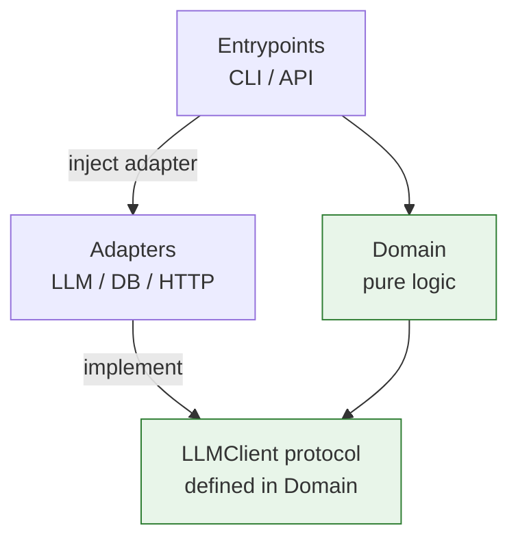

# Python Project Structure and Clean Architecture

> **TL;DR:** Organize an AI project into layered packages under `src/` with dependencies pointing inward, apply SOLID to keep modules loosely coupled, and use patterns like Adapter to make LLM providers swappable.

---

## Overview
As an AI application grows past a single script, structure becomes the difference between a codebase you can evolve and one that calcifies. A clean layout separates business logic from I/O (LLM APIs, databases, HTTP), so you can swap a model provider, add a vector store, or write tests without rippling changes everywhere. This lesson gives you a sensible repo layout, the SOLID principles in concrete Python, and a few design patterns that recur in AI apps.

**By the end, you will be able to:**
- Lay out a Python project with `src/`, `tests/`, `pyproject.toml`, and a clear layer boundary.
- Apply SOLID principles to keep modules cohesive and loosely coupled.
- Use the Strategy, Factory, and Adapter patterns — including an Adapter over multiple LLM providers.

---

## Intuition
Think of your project like a well-run kitchen. The **dining room** (interface layer: CLI, API) takes orders; the **kitchen** (domain/service layer) contains the recipes and logic; the **suppliers** (infrastructure layer: LLM APIs, databases) deliver ingredients. The recipes should not care which supplier delivered the tomatoes — swapping suppliers must not force you to rewrite recipes. Clean architecture is just enforcing that the recipes depend on an *idea* of "tomatoes," not on one specific supplier.

That direction — inner layers know nothing about outer layers — is the single most important rule.

---

## Details

### A sensible repo layout
Use a `src/` layout so your package is importable only when installed, which prevents accidental imports of an uninstalled working copy and matches how it will run in production.

```text
my-ai-app/
├── pyproject.toml          # metadata, dependencies, tool config
├── README.md
├── .env.example            # documents required env vars (no real secrets)
├── .gitignore              # ignores .env, __pycache__, etc.
├── src/
│   └── my_ai_app/
│       ├── __init__.py
│       ├── config.py           # settings loaded from environment
│       ├── logging_setup.py    # configure logging once, at entry
│       ├── domain/             # pure business logic, no I/O
│       │   ├── __init__.py
│       │   └── summarize.py
│       ├── adapters/           # infrastructure: LLM, DB, HTTP clients
│       │   ├── __init__.py
│       │   └── llm.py
│       └── entrypoints/        # CLI / API wiring
│           ├── __init__.py
│           └── cli.py
└── tests/
    ├── test_summarize.py
    └── test_llm_adapter.py
```

Config and logging setup live near the top of the package; tests live in a sibling `tests/` tree (see [Testing Python Code with pytest](testing.md)) and config in the environment (see [Logging and Configuration Management](logging-and-configuration.md)).

### Modules vs packages and imports
A **module** is a single `.py` file; a **package** is a directory with an `__init__.py` that groups modules. Prefer **absolute imports** rooted at your package for clarity:

```python
# Clear and refactor-friendly:
from my_ai_app.adapters.llm import OpenAIAdapter

# Fragile relative import — avoid across distant layers:
# from ...adapters.llm import OpenAIAdapter
```

### Separation of concerns and layering
Split responsibilities into layers and let dependencies point **inward only**:

- **Domain** — pure logic (prompt building, parsing, scoring). No SDK imports.
- **Adapters** — talk to the outside world (LLM APIs, DBs, HTTP).
- **Entrypoints** — wire everything together (CLI, FastAPI route) and inject dependencies.

The domain defines an interface it needs; adapters implement it. The domain never imports an adapter — it receives one.

### SOLID principles (concrete Python)

- **S — Single Responsibility.** A class has one reason to change. Keep parsing, calling, and caching in separate units, not one `LLMManager` doing all three.
- **O — Open/Closed.** Open to extension, closed to modification. Adding a new LLM provider should mean writing a new adapter, not editing existing ones.
- **L — Liskov Substitution.** Any adapter that satisfies the `LLMClient` interface must be usable wherever the interface is expected, without surprises.
- **I — Interface Segregation.** Keep interfaces small. A summarizer needs `complete(prompt) -> str`, not a 30-method mega-interface.
- **D — Dependency Inversion.** High-level code depends on abstractions, not concretions. The domain depends on an `LLMClient` protocol; the concrete OpenAI adapter is injected.

```python
from typing import Protocol


class LLMClient(Protocol):
    """The only capability the domain needs from an LLM."""

    def complete(self, prompt: str) -> str: ...


def summarize(client: LLMClient, text: str) -> str:
    """Domain logic depends on the abstraction, not a vendor SDK."""
    return client.complete(f"Summarize in one line:\n{text}").strip()
```

### Design patterns for AI apps

**Adapter** — wrap each vendor SDK behind your own `LLMClient` interface so providers are swappable:

```python
class OpenAIAdapter:
    """Adapts an OpenAI-style client to the LLMClient protocol."""

    def __init__(self, client) -> None:
        self._client = client

    def complete(self, prompt: str) -> str:
        resp = self._client.responses.create(model="gpt-4o-mini", input=prompt)
        return resp.output_text


class AnthropicAdapter:
    """Adapts an Anthropic-style client to the same protocol."""

    def __init__(self, client) -> None:
        self._client = client

    def complete(self, prompt: str) -> str:
        msg = self._client.messages.create(
            model="claude-3-5-haiku",
            max_tokens=256,
            messages=[{"role": "user", "content": prompt}],
        )
        return msg.content[0].text
```

**Factory** — centralize which adapter to build based on config:

```python
def make_llm_client(provider: str, sdk_client) -> LLMClient:
    """Return the adapter for the configured provider."""
    match provider:
        case "openai":
            return OpenAIAdapter(sdk_client)
        case "anthropic":
            return AnthropicAdapter(sdk_client)
        case _:
            raise ValueError(f"unknown provider: {provider}")
```

**Strategy** — select an algorithm at runtime behind a common interface (e.g. different chunking strategies for RAG):

```python
from typing import Callable

# Each strategy is a function with the same signature.
Chunker = Callable[[str], list[str]]


def by_sentence(text: str) -> list[str]:
    return [s.strip() for s in text.split(".") if s.strip()]


def by_paragraph(text: str) -> list[str]:
    return [p for p in text.split("\n\n") if p]


def chunk(text: str, strategy: Chunker) -> list[str]:
    return strategy(text)  # caller injects the chosen strategy
```

### Where logging, config, and tests live
- **Config** in `config.py`, read from the environment at startup.
- **Logging** configured once in `logging_setup.py`, called from an entrypoint.
- **Tests** in the sibling `tests/` directory, mirroring the package layout.

### Dependency direction
The golden rule: **dependencies point inward.** Entrypoints depend on the domain; adapters depend on the domain's interfaces; the domain depends on nothing external. If you ever find `domain/` importing `openai`, a layer has leaked.

## Diagram



## Worked Example
Wire the layers together in an entrypoint: build the adapter from config, inject it into domain logic.

```python
# src/my_ai_app/entrypoints/cli.py
from my_ai_app.adapters.llm import OpenAIAdapter, make_llm_client
from my_ai_app.domain.summarize import summarize


def run(text: str, provider: str, sdk_client) -> str:
    """Compose the app: config -> adapter -> domain."""
    client = make_llm_client(provider, sdk_client)  # Factory + Adapter
    return summarize(client, text)  # domain depends only on the protocol
```

Because `summarize` depends on the `LLMClient` protocol, tests inject a mock and never call a real API (see [Testing Python Code with pytest](testing.md)).

## Best Practices
- ✅ Use a `src/` layout and a single `pyproject.toml` for metadata and tool config.
- ✅ Keep domain logic free of vendor SDK imports; talk to abstractions.
- ✅ Wrap each external provider in an Adapter so it is swappable and mockable.
- ✅ Inject dependencies at the entrypoint rather than constructing them deep inside logic.
- ✅ Mirror your package structure in `tests/`.

## Common Mistakes
- ⚠️ Importing `openai` inside domain code → hide vendors behind an adapter/protocol.
- ⚠️ A flat repo with everything in one module → split by layer as it grows.
- ⚠️ Circular imports from tangled layers → enforce inward-only dependency direction.
- ⚠️ Committing a `.env` with real keys → commit only `.env.example` with placeholders.
- ⚠️ God classes doing config, calls, parsing, and caching → apply Single Responsibility.

## Industry Tips
- 💡 Provider-agnostic adapters let you A/B test models or fail over between vendors with a config change, not a rewrite.
- 💡 Keep the domain layer import-light so it stays fast to unit test — pure functions test in milliseconds.
- 💡 Define interfaces with `typing.Protocol` for structural typing — adapters conform without inheriting a base class.

## Real-World Use Cases
- Swapping between OpenAI and Anthropic behind one interface for cost/quality tuning.
- Selecting a RAG chunking strategy at runtime via the Strategy pattern.
- Building the right vector store or LLM client from environment config with a Factory.

---

## Summary
- A `src/` layout with domain / adapters / entrypoints keeps concerns separated.
- SOLID keeps modules cohesive and loosely coupled; Dependency Inversion is the linchpin.
- Adapter, Factory, and Strategy make AI apps swappable and testable.
- Dependencies always point inward — the domain depends on nothing external.

## Practice
- [ ] Exercises: [Module 1 Exercises](../exercises/README.md)
- [ ] Self-check: If `domain/summarize.py` starts importing the OpenAI SDK, which principle is violated and how do you fix it?

## Further Reading
- 📘 Architecture Patterns with Python, Harry Percival & Bob Gregory
- 📘 Effective Python, Brett Slatkin
- 📄 [Python packaging user guide — src layout](https://packaging.python.org/en/latest/discussions/src-layout-vs-flat-layout/)
- 🌐 Real Python — https://realpython.com/
- ▶️ ArjanCodes (YouTube) — https://www.youtube.com/@ArjanCodes

## Related
- [Packaging Python Projects](packaging.md)
- [Logging and Configuration Management](logging-and-configuration.md)
- [Testing Python Code with pytest](testing.md)
- Cross-domain: [AI Engineering](../../12-ai-engineering/README.md)

---

## Navigation
- ⬆️ [Lessons](README.md)
- 📚 [Module 1 — Python for AI Engineering](../README.md)
- 🏠 [Knowledge Base Home](../../README.md)
