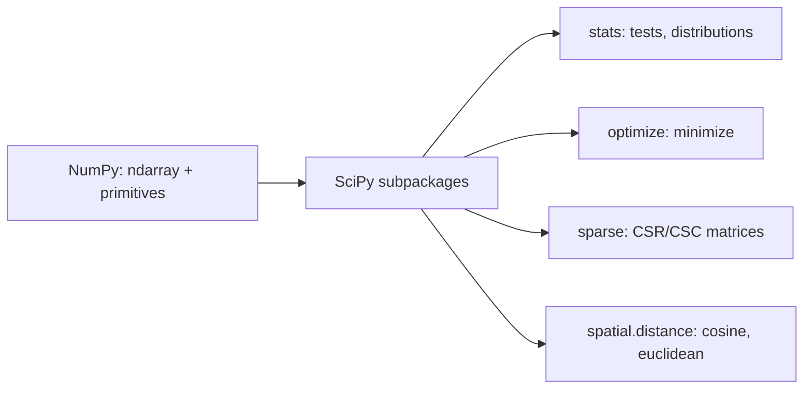

# SciPy Essentials for AI

> **TL;DR:** SciPy layers scientific algorithms — statistics, optimization, linear algebra, sparse matrices, and distance metrics — on top of NumPy arrays. It fills the gap between raw arrays and the higher-level ML libraries.

---

## Overview

NumPy gives you arrays and elementary operations; SciPy gives you the algorithms. When you need a statistical test, a numerical optimizer, a sparse representation of a huge one-hot matrix, or a cosine distance between embeddings, you reach for SciPy. Many scikit-learn internals rely on it, so knowing the building blocks demystifies the tools built above.

**By the end, you will be able to:**

- Use `scipy.stats` for distributions and common hypothesis tests
- Minimize a function with `scipy.optimize` and connect it to gradient-based training
- Store and operate on sparse matrices and compute similarity with distance metrics

---

## Intuition

If NumPy is the array and the arithmetic, SciPy is the reference library of numerical methods that operate on those arrays. You rarely reimplement an optimizer or a statistical test — SciPy has a vetted, well-tested version. The design contract is simple: SciPy functions take and return NumPy arrays, so the two libraries compose seamlessly.

---

## Details

### What SciPy adds on top of NumPy

NumPy focuses on the `ndarray` and fast elementwise and linear-algebra primitives. SciPy provides task-specific subpackages built on those arrays:

- `scipy.stats` — probability distributions and statistical tests
- `scipy.optimize` — root finding and function minimization
- `scipy.linalg` — a broader, often faster set of linear-algebra routines than `numpy.linalg`
- `scipy.sparse` — memory-efficient matrices that store only nonzero entries
- `scipy.spatial.distance` — distance and similarity metrics

### `scipy.stats`: distributions and tests

Distributions expose a consistent interface: `pdf`, `cdf`, `rvs` (sample), `ppf` (inverse CDF). Tests return a statistic and a p-value.

```python
from scipy import stats
import numpy as np

# Model per-feature values as normal; get the probability density and a sample.
dist = stats.norm(loc=0.0, scale=1.0)
dist.pdf(0.0)                 # density at 0
sample = dist.rvs(size=5, random_state=0)

# AI-relevant test: did a metric shift between two model versions (A/B test)?
old = np.array([0.81, 0.79, 0.83, 0.80, 0.82])
new = np.array([0.84, 0.85, 0.83, 0.86, 0.85])
result = stats.ttest_ind(new, old)  # independent two-sample t-test
print(result.pvalue)  # small p-value suggests a real difference
```

Report the effect size alongside the p-value; statistical significance is not the same as a meaningful improvement.

### `scipy.optimize`: minimize

`minimize` finds parameters that make a scalar objective as small as possible. This is exactly what model training does — minimize a loss. Here you can watch it happen on a tiny, transparent problem.

```python
from scipy.optimize import minimize
import numpy as np

# Fit a line y = w*x + b by minimizing mean squared error.
x = np.array([0.0, 1.0, 2.0, 3.0])
y = np.array([1.0, 3.0, 5.0, 7.0])  # true relationship: y = 2x + 1

def mse(params):
    w, b = params
    pred = w * x + b
    return np.mean((pred - y) ** 2)

res = minimize(mse, x0=np.array([0.0, 0.0]))  # start from w=0, b=0
print(res.x)  # ~[2.0, 1.0] -> recovers the slope and intercept
```

Deep-learning frameworks scale this same idea with gradient descent over millions of parameters, but the objective — drive a loss toward its minimum — is identical. Providing an analytic gradient via the `jac` argument makes `minimize` faster and more reliable, mirroring why autodiff matters in training.

### `scipy.linalg`

`scipy.linalg` covers decompositions (LU, QR, SVD, Cholesky), solvers, and matrix functions, often with more options than `numpy.linalg`.

```python
from scipy import linalg
import numpy as np

A = np.array([[4.0, 1.0], [1.0, 3.0]])
b = np.array([1.0, 2.0])
x = linalg.solve(A, b)          # solve Ax = b
U, s, Vt = linalg.svd(A)        # singular value decomposition
```

SVD underlies dimensionality reduction (PCA) and low-rank approximations used in model compression.

### `scipy.sparse`: why sparse matters

Many AI feature matrices are mostly zeros: TF-IDF vectors, one-hot encodings, and bag-of-words counts over a large vocabulary. Storing every zero wastes enormous memory. A sparse matrix stores only the nonzero entries and their positions.

```python
from scipy.sparse import csr_matrix
import numpy as np

# A 4-document x 6-term matrix with few nonzeros (like TF-IDF output).
dense = np.array([
    [0, 2, 0, 0, 1, 0],
    [1, 0, 0, 0, 0, 0],
    [0, 0, 3, 0, 0, 0],
    [0, 0, 0, 0, 0, 4],
])
X = csr_matrix(dense)  # Compressed Sparse Row format
print(X.nnz)           # 5 stored values instead of 24
row0 = X[0]            # sparse row slicing stays efficient
```

`csr_matrix` (Compressed Sparse Row) is efficient for row slicing and matrix-vector products; `csc_matrix` favors column operations. scikit-learn vectorizers return sparse matrices for exactly this reason — a vocabulary of tens of thousands of terms would be infeasible dense.

### `scipy.spatial.distance`: similarity metrics

Comparing embeddings and feature vectors means measuring distance. Cosine distance ignores magnitude and captures direction, which is why it dominates embedding search; Euclidean distance measures straight-line separation.

```python
from scipy.spatial.distance import cosine, euclidean, cdist
import numpy as np

a = np.array([1.0, 0.0, 1.0])
b = np.array([1.0, 1.0, 0.0])

cosine(a, b)     # cosine DISTANCE = 1 - cosine similarity
euclidean(a, b)  # straight-line distance

# Pairwise distances between a query and a set of candidate vectors.
query = np.array([[0.2, 0.9, 0.1]])
candidates = np.random.default_rng(0).normal(size=(5, 3))
dists = cdist(query, candidates, metric="cosine")  # shape (1, 5)
nearest = dists.argmin(axis=1)  # index of closest candidate
```

Note the convention: `cosine` returns a *distance* (`1 - similarity`), so smaller is more similar.

## Diagram



## Worked Example

You have a small set of document embeddings and a query, and you want the most similar document plus a quick check on whether two score groups differ — a miniature retrieval-and-evaluation loop.

```python
import numpy as np
from scipy.spatial.distance import cdist
from scipy import stats

rng = np.random.default_rng(3)
docs = rng.normal(size=(5, 4))   # 5 documents, 4-dim embeddings
query = rng.normal(size=(1, 4))

# Rank documents by cosine distance (smaller = more similar).
dists = cdist(query, docs, metric="cosine")  # (1, 5)
ranking = dists.argsort(axis=1).ravel()
best = ranking[0]
print("most similar doc:", best)

# Evaluate: are relevance scores for the top-2 higher than the bottom-2?
scores = np.array([0.9, 0.85, 0.4, 0.3, 0.35])
top = scores[ranking[:2]]
bottom = scores[ranking[-2:]]
print(stats.ttest_ind(top, bottom).pvalue)
```

This chains SciPy's distance metrics for retrieval with a statistical test for evaluation — both operating directly on NumPy arrays.

## Best Practices

- ✅ Import the specific subpackage (`from scipy import stats`); SciPy does not import subpackages automatically from the top level.
- ✅ Use sparse matrices for high-dimensional, mostly-zero features to save memory.
- ✅ Report effect size alongside p-values from statistical tests.
- ✅ Provide an analytic gradient (`jac`) to `minimize` when you have one, for speed and stability.

## Common Mistakes

- ⚠️ Treating `scipy.spatial.distance.cosine` as a similarity — it returns `1 - similarity`. Smaller means more similar.
- ⚠️ Densifying a large sparse matrix with `.toarray()` and exhausting memory. Keep it sparse through the pipeline.
- ⚠️ Reading a p-value as a probability that the result is "true" — it is not. It is the probability of data this extreme under the null hypothesis.
- ⚠️ Expecting `import scipy` alone to expose `scipy.stats`; import the subpackage explicitly.

## Industry Tips

- 💡 scikit-learn's text vectorizers and one-hot encoders return `scipy.sparse` matrices by design; keeping data sparse end-to-end is what makes large-vocabulary NLP feasible on modest hardware.
- 💡 `scipy.optimize.minimize` is a great sandbox for building intuition about loss surfaces before scaling to gradient descent in a deep-learning framework.

## Real-World Use Cases

- Similarity search over embeddings using cosine distance
- Sparse TF-IDF and one-hot feature matrices for classical ML
- A/B testing model or metric changes with hypothesis tests
- Dimensionality reduction and low-rank approximation via SVD

---

## Summary

- SciPy adds vetted scientific algorithms on top of NumPy arrays, composing seamlessly with them.
- `scipy.stats`, `scipy.optimize`, `scipy.linalg`, `scipy.sparse`, and `scipy.spatial.distance` cover the most common AI needs.
- Sparse matrices and cosine distance are especially load-bearing for NLP and embedding workflows.

## Practice

- [ ] Exercises: [Module 1 Exercises](../exercises/README.md)
- [ ] Self-check: Why does `scipy.spatial.distance.cosine` return `0` for identical-direction vectors, and how does that relate to cosine similarity?

## Further Reading

- 📘 *Python for Data Analysis* by Wes McKinney
- 📄 [SciPy documentation](https://docs.scipy.org/doc/scipy/)
- 🌐 Real Python — https://realpython.com/
- ▶️ SciPy user guide — https://docs.scipy.org/doc/scipy/

## Related

- [NumPy for AI Engineering](numpy.md)
- [Mathematics Foundations](../../02-mathematics-foundations/README.md)

---

## Navigation
- ⬆️ [Lessons](README.md)
- 📚 [Module 1 — Python for AI Engineering](../README.md)
- 🏠 [Knowledge Base Home](../../README.md)
