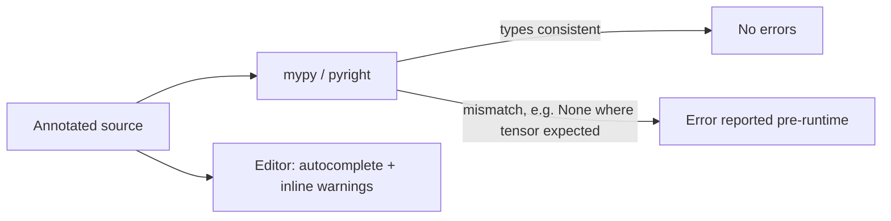

# Type Hints and Static Typing

> **TL;DR:** Type hints annotate what your functions accept and return. A static checker like `mypy` or `pyright` reads those hints and flags mismatches — a `None` where a tensor was expected, a wrong return type — before you run anything.

---

## Overview
Type hints are optional annotations that describe the types of variables, arguments, and return values. They do not change how Python runs — the interpreter ignores them — but a static type checker uses them to find bugs without executing code. In large AI codebases with long-running training jobs, catching a `None`-handling or shape-config bug statically saves hours of wasted GPU time and produces far better editor autocomplete.

**By the end, you will be able to:**
- Annotate functions and variables using PEP 484 syntax.
- Use built-in generics, `Optional`, unions, `Callable`, `TypeVar`, `Protocol`, and `TypedDict`.
- Type dataclasses and run `mypy`/`pyright`.
- Apply gradual typing to an existing untyped ML codebase.

---

## Intuition
Untyped Python is like passing unlabeled boxes between functions: each function opens its box at runtime and hopes it's the right thing. Type hints are labels on the boxes — "this holds a list of ints," "this may be empty." A static checker reads the labels along every path through your program and warns you *before shipping* when a box that might be empty gets opened as if it were full.

---

## Details

### Annotations and PEP 484
PEP 484 introduced the standard syntax for type hints. See https://peps.python.org/pep-0484/.

```python
def scale(x: float, factor: float = 1.0) -> float:
    """Both parameters and the return value are annotated."""
    return x * factor

learning_rate: float = 3e-4   # a variable annotation
```

The annotations are metadata; Python does not enforce them at runtime. A checker does.

### The `typing` module and modern built-ins
In modern Python you can subscript built-in collections directly — `list[int]`, `dict[str, float]` — instead of importing `List`/`Dict`. Reach into `typing` for the rest.

```python
def batch_losses(losses: list[float]) -> dict[str, float]:
    """Built-in generics: list[...] and dict[...] need no import."""
    return {"mean": sum(losses) / len(losses), "max": max(losses)}
```

`Optional[T]` means "a `T` or `None`." Unions mean "one of these types"; modern syntax uses the `|` operator. `Callable` describes a function's signature.

```python
from typing import Optional, Union, Callable

def load_checkpoint(path: Optional[str]) -> Union[dict, None]:
    """Optional[str] == str | None; the return is dict | None."""
    if path is None:
        return None
    return {"path": path}

# A step function: takes a float batch loss, returns the updated loss.
StepFn = Callable[[float], float]

def run(step: StepFn, start: float) -> float:
    return step(start)
```

### Generics and `TypeVar`
A `TypeVar` lets you write functions and classes that are generic over a type while preserving it — the return type tracks the input type.

```python
from typing import TypeVar

T = TypeVar("T")

def first(items: list[T]) -> T:
    """If you pass list[int], the checker knows the result is int."""
    return items[0]

reveal = first([1, 2, 3])   # inferred as int, not "some object"
```

### `Protocol` (structural typing)
A `Protocol` defines a set of methods/attributes; any object that has them matches, without needing to inherit anything. This is "duck typing" the checker understands — ideal for ML code that accepts "anything with a `.predict` method."

```python
from typing import Protocol

class Predictor(Protocol):
    def predict(self, x: list[float]) -> float: ...

def evaluate(model: Predictor, x: list[float]) -> float:
    # Any object with a matching predict() satisfies Predictor.
    return model.predict(x)
```

### `TypedDict`
`TypedDict` types a dictionary with a fixed set of keys and per-key value types — useful for JSON configs and API payloads common in ML pipelines.

```python
from typing import TypedDict

class TrainConfig(TypedDict):
    lr: float
    epochs: int
    model_name: str

cfg: TrainConfig = {"lr": 3e-4, "epochs": 3, "model_name": "bert-base"}
# A missing key or wrong value type is flagged by the checker.
```

### Typing dataclasses
`dataclass` fields are declared with annotations, so typing and dataclasses fit together naturally.

```python
from dataclasses import dataclass

@dataclass
class Sample:
    text: str
    label: int
    weight: float = 1.0   # typed field with a default

s = Sample(text="hello", label=1)
```

### Running `mypy` / `pyright`
`mypy` and `pyright` are static type checkers. They analyze annotations and report mismatches without running your code.

```bash
# mypy: install and check a package or file
pip install mypy
mypy src/

# pyright is an alternative checker (also powers editor type checking)
pyright src/
```

See https://mypy.readthedocs.io/.

### Gradual typing
You don't have to type everything at once. Python's typing is **gradual**: unannotated code is treated as dynamic and skipped, so you can add hints file by file — start with public function signatures and the trickiest modules, then tighten checker strictness over time. This is the practical path for adopting typing in an existing untyped ML repo.

---

## Diagram



---

## Worked Example
A subtle `None` bug that types catch before a training run.

```python
from typing import Optional

def get_batch_size(config: dict[str, int]) -> Optional[int]:
    """Returns None when the key is absent."""
    return config.get("batch_size")

def make_loader(config: dict[str, int]) -> list[int]:
    size = get_batch_size(config)
    # mypy flags this: `size` may be None, and None * 2 fails at runtime.
    return list(range(size * 2))   # error: unsupported operand for None
```

Running `mypy` reports that `size` can be `None` here. You fix it by handling the missing key — before the bug crashes hour three of training.

```python
def make_loader(config: dict[str, int]) -> list[int]:
    size = get_batch_size(config)
    if size is None:
        size = 32                    # explicit default; narrows the type to int
    return list(range(size * 2))
```

---

## Best Practices
- ✅ Annotate all public function signatures first — the highest-value surface.
- ✅ Use `Optional`/`| None` explicitly for anything that can be absent, and handle it.
- ✅ Run the checker in CI so type regressions fail the build.
- ✅ Prefer built-in generics (`list[int]`) over legacy `typing.List` on modern Python.
- ✅ Use `Protocol` to type "anything with this interface" instead of forcing inheritance.

## Common Mistakes
- ⚠️ Believing hints are enforced at runtime — they aren't; you still need a checker or runtime validation.
- ⚠️ Overusing `Any`, which silences the checker and hides real bugs — prefer a precise type or a `Protocol`.
- ⚠️ Ignoring "may be None" warnings — this is exactly the class of bug typing exists to catch.
- ⚠️ Annotating everything at once in a large repo and abandoning it — adopt gradually, module by module.

## Industry Tips
- 💡 On large ML teams, a CI type-check gate prevents an entire class of `None`/shape-config bugs from ever reaching a costly GPU job.
- 💡 Type your config objects (`TypedDict` or dataclasses) — most silent training misconfigurations are wrong keys or wrong value types that a checker flags instantly.

## Real-World Use Cases
- Catching a `None` returned from an optional config lookup before it reaches a tensor op.
- Precise autocomplete across a shared data/feature package used by many teammates.
- Enforcing that any object passed as a "model" exposes the expected `predict`/`forward` interface via `Protocol`.

---

## Summary
- Type hints (PEP 484) describe types but are not enforced at runtime; a checker enforces them statically.
- Use built-in generics, `Optional`/unions, `Callable`, `TypeVar`, `Protocol`, and `TypedDict` to express intent precisely.
- `mypy`/`pyright` catch `None` and mismatch bugs before code runs.
- Adopt typing gradually, prioritizing public signatures and config objects.

## Practice
- [ ] Exercises: [Module 1 Exercises](../exercises/README.md)
- [ ] Self-check: What is the difference between `Protocol`-based structural typing and typing via class inheritance, and when would you prefer `Protocol`?

## Further Reading
- 📘 *Robust Python* — Patrick Viafore
- 📄 [typing — Support for type hints](https://docs.python.org/3/library/typing.html)
- 📄 [PEP 484 — Type Hints](https://peps.python.org/pep-0484/)
- 📄 [mypy documentation](https://mypy.readthedocs.io/)
- 🌐 Real Python — https://realpython.com/

## Related
- [Object-Oriented Programming in Python](oop.md)
- [Testing Python Code with pytest](testing.md)

---

## Navigation
- ⬆️ [Lessons](README.md)
- 📚 [Module 1 — Python for AI Engineering](../README.md)
- 🏠 [Knowledge Base Home](../../README.md)
