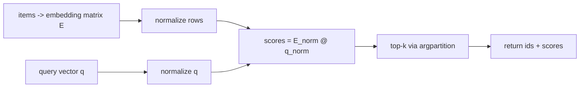

# Mini Project: Mini Vector Search

> **What you'll build:** A small vector-search index that, given a query vector,
> returns the top-k most similar items using cosine similarity — the core of every
> retrieval system, built from scratch with NumPy.

---

## Objective

Vector databases power RAG and semantic search, but the core operation is simple
linear algebra. You will implement exact top-k search over a matrix of embeddings
so the abstraction stops being a black box.

## Learning Goals

- Use vectorized NumPy and broadcasting instead of loops.
- Understand cosine similarity and normalization.
- Reason about the accuracy/speed trade-off of exact vs approximate search.

---

## Prerequisites

- [NumPy for AI Engineering](../lessons/numpy.md)
- [SciPy Essentials for AI](../lessons/scipy.md)
- Precomputed embeddings, or random vectors to stand in for them.

## Architecture

---

## Steps

### 1. Setup
Create the package. Store embeddings as a `(n, d)` NumPy array plus a parallel
list of item ids.

### 2. Build the index
Write an `Index` class that stores the matrix and precomputes L2-normalized rows,
so cosine similarity reduces to a single matrix–vector product.

### 3. Search
Implement `search(query, k)` returning the top-k `(id, score)` pairs. Use
`np.argpartition` for an efficient top-k rather than a full sort.

### 4. Validate correctness
Cross-check your cosine scores against `scipy.spatial.distance.cdist(..., "cosine")`
on a small input to prove the vectorized version is correct.

### 5. Test & Measure
Unit-test correctness on tiny inputs; then time queries as `n` grows and write up
where brute-force stops scaling (motivating approximate nearest neighbors later).

---

## Deliverables

- [ ] An `Index` class with `add`/`search`.
- [ ] Vectorized cosine similarity (no Python loops in the hot path).
- [ ] Correctness test against SciPy.
- [ ] `README.md` with a short note on when to switch to a real vector DB.

## Success Criteria

`search(q, k)` returns the same neighbors as the SciPy reference on test data, and
your write-up correctly explains the scaling limits of exact search.

---

## Extensions (Optional)

- 🚀 Add batched queries (a `(m, d)` query matrix → `(m, k)` results).
- 🚀 Compare against a real library such as FAISS and note the differences.

## Further Reading

- [NumPy documentation](https://numpy.org/doc/stable/)
- [scipy.spatial.distance](https://docs.scipy.org/doc/scipy/reference/spatial.distance.html)
- Related domain: [Retrieval-Augmented Generation](../../09-rag/README.md)

---

## Navigation

- ⬆️ [Module 1 Mini Projects](README.md)
- 📚 [Module 1 — Python for AI Engineering](../README.md)
- 🏠 [Knowledge Base Home](../../README.md)
