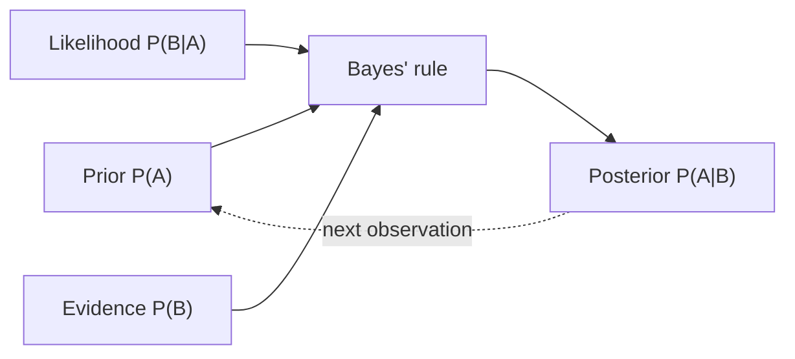

# Bayes' Rule

> **TL;DR:** Bayes' rule flips a conditional probability, letting you update beliefs as evidence arrives. It is the reason a 99%-accurate medical test can still leave you probably healthy — and the engine behind Naive Bayes classifiers.

---

## Overview
Bayes' rule is how you rationally combine what you believed *before* seeing data (the prior) with what the data tells you (the likelihood) to get an updated belief (the posterior). This update loop underlies spam filters, medical diagnostics, probabilistic ML, and the mental discipline of not being fooled by rare events. It is one of the highest-leverage formulas in all of AI.

**By the end, you will be able to:**
- Derive Bayes' theorem from conditional probability and name each term.
- Work the classic medical-test example and explain the base-rate fallacy.
- Sketch how Naive Bayes turns Bayes' rule into a working classifier.

---

## Intuition
Start with how strongly you believe something *before* any evidence — call that your prior. New evidence arrives. Ask: "How likely was this evidence in the world where my belief is true, versus where it is false?" If the evidence is much more likely under one world, you shift your belief toward it. Bayes' rule is just the exact bookkeeping for that shift.

The counterintuitive part is the **base rate**. If a disease is very rare, most positive test results come from the huge pool of healthy people producing false positives — not from the tiny pool of sick people. So even a very accurate test, applied to a rare condition, gives a positive result that is more often wrong than right. Bayes' rule forces you to account for that background rarity.

---

## Details

### Mathematics

**Conditional probability recap.** From the [Probability](probability.md) lesson, for events $A$ and $B$ with $P(B) > 0$:

$$
P(A \mid B) = \frac{P(A \cap B)}{P(B)}, \qquad P(A \cap B) = P(B \mid A)\,P(A).
$$

**Bayes' theorem.** Substituting the second identity into the first gives

$$
P(A \mid B) = \frac{P(B \mid A)\,P(A)}{P(B)}.
$$

Naming each term when $A$ is a hypothesis and $B$ is observed evidence:

- $P(A)$ — the **prior**: belief in the hypothesis before seeing evidence.
- $P(B \mid A)$ — the **likelihood**: how probable the evidence is if the hypothesis holds.
- $P(A \mid B)$ — the **posterior**: updated belief after seeing the evidence.
- $P(B)$ — the **evidence** (marginal likelihood): total probability of the evidence.

The evidence is computed by the *law of total probability*, summing over the mutually exclusive, exhaustive hypotheses $A$ and $A^c$:

$$
P(B) = P(B \mid A)\,P(A) + P(B \mid A^c)\,P(A^c).
$$

### Python implementation

```python
def bayes_posterior(prior: float, sensitivity: float, false_positive_rate: float) -> float:
    """Posterior P(disease | positive test) via Bayes' rule.

    prior               : P(disease)            — base rate
    sensitivity         : P(positive | disease) — true positive rate
    false_positive_rate : P(positive | healthy)
    """
    p_pos_given_healthy = false_positive_rate
    evidence = sensitivity * prior + p_pos_given_healthy * (1 - prior)  # P(positive)
    return sensitivity * prior / evidence

posterior = bayes_posterior(prior=0.001, sensitivity=0.99, false_positive_rate=0.05)
print(f"P(disease | positive) = {posterior:.4f}")  # ~0.0194
```

## Diagram



## Worked Example
A disease affects $0.1\%$ of a population, so the prior is $P(D) = 0.001$. A test has **sensitivity** $P(+ \mid D) = 0.99$ and a **false-positive rate** $P(+ \mid \neg D) = 0.05$. You test positive. What is $P(D \mid +)$?

First the evidence:

$$
P(+) = P(+\mid D)P(D) + P(+\mid \neg D)P(\neg D) = (0.99)(0.001) + (0.05)(0.999) = 0.00099 + 0.04995 = 0.05094.
$$

Then the posterior:

$$
P(D \mid +) = \frac{P(+\mid D)\,P(D)}{P(+)} = \frac{0.00099}{0.05094} \approx 0.0194.
$$

Despite a positive result from a 99%-sensitive test, there is only about a **1.9%** chance you actually have the disease. The rarity of the disease (the base rate) dominates — this is the **base-rate fallacy**. This is also why doctors order a second, independent test: feeding $0.0194$ back in as the new prior sharply raises the posterior after a second positive.

## Best Practices
- ✅ Always incorporate the base rate (prior) — it is the term people most often ignore.
- ✅ For repeated evidence, use yesterday's posterior as today's prior (Bayesian updating).
- ✅ Keep likelihoods and priors clearly labeled; mislabeling silently inverts the answer.

## Common Mistakes
- ⚠️ Confusing $P(+ \mid D)$ (test sensitivity) with $P(D \mid +)$ (what you actually want). Fix: that inversion is precisely what Bayes' rule performs.
- ⚠️ Dropping the base rate and reading a "99% accurate" test as a 99% chance of disease. Fix: divide by the full evidence $P(+)$.
- ⚠️ In Naive Bayes, multiplying many small probabilities underflows to 0. Fix: sum log-probabilities instead.

## Industry Tips
- 💡 Naive Bayes remains a strong, fast baseline for text classification — cheap to train and hard to beat on small datasets.
- 💡 Bayesian priors act as regularizers: a sensible prior stabilizes estimates when data is scarce.

## Real-World Use Cases
- Spam and content classification with Naive Bayes over word features.
- Medical and fraud diagnostics, where base rates are low and calibration matters.
- Bayesian A/B testing and probabilistic model updating from streaming data.

### Naive Bayes sketch
Naive Bayes classifies by choosing the class $c$ with the highest posterior. Using Bayes' rule and the *naive* assumption that features $x_1,\dots,x_d$ are conditionally independent given the class:

$$
P(c \mid \mathbf{x}) \propto P(c) \prod_{j=1}^{d} P(x_j \mid c).
$$

```python
import numpy as np

# Two classes, three binary features. P(feature=1 | class) tables (learned from data).
log_prior = np.log([0.6, 0.4])                       # P(spam), P(ham)
p_feat_given_class = np.array([[0.8, 0.1, 0.7],      # P(x_j=1 | spam)
                               [0.2, 0.6, 0.3]])      # P(x_j=1 | ham)

x = np.array([1, 0, 1])  # observed feature vector
# Sum log-likelihoods (log avoids underflow); pick the argmax class.
ll = np.where(x == 1, np.log(p_feat_given_class), np.log(1 - p_feat_given_class)).sum(axis=1)
posterior_logits = log_prior + ll
print("predicted class:", int(np.argmax(posterior_logits)))  # 0 => spam
```

---

## Summary
- Bayes' rule inverts a conditional: posterior ∝ likelihood × prior, normalized by the evidence.
- The base rate (prior) is decisive — ignoring it produces the base-rate fallacy.
- A single positive from an accurate test can still mean low disease probability when the condition is rare.
- Naive Bayes applies the rule with a conditional-independence assumption to build a fast classifier.

## Practice
- [ ] Exercises: [Module 2 Exercises](../exercises/README.md)
- [ ] Self-check: In the medical example, what does the posterior become after a *second* independent positive test?

## Further Reading
- 📘 Mathematics for Machine Learning — Deisenroth, Faisal & Ong (https://mml-book.github.io/)
- 📘 Deep Learning — Goodfellow, Bengio & Courville (https://www.deeplearningbook.org/)
- 📄 [scipy.stats](https://docs.scipy.org/doc/scipy/reference/stats.html)
- ▶️ Khan Academy (https://www.khanacademy.org/)

## Related
- [Probability](probability.md)
- [Statistics](statistics.md)
- Cross-domain (Naive Bayes text classification): [NLP](../../05-nlp/README.md)

---

## Navigation
- ⬆️ [Lessons](README.md)
- 📚 [Module 2 — Mathematics for AI](../README.md)
- 🏠 [Knowledge Base Home](../../README.md)
