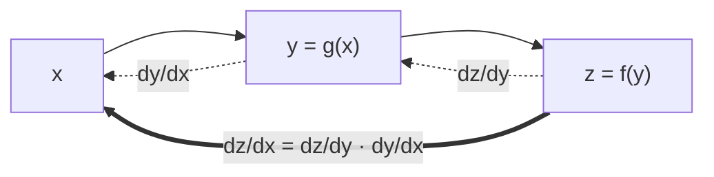

# Calculus for Machine Learning

> **TL;DR:** Derivatives measure how a function changes; the gradient collects those changes for every input; and the chain rule composes them — which is exactly what backpropagation does to train neural networks.

---

## Overview

Almost every model in machine learning learns by *minimizing a loss*, and minimization is powered by calculus. You do not need to solve integrals by hand, but you must understand derivatives, gradients, and the chain rule, because these are the machinery behind gradient descent and backpropagation.

**By the end, you will be able to:**
- Interpret a derivative as an instantaneous rate of change and a slope.
- Compute partial derivatives and assemble them into the gradient $\nabla f$.
- Apply the chain rule and explain its role in backpropagation.

---

## Intuition

Imagine standing on a hillside in fog. You cannot see the whole landscape, but you can feel the slope directly under your feet. A **derivative** is that local slope: if you take a tiny step in some direction, how much does your height change?

For a function of one variable, there is only one direction to worry about. For a function of many variables — like a loss that depends on millions of network weights — you feel a slope in *every* direction at once. The **gradient** is the vector that bundles all those slopes together, and it happens to point in the direction of steepest increase. Walk the opposite way and you go downhill fastest, which is the whole idea behind training.

The **chain rule** is how you reason about slopes through a pipeline. If a small change in $x$ nudges $y$, and a change in $y$ nudges $z$, the chain rule multiplies those sensitivities to tell you how $x$ affects $z$. Neural networks are long pipelines of such compositions, so the chain rule is what lets us assign credit backwards through the layers.

---

## Details

### Mathematics

**Derivative.** For a scalar function $f: \mathbb{R} \to \mathbb{R}$, the derivative at $x$ is the limit of the slope of the secant line:

$$
f'(x) = \frac{df}{dx} = \lim_{h \to 0} \frac{f(x+h) - f(x)}{h}
$$

Here $h$ is a small step in the input. The derivative $f'(x)$ is the instantaneous rate of change of $f$ at $x$.

**Rules you actually need.** With $c$ a constant and $u, v$ functions of $x$:

$$
\frac{d}{dx}\,x^n = n x^{n-1}, \qquad
\frac{d}{dx}\,e^{x} = e^{x}, \qquad
\frac{d}{dx}\,\ln x = \frac{1}{x}
$$

$$
(u+v)' = u' + v', \qquad (uv)' = u'v + uv' \quad(\text{product rule})
$$

**Partial derivatives.** For $f: \mathbb{R}^n \to \mathbb{R}$ with inputs $x_1, \dots, x_n$, the partial derivative $\frac{\partial f}{\partial x_i}$ is the derivative with respect to $x_i$ while holding every other input fixed.

**Gradient.** The gradient stacks all partials into a vector:

$$
\nabla f(\mathbf{x}) =
\begin{bmatrix}
\dfrac{\partial f}{\partial x_1} & \dfrac{\partial f}{\partial x_2} & \cdots & \dfrac{\partial f}{\partial x_n}
\end{bmatrix}^{\top}
$$

$\nabla f$ (read "del $f$") points in the direction of steepest ascent, and $\lVert \nabla f \rVert$ is the rate of increase in that direction.

**Chain rule.** For a composition $z = f(g(x))$ with $y = g(x)$:

$$
\frac{dz}{dx} = \frac{dz}{dy} \cdot \frac{dy}{dx}
$$

The multivariable form, used in backpropagation, sums contributions through every intermediate variable $y_j$:

$$
\frac{\partial z}{\partial x_i} = \sum_{j} \frac{\partial z}{\partial y_j}\, \frac{\partial y_j}{\partial x_i}
$$

**Jacobian and Hessian.** For a vector-valued map $\mathbf{f}: \mathbb{R}^n \to \mathbb{R}^m$, the **Jacobian** $J$ is the $m \times n$ matrix of first-order partials $J_{ij} = \partial f_i / \partial x_j$. For a scalar $f$, the **Hessian** $H$ is the $n \times n$ matrix of second-order partials $H_{ij} = \partial^2 f / (\partial x_i\, \partial x_j)$; it describes curvature and underlies second-order optimizers.

### Python implementation

Symbolic differentiation with SymPy gives exact derivatives:

```python
import sympy as sp

x, y = sp.symbols("x y")
f = x**2 * sp.sin(y) + sp.exp(x)

# Partial derivatives
df_dx = sp.diff(f, x)   # 2*x*sin(y) + exp(x)
df_dy = sp.diff(f, y)   # x**2*cos(y)

grad = sp.Matrix([df_dx, df_dy])
print(grad)
```

When you only have the function as code (not a formula), estimate the gradient numerically with a central finite difference:

```python
import numpy as np
from typing import Callable

def numerical_gradient(
    f: Callable[[np.ndarray], float],
    x: np.ndarray,
    h: float = 1e-5,
) -> np.ndarray:
    """Central-difference gradient: (f(x+h) - f(x-h)) / (2h) per coordinate."""
    grad = np.zeros_like(x, dtype=float)
    for i in range(x.size):
        step = np.zeros_like(x, dtype=float)
        step[i] = h
        grad[i] = (f(x + step) - f(x - step)) / (2 * h)
    return grad

# f(x) = x0^2 + 3*x1^2  ->  gradient = [2*x0, 6*x1]
f = lambda v: v[0] ** 2 + 3 * v[1] ** 2
print(numerical_gradient(f, np.array([1.0, 2.0])))  # ~ [2., 12.]
```

The central difference $\frac{f(x+h) - f(x-h)}{2h}$ is more accurate than the one-sided version because its leading error term is $O(h^2)$ rather than $O(h)$.

## Diagram



## Worked Example

Consider one logistic-regression neuron on a single input: $z = wx + b$, $\hat{y} = \sigma(z) = \frac{1}{1+e^{-z}}$, with squared loss $L = \tfrac{1}{2}(\hat{y} - t)^2$ for target $t$.

To update $w$ you need $\partial L / \partial w$. Apply the chain rule through the pipeline:

$$
\frac{\partial L}{\partial w}
= \frac{\partial L}{\partial \hat{y}} \cdot \frac{\partial \hat{y}}{\partial z} \cdot \frac{\partial z}{\partial w}
= (\hat{y} - t)\,\big(\hat{y}(1-\hat{y})\big)\, x
$$

using the standard result $\sigma'(z) = \sigma(z)\,(1 - \sigma(z))$. Each factor is one link in the chain — this backward multiplication of local derivatives *is* backpropagation for this tiny network.

```python
import numpy as np

x, t, w, b = 2.0, 1.0, 0.5, 0.0
z = w * x + b
y_hat = 1 / (1 + np.exp(-z))
dL_dw = (y_hat - t) * (y_hat * (1 - y_hat)) * x
print(round(dL_dw, 4))
```

## Best Practices
- ✅ Verify hand-derived or symbolic gradients against `numerical_gradient` before trusting them in training code.
- ✅ Keep derivatives vectorized with NumPy rather than looping over scalars.
- ✅ Define every symbol and its shape before differentiating; shape errors dominate real-world bugs.

## Common Mistakes
- ⚠️ Confusing the gradient's *direction*: $\nabla f$ points uphill, so descent moves along $-\nabla f$.
- ⚠️ Using a one-sided finite difference and blaming the model for a "wrong" gradient — prefer the central difference.
- ⚠️ Picking $h$ too small (catastrophic floating-point cancellation) or too large (poor approximation); $h \approx 10^{-5}$ is a safe default for float64.

## Industry Tips
- 💡 Frameworks like PyTorch and JAX compute gradients by *automatic differentiation* (autodiff), which applies the chain rule exactly and cheaply — you almost never hand-code gradients in production.
- 💡 `torch.autograd.gradcheck` uses finite differences to validate custom autograd functions; the numerical gradient above is the same idea.

## Real-World Use Cases
- Backpropagation training every neural network, from linear models to large transformers.
- Gradient-based feature attribution (saliency maps) that explain model predictions.
- Physics-informed and differentiable-simulation models where gradients flow through solvers.

---

## Summary
- A derivative is an instantaneous rate of change; the gradient $\nabla f$ collects partial derivatives and points toward steepest ascent.
- The chain rule composes local sensitivities and is the mathematical core of backpropagation.
- SymPy gives exact symbolic derivatives; a central finite difference gives a numerical check.

## Practice
- [ ] Exercises: [Module 2 Exercises](../exercises/README.md)
- [ ] Self-check: Why does gradient descent step along $-\nabla f$ rather than $+\nabla f$?

## Further Reading
- 📘 Mathematics for Machine Learning — Deisenroth, Faisal & Ong (https://mml-book.github.io/)
- 📘 Deep Learning — Goodfellow, Bengio & Courville (https://www.deeplearningbook.org/)
- ▶️ 3Blue1Brown (https://www.youtube.com/@3blue1brown)

## Related
- [Gradient Descent](gradient-descent.md)
- [Deep Learning](../../04-deep-learning/README.md) — backpropagation in practice

---

## Navigation
- ⬆️ [Lessons](README.md)
- 📚 [Module 2 — Mathematics for AI](../README.md)
- 🏠 [Knowledge Base Home](../../README.md)
