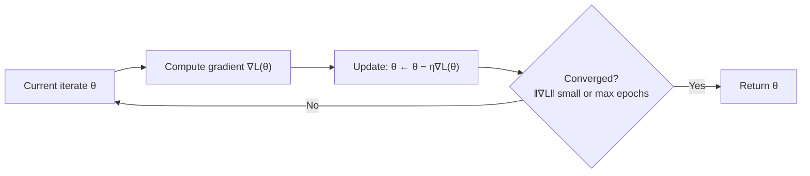

# Gradient Descent

> **TL;DR:** Gradient descent repeatedly steps parameters in the direction of the negative gradient, $\theta \leftarrow \theta - \eta\,\nabla_\theta L$, shrinking the loss until it converges — the choice of learning rate and batch size decides whether it works well.

---

## Overview

Training a model means finding parameters that make the loss small. For anything beyond the simplest models there is no closed-form solution, so we search *iteratively*. Gradient descent is that search: it is the single most important optimization algorithm in machine learning, and every advanced optimizer is a variation on it.

**By the end, you will be able to:**
- State the gradient-descent update rule and explain each term.
- Reason about the learning rate and diagnose steps that are too large or too small.
- Distinguish batch, stochastic, and mini-batch descent and know when convergence fails.

---

## Intuition

You are on a foggy hillside again (see [Calculus](calculus.md)), trying to reach the lowest valley. You cannot see far, but you can feel the slope under your feet. A sensible strategy: face downhill and take a step, feel the new slope, step again, and repeat. That is gradient descent.

The slope is the gradient $\nabla f$. It points *uphill*, so you walk the opposite way, $-\nabla f$. The size of each step is the **learning rate** $\eta$. Step too timidly and you crawl toward the valley forever; step too boldly and you overshoot, bounce across the valley, and may fly *up* the far slope and diverge.

There is a subtlety: on a big dataset, feeling the *exact* slope means evaluating every example, which is slow. Instead you can feel an *approximate* slope from a handful of examples. The approximation is noisy, but it is fast and often good enough — and the noise can even help you escape bad spots.

---

## Details

### Mathematics

Let $\theta \in \mathbb{R}^d$ be the parameter vector and $L(\theta)$ the loss (a scalar). The gradient $\nabla_\theta L(\theta)$ is the vector of partial derivatives of $L$ with respect to each parameter. The **update rule** is:

$$
\theta \leftarrow \theta - \eta\,\nabla_\theta L(\theta)
$$

where $\eta > 0$ is the **learning rate** (step size). Starting from an initial $\theta_0$, iterating this rule produces $\theta_1, \theta_2, \dots$ with (under the right conditions) decreasing loss.

**The learning rate $\eta$.** Locally, $L(\theta - \eta \nabla L) \approx L(\theta) - \eta \lVert \nabla L \rVert^2$, so a small step is guaranteed to *decrease* the loss. But $\eta$ controls how far you trust this linear approximation:

- **Too small:** loss decreases, but painfully slowly; many wasted iterations.
- **Too large:** you overshoot the minimum, the loss oscillates or *increases*, and training can diverge to `inf`/`NaN`.

**Batch vs stochastic vs mini-batch.** With $N$ training examples, the full loss is $L(\theta) = \frac{1}{N}\sum_{i=1}^{N} \ell_i(\theta)$, where $\ell_i$ is the loss on example $i$.

- **Batch (full) GD:** uses the exact gradient $\frac{1}{N}\sum_i \nabla \ell_i$. Stable but expensive per step.
- **Stochastic GD (SGD):** uses one random example's gradient $\nabla \ell_i$. Cheap and noisy; the noise is an unbiased estimate of the true gradient.
- **Mini-batch GD:** averages over a batch $B$ of size $m$, $\frac{1}{m}\sum_{i \in B} \nabla \ell_i$. The standard choice: a compromise that is fast, hardware-friendly, and reasonably stable. In practice "SGD" usually means mini-batch SGD.

**Convergence and when it fails.** If $L$ is **convex** and $\eta$ is small enough, gradient descent converges to the global minimum. Deep networks are **non-convex**, so descent finds only a *local* minimum or a flat region. It can stall at **saddle points** (where $\nabla L = 0$ but the point is neither a min nor a max) or in flat plateaus where gradients nearly vanish. A poorly scaled $\eta$ can also cause divergence regardless of the landscape.

### Python implementation

Gradient descent from scratch to fit a linear model $\hat{y} = w x + b$ under mean-squared error:

```python
import numpy as np

rng = np.random.default_rng(0)
X = rng.uniform(-1, 1, size=200)
y = 3.0 * X + 2.0 + rng.normal(scale=0.1, size=X.shape)  # true w=3, b=2

def gradient_descent(X, y, eta=0.1, epochs=200):
    w, b = 0.0, 0.0
    n = X.size
    for _ in range(epochs):
        y_hat = w * X + b
        error = y_hat - y                 # shape (n,)
        # Gradients of MSE = (1/n) * sum(error^2 / ... ) -> d/dw, d/db
        grad_w = (2 / n) * np.dot(error, X)
        grad_b = (2 / n) * np.sum(error)
        w -= eta * grad_w                 # update rule
        b -= eta * grad_b
    return w, b

w, b = gradient_descent(X, y)
print(f"w={w:.3f}, b={b:.3f}")  # close to 3.0 and 2.0
```

Swapping the full-data gradient for a per-batch gradient (by shuffling and slicing `X`/`y`) turns this into mini-batch SGD.

## Diagram



## Worked Example

Take the simplest quadratic loss $L(\theta) = \theta^2$, so $\nabla L = 2\theta$ and the true minimum is $\theta = 0$. Start at $\theta_0 = 5$.

- With $\eta = 0.1$: $\theta_1 = 5 - 0.1(10) = 4$, $\theta_2 = 4 - 0.1(8) = 3.2$, … steadily shrinking toward 0. **Converges.**
- With $\eta = 1.1$: $\theta_1 = 5 - 1.1(10) = -6$, $\theta_2 = -6 - 1.1(-12) = 7.2$, … the magnitude *grows* each step. **Diverges.**

The only difference is the learning rate. This one-dimensional case makes visible why $\eta$ is the first hyperparameter you tune.

```python
def descend_1d(theta0, eta, steps=6):
    theta = theta0
    for _ in range(steps):
        theta = theta - eta * (2 * theta)   # grad of theta^2
        print(round(theta, 3))

descend_1d(5.0, 0.1)   # -> 0
descend_1d(5.0, 1.1)   # -> diverges
```

## Best Practices
- ✅ Normalize or standardize input features so all parameters share a similar scale — this makes a single $\eta$ work across dimensions.
- ✅ Start with a modest learning rate (e.g. `1e-3`) and increase or decrease by factors of 10 while watching the loss curve.
- ✅ Use mini-batches sized to your hardware (often 32–512) rather than pure SGD or full-batch.

## Common Mistakes
- ⚠️ Loss going to `NaN` almost always means $\eta$ is too large — lower it by 10×.
- ⚠️ Forgetting to shuffle data each epoch in SGD, which introduces ordering bias — shuffle every epoch.
- ⚠️ Declaring "it converged" when the loss merely stopped moving at a high value; check the gradient norm and the loss value, not just its rate of change.

## Industry Tips
- 💡 A **learning-rate schedule** (warmup then decay) is standard for training deep networks and large language models; a constant $\eta$ is rarely optimal.
- 💡 Plain SGD is the baseline, but adaptive optimizers (momentum, Adam) — covered in [Optimization](optimization.md) — usually converge faster in practice.

## Real-World Use Cases
- Training every neural network, from small classifiers to trillion-parameter transformers.
- Fitting classical models: linear/logistic regression, matrix factorization for recommenders.
- Fine-tuning pretrained models on downstream tasks with a small learning rate.

---

## Summary
- The update rule $\theta \leftarrow \theta - \eta\,\nabla_\theta L$ walks parameters downhill.
- The learning rate $\eta$ trades speed for stability; too large diverges, too small crawls.
- Mini-batch SGD is the practical default; on non-convex losses, descent finds local minima and can stall at saddle points.

## Practice
- [ ] Exercises: [Module 2 Exercises](../exercises/README.md)
- [ ] Self-check: For $L(\theta)=\theta^2$, what is the largest $\eta$ for which the update does not diverge?

## Further Reading
- 📘 Mathematics for Machine Learning — Deisenroth, Faisal & Ong (https://mml-book.github.io/)
- 📘 Deep Learning — Goodfellow, Bengio & Courville (https://www.deeplearningbook.org/)
- ▶️ 3Blue1Brown (https://www.youtube.com/@3blue1brown)

## Related
- [Calculus for Machine Learning](calculus.md)
- [Optimization](optimization.md)
- [Deep Learning](../../04-deep-learning/README.md) — optimizers in training loops

---

## Navigation
- ⬆️ [Lessons](README.md)
- 📚 [Module 2 — Mathematics for AI](../README.md)
- 🏠 [Knowledge Base Home](../../README.md)
