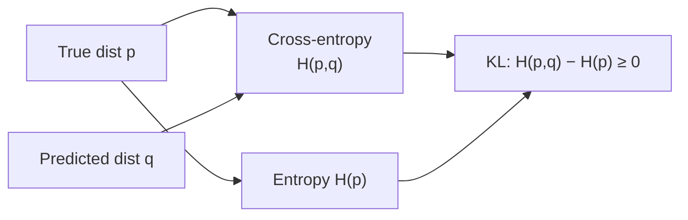

# Information Theory

> **TL;DR:** Information theory measures uncertainty: entropy is the average surprise of a distribution, cross-entropy scores predictions against truth, and KL divergence is the gap between them — which is exactly why cross-entropy is the go-to classification loss.

---

## Overview

Information theory gives machine learning its vocabulary for uncertainty and its most-used loss function. When a classifier outputs probabilities, we need a principled way to say how good those probabilities are — and entropy, cross-entropy, and KL divergence provide it. These same quantities reappear in language modeling as perplexity and in generative models as training objectives.

**By the end, you will be able to:**
- Interpret information content $-\log p$ as "surprise" and entropy as average surprise.
- Compute entropy, cross-entropy, and KL divergence, and explain why $D_{KL} \ge 0$ and is asymmetric.
- Explain why cross-entropy is the standard loss for classification.

---

## Intuition

Some events tell you a lot; others tell you nothing. Being told "the sun rose today" carries almost no information — you already knew it. Being told "it snowed in the desert" is surprising and informative. Information theory formalizes this: the rarer an event (smaller probability $p$), the more **surprise** it carries. The quantity $-\log p$ captures this — it is large when $p$ is small and zero when $p = 1$.

**Entropy** is the *average* surprise you expect from a distribution. A fair coin is maximally uncertain (high entropy); a coin that always lands heads carries no surprise (zero entropy).

Now suppose your model predicts a distribution $q$ but reality follows $p$. **Cross-entropy** measures the average surprise you actually suffer when you use $q$ to describe events drawn from $p$. If your predictions are perfect ($q = p$), cross-entropy bottoms out at the entropy of $p$; otherwise you pay a penalty. That extra penalty is the **KL divergence** — the wasted surprise from believing the wrong distribution. Training a classifier is nothing more than shrinking this waste.

---

## Details

### Mathematics

Throughout, $p$ and $q$ are probability distributions over the same set of outcomes, $p_i$ is the probability of outcome $i$, and $\log$ is the natural logarithm (units of *nats*; using $\log_2$ gives *bits*).

**Information content (surprise).** The information of an outcome with probability $p_i$ is

$$
I(p_i) = -\log p_i \; \ge 0
$$

Rare outcomes ($p_i \to 0$) carry large information; certain outcomes ($p_i = 1$) carry none.

**Entropy.** The entropy of $p$ is the expected information:

$$
H(p) = -\sum_i p_i \log p_i
$$

It is the average surprise, and it is maximized by the uniform distribution and minimized (zero) by a point mass.

**Cross-entropy.** The cross-entropy of $q$ relative to $p$ is the expected surprise when outcomes follow $p$ but are scored with $q$:

$$
H(p, q) = -\sum_i p_i \log q_i
$$

**KL divergence.** The Kullback–Leibler divergence measures how far $q$ is from $p$:

$$
D_{KL}(p \parallel q) = \sum_i p_i \log \frac{p_i}{q_i} = H(p, q) - H(p)
$$

Two key properties:

- **Non-negativity:** $D_{KL}(p \parallel q) \ge 0$, with equality iff $p = q$. This follows from Gibbs' inequality (a consequence of the concavity of $\log$ / Jensen's inequality). Because $D_{KL} \ge 0$, cross-entropy $H(p,q) = H(p) + D_{KL}(p \parallel q) \ge H(p)$ — you can never beat the true entropy.
- **Asymmetry:** in general $D_{KL}(p \parallel q) \ne D_{KL}(q \parallel p)$, so it is *not* a distance metric.

**Mutual information (brief).** For two random variables $X, Y$, mutual information $I(X;Y) = D_{KL}\big(p(x,y) \parallel p(x)p(y)\big)$ measures how much knowing one reduces uncertainty about the other; it is zero exactly when $X$ and $Y$ are independent.

**Why cross-entropy is the classification loss.** In classification the true label is a one-hot distribution $p$ (all mass on the correct class $c$, so $p_c = 1$). Minimizing cross-entropy over model predictions $q$ is equivalent to minimizing $D_{KL}(p \parallel q)$, because $H(p) = 0$ for a one-hot $p$ and $H(p,q) = H(p) + D_{KL}(p\parallel q)$. So driving cross-entropy down *is* pushing the model's distribution toward the truth. With one-hot $p$ the loss collapses to $-\log q_c$: the negative log-probability the model assigned to the correct class — the **negative log-likelihood**. Minimizing it is therefore exactly maximum-likelihood estimation, giving cross-entropy a firm statistical footing. It also pairs cleanly with softmax to yield simple, well-behaved gradients.

### Python implementation

```python
import numpy as np

def entropy(p: np.ndarray) -> float:
    p = np.asarray(p, dtype=float)
    return float(-np.sum(p * np.log(p + 1e-12)))          # nats

def cross_entropy(p: np.ndarray, q: np.ndarray) -> float:
    p, q = np.asarray(p, float), np.asarray(q, float)
    return float(-np.sum(p * np.log(q + 1e-12)))

def kl_divergence(p: np.ndarray, q: np.ndarray) -> float:
    p, q = np.asarray(p, float), np.asarray(q, float)
    return float(np.sum(p * np.log((p + 1e-12) / (q + 1e-12))))

p = np.array([0.7, 0.2, 0.1])
q = np.array([0.5, 0.3, 0.2])
print(entropy(p))                       # ~0.802 nats
print(cross_entropy(p, q))              # >= entropy(p)
print(kl_divergence(p, q))              # = cross_entropy(p,q) - entropy(p) >= 0
```

Cross-entropy loss on a softmax output for a single labeled example:

```python
def softmax(z: np.ndarray) -> np.ndarray:
    z = z - z.max()                     # numerical stability
    e = np.exp(z)
    return e / e.sum()

logits = np.array([2.0, 1.0, 0.1])      # raw model scores
probs = softmax(logits)                 # predicted distribution q
true_class = 0                          # one-hot p with p_0 = 1
loss = -np.log(probs[true_class] + 1e-12)   # = cross-entropy for one-hot p
print(round(loss, 4))
```

The `1e-12` guards protect against $\log 0$; production libraries fuse softmax and cross-entropy into one numerically stable operation.

## Diagram



## Worked Example

A 3-class classifier sees an image whose true label is class 0, so $p = [1, 0, 0]$. Two models predict:

- Confident-correct: $q_A = [0.9, 0.05, 0.05]$ → loss $= -\log 0.9 \approx 0.105$.
- Confident-wrong: $q_B = [0.1, 0.8, 0.1]$ → loss $= -\log 0.1 \approx 2.303$.

Cross-entropy rewards the model that put high probability on the true class and heavily penalizes confident mistakes (the loss grows without bound as $q_c \to 0$). Averaged over a dataset, this is precisely the training signal a classifier follows. In language modeling, the average cross-entropy per token, exponentiated, is the model's **perplexity** — the same quantity in a friendlier unit.

## Best Practices
- ✅ Always add a small epsilon (or use a fused loss) before taking logs to avoid $-\infty$ from zero probabilities.
- ✅ Feed *logits* into a combined softmax-cross-entropy function rather than softmaxing then logging separately.
- ✅ Be explicit about units (bits vs nats) when reporting entropy or perplexity.

## Common Mistakes
- ⚠️ Treating KL divergence as symmetric — $D_{KL}(p\parallel q) \ne D_{KL}(q\parallel p)$; choose the direction deliberately.
- ⚠️ Double-applying softmax (once in the model, again in the loss), which flattens gradients — pass raw logits to the loss.
- ⚠️ Reporting perplexity computed with the wrong log base; perplexity is $\exp$ of natural-log cross-entropy (or $2^{H}$ for bits).

## Industry Tips
- 💡 In LLM training and evaluation, cross-entropy loss and its exponential, perplexity, are the primary quality metrics.
- 💡 KL divergence appears as a regularizer in variational autoencoders and as the trust-region term in RLHF/PPO fine-tuning of language models.

## Real-World Use Cases
- Cross-entropy loss for classification across vision, NLP, and tabular models.
- Perplexity for evaluating and comparing language models.
- KL divergence in variational inference, distillation, and policy-optimization objectives.

---

## Summary
- Surprise is $-\log p$; entropy $H(p) = -\sum_i p_i \log p_i$ is its average.
- Cross-entropy $H(p,q) = -\sum_i p_i \log q_i$ decomposes as $H(p) + D_{KL}(p\parallel q)$, and $D_{KL} \ge 0$ (asymmetric).
- Minimizing cross-entropy equals minimizing KL to the true labels and equals maximum-likelihood — hence it is the standard classification loss.

## Practice
- [ ] Exercises: [Module 2 Exercises](../exercises/README.md)
- [ ] Self-check: For a one-hot label, why does cross-entropy reduce to $-\log q_c$?

## Further Reading
- 📘 Mathematics for Machine Learning — Deisenroth, Faisal & Ong (https://mml-book.github.io/)
- 📘 Deep Learning — Goodfellow, Bengio & Courville (https://www.deeplearningbook.org/)
- ▶️ StatQuest (https://www.youtube.com/@statquest)
- ▶️ 3Blue1Brown (https://www.youtube.com/@3blue1brown)

## Related
- [Probability](probability.md)
- [Large Language Models](../../07-large-language-models/README.md) — cross-entropy and perplexity
- [Deep Learning](../../04-deep-learning/README.md) — loss functions

---

## Navigation
- ⬆️ [Lessons](README.md)
- 📚 [Module 2 — Mathematics for AI](../README.md)
- 🏠 [Knowledge Base Home](../../README.md)
