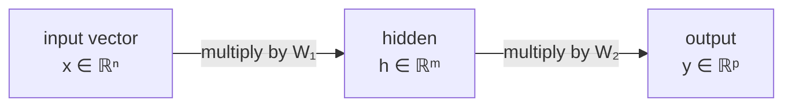

# Matrices

> **TL;DR:** A matrix is both a table of numbers (rows of data) and a function that transforms vectors. Matrix multiplication chains those transformations and is the computational core of every neural network layer.

---

## Overview

If vectors are the atoms of AI, matrices are the machines that move them. Your dataset is a matrix (rows = samples, columns = features). A neural network layer is a matrix that maps input vectors to output vectors. Attention in Transformers is a stack of matrix multiplications. Mastering shape rules, transposition, inverses, and how to solve $A\mathbf{x} = \mathbf{b}$ lets you read and debug real model code.

**By the end, you will be able to:**
- See a matrix as both a data table and a linear transformation.
- Apply matrix–vector and matrix–matrix multiplication with correct shape rules.
- Recognize special matrices (diagonal, symmetric, orthogonal), compute rank, and solve linear systems in NumPy.

---

## Intuition

Two mental pictures, both correct.

**As a table:** a matrix is a spreadsheet. Rows are records (customers, images, tokens), columns are attributes (age, pixel, feature). This is how you store data.

**As a transformation:** a matrix is a machine that eats a vector and spits out another vector, deforming space in a *linear* way — it can rotate, scale, shear, or project, but it always keeps the origin fixed and keeps straight lines straight. If you know where the transformation sends each basis direction, you know everything it does. Multiplying two matrices means "do this transformation, then that one," composing them into a single machine. This is why a deep network — a chain of layers — is really a chain of matrix transformations with nonlinearities wedged between them.

---

## Details

### Mathematics

A **matrix** $A \in \mathbb{R}^{m \times n}$ has $m$ rows and $n$ columns; the entry in row $i$, column $j$ is $a_{ij}$:

$$
A = \begin{bmatrix}
a_{11} & a_{12} & \cdots & a_{1n} \\
a_{21} & a_{22} & \cdots & a_{2n} \\
\vdots & \vdots & \ddots & \vdots \\
a_{m1} & a_{m2} & \cdots & a_{mn}
\end{bmatrix}.
$$

**Matrix–vector product.** For $A \in \mathbb{R}^{m\times n}$ and $\mathbf{x} \in \mathbb{R}^n$, the result $A\mathbf{x} \in \mathbb{R}^m$ has entries

$$
(A\mathbf{x})_i = \sum_{j=1}^{n} a_{ij} x_j.
$$

This is the linear transformation view: $A$ maps an $n$-dimensional vector to an $m$-dimensional one.

**Matrix–matrix product.** For $A \in \mathbb{R}^{m\times n}$ and $B \in \mathbb{R}^{n\times p}$, the product $C = AB \in \mathbb{R}^{m\times p}$ has entries

$$
c_{ij} = \sum_{k=1}^{n} a_{ik} b_{kj}.
$$

**Shape rule:** the inner dimensions must match — $(m \times n)(n \times p) \to (m \times p)$. Multiplication is **associative** ($A(BC) = (AB)C$) but generally **not commutative** ($AB \neq BA$).

**Transpose.** $A^\top$ flips rows and columns: $(A^\top)_{ij} = a_{ji}$, so $A^\top \in \mathbb{R}^{n\times m}$.

**Identity.** $I_n \in \mathbb{R}^{n\times n}$ has ones on the diagonal and zeros elsewhere; $AI = IA = A$. It is the "do nothing" transformation.

**Inverse.** A square matrix $A \in \mathbb{R}^{n\times n}$ is **invertible** if there exists $A^{-1}$ with

$$
A A^{-1} = A^{-1} A = I_n.
$$

An inverse exists exactly when $A$ is **full rank** (equivalently, $\det A \neq 0$).

**Special matrices:**
- **Diagonal:** nonzero entries only on the diagonal; scales each axis independently.
- **Symmetric:** $A = A^\top$.
- **Orthogonal:** $Q^\top Q = Q Q^\top = I$, so $Q^{-1} = Q^\top$. Orthogonal matrices rotate/reflect without changing lengths or angles.

**Rank.** $\operatorname{rank}(A)$ is the number of linearly independent rows (equivalently, columns). It measures how many dimensions the transformation's output actually spans; a **rank-deficient** matrix collapses space.

**Linear systems.** Solving $A\mathbf{x} = \mathbf{b}$ finds the input $\mathbf{x}$ that the transformation maps to $\mathbf{b}$. If $A$ is invertible, $\mathbf{x} = A^{-1}\mathbf{b}$ — but in practice you *solve* rather than invert (see Best Practices).

### Python implementation

```python
import numpy as np

A: np.ndarray = np.array([[1.0, 2.0],
                          [3.0, 4.0]])
x: np.ndarray = np.array([1.0, 1.0])

# Matrix-vector and matrix-matrix products use @
print(A @ x)        # [3. 7.]
B: np.ndarray = np.array([[5.0, 6.0], [7.0, 8.0]])
print(A @ B)        # [[19. 22.] [43. 50.]]

# Transpose, identity
print(A.T)                 # [[1. 3.] [2. 4.]]
print(np.eye(2))           # identity

# Rank and inverse
print(np.linalg.matrix_rank(A))  # 2 (full rank)
print(np.linalg.inv(A))          # inverse exists

# Orthogonality check for a rotation matrix
theta = np.pi / 4
Q = np.array([[np.cos(theta), -np.sin(theta)],
              [np.sin(theta),  np.cos(theta)]])
print(np.allclose(Q.T @ Q, np.eye(2)))  # True
```

## Diagram



Each arrow is a matrix transformation; stacking them (with nonlinearities in a real network) composes into the full model.

## Worked Example

Solve a small linear system — the workhorse behind linear regression's normal equations. Suppose two feature combinations produce two targets:

$$
\begin{cases} 2x_1 + x_2 = 5 \\ x_1 + 3x_2 = 10 \end{cases}
\quad\Longrightarrow\quad
A = \begin{bmatrix} 2 & 1 \\ 1 & 3 \end{bmatrix},\;
\mathbf{b} = \begin{bmatrix} 5 \\ 10 \end{bmatrix}.
$$

```python
import numpy as np

A = np.array([[2.0, 1.0], [1.0, 3.0]])
b = np.array([5.0, 10.0])

# Preferred: solve directly (faster and more stable than inverting)
x = np.linalg.solve(A, b)
print(x)                 # [1. 3.]
print(np.allclose(A @ x, b))  # True

# For non-square / overdetermined systems (real regression), use least squares
x_ls, *_ = np.linalg.lstsq(A, b, rcond=None)
print(x_ls)              # same solution here
```

The solution $\mathbf{x} = [1, 3]$ is the input the transformation $A$ maps to the target $\mathbf{b}$.

## Best Practices
- ✅ Prefer `np.linalg.solve(A, b)` over `np.linalg.inv(A) @ b` — it is faster and numerically more stable.
- ✅ Track shapes explicitly; a `(m, n) @ (n, p)` mismatch is the most common bug in model code.
- ✅ Use `np.linalg.lstsq` for overdetermined systems (more equations than unknowns), the usual case in ML.

## Common Mistakes
- ⚠️ Assuming $AB = BA$. Matrix multiplication is not commutative; order encodes "which transformation first."
- ⚠️ Using `*` (element-wise) when you meant `@` (matrix product). NumPy will happily broadcast and give a wrong answer.
- ⚠️ Inverting a near-singular (rank-deficient) matrix; the result explodes numerically. Check `np.linalg.matrix_rank` first.

## Industry Tips
- 💡 A dense/linear layer computes $\mathbf{y} = W\mathbf{x} + \mathbf{b}$ — one matrix multiply plus a bias. Batches turn this into matrix–matrix products for GPU efficiency.
- 💡 In Transformers, attention scores are $QK^\top$ and the output is a weighted matrix product with $V$; it is matrices all the way down.

## Real-World Use Cases
- Every fully connected neural network layer is a matrix multiplication.
- Linear and ridge regression solve linear systems derived from data matrices.
- Graphics, robotics, and camera models use orthogonal/rotation matrices to move points in space.

---

## Summary
- A matrix is simultaneously a data table and a linear transformation of vectors.
- Multiplication composes transformations with the inner-dimension shape rule; it is associative but not commutative.
- Transpose, identity, inverse, rank, and special structures (diagonal, symmetric, orthogonal) let you reason about and solve $A\mathbf{x} = \mathbf{b}$.

## Practice
- [ ] Exercises: [Module 2 Exercises](../exercises/README.md)
- [ ] Self-check: Given `A` is `(3, 4)` and `B` is `(4, 2)`, what is the shape of `A @ B`, and is `B @ A` even defined?

## Further Reading
- 📘 Mathematics for Machine Learning — Deisenroth, Faisal & Ong (https://mml-book.github.io/)
- 📄 [NumPy linear algebra](https://numpy.org/doc/stable/reference/routines.linalg.html)
- ▶️ 3Blue1Brown — Essence of Linear Algebra (https://www.youtube.com/@3blue1brown)

## Related
- [Vectors](vectors.md)
- [Eigenvalues and Eigenvectors](eigenvalues-and-eigenvectors.md)
- [Transformers](../../06-transformers/README.md)

---

## Navigation
- ⬆️ [Lessons](README.md)
- 📚 [Module 2 — Mathematics for AI](../README.md)
- 🏠 [Knowledge Base Home](../../README.md)
