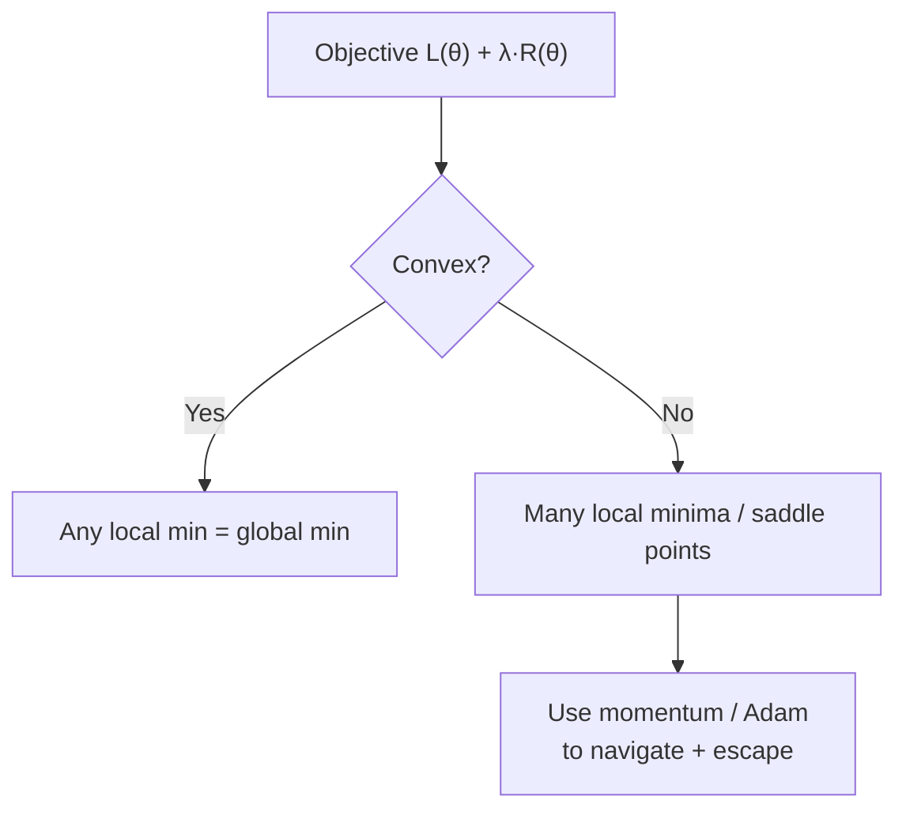

# Optimization

> **TL;DR:** Optimization is minimizing an objective; convexity decides whether a minimum is global, momentum and Adam accelerate the search, and regularization adds penalty terms that trade fit for simplicity.

---

## Overview

Machine learning *is* optimization: you write down an objective that measures how bad a model is, then search for parameters that make it small. Understanding the shape of that objective (convex or not), the algorithms that navigate it (momentum, Adam), and the penalty terms that shape it (regularization) is what separates tuning by luck from tuning by reason.

**By the end, you will be able to:**
- Describe objective/loss functions and the difference between local and global minima.
- Explain convex vs non-convex landscapes and how momentum and Adam accelerate descent.
- Express $L_1$/$L_2$ regularization and constraints as terms in an optimization problem.

---

## Intuition

An **objective function** is a scorecard: give it a set of parameters and it returns a single number saying how badly the model does. Optimization is the game of making that number as small as possible.

The *shape* of the scorecard matters enormously. A **convex** objective is bowl-shaped: wherever you are, walking downhill always leads to the single lowest point. A **non-convex** objective is a mountain range with many valleys — walk downhill and you reach *a* valley, but maybe not the deepest one. Deep-learning losses are non-convex, which is why initialization and optimizer choice matter.

**Momentum** helps you cross this terrain: instead of reacting only to the slope right now, you carry velocity like a heavy ball rolling downhill, smoothing out jitter and powering through small bumps. **Adam** goes further, giving each parameter its own adaptive step size based on the recent history of its gradients. **Regularization** changes the scorecard itself: it adds a penalty for complex solutions, nudging the optimizer toward simpler models that generalize better.

---

## Details

### Mathematics

**Objective / loss.** We seek $\theta^\star = \arg\min_{\theta} L(\theta)$, where $L(\theta)$ is the loss (objective) and $\theta$ are the parameters. A point $\theta^\star$ is a **local minimum** if $L(\theta^\star) \le L(\theta)$ for all $\theta$ nearby, and a **global minimum** if the inequality holds for *all* $\theta$.

**Convexity.** A function $L$ is **convex** if for all $\theta_1, \theta_2$ and $\lambda \in [0,1]$:

$$
L\big(\lambda \theta_1 + (1-\lambda)\theta_2\big) \le \lambda L(\theta_1) + (1-\lambda) L(\theta_2)
$$

Geometrically, the line segment between any two points on the graph lies on or above the graph. For convex $L$, **every local minimum is a global minimum**. Non-convex functions (typical of neural networks) violate this and admit multiple local minima and saddle points.

**Momentum.** Introduce a velocity vector $v$ and a momentum coefficient $\beta \in [0,1)$ (often $0.9$):

$$
v \leftarrow \beta v + \nabla_\theta L(\theta), \qquad
\theta \leftarrow \theta - \eta\, v
$$

The velocity accumulates an exponentially weighted average of past gradients, damping oscillation across steep directions and accelerating along consistent ones.

**Adam (conceptual).** Adam ("adaptive moment estimation") maintains two exponentially weighted moving averages per parameter: the first moment $m$ (mean of gradients, like momentum) and the second moment $v$ (mean of *squared* gradients, a per-parameter scale). With gradient $g$ at step $t$ and coefficients $\beta_1, \beta_2$:

$$
m \leftarrow \beta_1 m + (1-\beta_1) g, \qquad
v \leftarrow \beta_2 v + (1-\beta_2) g^2
$$

After a bias correction that compensates for $m, v$ starting at zero, the update divides the (corrected) first moment by the square root of the (corrected) second moment:

$$
\theta \leftarrow \theta - \eta\,\frac{\hat{m}}{\sqrt{\hat{v}} + \varepsilon}
$$

Effectively each parameter gets its own adaptive learning rate: parameters with large, noisy gradients take smaller steps. The small constant $\varepsilon$ (e.g. $10^{-8}$) prevents division by zero. Adam was introduced by Kingma & Ba (2014).

**Regularization as an added term.** Regularization augments the loss with a penalty on the weights $\theta$, controlled by strength $\lambda \ge 0$:

$$
L_{\text{reg}}(\theta) = L(\theta) + \lambda\, R(\theta)
$$

- **$L_2$ (ridge / weight decay):** $R(\theta) = \lVert \theta \rVert_2^2 = \sum_i \theta_i^2$. Shrinks weights smoothly toward zero.
- **$L_1$ (lasso):** $R(\theta) = \lVert \theta \rVert_1 = \sum_i |\theta_i|$. Drives some weights exactly to zero, producing sparse models.

A hard **constraint** such as $\lVert \theta \rVert_2 \le c$ can equivalently be written as a penalized objective — this duality is why regularization and constrained optimization are two views of the same idea.

### Python implementation

Compare `scipy.optimize.minimize` against hand-rolled gradient descent on an $L_2$-regularized quadratic $L(\theta) = \lVert A\theta - b \rVert_2^2 + \lambda \lVert \theta \rVert_2^2$:

```python
import numpy as np
from scipy.optimize import minimize

rng = np.random.default_rng(0)
A = rng.normal(size=(50, 3))
b = A @ np.array([1.5, -2.0, 0.5]) + rng.normal(scale=0.1, size=50)
lam = 0.1

def loss(theta):
    resid = A @ theta - b
    return resid @ resid + lam * (theta @ theta)

def grad(theta):
    return 2 * A.T @ (A @ theta - b) + 2 * lam * theta

# 1) SciPy (BFGS, a quasi-Newton method using the gradient)
res = minimize(loss, x0=np.zeros(3), jac=grad, method="BFGS")
print("scipy :", np.round(res.x, 3))

# 2) Hand-rolled gradient descent
theta = np.zeros(3)
for _ in range(2000):
    theta -= 0.01 * grad(theta)
print("manual:", np.round(theta, 3))
```

Both converge to the same regularized solution; SciPy's BFGS gets there in far fewer iterations because it approximates curvature (the Hessian), whereas plain gradient descent uses only the slope.

## Diagram



## Worked Example

Suppose you fit a linear model with 100 features but only 60 training rows — a recipe for overfitting. Add $L_1$ regularization:

$$
L(\theta) = \tfrac{1}{n}\lVert X\theta - y \rVert_2^2 + \lambda \sum_i |\theta_i|
$$

As you increase $\lambda$ from 0, the optimizer is penalized for every nonzero weight. Unimportant features are pushed to *exactly* zero (a property of the $L_1$ penalty's sharp corner at the origin), leaving a sparse, interpretable model that uses only the features that genuinely help. Increasing $\lambda$ too far, however, zeros out useful features and *underfits* — so $\lambda$ is chosen by validation. This is the bias–variance trade-off expressed as a single optimization knob.

## Best Practices
- ✅ Provide the analytical gradient (`jac=`) to `scipy.optimize.minimize` when you can; it is faster and more accurate than finite differences.
- ✅ Prefer Adam as a robust default for deep networks, but try SGD+momentum for large-scale training where it can generalize better.
- ✅ Tune the regularization strength $\lambda$ on a validation set, not the training set.

## Common Mistakes
- ⚠️ Assuming a converged optimizer found the *global* minimum — on non-convex losses it found a local one; fix by comparing multiple seeds/initializations.
- ⚠️ Applying weight decay to bias terms and normalization parameters; usually you regularize only weights.
- ⚠️ Confusing $L_1$ and $L_2$: use $L_1$ for sparsity/feature selection, $L_2$ for smooth shrinkage.

## Industry Tips
- 💡 "Weight decay" in deep-learning frameworks is $L_2$ regularization folded into the update; AdamW decouples it from the adaptive step for cleaner behavior.
- 💡 When a custom loss trains poorly, first confirm it is even well-posed by minimizing it with `scipy.optimize.minimize` on a tiny problem before scaling up.

## Real-World Use Cases
- Adam training the vast majority of modern deep-learning and transformer models.
- $L_1$ regularization for sparse feature selection in high-dimensional tabular models.
- Constrained optimization in resource allocation, portfolio selection, and control.

---

## Summary
- Optimization minimizes an objective; convexity guarantees any local minimum is global, which non-convex deep-learning losses lack.
- Momentum accumulates gradient history; Adam adds per-parameter adaptive step sizes.
- $L_1$/$L_2$ regularization are penalty terms that trade training fit for simpler, better-generalizing models.

## Practice
- [ ] Exercises: [Module 2 Exercises](../exercises/README.md)
- [ ] Self-check: Why does $L_1$ regularization produce exactly-zero weights while $L_2$ only shrinks them?

## Further Reading
- 📘 Mathematics for Machine Learning — Deisenroth, Faisal & Ong (https://mml-book.github.io/)
- 📘 Deep Learning — Goodfellow, Bengio & Courville (https://www.deeplearningbook.org/)
- 📗 SciPy documentation (https://docs.scipy.org/doc/scipy/)
- ▶️ 3Blue1Brown (https://www.youtube.com/@3blue1brown)

## Related
- [Gradient Descent](gradient-descent.md)
- [Machine Learning](../../03-machine-learning/README.md) — regularization and model selection

---

## Navigation
- ⬆️ [Lessons](README.md)
- 📚 [Module 2 — Mathematics for AI](../README.md)
- 🏠 [Knowledge Base Home](../../README.md)
