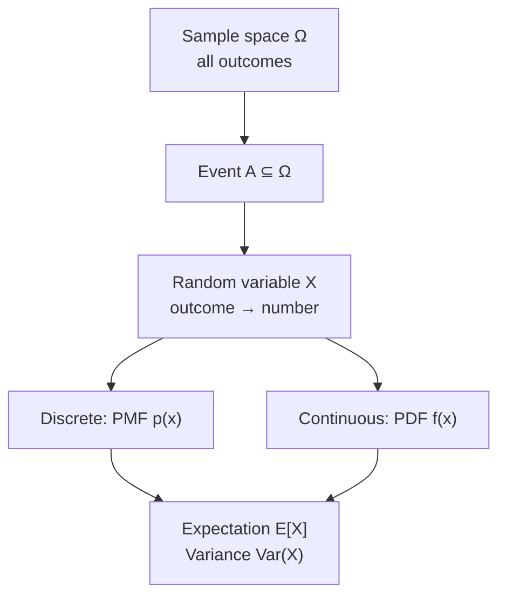

# Probability

> **TL;DR:** Probability quantifies uncertainty on a 0-to-1 scale. Master sample spaces, conditional probability, random variables, and the Bernoulli/Binomial/Gaussian distributions, and you have the language every ML model is written in.

---

## Overview
Every modern ML system reasons under uncertainty: a classifier outputs class probabilities, a language model predicts a distribution over the next token, and a recommender ranks by expected reward. Probability is the mathematics that makes these statements precise. Get comfortable here and the rest of the mathematics stack — statistics, Bayes' rule, information theory — falls into place.

**By the end, you will be able to:**
- State the probability axioms and compute with conditional probability and independence.
- Distinguish discrete from continuous random variables and read their distributions.
- Compute expectation and variance, and simulate distributions with NumPy and `scipy.stats`.

---

## Intuition
Think of probability as a way of splitting your confidence — a single unit of belief — across everything that could happen. If a fair coin has two equally plausible outcomes, you split your belief evenly: 0.5 to heads, 0.5 to tails. The pieces always sum to 1 because *something* must happen.

A **random variable** is just a rule that attaches a number to each outcome (heads → 1, tails → 0). Once outcomes are numbers, you can ask about their *average* (expectation) and their *spread* (variance). Distributions are the recurring "shapes" that these numbers take: a single yes/no trial (Bernoulli), a count of successes over many trials (Binomial), or the familiar bell curve that shows up whenever many small effects add together (Gaussian).

---

## Details

### Mathematics

**Sample space and events.** The *sample space* $\Omega$ is the set of all possible outcomes. An *event* $A \subseteq \Omega$ is a subset of outcomes. For one die roll, $\Omega = \{1,2,3,4,5,6\}$ and "even" is the event $A = \{2,4,6\}$.

**Axioms (Kolmogorov).** A probability measure $P$ assigns each event a number such that:

$$
P(A) \ge 0, \qquad P(\Omega) = 1, \qquad P\!\left(\bigcup_i A_i\right) = \sum_i P(A_i) \text{ for disjoint } A_i.
$$

From these follow $P(\varnothing)=0$, $P(A^c) = 1 - P(A)$, and the inclusion rule $P(A \cup B) = P(A) + P(B) - P(A \cap B)$.

**Conditional probability.** The probability of $A$ given that $B$ occurred is

$$
P(A \mid B) = \frac{P(A \cap B)}{P(B)}, \qquad P(B) > 0,
$$

where $A \cap B$ is the joint event that both $A$ and $B$ occur.

**Independence.** Events $A$ and $B$ are *independent* when knowing one tells you nothing about the other:

$$
P(A \cap B) = P(A)\,P(B) \quad\Longleftrightarrow\quad P(A \mid B) = P(A).
$$

**Random variables.** A *random variable* $X$ maps outcomes to real numbers. A **discrete** $X$ has a probability mass function (PMF) $p(x) = P(X = x)$ with $\sum_x p(x) = 1$. A **continuous** $X$ has a probability density function (PDF) $f(x) \ge 0$ with $\int_{-\infty}^{\infty} f(x)\,dx = 1$; here $P(a \le X \le b) = \int_a^b f(x)\,dx$ and $P(X = x) = 0$ for any single point.

**Key distributions.**

- **Bernoulli($p$)** — one trial with success probability $p$: $\;P(X=1)=p,\; P(X=0)=1-p$. Mean $p$, variance $p(1-p)$.
- **Binomial($n,p$)** — number of successes in $n$ independent Bernoulli($p$) trials:

$$
P(X=k) = \binom{n}{k} p^k (1-p)^{n-k}, \qquad k = 0,1,\dots,n,
$$

with mean $np$ and variance $np(1-p)$, where $\binom{n}{k} = \frac{n!}{k!(n-k)!}$.

- **Gaussian / Normal($\mu, \sigma^2$)** — continuous bell curve with mean $\mu$ and variance $\sigma^2$:

$$
f(x) = \frac{1}{\sigma\sqrt{2\pi}} \exp\!\left(-\frac{(x-\mu)^2}{2\sigma^2}\right).
$$

**Expectation and variance.** The *expectation* (mean) is the probability-weighted average value of $X$:

$$
\mathbb{E}[X] = \sum_x x\,p(x) \quad\text{(discrete)}, \qquad \mathbb{E}[X] = \int_{-\infty}^{\infty} x\,f(x)\,dx \quad\text{(continuous)}.
$$

The *variance* measures spread around the mean:

$$
\mathrm{Var}(X) = \mathbb{E}\!\left[(X - \mathbb{E}[X])^2\right] = \mathbb{E}[X^2] - \big(\mathbb{E}[X]\big)^2,
$$

and the *standard deviation* is $\sigma = \sqrt{\mathrm{Var}(X)}$, in the same units as $X$.

### Python implementation

```python
import numpy as np
from scipy import stats

rng = np.random.default_rng(seed=42)  # reproducible generator

# Bernoulli(p=0.3): simulate 100_000 yes/no trials, then compare to theory.
p = 0.3
samples = rng.binomial(n=1, p=p, size=100_000)
print(f"empirical mean  = {samples.mean():.3f}   (theory {p})")
print(f"empirical var   = {samples.var():.3f}   (theory {p * (1 - p):.3f})")

# Binomial(n=10, p=0.3): PMF and moments from scipy.stats.
binom = stats.binom(n=10, p=0.3)
print(f"P(X = 3)        = {binom.pmf(3):.4f}")
print(f"E[X], Var(X)    = {binom.mean():.2f}, {binom.var():.2f}")

# Gaussian(mu=0, sigma=1): PDF value and a tail probability.
normal = stats.norm(loc=0.0, scale=1.0)
print(f"f(0)            = {normal.pdf(0.0):.4f}")   # peak density
print(f"P(X <= 1.96)    = {normal.cdf(1.96):.4f}")  # ~0.975
```

## Diagram



## Worked Example
Suppose a spam filter flags each incoming email independently with probability $p = 0.2$. Out of $n = 5$ emails, what is the probability that *exactly* 2 are flagged?

This is Binomial($5, 0.2$). Using the PMF:

$$
P(X = 2) = \binom{5}{2}(0.2)^2 (0.8)^3 = 10 \times 0.04 \times 0.512 = 0.2048.
$$

The expected number flagged is $\mathbb{E}[X] = np = 5 \times 0.2 = 1.0$, with variance $\mathrm{Var}(X) = np(1-p) = 5 \times 0.2 \times 0.8 = 0.8$. Verify in Python:

```python
from scipy import stats
print(stats.binom(n=5, p=0.2).pmf(2))  # 0.2048
```

## Best Practices
- ✅ Always confirm your probabilities are non-negative and sum (or integrate) to 1 — a broken normalization is the most common silent bug.
- ✅ Use `np.random.default_rng(seed=...)` for reproducible simulations rather than the legacy `np.random.seed`.
- ✅ Sanity-check simulated moments against the closed-form mean and variance.

## Common Mistakes
- ⚠️ Confusing $P(A \mid B)$ with $P(B \mid A)$ — they are generally *not* equal (this is exactly what Bayes' rule corrects).
- ⚠️ Treating a continuous PDF value $f(x)$ as a probability. It is a *density*; only integrals over intervals give probabilities, and $f(x)$ can exceed 1.
- ⚠️ Assuming events are independent without justification — dependence changes joint probabilities.

## Industry Tips
- 💡 A classifier's softmax output is a discrete probability distribution over classes; it must sum to 1 by construction.
- 💡 Weight initialization in neural networks typically samples from a Gaussian or uniform distribution to break symmetry.

## Real-World Use Cases
- Language models predict a probability distribution over the vocabulary for the next token.
- A/B testing models conversion as a Bernoulli trial and cumulative conversions as Binomial.
- Anomaly detection flags points in the low-density tails of a fitted Gaussian.

---

## Summary
- Probability distributes a unit of belief over a sample space, obeying the Kolmogorov axioms.
- Conditional probability and independence describe how events inform one another.
- Random variables turn outcomes into numbers; expectation and variance summarize center and spread.
- Bernoulli, Binomial, and Gaussian are the workhorse distributions of ML.

## Practice
- [ ] Exercises: [Module 2 Exercises](../exercises/README.md)
- [ ] Self-check: For Binomial($n=8, p=0.5$), what are $\mathbb{E}[X]$ and $\mathrm{Var}(X)$?

## Further Reading
- 📘 Mathematics for Machine Learning — Deisenroth, Faisal & Ong (https://mml-book.github.io/)
- 📄 [scipy.stats](https://docs.scipy.org/doc/scipy/reference/stats.html)
- ▶️ StatQuest (https://www.youtube.com/@statquest)

## Related
- [Statistics](statistics.md)
- [Bayes' Rule](bayes-rule.md)
- Cross-domain: [Machine Learning](../../03-machine-learning/README.md)

---

## Navigation
- ⬆️ [Lessons](README.md)
- 📚 [Module 2 — Mathematics for AI](../README.md)
- 🏠 [Knowledge Base Home](../../README.md)
