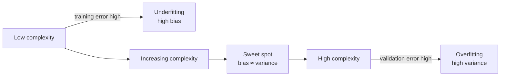

# Bias, Variance, Overfitting & Underfitting

> **TL;DR:** A model's error splits into *bias* (systematic error from being too simple) and *variance* (sensitivity to the particular training set). Reducing one often raises the other, so your job is to find the sweet spot — usually by tuning complexity, adding data, or applying regularization.

---

## Overview
Every supervised model faces the same central tension: too simple and it misses real patterns, too complex and it memorizes noise. This tradeoff is the single most useful mental model for debugging why a model performs poorly. You will learn to name the failure mode, diagnose it from curves, and pick the right fix.

**By the end, you will be able to:**
- Explain bias and variance and how model complexity trades one for the other.
- Diagnose underfitting vs. overfitting from training and validation scores.
- Use scikit-learn `learning_curve` and `validation_curve` to guide fixes like regularization or more data.

---

## Intuition
Imagine three students preparing for an exam using a book of practice questions.

- The **underfitter** skims one chapter and answers everything with the same vague rule. They do poorly on practice *and* the real exam — consistently wrong. That is **high bias**.
- The **overfitter** memorizes every practice question word-for-word, including typos. They ace the practice book but panic on the real exam because the questions are phrased differently. That is **high variance**.
- The **good student** learns the underlying concepts. They do well on both. That is the balance you want.

Bias is error from wrong assumptions (too simple). Variance is error from being too sensitive to the exact examples you happened to see. You can rarely drive both to zero; you tune the model to balance them.

---

## Details

### Theory

Suppose the true relationship is $y = f(\mathbf{x}) + \varepsilon$, where $f$ is the unknown target function, $\mathbf{x}$ is the feature vector, and $\varepsilon$ is random noise with mean $0$ and variance $\sigma^2$. You fit an estimate $\hat{f}$ from a training set. For a fixed test point $\mathbf{x}_0$, the **expected squared prediction error** — averaged over all possible training sets — decomposes as:

$$
\mathbb{E}\big[(y - \hat{f}(\mathbf{x}_0))^2\big] = \underbrace{\big(\text{Bias}[\hat{f}(\mathbf{x}_0)]\big)^2}_{\text{how far off on average}} + \underbrace{\text{Var}[\hat{f}(\mathbf{x}_0)]}_{\text{how much it wobbles}} + \underbrace{\sigma^2}_{\text{irreducible noise}}
$$

Defining each term:

- **Bias** $= \mathbb{E}[\hat{f}(\mathbf{x}_0)] - f(\mathbf{x}_0)$: the gap between the *average* prediction (over many training sets) and the truth. High for models too simple to represent $f$.
- **Variance** $= \mathbb{E}\big[(\hat{f}(\mathbf{x}_0) - \mathbb{E}[\hat{f}(\mathbf{x}_0)])^2\big]$: how much the prediction changes if you retrain on a different sample. High for flexible models that chase noise.
- **Irreducible error** $\sigma^2$: noise in the data itself. No model can beat it — it sets the floor.

This decomposition holds exactly for squared-error loss and is the reason you cannot minimize both bias and variance freely: increasing model **complexity** (more parameters, higher-degree polynomials, deeper trees) lowers bias but raises variance.

**Mapping to failure modes:**

| | Bias | Variance | Train error | Validation error |
|---|---|---|---|---|
| **Underfitting** | high | low | high | high |
| **Good fit** | low | low | low | low |
| **Overfitting** | low | high | low | high |

**Three levers to move along the tradeoff:**

1. **Model complexity.** Lower it (simpler model, fewer features) to cut variance; raise it to cut bias.
2. **More training data.** Shrinks variance without adding bias — the overfitter's main cure. It does *not* fix bias (a straight line stays a straight line no matter how many points you feed it).
3. **Regularization.** Add a penalty on parameter size to the loss, e.g. ridge (L2):

$$
J(\mathbf{w}) = \underbrace{\sum_{i=1}^{n} (y_i - \hat{y}_i)^2}_{\text{fit the data}} + \underbrace{\lambda \sum_{j=1}^{d} w_j^2}_{\text{keep weights small}}
$$

Here $\mathbf{w}$ are the model weights and $\lambda \ge 0$ is the regularization strength. Larger $\lambda$ shrinks weights → simpler effective model → more bias, less variance. $\lambda = 0$ recovers the unregularized fit.

**Diagnostics.**

- A **validation curve** plots train and validation score against a complexity hyperparameter (e.g. polynomial degree, $\lambda$). Training error falls monotonically with complexity; validation error is **U-shaped** — the bottom is your sweet spot.
- A **learning curve** plots score against training-set *size* at fixed complexity. A large, persistent gap between high train score and low validation score signals **high variance** (more data will help). Both curves converging at a *poor* score signals **high bias** (more data will not help — increase complexity instead).

### Python implementation

```python
import numpy as np
from sklearn.model_selection import learning_curve, validation_curve
from sklearn.pipeline import make_pipeline
from sklearn.preprocessing import PolynomialFeatures
from sklearn.linear_model import Ridge

# Synthetic nonlinear data: y = sin, plus noise
rng = np.random.default_rng(0)
X = np.sort(rng.uniform(0, 1, size=(120, 1)), axis=0)
y = np.sin(2 * np.pi * X.ravel()) + rng.normal(0, 0.2, size=120)

# A pipeline whose complexity we can dial via polynomial degree
def poly_ridge(degree: int, alpha: float = 0.0):
    return make_pipeline(PolynomialFeatures(degree), Ridge(alpha=alpha))

# --- Validation curve: complexity (polynomial degree) vs. error ---
degrees = np.arange(1, 12)
train_scores, val_scores = validation_curve(
    poly_ridge(degree=1),          # base estimator; param overridden below
    X, y,
    param_name="polynomialfeatures__degree",
    param_range=degrees,
    scoring="neg_mean_squared_error",
    cv=5,
)
# Convert to positive MSE and average across folds
train_mse = -train_scores.mean(axis=1)
val_mse = -val_scores.mean(axis=1)
best_degree = degrees[val_mse.argmin()]
print(f"Best degree (min validation MSE): {best_degree}")

# --- Learning curve: training-set size vs. error, at fixed complexity ---
sizes, lc_train, lc_val = learning_curve(
    poly_ridge(degree=int(best_degree)),
    X, y,
    train_sizes=np.linspace(0.1, 1.0, 8),
    scoring="neg_mean_squared_error",
    cv=5,
)
print("Train sizes:", sizes)
print("Gap (val - train MSE):", (-lc_val.mean(1)) - (-lc_train.mean(1)))
```

## Diagram



The shape to picture: as complexity increases (left → right), **training error slides down** toward zero, while **validation error falls, bottoms out, then climbs** — a U. The U's minimum is where you want to be.

## Worked Example
You fit a linear regression to house prices and get train $R^2 = 0.55$, validation $R^2 = 0.54$. The scores are *both low and nearly equal* → **high bias / underfitting**. More data will not help. You add polynomial and interaction features (raise complexity). Now train $R^2 = 0.98$, validation $R^2 = 0.61$ → the gap exploded → **overfitting / high variance**. You dial back by applying ridge regularization and tuning $\lambda$ via a validation curve; the sweet spot lands at train $R^2 = 0.82$, validation $R^2 = 0.79$ — a balanced, generalizing model.

## Best Practices
- ✅ Always compare **training** and **validation** scores together — the *gap* diagnoses the failure mode, not either number alone.
- ✅ Use `learning_curve` before collecting more data — it tells you whether more data will actually help.
- ✅ Regularize by default for high-dimensional linear models; tune the strength with cross-validation.

## Common Mistakes
- ⚠️ **Reading test-set performance to tune complexity.** That leaks the test set. Tune on validation/CV folds; touch test once, at the end.
- ⚠️ **Adding more data to fix high bias.** It does not work — a too-simple model stays wrong. Add complexity or better features instead.
- ⚠️ **Judging overfitting from training error alone.** Low training error is expected and is *not* evidence of a good model.

## Industry Tips
- 💡 In practice you rarely compute the bias–variance decomposition numerically — it is a *diagnostic vocabulary*. The learning curve is the tool you actually run.
- 💡 Ensembles exploit this tradeoff directly: bagging (random forests) cuts variance; boosting cuts bias.

## Real-World Use Cases
- Choosing tree depth / number of estimators in gradient boosting for tabular prediction.
- Deciding whether a plateauing model needs more labeled data (variance) or richer features (bias).
- Setting L2 weight decay in neural network training.

---

## Summary
- Expected error = bias$^2$ + variance + irreducible noise; complexity trades bias for variance.
- Underfitting = high train *and* validation error; overfitting = low train but high validation error.
- Fix high variance with more data or regularization; fix high bias with more complexity or better features.

## Practice
- [ ] Exercises: [Module 3 Exercises](../exercises/README.md)
- [ ] Self-check: Your model has train accuracy 0.99 and validation accuracy 0.72. Which failure mode is this, and what are two fixes?

## Further Reading
- 📘 Hands-On Machine Learning — Aurélien Géron
- 📘 An Introduction to Statistical Learning — James, Witten, Hastie & Tibshirani (https://www.statlearning.com/)
- 📄 [scikit-learn user guide](https://scikit-learn.org/stable/user_guide.html)
- ▶️ StatQuest (https://www.youtube.com/@statquest)

## Related
- [Regression](regression.md)
- [Cross-Validation](cross-validation.md)
- [Model Evaluation Metrics](model-evaluation-metrics.md)

---

## Navigation
- ⬆️ [Lessons](README.md)
- 📚 [Module 3 — Machine Learning](../README.md)
- 🏠 [Knowledge Base Home](../../README.md)
