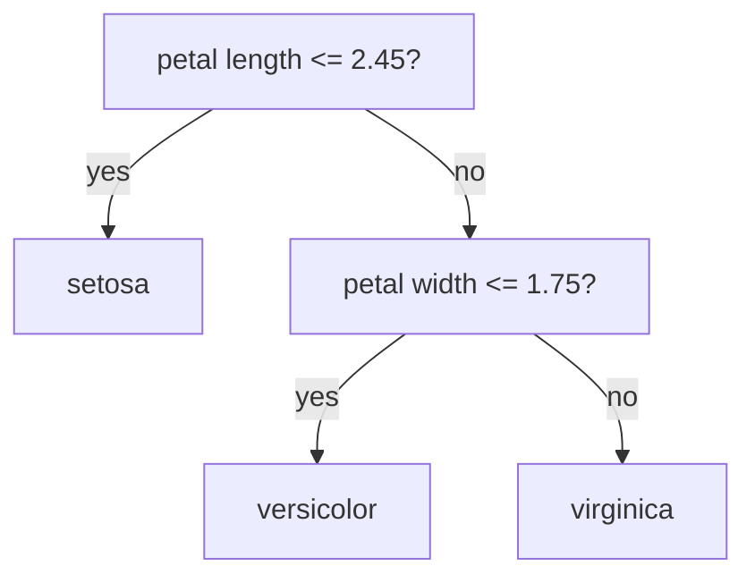

# Classification

> **TL;DR:** Classification predicts a discrete label. Logistic regression squashes a linear score through a sigmoid into a probability; k-NN votes by nearest neighbors; decision trees split the feature space by impurity. Pick a threshold to turn probabilities into decisions.

---

## Overview

Classification is supervised learning where the target is a **category** — spam vs. not spam, which of ten digits, benign vs. malignant. This lesson covers four foundational classifiers (logistic regression, k-nearest neighbors, decision trees, and a conceptual look at SVMs), how they draw decision boundaries, and how to go from a binary model to multiclass and from probabilities to hard decisions.

**By the end, you will be able to:**
- Explain logistic regression via the sigmoid, decision boundary, and cross-entropy loss.
- Train k-NN, decision tree, and logistic classifiers in scikit-learn and reason about their trade-offs.
- Handle multiclass problems with one-vs-rest and tune decision thresholds from predicted probabilities.

---

## Intuition

A classifier carves the feature space into regions, one per class, and predicts the region a new point falls into. The classifiers differ in the *shape* of that boundary and *how* they draw it:

- **Logistic regression** draws one straight boundary (a line/hyperplane) and reports how confident it is via a probability — points far on one side are near-certain, points near the boundary are a coin flip.
- **k-nearest neighbors** has no boundary equation at all: to classify a point, it looks at the $k$ closest training points and takes a majority vote. Simple, but it stores all the data.
- **Decision trees** ask a sequence of yes/no questions ("is petal length > 2.5 cm?"), producing a boundary made of axis-aligned rectangles.
- **SVMs** find the boundary with the widest possible margin between classes.

---

## Details

### Theory

**Logistic regression.** It computes a linear score $z = \mathbf{w}^\top\mathbf{x} + b$ (where $\mathbf{x}$ is the feature vector, $\mathbf{w}$ the weights, $b$ the bias) and passes it through the **sigmoid** to get a probability:

$$\hat{p} = \sigma(z) = \frac{1}{1 + e^{-z}}, \qquad \sigma: \mathbb{R} \to (0, 1)$$

$\hat{p}$ is the estimated probability of the positive class. The **decision boundary** is where $\hat{p} = 0.5$, i.e. $z = 0$ — a hyperplane. Parameters are fit by minimizing the **binary cross-entropy** (log loss):

$$\mathcal{L} = -\frac{1}{n} \sum_{i=1}^{n} \Big[ y_i \log \hat{p}_i + (1 - y_i) \log(1 - \hat{p}_i) \Big]$$

where $y_i \in \{0,1\}$ is the true label and $\hat{p}_i$ the predicted probability for example $i$. Cross-entropy is convex and rooted in [information theory](../../02-mathematics-foundations/lessons/information-theory.md); it penalizes confident wrong predictions heavily.

**k-nearest neighbors (k-NN).** No training beyond storing the data. To classify $\mathbf{x}$, find its $k$ nearest neighbors (usually by Euclidean distance) and predict the majority class. Small $k$ gives a jagged, low-bias/high-variance boundary; large $k$ smooths it. Features must be scaled, since distance is scale-sensitive.

**Decision trees.** A tree recursively splits the data on one feature at a time, choosing the split that most reduces node **impurity**. Two common impurity measures for a node with class proportions $p_c$:

$$\text{Gini} = 1 - \sum_{c} p_c^2, \qquad \text{Entropy} = -\sum_{c} p_c \log_2 p_c$$

Both are zero when a node is pure (one class) and maximal when classes are evenly mixed. Trees capture nonlinear boundaries and interactions but overfit easily — control with `max_depth`, `min_samples_leaf`.

**SVM (conceptual).** A support vector machine finds the separating hyperplane with the **maximum margin** — the largest gap to the nearest points of each class (the "support vectors"). Kernels let it draw nonlinear boundaries implicitly. SVMs are strong on medium-sized, high-dimensional data.

**Binary → multiclass.** For $K > 2$ classes, **one-vs-rest** trains $K$ binary classifiers (each: "this class vs. everything else") and predicts the class whose classifier is most confident. scikit-learn handles this automatically for most estimators.

**Probabilities & thresholds.** Classifiers with `predict_proba` output probabilities; the default decision is threshold 0.5. Move the threshold to trade **precision** for **recall** — e.g. lower it to catch more positives in fraud detection. (Full metric definitions: [Model Evaluation Metrics](model-evaluation-metrics.md).)

### Python implementation

```python
from sklearn.datasets import load_iris
from sklearn.linear_model import LogisticRegression
from sklearn.neighbors import KNeighborsClassifier
from sklearn.tree import DecisionTreeClassifier
from sklearn.model_selection import train_test_split
from sklearn.pipeline import make_pipeline
from sklearn.preprocessing import StandardScaler

X, y = load_iris(return_X_y=True)
X_train, X_test, y_train, y_test = train_test_split(
    X, y, test_size=0.25, random_state=0, stratify=y
)

models = {
    # Scaling matters for logistic regression and k-NN (distance/penalty based).
    "logreg": make_pipeline(StandardScaler(), LogisticRegression(max_iter=1000)),
    "knn": make_pipeline(StandardScaler(), KNeighborsClassifier(n_neighbors=5)),
    # Trees are scale-invariant, so no scaler needed.
    "tree": DecisionTreeClassifier(max_depth=3, random_state=0),
}

for name, model in models.items():
    model.fit(X_train, y_train)
    print(f"{name:7s} accuracy={model.score(X_test, y_test):.3f}")

# Probabilities and a custom threshold (binary example: class 2 vs rest).
logreg = models["logreg"]
proba_class2 = logreg.predict_proba(X_test)[:, 2]
predict_class2 = proba_class2 >= 0.3  # lower threshold favors recall
```

## Diagram



## Worked Example

Classify iris flowers into three species from four measurements.

1. Load Iris (150 samples, 3 balanced classes) and split with `stratify=y` to keep class ratios.
2. Fit logistic regression in a scaled pipeline. Internally scikit-learn uses one-vs-rest (or multinomial) to handle three classes.
3. Evaluate: accuracy around 0.95 on the held-out set — Iris is nearly linearly separable, so a linear boundary works well.
4. Fit a `DecisionTreeClassifier(max_depth=3)`. It reaches similar accuracy and yields a readable rule set (see diagram) — the first split on petal length alone perfectly isolates *setosa*.
5. Inspect `predict_proba` to see borderline versicolor/virginica cases where the two classes overlap, then adjust the threshold if one class matters more.

## Best Practices
- ✅ Scale features for logistic regression and k-NN; trees don't need it.
- ✅ Use `stratify=y` in `train_test_split` to preserve class balance.
- ✅ Prefer probabilities plus a chosen threshold over raw 0.5 hard labels when errors are asymmetric.
- ✅ Constrain tree depth/leaf size to prevent overfitting.

## Common Mistakes
- ⚠️ Judging a model by accuracy on imbalanced data. Fix: use precision/recall/ROC-AUC (see the evaluation lesson).
- ⚠️ Running k-NN on unscaled features so one large-scale feature dominates distance. Fix: `StandardScaler`.
- ⚠️ Growing an unbounded decision tree that memorizes training data. Fix: set `max_depth` / `min_samples_leaf`.

## Industry Tips
- 💡 Logistic regression is the default production baseline for binary classification: calibrated probabilities, interpretable coefficients, cheap to serve.
- 💡 Choose the decision threshold from business cost, not the arbitrary 0.5 — a fraud model may operate at 0.1.

## Real-World Use Cases
- Spam and abuse detection (binary text classification).
- Medical diagnosis screening (probability + threshold tuned for recall).
- Customer churn and credit default prediction.

---

## Summary
- Logistic regression maps a linear score through the sigmoid to a probability and is trained with cross-entropy loss; its boundary is a hyperplane.
- k-NN votes by nearest neighbors (scale-sensitive); decision trees split by impurity into axis-aligned regions; SVMs maximize the margin.
- Convert binary to multiclass with one-vs-rest, and turn probabilities into decisions by choosing a threshold that matches the cost of errors.

## Practice
- [ ] Exercises: [Module 3 Exercises](../exercises/README.md)
- [ ] Self-check: Why does k-NN require feature scaling while a decision tree does not?

## Further Reading
- 📘 Hands-On Machine Learning — Aurélien Géron
- 📘 An Introduction to Statistical Learning — James, Witten, Hastie & Tibshirani (https://www.statlearning.com/)
- 📄 [scikit-learn user guide](https://scikit-learn.org/stable/user_guide.html)
- ▶️ StatQuest (https://www.youtube.com/@statquest)

## Related
- [Regression](regression.md)
- [Ensemble Methods](ensemble-methods.md)
- [Model Evaluation Metrics](model-evaluation-metrics.md)
- [Information Theory](../../02-mathematics-foundations/lessons/information-theory.md)

---

## Navigation
- ⬆️ [Lessons](README.md)
- 📚 [Module 3 — Machine Learning](../README.md)
- 🏠 [Knowledge Base Home](../../README.md)
