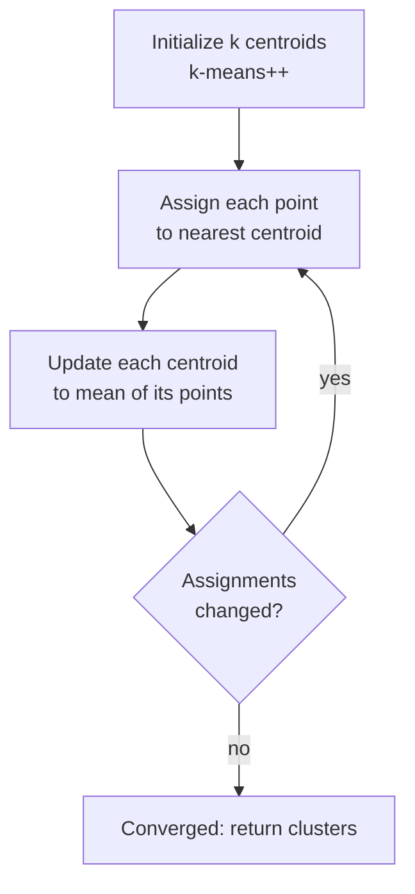

# Clustering

> **TL;DR:** Clustering finds structure in unlabeled data by grouping similar points together. You will learn k-means, hierarchical clustering, and DBSCAN — and why you almost always scale features first.

---

## Overview

Clustering is an unsupervised task: you have feature vectors but no labels, and you want the algorithm to discover groups. Different algorithms make different assumptions about what a "group" is — compact blobs, nested hierarchies, or dense regions separated by sparse ones. Choosing the right one, and preparing your features correctly, matters more than tuning any single hyperparameter.

**By the end, you will be able to:**
- Explain and run k-means, choosing $k$ with the elbow method and silhouette score.
- Describe hierarchical/agglomerative clustering and read a dendrogram.
- Apply DBSCAN to find arbitrary-shaped clusters and handle noise, and know when to prefer it.

---

## Intuition

Imagine dots scattered on a table. **K-means** asks you to fix a number of piles up front, then repeatedly nudges each pile's center to the middle of its dots and reassigns dots to the nearest center until nothing moves. It loves round, similarly-sized piles.

**Hierarchical clustering** instead starts with every dot as its own pile and repeatedly merges the two closest piles, building a tree you can cut at any height — no need to pick the count in advance.

**DBSCAN** ignores counts entirely. It walks through dense neighborhoods, growing a cluster as long as points stay packed together, and leaves sparse stragglers labeled as noise. That lets it trace crescents and rings that k-means would slice in half.

---

## Details

### Theory

**K-means.** Given $n$ points $\{x_i\}_{i=1}^{n}$ with $x_i \in \mathbb{R}^d$, and a chosen number of clusters $k$, k-means picks centroids $\{\mu_j\}_{j=1}^{k}$ and an assignment $c_i \in \{1,\dots,k\}$ for each point to minimize the **within-cluster sum of squares** (WCSS), also called inertia:

$$
J = \sum_{i=1}^{n} \lVert x_i - \mu_{c_i} \rVert^2 .
$$

Here $\lVert \cdot \rVert$ is the Euclidean norm and $\mu_{c_i}$ is the centroid of the cluster assigned to point $x_i$. **Lloyd's algorithm** minimizes $J$ by alternating two steps until assignments stop changing:

1. **Assign:** put each point in the cluster of its nearest centroid, $c_i = \arg\min_j \lVert x_i - \mu_j \rVert^2$.
2. **Update:** move each centroid to the mean of its assigned points, $\mu_j = \frac{1}{|S_j|}\sum_{i \in S_j} x_i$, where $S_j$ is the set of points in cluster $j$.

Each step can only lower $J$, so the algorithm converges — but only to a **local** minimum, so results depend on initialization. `k-means++` seeding spreads initial centroids apart to reduce bad outcomes.

**Choosing $k$.** Two common tools:
- **Elbow method:** plot inertia $J$ against $k$. It always decreases, but the rate of decrease flattens; the "elbow" suggests a good $k$.
- **Silhouette score:** for a point $i$, let $a(i)$ be its mean distance to points in its own cluster and $b(i)$ the mean distance to the nearest *other* cluster. The silhouette is

$$
s(i) = \frac{b(i) - a(i)}{\max\{a(i),\, b(i)\}} \in [-1, 1].
$$

Values near $1$ mean well-separated clusters; near $0$ mean overlapping; negative means likely misassigned. Average over all points to score a clustering.

**Hierarchical / agglomerative clustering.** Start with each point as its own cluster and repeatedly merge the two closest clusters. "Closest" depends on the **linkage**: *single* (nearest pair), *complete* (farthest pair), *average*, or *Ward* (merge that minimizes the increase in WCSS). The merge history forms a **dendrogram**; cutting it at a chosen height yields a flat clustering. No $k$ is needed up front, but the algorithm is typically $O(n^2)$ or worse in memory, so it suits smaller datasets.

**DBSCAN** (Density-Based Spatial Clustering of Applications with Noise) uses two parameters: `eps` ($\varepsilon$, a neighborhood radius) and `min_samples`. A point is a **core point** if at least `min_samples` points lie within $\varepsilon$. Clusters grow by connecting core points and their neighbors; points not reachable from any core point are labeled **noise** (`-1`). DBSCAN finds arbitrary shapes and does not require you to specify the number of clusters, but it struggles when clusters have very different densities.

**Scaling matters.** All three methods rely on distances. If one feature ranges over thousands and another over fractions, the large-scale feature dominates the distance and the others are ignored. Standardize features (zero mean, unit variance) before clustering unless you have a specific reason not to.

### Python implementation

```python
import numpy as np
from sklearn.datasets import make_blobs
from sklearn.preprocessing import StandardScaler
from sklearn.cluster import KMeans, AgglomerativeClustering, DBSCAN
from sklearn.metrics import silhouette_score

# Synthetic unlabeled data (ignore the true labels y)
X, _ = make_blobs(n_samples=300, centers=4, cluster_std=0.90, random_state=42)

# Always scale first: distance-based methods are sensitive to feature scale
X_scaled: np.ndarray = StandardScaler().fit_transform(X)

# --- k-means ---
km = KMeans(n_clusters=4, init="k-means++", n_init=10, random_state=42)
labels_km = km.fit_predict(X_scaled)
print("k-means inertia (WCSS):", round(km.inertia_, 2))
print("k-means silhouette:", round(silhouette_score(X_scaled, labels_km), 3))

# Choose k with the elbow method: inertia vs k
for k in range(2, 7):
    m = KMeans(n_clusters=k, n_init=10, random_state=42).fit(X_scaled)
    print(f"k={k}  inertia={m.inertia_:.1f}  "
          f"silhouette={silhouette_score(X_scaled, m.labels_):.3f}")

# --- hierarchical / agglomerative (Ward linkage) ---
agg = AgglomerativeClustering(n_clusters=4, linkage="ward")
labels_agg = agg.fit_predict(X_scaled)

# --- DBSCAN: no k needed; label -1 means noise ---
db = DBSCAN(eps=0.35, min_samples=5)
labels_db = db.fit_predict(X_scaled)
n_clusters = len(set(labels_db)) - (1 if -1 in labels_db else 0)
print("DBSCAN clusters:", n_clusters, "| noise points:", int(np.sum(labels_db == -1)))
```

## Diagram

The k-means iterate loop:



## Worked Example

You have customer records with two scaled features: annual spend and visit frequency. You suspect natural segments but have no labels.

1. **Scale** both features with `StandardScaler` so spend does not dominate frequency.
2. Run k-means for `k` from 2 to 6, recording inertia and silhouette. Inertia keeps dropping, but silhouette peaks at `k=4` (say 0.55), and the elbow plot bends there too — so you choose **4 segments**.
3. Inspect centroids: cluster 0 = high spend / high frequency (loyal), cluster 3 = low spend / low frequency (at-risk).
4. As a sanity check, run DBSCAN. It flags a handful of extreme outliers as noise (`-1`) that k-means had forced into a segment — you set those aside for manual review.

The result: four actionable customer segments plus a small outlier list, all from unlabeled data.

## Best Practices
- ✅ Standardize features before any distance-based clustering.
- ✅ Set `n_init=10` (or more) for k-means so a bad random start does not decide your result.
- ✅ Validate $k$ with both the elbow method and silhouette score, not one alone.
- ✅ Use Ward linkage for hierarchical clustering when you want compact, balanced clusters.

## Common Mistakes
- ⚠️ Clustering unscaled features → one high-range feature dominates. Fix: scale first.
- ⚠️ Assuming DBSCAN's `-1` is a real cluster → it means noise. Fix: exclude or review those points.
- ⚠️ Reading inertia alone to pick $k$ → it always decreases. Fix: look for the elbow and check silhouette.
- ⚠️ Forcing k-means on crescent/ring shapes → it produces straight-cut clusters. Fix: use DBSCAN or spectral clustering.

## Industry Tips
- 💡 Cluster labels are arbitrary integers; the same clustering can relabel across runs. Match clusters by centroid, not by label id.
- 💡 DBSCAN's `eps` is the hard part — a k-distance plot (sorted distance to the `min_samples`-th neighbor) helps you find its elbow.
- 💡 For very large datasets, prefer `MiniBatchKMeans`; hierarchical clustering rarely scales past tens of thousands of points.

## Real-World Use Cases
- Customer segmentation for targeted marketing.
- Image color quantization (compress an image to $k$ representative colors).
- Anomaly and fraud detection via DBSCAN noise points.
- Grouping documents or embeddings before labeling.

---

## Summary
- K-means minimizes within-cluster sum of squares via Lloyd's algorithm; pick $k$ with the elbow method and silhouette score.
- Hierarchical clustering builds a dendrogram you cut at any height — no $k$ needed, but it scales poorly.
- DBSCAN finds arbitrary shapes and labels noise, but needs `eps` and `min_samples`; always scale features first.

## Practice
- [ ] Exercises: [Module 3 Exercises](../exercises/README.md)
- [ ] Self-check: Why does k-means inertia always decrease as you increase $k$, and why does that make it a poor sole criterion for choosing $k$?

## Further Reading
- 📘 Hands-On Machine Learning — Aurélien Géron
- 📘 An Introduction to Statistical Learning — James, Witten, Hastie & Tibshirani (https://www.statlearning.com/)
- 📄 [scikit-learn user guide](https://scikit-learn.org/stable/user_guide.html)
- ▶️ StatQuest (https://www.youtube.com/@statquest)

## Related
- [Dimensionality Reduction](dimensionality-reduction.md)
- [Learning Paradigms](learning-paradigms.md)

---

## Navigation
- ⬆️ [Lessons](README.md)
- 📚 [Module 3 — Machine Learning](../README.md)
- 🏠 [Knowledge Base Home](../../README.md)
