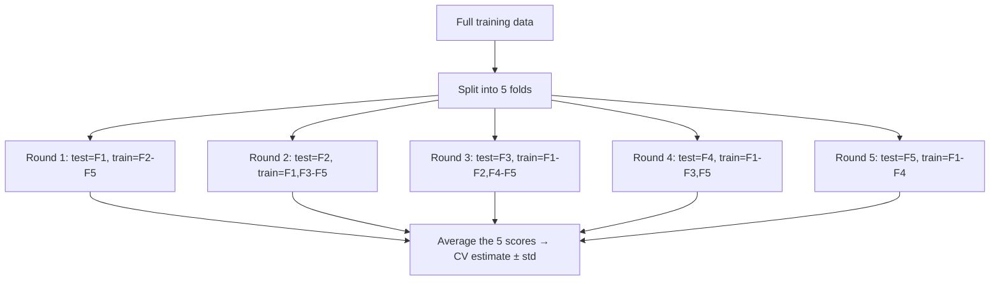

# Cross-Validation

> **TL;DR:** A single train/test split gives a noisy score that depends on which rows landed where. k-fold cross-validation reuses every row for both training and testing across rotations, giving a stabler estimate — as long as *all* preprocessing lives inside the loop so no test information leaks in.

---

## Overview
How do you know your model's reported accuracy is real and not luck of the split? Cross-validation (CV) answers this by evaluating on multiple rotations of the data and averaging. It also underpins honest hyperparameter tuning. The catch — and the part beginners get wrong — is that any step that learns from data must be refit inside each fold, or your score is inflated by leakage.

**By the end, you will be able to:**
- Explain why one split is noisy and how k-fold reduces that variance.
- Use `KFold`, `StratifiedKFold`, and `cross_val_score` correctly.
- Prevent data leakage by wrapping preprocessing in a `Pipeline` and tuning with `GridSearchCV`.

---

## Intuition
Judging a model on one train/test split is like judging a restaurant on one dish. You might have hit the chef's best (a lucky split) or an off-night (an unlucky one). One data point tells you little about the *average*.

Cross-validation orders several dishes. You split the data into $k$ equal chunks ("folds"), then run $k$ rounds: each round, one fold is the test set and the other $k-1$ train the model. Every row gets tested exactly once, and you average the $k$ scores. Now you have both a mean (expected performance) and a spread (how much it varies) — a far more trustworthy verdict.

---

## Details

### Theory

**Why one split is noisy.** With a single 80/20 split, your estimate depends entirely on which 20% you happened to hold out. Swap the seed and the score moves. The estimate has high **variance**, especially on small datasets.

**k-fold cross-validation.** Partition the $n$ samples into $k$ disjoint folds of roughly $n/k$ each. For each fold $i = 1, \dots, k$: train on the other $k-1$ folds, evaluate on fold $i$ to get score $s_i$. The CV estimate is the mean:

$$
\text{CV}_{k} = \frac{1}{k}\sum_{i=1}^{k} s_i
$$

and the standard deviation of the $s_i$ estimates its variability. Common choices are $k = 5$ or $k = 10$. Larger $k$ means more training data per fold (less bias) but more compute and folds that overlap heavily (the estimate's variance can rise). $k = n$ is **leave-one-out** CV.

**Stratified k-fold.** For classification — especially imbalanced classes — ordinary random folds may leave a rare class out of a fold entirely. **Stratified** k-fold preserves each class's proportion in every fold. Use it as the default for classification; scikit-learn already does this automatically for classifiers in `cross_val_score`.

**The three-way split.** CV replaces the *validation* set, not the *test* set. The honest protocol:

1. Hold out a **test set** once, up front, and do not touch it.
2. Use CV on the remaining data to select the model and tune hyperparameters.
3. Evaluate the single chosen model on the test set exactly once, for a final unbiased number.

If you tune against the test set, you have implicitly fit to it and your reported number is optimistic.

**Data leakage — the critical rule.** Leakage is when information from outside the training fold sneaks into training, inflating scores that then collapse in production. The classic mistake is fitting a scaler or imputer on the *whole* dataset before splitting:

```python
# WRONG — scaler has already "seen" the test rows
X_scaled = StandardScaler().fit_transform(X)   # leaks!
scores = cross_val_score(model, X_scaled, y, cv=5)
```

The scaler's mean and standard deviation were computed using test-fold rows. The rule: **every step that learns from data (scaling, imputing, feature selection, encoding) must be fit on the training folds only.** The clean way to guarantee this is a `Pipeline`, which CV refits *end to end* on each fold's training portion.

**Grouped and time-series CV (briefly).**
- **GroupKFold**: when rows cluster (multiple records per patient/user), keep a group entirely within one fold so the model cannot memorize a group across the split.
- **TimeSeriesSplit**: for temporal data, never train on the future to predict the past. This expanding-window scheme always tests on times *after* the training window.

### Python implementation

```python
from sklearn.datasets import load_breast_cancer
from sklearn.model_selection import (
    train_test_split, cross_val_score, StratifiedKFold, GridSearchCV,
)
from sklearn.pipeline import Pipeline
from sklearn.preprocessing import StandardScaler
from sklearn.svm import SVC

X, y = load_breast_cancer(return_X_y=True)

# 1. Hold out a test set ONCE, up front.
X_tr, X_te, y_tr, y_te = train_test_split(X, y, stratify=y, random_state=0)

# 2. Pipeline = preprocessing + model. The scaler is refit inside every fold,
#    so no test-fold statistics leak into training. This is leakage-safe.
pipe = Pipeline([
    ("scaler", StandardScaler()),
    ("svc", SVC()),
])

# 3. Basic k-fold CV score (stratified is automatic for classifiers).
cv = StratifiedKFold(n_splits=5, shuffle=True, random_state=0)
scores = cross_val_score(pipe, X_tr, y_tr, cv=cv, scoring="f1")
print(f"CV F1: {scores.mean():.3f} +/- {scores.std():.3f}")

# 4. Hyperparameter tuning with CV — grid search refits the whole pipeline per fold.
param_grid = {"svc__C": [0.1, 1, 10], "svc__gamma": ["scale", 0.01, 0.1]}
search = GridSearchCV(pipe, param_grid, cv=cv, scoring="f1")
search.fit(X_tr, y_tr)
print("Best params:", search.best_params_)
print("Best CV F1 :", round(search.best_score_, 3))

# 5. Final, honest evaluation — touch the test set exactly once.
print("Test F1    :", round(search.score(X_te, y_te), 3))
```

## Diagram



## Worked Example
You have 500 labeled records and an SVM to tune. A single 80/20 split reports F1 = 0.94 — but reshuffling the split gives 0.88 the next time. Untrustworthy. You switch to 5-fold stratified CV and get F1 = 0.91 ± 0.03, a stable estimate with a known spread. You wrap `StandardScaler` and `SVC` in a `Pipeline` and hand it to `GridSearchCV`, which refits the scaler on each fold's training portion — no leakage. It selects `C=10, gamma=0.01` at CV F1 = 0.92. Only then do you evaluate on the untouched test set: F1 = 0.90, confirming the CV estimate held up.

## Best Practices
- ✅ Wrap every learned preprocessing step and the estimator in a `Pipeline`, then pass the pipeline (not pre-transformed data) to CV.
- ✅ Use `StratifiedKFold` for classification and set `shuffle=True` with a fixed `random_state` for reproducibility.
- ✅ Keep the test set sealed until the very end; do all selection with CV on the training portion.

## Common Mistakes
- ⚠️ **Scaling/imputing/selecting features on the full dataset before CV.** Fix: move those steps inside a `Pipeline` so they refit per fold.
- ⚠️ **Using plain `KFold` on grouped or time-ordered data.** Fix: `GroupKFold` for clustered rows, `TimeSeriesSplit` for temporal data.
- ⚠️ **Reporting the best CV score as the final result.** Fix: it is optimistic after tuning; report the held-out test score.

## Industry Tips
- 💡 `cross_val_score` returns an array — report the **mean and standard deviation**; a large std means the model is unstable or the dataset too small.
- 💡 Nested CV (an inner loop for tuning, an outer loop for evaluation) gives the least biased estimate when both selecting *and* assessing on limited data.

## Real-World Use Cases
- Comparing candidate algorithms fairly before committing to one.
- Tuning hyperparameters (`GridSearchCV` / `RandomizedSearchCV`) without leaking the test set.
- Validating forecasting models with `TimeSeriesSplit` so evaluation respects chronology.

---

## Summary
- One split is noisy; k-fold averages over rotations for a stabler mean and a spread.
- Use stratified folds for classification and keep a sealed test set for the final number.
- Prevent leakage by refitting all preprocessing inside the CV loop via a `Pipeline`.

## Practice
- [ ] Exercises: [Module 3 Exercises](../exercises/README.md)
- [ ] Self-check: Why does fitting a `StandardScaler` before `cross_val_score` inflate the reported score, and how does a `Pipeline` fix it?

## Further Reading
- 📘 Hands-On Machine Learning — Aurélien Géron
- 📘 An Introduction to Statistical Learning — James, Witten, Hastie & Tibshirani (https://www.statlearning.com/)
- 📄 [scikit-learn user guide](https://scikit-learn.org/stable/user_guide.html)
- ▶️ StatQuest (https://www.youtube.com/@statquest)

## Related
- [Model Evaluation Metrics](model-evaluation-metrics.md)
- [The scikit-learn Workflow](scikit-learn-workflow.md)
- [Feature Engineering](../../01-python-languages/lessons/feature-engineering.md) — leakage in preprocessing

---

## Navigation
- ⬆️ [Lessons](README.md)
- 📚 [Module 3 — Machine Learning](../README.md)
- 🏠 [Knowledge Base Home](../../README.md)
