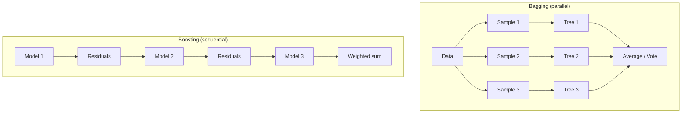

# Ensemble Methods

> **TL;DR:** Combining many models beats any single one. Bagging (random forests) trains models in parallel on bootstrap samples to cut variance; boosting (AdaBoost, gradient boosting) trains models sequentially so each fixes the last one's errors to cut bias.

---

## Overview

An **ensemble** aggregates the predictions of several base models into one stronger prediction. The two dominant strategies are **bagging** (train independent models in parallel and average them) and **boosting** (train models in sequence, each correcting its predecessor). This lesson explains why ensembles work, covers random forests, gradient boosting, and stacking, and shows their scikit-learn APIs.

**By the end, you will be able to:**
- Explain how bagging reduces variance and boosting reduces bias.
- Train random forests and gradient boosting models and read their feature importances.
- Choose between bagging, boosting, and stacking for a given problem.

---

## Intuition

A single decision tree is like one expert who is confident but erratic — small changes in the data swing its answers. Now ask a *crowd* of experts and combine their votes. If the experts make independent mistakes, the errors cancel and the crowd is far more reliable than any individual. That is the core of ensembling.

The two philosophies differ in how they build the crowd:

- **Bagging** builds many experts *in parallel*, each trained on a random resample of the data, then averages them. Because they are diverse and independent-ish, averaging **cancels variance** — the wobble of any one tree gets smoothed out.
- **Boosting** builds experts *in sequence*. Each new model focuses on the examples the previous ensemble got wrong, gradually chipping away at systematic error. This **reduces bias**, turning weak learners into a strong one.

---

## Details

### Theory

**Why combining helps.** Averaging $M$ models whose errors are uncorrelated reduces the variance of the prediction roughly by a factor of $M$, without raising bias — this is the statistical engine behind bagging. Boosting instead reduces bias by adding models that target the current residual error. (See [Bias, Variance, Overfitting & Underfitting](bias-variance-overfitting.md).)

**Bagging (Bootstrap AGGregatING).** Draw $M$ bootstrap samples (sample $n$ rows *with replacement*) from the training set, fit one base model per sample, and aggregate — vote for classification, average for regression. Because each model sees a slightly different dataset, they decorrelate.

**Random forests.** Bagging specialized to decision trees, with one extra twist: at each split, only a random subset of features is considered (typically $\sqrt{d}$ features for classification, where $d$ is the total feature count). This further decorrelates the trees, so their averaged prediction is more robust. Random forests are a strong, low-tuning default.

**Boosting.** Models are added one at a time; each focuses on examples the ensemble currently handles poorly.
- **AdaBoost** (intuition): after each weak learner, *increase the weights* of misclassified examples so the next learner concentrates on them; combine learners weighted by their accuracy.
- **Gradient boosting** (accurately): fit each new model to the **negative gradient of the loss** with respect to the current predictions — for squared error this is exactly the residual $y_i - \hat{y}_i$. Predictions are updated additively with a **learning rate** $\eta$ that scales each model's contribution:

$$F_{m}(\mathbf{x}) = F_{m-1}(\mathbf{x}) + \eta\, h_m(\mathbf{x})$$

where $F_{m}$ is the ensemble after $m$ stages, $h_m$ the newly fitted tree, and $\eta \in (0, 1]$ the learning rate. Small $\eta$ needs more trees but generalizes better. The base learners are shallow trees ("stumps" or depth-limited trees).

**Real-world boosting libraries.** **XGBoost** and **LightGBM** are widely used, highly optimized gradient-boosting implementations that dominate tabular-data competitions and are common in production; they add regularization, efficient histogram-based split finding, and native handling of large datasets. scikit-learn's own `HistGradientBoostingClassifier` is a fast, comparable alternative.

**Stacking (brief).** Train several diverse base models, then train a **meta-model** on their out-of-fold predictions to learn how best to combine them. More powerful but more complex and prone to leakage if cross-validation is sloppy.

**Feature importance.** Tree ensembles report how much each feature reduced impurity across all splits (`feature_importances_`). Useful for a first read, but impurity-based importance is biased toward high-cardinality features — prefer **permutation importance** for a more reliable ranking.

### Python implementation

```python
from sklearn.datasets import load_breast_cancer
from sklearn.ensemble import (
    RandomForestClassifier,
    GradientBoostingClassifier,
    VotingClassifier,
)
from sklearn.linear_model import LogisticRegression
from sklearn.model_selection import train_test_split

X, y = load_breast_cancer(return_X_y=True)
X_train, X_test, y_train, y_test = train_test_split(
    X, y, test_size=0.25, random_state=0, stratify=y
)

rf = RandomForestClassifier(n_estimators=300, random_state=0)
gb = GradientBoostingClassifier(
    n_estimators=200, learning_rate=0.1, max_depth=3, random_state=0
)

# A voting ensemble that combines diverse models by soft-voting probabilities.
voting = VotingClassifier(
    estimators=[("rf", rf), ("gb", gb), ("lr", LogisticRegression(max_iter=5000))],
    voting="soft",
)

for name, model in [("random_forest", rf), ("grad_boost", gb), ("voting", voting)]:
    model.fit(X_train, y_train)
    print(f"{name:14s} accuracy={model.score(X_test, y_test):.3f}")

# Feature importances from the random forest.
importances = sorted(
    zip(load_breast_cancer().feature_names, rf.feature_importances_),
    key=lambda t: t[1],
    reverse=True,
)
print("top features:", importances[:5])
```

## Diagram



## Worked Example

Predict whether a breast-tumor sample is malignant from 30 measurements.

1. Split with stratification to preserve the class ratio.
2. Train a `RandomForestClassifier(n_estimators=300)`. It bootstraps 300 trees, each seeing random rows and random feature subsets at splits, and votes — reaching roughly 0.96 accuracy with almost no tuning.
3. Train a `GradientBoostingClassifier(learning_rate=0.1, n_estimators=200, max_depth=3)`. It adds shallow trees sequentially, each fitting the residual error; it typically edges out the forest but is more sensitive to `learning_rate` / `n_estimators`.
4. Read `rf.feature_importances_` — "worst area" and "worst concave points" usually top the list, matching clinical intuition.
5. Combine all three models in a soft-`VotingClassifier` to average their probabilities for a small, robust gain.

## Best Practices
- ✅ Use random forests as a strong, low-effort baseline; reach for gradient boosting (or XGBoost/LightGBM) when you need to squeeze out more accuracy.
- ✅ In gradient boosting, lower the `learning_rate` and raise `n_estimators` together, and use early stopping on a validation set.
- ✅ Prefer permutation importance over impurity importance for trustworthy feature rankings.

## Common Mistakes
- ⚠️ Growing very deep trees inside a gradient-boosting model. Fix: keep base learners shallow (`max_depth` 2–4); depth comes from the number of stages, not per-tree depth.
- ⚠️ Reading impurity `feature_importances_` as ground truth. Fix: cross-check with permutation importance.
- ⚠️ Leaking data in stacking by training the meta-model on in-fold predictions. Fix: use out-of-fold predictions (`StackingClassifier` handles this).

## Industry Tips
- 💡 Gradient-boosted trees (XGBoost, LightGBM, `HistGradientBoosting`) are the go-to models for tabular data in industry, often beating deep learning there.
- 💡 Random forests parallelize trivially across cores (`n_jobs=-1`) and rarely overfit with more trees — a safe production default.

## Real-World Use Cases
- Credit scoring and fraud detection on tabular financial data.
- Click-through-rate and ranking models in ad tech (gradient boosting).
- Medical risk stratification and diagnostic support.

---

## Summary
- Ensembles combine base models: bagging averages parallel models to cut variance; boosting adds sequential models to cut bias.
- Random forests are bagged decision trees with random feature subsets; gradient boosting fits each new tree to the negative gradient (residuals) of the loss, scaled by a learning rate.
- XGBoost and LightGBM are the dominant production gradient-boosting libraries; stacking combines diverse models via a meta-learner, and permutation importance gives reliable feature rankings.

## Practice
- [ ] Exercises: [Module 3 Exercises](../exercises/README.md)
- [ ] Self-check: Why does bagging mainly reduce variance while boosting mainly reduces bias?

## Further Reading
- 📘 Hands-On Machine Learning — Aurélien Géron
- 📘 An Introduction to Statistical Learning — James, Witten, Hastie & Tibshirani (https://www.statlearning.com/)
- 📄 [scikit-learn user guide](https://scikit-learn.org/stable/user_guide.html)
- ▶️ StatQuest (https://www.youtube.com/@statquest)

## Related
- [Classification](classification.md)
- [Bias, Variance, Overfitting & Underfitting](bias-variance-overfitting.md)

---

## Navigation
- ⬆️ [Lessons](README.md)
- 📚 [Module 3 — Machine Learning](../README.md)
- 🏠 [Knowledge Base Home](../../README.md)
