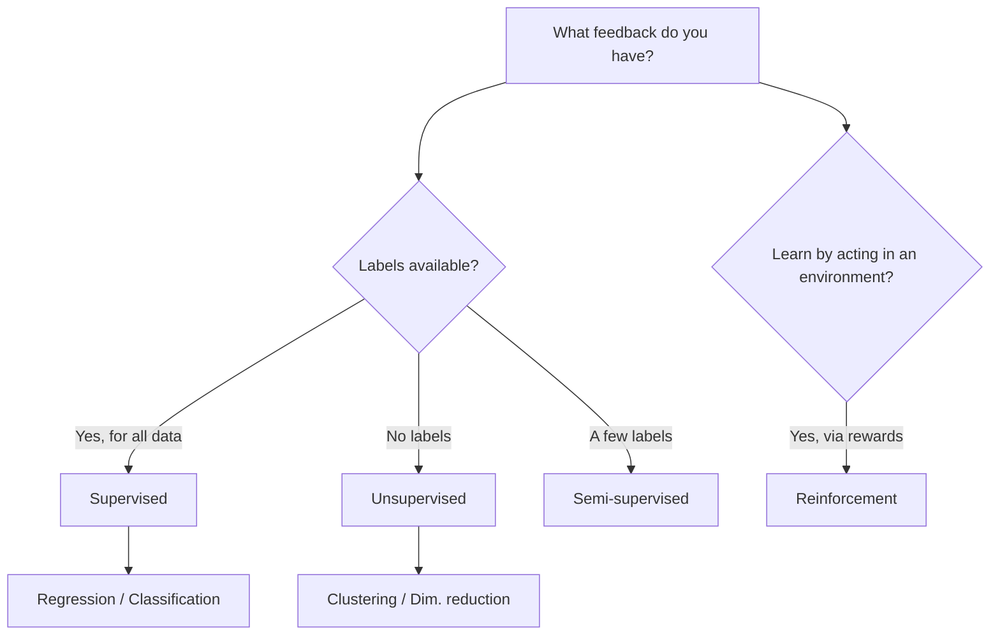

# Learning Paradigms

> **TL;DR:** Machine learning splits into four broad paradigms defined by *what feedback the model gets*: labeled answers (supervised), no answers (unsupervised), a few answers (semi-supervised), or rewards from acting in an environment (reinforcement). Pick the paradigm by matching it to the data and feedback you actually have.

---

## Overview
Before choosing an algorithm, you choose a *paradigm* — the kind of learning signal available to the model. This decision is driven by your data: do you have labels, how many, and are you learning from a static dataset or from interaction? Getting this right up front saves you from applying a classifier when you have no labels, or hand-labeling data you did not need to.

**By the end, you will be able to:**
- Distinguish supervised, unsupervised, semi-supervised, and reinforcement learning by their feedback signal.
- Name the canonical tasks in each paradigm (regression, classification, clustering, dimensionality reduction).
- Choose the appropriate paradigm for a new problem from the data you have.

---

## Intuition
Think about the *feedback* a learner receives:

- **Supervised** — a tutor gives you the correct answer for every practice question. You learn by minimizing your mistakes against those answers.
- **Unsupervised** — no answer key. You are handed a pile of examples and asked to find structure: which ones group together, what the hidden axes of variation are.
- **Semi-supervised** — the tutor answers a *few* questions, then leaves you with a big stack of unanswered ones. You use the few answers to make educated guesses about the rest.
- **Reinforcement** — no one tells you the right move. You act, the world responds with a reward or penalty, and you gradually learn a strategy that earns more reward.

The paradigm you need is dictated by which of these situations you are actually in.

---

## Details

### Theory

**Supervised learning.** You have a dataset of input–output pairs $\{(\mathbf{x}_i, y_i)\}_{i=1}^{n}$, where $\mathbf{x}_i$ is a feature vector and $y_i$ is a known **label**. The goal is to learn a function $f$ that predicts $y$ from $\mathbf{x}$ by minimizing a loss $L(y, \hat{y})$ over the data. Two sub-types:

- **Regression** — the label $y \in \mathbb{R}$ is continuous (house price, temperature).
- **Classification** — the label $y$ is one of $K$ discrete classes (spam / not-spam, digit 0–9).

**Unsupervised learning.** You have inputs only: $\{\mathbf{x}_i\}_{i=1}^{n}$, no labels. The goal is to discover structure. Two common tasks:

- **Clustering** — partition samples into groups so that points in a group are more similar to each other than to points in other groups (e.g. $k$-means minimizes within-cluster variance).
- **Dimensionality reduction** — find a lower-dimensional representation $\mathbf{z}_i \in \mathbb{R}^{k}$ (with $k \ll d$) that preserves most of the information in $\mathbf{x}_i \in \mathbb{R}^{d}$ (e.g. PCA keeps the directions of greatest variance).

**Semi-supervised learning.** You have a small labeled set $\{(\mathbf{x}_i, y_i)\}_{i=1}^{l}$ and a much larger unlabeled set $\{\mathbf{x}_j\}_{j=l+1}^{l+u}$ with $u \gg l$. Labels are expensive (a doctor annotating scans), but raw data is cheap. The intuition behind **pseudo-labeling**: train a model on the few labels, use it to predict labels for the unlabeled data, keep the confident predictions as if they were true labels, and retrain on the enlarged set. This works when the data's natural structure (clusters, low-dimensional manifolds) aligns with the true labels — the *cluster assumption*.

**Reinforcement learning (RL).** There is no fixed dataset. An **agent** interacts with an **environment** over time. At each step the agent observes a **state** $s_t$, takes an **action** $a_t$, and receives a scalar **reward** $r_t$. It learns a **policy** $\pi(a \mid s)$ — a strategy mapping states to actions — that maximizes the expected cumulative reward (the *return*):

$$
G_t = \sum_{k=0}^{\infty} \gamma^{k}\, r_{t+k+1}
$$

where $\gamma \in [0, 1)$ is a **discount factor** trading off immediate versus future reward. RL differs fundamentally from supervised learning: feedback is *evaluative* (how good was that action?) rather than *instructive* (what was the correct action?), and it is often delayed.

### When to use which

| Paradigm | You have… | Goal | Example task |
|----------|-----------|------|--------------|
| Supervised | Labeled examples $(\mathbf{x}, y)$ | Predict a known target | Spam detection, price prediction |
| Unsupervised | Inputs only, no labels | Discover structure | Customer segmentation, PCA |
| Semi-supervised | Few labels + many unlabeled | Predict a target cheaply | Medical image triage |
| Reinforcement | An environment + reward signal | Learn a decision policy | Game playing, robot control |

### Python implementation

Small snippets showing the shape of each paradigm's API in scikit-learn.

```python
import numpy as np
from sklearn.linear_model import LinearRegression, LogisticRegression
from sklearn.cluster import KMeans
from sklearn.decomposition import PCA

X = np.random.rand(100, 4)          # 100 samples, 4 features
y_cont = X @ np.array([1.0, -2.0, 0.5, 3.0])   # continuous target
y_class = (y_cont > y_cont.mean()).astype(int)  # binary target

# Supervised — regression
LinearRegression().fit(X, y_cont)

# Supervised — classification
LogisticRegression().fit(X, y_class)

# Unsupervised — clustering (no y)
KMeans(n_clusters=3, n_init="auto").fit(X)

# Unsupervised — dimensionality reduction (no y)
Z = PCA(n_components=2).fit_transform(X)   # shape (100, 2)
```

Semi-supervised learning has first-class support too — scikit-learn uses the convention that unlabeled samples carry the label `-1`:

```python
import numpy as np
from sklearn.semi_supervised import SelfTrainingClassifier
from sklearn.svm import SVC

y_partial = y_class.copy()
y_partial[20:] = -1   # keep only the first 20 labels; rest are "unlabeled"

model = SelfTrainingClassifier(SVC(probability=True, gamma="auto"))
model.fit(X, y_partial)   # learns from 20 labels + 80 unlabeled samples
```

Reinforcement learning is not part of scikit-learn; it typically uses environment libraries (e.g. Gymnasium) and is covered later in the curriculum.

## Diagram



## Worked Example
Suppose an online retailer wants to understand its customers.

1. **No labels yet.** They start with purchase histories but no target variable. This is *unsupervised*: run $k$-means clustering to segment customers into groups like "bargain hunters" and "premium loyalists."
2. **A label appears.** Later they tag a few thousand customers as "churned" or "retained," but most customers are unlabeled. With a small labeled set and many unlabeled records, *semi-supervised* self-training can propagate labels.
3. **Full labels.** Once churn labels are backfilled for everyone, it becomes a standard *supervised* classification problem: predict churn probability from customer features.
4. **Acting over time.** Finally, to decide *which discount to offer each customer*, they could frame it as *reinforcement learning*: the action is the discount, the reward is realized revenue, and the policy learns which offer maximizes long-run value.

The same business problem moves through paradigms as the data and feedback change.

## Best Practices
- ✅ Choose the paradigm from the data you *have*, not the algorithm you like.
- ✅ Try unsupervised exploration (clustering, PCA) early to understand data before modeling.
- ✅ Use semi-supervised methods only when unlabeled data plausibly shares structure with the labeled data.

## Common Mistakes
- ⚠️ Treating a problem as supervised when you have no reliable labels — build or buy labels first, or start unsupervised.
- ⚠️ Trusting pseudo-labels blindly — low-confidence pseudo-labels inject noise; keep only high-confidence ones.
- ⚠️ Reaching for reinforcement learning when a supervised model would do — RL needs an environment and is far harder to get working.

## Industry Tips
- 💡 Labels are usually the scarcest, most expensive resource. Much of applied ML is really a labeling and data-strategy problem.
- 💡 Self-supervised learning (a form of unsupervised learning that generates its own labels from raw data) underpins modern LLMs and is worth knowing about as you advance.

## Real-World Use Cases
- Supervised: fraud detection, demand forecasting, image classification.
- Unsupervised: anomaly detection, topic discovery, recommendation pre-processing.
- Semi-supervised: medical imaging where expert labels are scarce.
- Reinforcement: robotics, game AI, and RLHF used to align large language models.

---

## Summary
- The four paradigms are defined by their feedback signal: full labels, no labels, few labels, or rewards from an environment.
- Supervised splits into regression (continuous) and classification (discrete); unsupervised into clustering and dimensionality reduction.
- Match the paradigm to your data first; the specific algorithm comes second.

## Practice
- [ ] Exercises: [Module 3 Exercises](../exercises/README.md)
- [ ] Self-check: You have 500 labeled emails and 50,000 unlabeled ones. Which paradigm fits, and why?

## Further Reading
- 📘 Hands-On Machine Learning — Aurélien Géron
- 📘 An Introduction to Statistical Learning — James, Witten, Hastie & Tibshirani (https://www.statlearning.com/)
- 📄 [scikit-learn user guide](https://scikit-learn.org/stable/user_guide.html)
- ▶️ StatQuest (https://www.youtube.com/@statquest)

## Related
- [Machine Learning Fundamentals](ml-fundamentals.md)
- [Regression](regression.md)
- [Clustering](clustering.md)

---

## Navigation
- ⬆️ [Lessons](README.md)
- 📚 [Module 3 — Machine Learning](../README.md)
- 🏠 [Knowledge Base Home](../../README.md)
