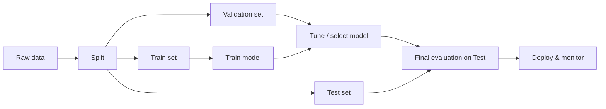

# Machine Learning Fundamentals

> **TL;DR:** Machine learning lets a program learn patterns from data instead of following hand-written rules. The goal is *generalization* — good predictions on data it has never seen — which is why you split your data and evaluate honestly.

---

## Overview
Machine learning (ML) is the foundation of nearly every modern AI system, from spam filters to large language models. Instead of coding rules by hand, you show a model examples and let it infer the rules. As an AI engineer, most of your time is spent on the *workflow* around the model — collecting data, splitting it correctly, training, evaluating, and shipping — not on the algorithm itself.

**By the end, you will be able to:**
- Explain what ML is and how it differs from rule-based programming.
- Use the core vocabulary: features, labels, samples, model, and generalization.
- Run an end-to-end scikit-learn workflow with correct train/validation/test splits.

---

## Intuition
Imagine teaching a child to recognize cats. You do not write a rulebook ("if it has whiskers AND pointy ears AND a tail, then cat"). You just point at many animals and say "cat" or "not cat." Over time the child learns the pattern and can label a cat it has never seen before.

ML works the same way. You feed the model many labeled examples, it adjusts its internal settings to fit those examples, and then it makes predictions on new inputs. The whole point is that last step: predicting well on **new, unseen** data. A model that only memorizes the examples it was trained on is useless — like a student who memorizes the answer key but fails the real exam.

---

## Details

### Theory

**Rules vs. learning.** Classic programming maps input → output through code you write. ML instead learns a function $f$ from data so that:

$$
\hat{y} = f(\mathbf{x})
$$

where $\mathbf{x}$ is a **feature vector** (the inputs describing one example), $\hat{y}$ is the model's **prediction**, and $f$ is learned from examples rather than written by hand.

**Core vocabulary.**
- **Sample** (or *instance*, *example*): one data point — one row.
- **Feature**: a measured input variable — one column. The full input is a feature vector $\mathbf{x} \in \mathbb{R}^{d}$ with $d$ features.
- **Label** (or *target*): the answer you want to predict, $y$. Present in **supervised** learning, absent in unsupervised.
- **Dataset**: a collection of $n$ samples, often written as a matrix $\mathbf{X} \in \mathbb{R}^{n \times d}$ with labels $\mathbf{y} \in \mathbb{R}^{n}$.
- **Model**: the learned function $f$, parameterized by values fit during training.

**Generalization.** Training minimizes error on data you have. What you actually care about is *generalization error* — expected error on unseen data drawn from the same distribution. Define the loss $L(y, \hat{y})$ (how wrong a single prediction is). Training minimizes the **empirical risk** on the training set:

$$
\hat{R}_{\text{train}} = \frac{1}{n} \sum_{i=1}^{n} L\big(y_i,\, f(\mathbf{x}_i)\big)
$$

But the true objective is the **expected risk** $R = \mathbb{E}_{(\mathbf{x}, y)}[L(y, f(\mathbf{x}))]$ over the whole data distribution. Because you cannot see the full distribution, you *estimate* $R$ using held-out data.

**Why you split the data.** Evaluating on the same data you trained on gives an optimistic, dishonest score. So you partition:

- **Training set** — the model fits its parameters here.
- **Validation set** — used to tune choices you make *about* the model (hyperparameters, model family). You look at it repeatedly, so it slowly "leaks" into your decisions.
- **Test set** — touched **once**, at the very end, to estimate real-world performance. Never tune on it.

A typical split is 60/20/20 or 80/10/10. When data is scarce, cross-validation reuses the training data more efficiently (covered in a later lesson).

### Python implementation

A minimal, honest end-to-end run on the built-in Iris dataset.

```python
import numpy as np
from sklearn.datasets import load_iris
from sklearn.model_selection import train_test_split
from sklearn.linear_model import LogisticRegression
from sklearn.metrics import accuracy_score

rng = np.random.default_rng(42)

# 1. Data: X = features (n x d), y = labels (n,)
X, y = load_iris(return_X_y=True)

# 2. Split: hold out a test set the model never sees during training.
X_train, X_test, y_train, y_test = train_test_split(
    X, y, test_size=0.2, random_state=42, stratify=y
)

# 3. Train: the model learns f from the training data only.
model = LogisticRegression(max_iter=1000)
model.fit(X_train, y_train)

# 4. Evaluate: score on the untouched test set = generalization estimate.
y_pred = model.predict(X_test)
print(f"Test accuracy: {accuracy_score(y_test, y_pred):.3f}")
```

`stratify=y` keeps the class proportions the same in both splits — important for classification.

## Diagram



## Worked Example
Predict whether an iris is species *setosa* using only petal length.

1. **Data**: 150 flowers, one feature (petal length in cm), label = 1 if setosa else 0.
2. **Split**: 120 train, 30 test.
3. **Train**: logistic regression finds a threshold — roughly "petal length < 2.5 cm ⇒ setosa."
4. **Evaluate**: on the 30 unseen flowers it classifies nearly all correctly, because setosa is cleanly separable by petal size.

The key lesson: the model was *judged on flowers it never saw*, so the accuracy is a trustworthy estimate of future performance.

## Best Practices
- ✅ Split before doing anything else — inspect and preprocess using the training set only.
- ✅ Use `stratify` for classification so class ratios are preserved.
- ✅ Fix `random_state` so runs are reproducible.
- ✅ Establish a trivial baseline (e.g. always predict the majority class) before celebrating a model.

## Common Mistakes
- ⚠️ **Evaluating on training data.** Fix: always report the score on a held-out set.
- ⚠️ **Peeking at the test set to tune.** Fix: tune on validation/CV; touch test exactly once.
- ⚠️ **Data leakage** — computing scaling statistics on the full dataset before splitting. Fix: fit preprocessing on the training split only (Pipelines make this automatic).

## Industry Tips
- 💡 In production, "generalization" also means holding up over *time* — monitor for data drift after deploy.
- 💡 Most real gains come from better data and correct evaluation, not fancier algorithms.

## Real-World Use Cases
- Email spam detection (features: word counts; label: spam/not spam).
- Credit risk scoring (features: financial history; label: default/no default).
- Product recommendation ranking.

---

## Summary
- ML learns a function from labeled examples instead of using hand-written rules.
- Vocabulary: samples (rows), features (columns), labels (targets), model (learned $f$).
- Generalization — performing well on unseen data — is the entire goal.
- Train/validation/test splits give an honest estimate of generalization; the test set is used once.

## Practice
- [ ] Exercises: [Module 3 Exercises](../exercises/README.md)
- [ ] Self-check: Why does reporting accuracy on the training set overstate a model's real-world performance?

## Further Reading
- 📘 Hands-On Machine Learning — Aurélien Géron
- 📘 An Introduction to Statistical Learning — James, Witten, Hastie & Tibshirani (https://www.statlearning.com/)
- 📄 [scikit-learn user guide](https://scikit-learn.org/stable/user_guide.html)
- ▶️ StatQuest (https://www.youtube.com/@statquest)

## Related
- [Learning Paradigms](learning-paradigms.md)
- [The scikit-learn Workflow](scikit-learn-workflow.md)
- [Mathematics for AI](../../02-mathematics-foundations/README.md)

---

## Navigation
- ⬆️ [Lessons](README.md)
- 📚 [Module 3 — Machine Learning](../README.md)
- 🏠 [Knowledge Base Home](../../README.md)
