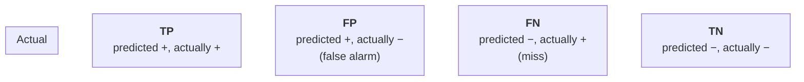

# Model Evaluation Metrics

> **TL;DR:** Accuracy alone lies on imbalanced data. Choose metrics — precision, recall, $F_1$, ROC-AUC for classification; MAE, RMSE, $R^2$ for regression — that reflect the actual cost of each kind of mistake.

---

## Overview
A model is only as useful as the metric you judge it by, and the "obvious" metric is often the wrong one. This lesson covers the standard classification and regression metrics, what each one hides, and how to let the business cost of errors drive your choice. Getting this right is what separates a demo from a deployable system.

**By the end, you will be able to:**
- Read a confusion matrix and compute precision, recall, and $F_1$ from it.
- Explain the accuracy paradox and when to prefer ROC-AUC or a precision–recall curve.
- Pick and compute the right regression metric (MAE, RMSE, $R^2$) for a given goal.

---

## Intuition
Suppose 1 in 1000 emails is spam and you build a "model" that labels *everything* as not-spam. It is **99.9% accurate** — and completely worthless. That is the accuracy paradox: on imbalanced data, accuracy rewards ignoring the rare class.

The fix is to ask *what kind of mistake hurts, and how much*. A spam filter that deletes a real job offer (false positive) is worse than one that lets a spam email through (false negative). A cancer screen is the opposite — missing a real case (false negative) is catastrophic. Different costs → different metrics. Metrics are not neutral; they encode what you care about.

---

## Details

### Theory

**The confusion matrix** is the source of every classification metric. For a binary problem with a "positive" class:



|  | Predicted Positive | Predicted Negative |
|---|---|---|
| **Actual Positive** | TP (true positive) | FN (false negative) |
| **Actual Negative** | FP (false positive) | TN (true negative) |

From these four counts:

$$
\text{Accuracy} = \frac{TP + TN}{TP + TN + FP + FN}
$$

$$
\text{Precision} = \frac{TP}{TP + FP} \qquad \text{Recall} = \frac{TP}{TP + FN}
$$

- **Precision** answers: *of everything I flagged positive, how much was right?* It punishes false positives.
- **Recall** (sensitivity) answers: *of all actual positives, how many did I catch?* It punishes false negatives.

There is a tension: pushing recall up (flag more) usually drags precision down. The **$F_1$ score** is their harmonic mean, high only when both are high:

$$
F_1 = 2 \cdot \frac{\text{Precision} \cdot \text{Recall}}{\text{Precision} + \text{Recall}}
$$

**Thresholds and curves.** A classifier outputs a probability; you convert it to a label with a **threshold** (default 0.5). Sweeping the threshold traces two curves:

- **ROC curve** plots the true-positive rate ($\text{TPR} = \text{Recall}$) against the false-positive rate ($\text{FPR} = \frac{FP}{FP + TN}$). **AUC** (area under it) is the probability the model ranks a random positive above a random negative; $0.5$ = random, $1.0$ = perfect. AUC is threshold-independent.
- **Precision–recall (PR) curve** plots precision against recall. On **heavily imbalanced** data the PR curve is more informative than ROC, because FPR stays deceptively low when negatives dominate.

**Regression metrics.** For continuous targets with true $y_i$, prediction $\hat{y}_i$, and $n$ samples:

$$
\text{MAE} = \frac{1}{n}\sum_{i=1}^{n} |y_i - \hat{y}_i| \qquad \text{MSE} = \frac{1}{n}\sum_{i=1}^{n} (y_i - \hat{y}_i)^2 \qquad \text{RMSE} = \sqrt{\text{MSE}}
$$

- **MAE** is in the target's units and treats all errors linearly — robust to outliers.
- **MSE / RMSE** square the errors, so large mistakes are penalized disproportionately; RMSE is back in the original units.
- **$R^2$** (coefficient of determination) is the fraction of variance explained, where $\bar{y}$ is the mean of $y$:

$$
R^2 = 1 - \frac{\sum_i (y_i - \hat{y}_i)^2}{\sum_i (y_i - \bar{y})^2}
$$

$R^2 = 1$ is perfect; $R^2 = 0$ means no better than predicting the mean; it can go negative for a bad model.

### Python implementation

```python
import numpy as np
from sklearn.datasets import make_classification
from sklearn.linear_model import LogisticRegression
from sklearn.model_selection import train_test_split
from sklearn.metrics import (
    confusion_matrix, classification_report,
    roc_auc_score, precision_recall_curve,
    mean_absolute_error, mean_squared_error, r2_score,
)

# --- Classification on imbalanced data (5% positive) ---
X, y = make_classification(n_samples=2000, weights=[0.95, 0.05], random_state=0)
X_tr, X_te, y_tr, y_te = train_test_split(X, y, stratify=y, random_state=0)

clf = LogisticRegression(max_iter=1000).fit(X_tr, y_tr)
y_pred = clf.predict(X_te)
y_proba = clf.predict_proba(X_te)[:, 1]   # probability of positive class

print(confusion_matrix(y_te, y_pred))     # [[TN, FP], [FN, TP]]
print(classification_report(y_te, y_pred, digits=3))  # precision/recall/F1 per class
print("ROC-AUC:", round(roc_auc_score(y_te, y_proba), 3))

# Choose a threshold from the precision-recall curve (not the default 0.5)
prec, rec, thr = precision_recall_curve(y_te, y_proba)

# --- Regression metrics ---
y_true = np.array([3.0, 5.0, 2.5, 7.0])
y_hat  = np.array([2.8, 5.5, 2.0, 8.0])
print("MAE :", round(mean_absolute_error(y_true, y_hat), 3))
print("RMSE:", round(mean_squared_error(y_true, y_hat) ** 0.5, 3))
print("R2  :", round(r2_score(y_true, y_hat), 3))
```

## Worked Example
A fraud model scores 10,000 transactions; 100 are truly fraudulent. It flags 120 transactions: 80 are real fraud (TP), 40 are false alarms (FP), and 20 frauds slip through (FN). Then:

- Precision $= 80 / (80 + 40) = 0.667$ — two-thirds of alerts are genuine.
- Recall $= 80 / (80 + 20) = 0.800$ — it catches 80% of fraud.
- $F_1 = 2 \cdot \frac{0.667 \cdot 0.800}{0.667 + 0.800} \approx 0.727$.

Accuracy here is $(80 + 9840)/10000 = 0.992$ — impressive-looking but meaningless given the imbalance. If each missed fraud costs \$500 and each false alarm costs \$5 of review time, you would **lower the threshold** to raise recall, accepting more false positives.

## Best Practices
- ✅ On imbalanced data, report precision, recall, $F_1$, and ROC-AUC (or PR-AUC) — never accuracy alone.
- ✅ Tie the metric to a cost: write down what a false positive and a false negative each cost before choosing.
- ✅ Tune the decision threshold on validation data using the PR curve; do not assume 0.5 is right.

## Common Mistakes
- ⚠️ **Optimizing accuracy on imbalanced classes.** Fix: use $F_1$ / recall / AUC that reflect the minority class.
- ⚠️ **Computing ROC-AUC on hard labels.** AUC needs *scores/probabilities* (`predict_proba` or `decision_function`), not `predict` output.
- ⚠️ **Reporting RMSE when outliers dominate and you did not intend that.** Fix: use MAE if large errors should not be penalized extra.

## Industry Tips
- 💡 For very rare positives, prefer the **precision–recall curve and PR-AUC** — ROC-AUC can look great while the model is useless in practice.
- 💡 Always eyeball the raw confusion matrix; a single aggregate number can hide a class the model never predicts.

## Real-World Use Cases
- Medical screening: maximize recall (catch every case), tolerate false positives caught by follow-up tests.
- Spam / content moderation: balance precision (don't block legit content) against recall.
- Demand forecasting: RMSE when big misses are costly, MAE when you want typical error in units.

---

## Summary
- The confusion matrix (TP/FP/FN/TN) generates precision, recall, $F_1$, and the ROC/PR curves.
- Accuracy is misleading on imbalanced data; pick metrics that match the cost of each error type.
- Regression: MAE for robustness, RMSE to punish big misses, $R^2$ for variance explained.

## Practice
- [ ] Exercises: [Module 3 Exercises](../exercises/README.md)
- [ ] Self-check: A model has precision 0.95 but recall 0.30. What does that mean, and for which application might it still be acceptable?

## Further Reading
- 📘 Hands-On Machine Learning — Aurélien Géron
- 📘 An Introduction to Statistical Learning — James, Witten, Hastie & Tibshirani (https://www.statlearning.com/)
- 📄 [scikit-learn user guide](https://scikit-learn.org/stable/user_guide.html)
- ▶️ StatQuest (https://www.youtube.com/@statquest)

## Related
- [Classification](classification.md)
- [Cross-Validation](cross-validation.md)

---

## Navigation
- ⬆️ [Lessons](README.md)
- 📚 [Module 3 — Machine Learning](../README.md)
- 🏠 [Knowledge Base Home](../../README.md)
