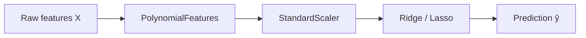

# Regression

> **TL;DR:** Regression predicts a continuous number. Start with linear regression (fit a weighted line/plane by minimizing squared error), extend it with polynomial features for curves, and add Ridge ($L_2$) or Lasso ($L_1$) regularization to keep the model from overfitting.

---

## Overview

Regression is the family of supervised-learning methods that predict a **continuous** target — a house price, a temperature, a delivery time — rather than a category. Linear models are the workhorse: they are fast, interpretable, and a strong baseline for almost any tabular problem. This lesson builds them from intuition to math to scikit-learn code, then shows how regularization tames overfitting.

**By the end, you will be able to:**
- Fit and interpret linear and polynomial regression models with scikit-learn.
- Explain why Ridge and Lasso regularization help, and when to reach for each.
- Recognize the assumptions of linear regression and know when to switch to a nonlinear regressor.

---

## Intuition

Imagine plotting house size against price. The points roughly follow an upward trend. Linear regression draws the single straight line that sits "closest" to all the points at once — closest meaning the total squared vertical distance from points to line is as small as possible. Once you have that line, you predict a new house's price by reading off the line at its size.

With many features (size, bedrooms, age), the line becomes a flat sheet (a hyperplane) through higher-dimensional space, but the idea is unchanged: find the weighted combination of inputs that lands closest to the observed targets.

If the true relationship curves, a straight line underfits. **Polynomial features** let the same linear machinery bend by feeding it $x^2, x^3, \dots$ as extra inputs. Push that too far and the curve wiggles through every point — memorizing noise. **Regularization** is the brake: it penalizes large weights so the model stays smooth.

---

## Details

### Theory

**The linear model.** For a feature vector $\mathbf{x} \in \mathbb{R}^d$ the prediction is

$$\hat{y} = \mathbf{w}^\top \mathbf{x} + b = \sum_{j=1}^{d} w_j x_j + b$$

where $\mathbf{x}$ is the input features, $\mathbf{w} \in \mathbb{R}^d$ is the weight vector (one weight per feature), $b \in \mathbb{R}$ is the bias/intercept, and $\hat{y}$ is the predicted value.

**The loss.** We choose $\mathbf{w}, b$ to minimize the **mean squared error** (MSE) over $n$ training examples:

$$\mathrm{MSE}(\mathbf{w}, b) = \frac{1}{n} \sum_{i=1}^{n} \left( y_i - \hat{y}_i \right)^2$$

where $y_i$ is the true target for example $i$ and $\hat{y}_i = \mathbf{w}^\top \mathbf{x}_i + b$ its prediction. Squaring makes the loss smooth and convex, so it has a single global minimum. That minimum can be found two ways: the **closed-form normal equation** (used by scikit-learn's `LinearRegression`), or iteratively via [gradient descent](../../02-mathematics-foundations/lessons/gradient-descent.md), which scales better to huge datasets.

**Polynomial features.** Replace $x$ with the expanded set $[x, x^2, \dots, x^p]$ (degree $p$). The model is still linear *in the weights*, so the same solver applies, but it can now fit curves.

**Regularization.** Add a penalty on weight size to the loss. **Ridge** ($L_2$) minimizes

$$\mathrm{MSE} + \alpha \sum_{j=1}^{d} w_j^2$$

and **Lasso** ($L_1$) minimizes

$$\mathrm{MSE} + \alpha \sum_{j=1}^{d} |w_j|$$

where $\alpha \ge 0$ is the regularization strength (a hyperparameter you tune). Larger $\alpha$ shrinks weights harder. The key difference: Ridge shrinks all weights smoothly toward zero but rarely to *exactly* zero, while Lasso's geometry drives many weights to exactly zero — giving automatic **feature selection**. Reach for Lasso when you suspect many features are irrelevant; reach for Ridge when features are correlated and you want to keep them all but calm them down. `ElasticNet` blends both.

**Assumptions & when linear works.** Linear models assume the target is approximately a linear combination of the features, errors are roughly independent with constant variance, and features are not perfectly collinear. They shine when relationships are close to linear, data is limited, or you need an interpretable model. When relationships are strongly nonlinear or involve complex feature interactions, tree-based regressors (`DecisionTreeRegressor`, `RandomForestRegressor`, gradient boosting) or other nonlinear models often win — at the cost of interpretability.

### Python implementation

Always **scale features** before regularization: Ridge and Lasso penalize weight magnitude, so features on larger numeric scales would be penalized unfairly. A `Pipeline` keeps scaling and model together so the scaler is fit only on training data.

```python
import numpy as np
from sklearn.linear_model import LinearRegression, Ridge, Lasso
from sklearn.pipeline import make_pipeline
from sklearn.preprocessing import StandardScaler, PolynomialFeatures
from sklearn.model_selection import train_test_split
from sklearn.metrics import mean_squared_error, r2_score

rng = np.random.default_rng(0)
X = rng.uniform(-3, 3, size=(200, 1))
y = 0.5 * X[:, 0] ** 2 + X[:, 0] + 2 + rng.normal(0, 1, size=200)

X_train, X_test, y_train, y_test = train_test_split(X, y, test_size=0.25, random_state=0)

# Plain linear regression (closed-form).
lin = LinearRegression().fit(X_train, y_train)

# Polynomial + Ridge in a scaled pipeline.
ridge_poly = make_pipeline(
    PolynomialFeatures(degree=2, include_bias=False),
    StandardScaler(),
    Ridge(alpha=1.0),
).fit(X_train, y_train)

for name, model in [("linear", lin), ("ridge_poly", ridge_poly)]:
    pred = model.predict(X_test)
    rmse = np.sqrt(mean_squared_error(y_test, pred))
    print(f"{name:12s} RMSE={rmse:.3f}  R2={r2_score(y_test, pred):.3f}")
```

Swap `Ridge(alpha=1.0)` for `Lasso(alpha=0.1)` to try $L_1$; inspect `model[-1].coef_` to see which weights Lasso zeroed out. We touch RMSE and $R^2$ here only to compare models — see [Model Evaluation Metrics](model-evaluation-metrics.md) for the full treatment.

## Diagram



## Worked Example

You predict apartment rent from three features: area (m²), number of rooms, and building age. Area ranges 20–150, rooms 1–5, age 0–80 — very different scales.

1. Split into train/test.
2. Build a pipeline: `StandardScaler` → `Ridge(alpha=1.0)`. Scaling puts all three features on comparable footing so the penalty is fair.
3. Fit on the training set; the model learns weights like `area: +18.2`, `rooms: +5.1`, `age: -3.4` (on standardized inputs, so they are directly comparable — area matters most, age drags rent down).
4. Predict on the test set and compute RMSE (e.g. 120 €/month) and $R^2$ (e.g. 0.78).
5. If test error is far worse than training error, raise `alpha` to regularize harder; if both are high, the model underfits — add polynomial features or richer inputs.

## Best Practices
- ✅ Wrap scaling and the estimator in a `Pipeline` so preprocessing is fit only on the training fold.
- ✅ Always scale features before Ridge/Lasso/ElasticNet.
- ✅ Tune `alpha` with cross-validation (`RidgeCV`, `LassoCV`) rather than guessing.
- ✅ Start with a plain linear baseline before adding polynomial complexity.

## Common Mistakes
- ⚠️ Fitting the scaler on the full dataset before splitting — leaks test information. Fix: scale inside a pipeline after the split.
- ⚠️ Using high-degree polynomials without regularization — the curve overfits wildly. Fix: keep degree low and/or add Ridge.
- ⚠️ Comparing raw coefficient magnitudes across unscaled features. Fix: standardize first, then coefficients are comparable.

## Industry Tips
- 💡 A regularized linear model is often the right *first* production model: fast to train, cheap to serve, and easy to explain to stakeholders.
- 💡 Lasso doubles as a feature-selection tool — inspect which coefficients it drives to zero before investing in a heavier model.

## Real-World Use Cases
- Demand forecasting and price prediction in retail.
- Estimating continuous risk scores (e.g., expected claim cost) in insurance.
- Baseline models in scientific and engineering measurement pipelines.

---

## Summary
- Linear regression fits $\hat{y}=\mathbf{w}^\top\mathbf{x}+b$ by minimizing MSE; it is the fast, interpretable baseline for continuous targets.
- Polynomial features let linear machinery fit curves; regularization (Ridge $L_2$, Lasso $L_1$) prevents the resulting flexibility from overfitting.
- Scale features and tune $\alpha$ by cross-validation; switch to tree/nonlinear regressors when relationships are strongly nonlinear.

## Practice
- [ ] Exercises: [Module 3 Exercises](../exercises/README.md)
- [ ] Self-check: Why does Lasso produce exactly-zero coefficients while Ridge usually does not?

## Further Reading
- 📘 Hands-On Machine Learning — Aurélien Géron
- 📘 An Introduction to Statistical Learning — James, Witten, Hastie & Tibshirani (https://www.statlearning.com/)
- 📄 [scikit-learn user guide](https://scikit-learn.org/stable/user_guide.html)
- ▶️ StatQuest (https://www.youtube.com/@statquest)

## Related
- [Classification](classification.md)
- [Bias, Variance, Overfitting & Underfitting](bias-variance-overfitting.md)
- [Gradient Descent](../../02-mathematics-foundations/lessons/gradient-descent.md)

---

## Navigation
- ⬆️ [Lessons](README.md)
- 📚 [Module 3 — Machine Learning](../README.md)
- 🏠 [Knowledge Base Home](../../README.md)
