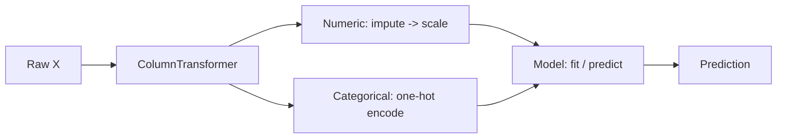

# The scikit-learn Workflow

> **TL;DR:** scikit-learn gives every object the same tiny API — `fit`, `predict`, `transform` — so you can snap preprocessing and models together into a `Pipeline`. Pipelines make your workflow reproducible, tunable with `GridSearchCV`, and safe from data leakage.

---

## Overview
scikit-learn is the workhorse of classical ML in Python. Its power comes not from any single algorithm but from a *consistent design*: hundreds of models and preprocessors share the same handful of methods. Once you learn the API once, you can compose components, swap models, tune hyperparameters, and ship a single artifact — all with the same patterns.

**By the end, you will be able to:**
- Use the estimator API (`fit`, `predict`, `transform`, `fit_transform`) and tell transformers from estimators.
- Build a `Pipeline` with a `ColumnTransformer` that preprocesses and models without leaking test data.
- Tune hyperparameters with `GridSearchCV`/`RandomizedSearchCV` and persist the result with `joblib`.

---

## Intuition
Imagine an assembly line. Raw materials (your data) enter one end, pass through stations that clean and shape them (scaling, encoding), and a finished product (a prediction) comes out the other end. scikit-learn lets you define that line once as a `Pipeline`. When you press "start" with `fit`, every station learns its settings *from the training data only*; when new data arrives, it flows through the exact same stations in the exact same order. Because the line is one object, you cannot accidentally forget a step in production, and you cannot accidentally let the test data teach the scaler.

---

## Details

### Theory

**The estimator API.** Almost every scikit-learn object is an *estimator* with a `fit(X, y)` method that learns from data. From there, two roles:

- **Predictors** (models like `LogisticRegression`) add `predict(X)` — and often `predict_proba` or `score`.
- **Transformers** (preprocessors like `StandardScaler`) add `transform(X)`, which returns a modified version of the data, plus the convenience `fit_transform(X)` that fits then transforms in one call.

The critical rule: call `fit` (or `fit_transform`) on **training data only**, then `transform`/`predict` on new data. This mirrors reality — the model never sees the future.

**Parameters vs hyperparameters.**
- **Parameters** are learned *from data during `fit`* (e.g. regression coefficients). scikit-learn stores them with a trailing underscore, like `coef_`.
- **Hyperparameters** are set *by you before `fit`* and control how learning happens (e.g. `C` in an SVM, `n_estimators` in a forest). They are what you tune.

**Pipelines and leakage.** *Data leakage* is when information from the test set sneaks into training, producing over-optimistic scores. A classic case: scaling the whole dataset before splitting, so the scaler's mean is computed using test rows. A `Pipeline` prevents this — during cross-validation it re-fits every preprocessing step on each training fold only, never on the held-out fold. A `ColumnTransformer` lets one pipeline apply different transforms to different columns (e.g. scale numeric columns, one-hot encode categorical ones).

**Model selection.** To find good hyperparameters, search over combinations and evaluate each with cross-validation:

- **`GridSearchCV`** tries every combination in a grid — exhaustive but expensive.
- **`RandomizedSearchCV`** samples a fixed number of random combinations — far cheaper for large search spaces and often just as good.

### Python implementation

A complete, leakage-free workflow: split, preprocess by column type, fit a model, tune it, and evaluate on a held-out test set.

```python
import numpy as np
import pandas as pd
from sklearn.model_selection import train_test_split, GridSearchCV
from sklearn.compose import ColumnTransformer
from sklearn.pipeline import Pipeline
from sklearn.preprocessing import StandardScaler, OneHotEncoder
from sklearn.impute import SimpleImputer
from sklearn.ensemble import RandomForestClassifier

# Toy data with mixed column types
df = pd.DataFrame({
    "age": [25, 47, 33, 51, 29, 40],
    "income": [40_000, 82_000, 55_000, 91_000, 47_000, 70_000],
    "city": ["NY", "SF", "NY", "LA", "SF", "LA"],
    "churn": [0, 1, 0, 1, 0, 1],
})
X = df.drop(columns="churn")
y = df["churn"]

X_train, X_test, y_train, y_test = train_test_split(
    X, y, test_size=0.33, random_state=42, stratify=y
)

numeric = ["age", "income"]
categorical = ["city"]

pre = ColumnTransformer([
    ("num", Pipeline([("impute", SimpleImputer(strategy="median")),
                      ("scale", StandardScaler())]), numeric),
    ("cat", OneHotEncoder(handle_unknown="ignore"), categorical),
])

pipe = Pipeline([
    ("pre", pre),
    ("clf", RandomForestClassifier(random_state=42)),
])

# Tune a hyperparameter with cross-validation. Note the "step__param" naming.
grid = GridSearchCV(pipe, {"clf__n_estimators": [50, 100, 200]}, cv=2)
grid.fit(X_train, y_train)

print("Best params:", grid.best_params_)
print("Test accuracy:", grid.score(X_test, y_test))
```

Once you are happy, persist the *whole pipeline* — preprocessing plus model — as one artifact:

```python
import joblib

joblib.dump(grid.best_estimator_, "churn_model.joblib")
loaded = joblib.load("churn_model.joblib")
loaded.predict(X_test)   # raw, unprocessed input works — the pipeline handles it
```

## Diagram



## Worked Example
You are predicting customer churn from the mixed-type table above.

1. **Split first.** `train_test_split` holds out a test set *before any preprocessing touches the data* — this is what keeps your final score honest.
2. **Route columns.** The `ColumnTransformer` sends `age` and `income` through imputation and scaling, and `city` through one-hot encoding. Each learns its settings (medians, means, category vocabulary) from the training folds only.
3. **Model.** The `RandomForestClassifier` receives the transformed matrix.
4. **Tune.** `GridSearchCV` tries three forest sizes, cross-validating each, and refits the best on the full training set.
5. **Ship.** `joblib.dump` saves the entire pipeline. In production you feed it *raw* rows and it reapplies every step identically — no preprocessing code to duplicate or drift.

## Best Practices
- ✅ Split before you preprocess; let the pipeline fit transformers on training data only.
- ✅ Put every preprocessing step inside the `Pipeline` so cross-validation and deployment stay leakage-free.
- ✅ Persist the whole pipeline, not just the model, so inference matches training exactly.

## Common Mistakes
- ⚠️ Calling `fit_transform` on the full dataset before splitting — leaks test information; fit inside a pipeline instead.
- ⚠️ Tuning hyperparameters on the test set — reserve the test set for one final evaluation; tune with cross-validation.
- ⚠️ Forgetting `handle_unknown="ignore"` on `OneHotEncoder` — unseen categories at inference time will otherwise raise an error.

## Industry Tips
- 💡 Prefer `RandomizedSearchCV` over `GridSearchCV` for large search spaces; it usually finds strong settings far faster.
- 💡 Pin your scikit-learn version alongside any pickled/joblib artifact — models are not guaranteed to unpickle across versions.

## Real-World Use Cases
- Reproducible training pipelines that a CI job can rebuild from scratch.
- Serving a single `joblib` artifact behind a prediction API so preprocessing never drifts from training.
- Rapid model comparison — swap the final estimator, keep the same preprocessing.

---

## Summary
- One consistent API (`fit`, `predict`, `transform`, `fit_transform`) makes every scikit-learn component composable.
- `Pipeline` + `ColumnTransformer` bundle preprocessing and modeling into a single, leakage-free, deployable object.
- Tune hyperparameters with `GridSearchCV`/`RandomizedSearchCV` and persist the fitted pipeline with `joblib`.

## Practice
- [ ] Exercises: [Module 3 Exercises](../exercises/README.md)
- [ ] Self-check: Why does scaling *inside* a pipeline prevent leakage that scaling the whole dataset first does not?

## Further Reading
- 📘 Hands-On Machine Learning — Aurélien Géron
- 📘 An Introduction to Statistical Learning — James, Witten, Hastie & Tibshirani (https://www.statlearning.com/)
- 📄 [scikit-learn user guide](https://scikit-learn.org/stable/user_guide.html)
- ▶️ StatQuest (https://www.youtube.com/@statquest)

## Related
- [Machine Learning Fundamentals](ml-fundamentals.md)
- [Cross-Validation](cross-validation.md)
- [Feature Engineering](../../01-python-languages/lessons/feature-engineering.md)

---

## Navigation
- ⬆️ [Lessons](README.md)
- 📚 [Module 3 — Machine Learning](../README.md)
- 🏠 [Knowledge Base Home](../../README.md)
