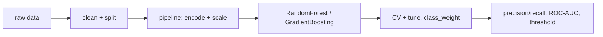

# Mini Project: Customer Churn Predictor

> **What you'll build:** A classifier that flags customers likely to churn, tuned
> and evaluated with metrics that reflect the cost of missing a churner.

---

## Objective

Churn is a classic, business-critical, often-imbalanced classification problem.
You'll build an ensemble model and — crucially — evaluate it honestly with
precision/recall and threshold tuning rather than raw accuracy.

## Learning Goals

- Train and tune ensemble classifiers.
- Handle class imbalance and pick a decision threshold from cost.
- Communicate model quality with the right metrics.

---

## Prerequisites

- [Classification](../lessons/classification.md), [Ensemble Methods](../lessons/ensemble-methods.md), [Model Evaluation Metrics](../lessons/model-evaluation-metrics.md)
- A churn-style tabular dataset (with an imbalanced target).

## Architecture

---

## Steps

### 1. Explore
Load the data; measure the class imbalance and inspect key drivers.

### 2. Pipeline & models
Build a preprocessing `Pipeline`; train `RandomForestClassifier` and
`GradientBoostingClassifier` with cross-validation.

### 3. Handle imbalance
Use `class_weight="balanced"` (or resampling) and compare.

### 4. Evaluate & tune threshold
Report precision, recall, F1, ROC-AUC and a confusion matrix; choose a threshold
that matches the business cost of a missed churner.

### 5. Write up
Explain the chosen operating point and the top churn drivers.

---

## Deliverables

- [ ] A tuned ensemble pipeline (reproducible).
- [ ] Precision/recall/ROC-AUC report + confusion matrix at the chosen threshold.
- [ ] `README.md` with the cost rationale and feature importances.

## Success Criteria

The model beats a majority-class baseline on recall/F1 for the churn class, and
your write-up justifies the threshold from cost — not accuracy.

---

## Extensions (Optional)

- 🚀 Add SMOTE (via `imbalanced-learn`) and compare to class weights.
- 🚀 Add SHAP-style feature explanations for individual predictions.

## Further Reading

- Hands-On Machine Learning — Aurélien Géron
- [scikit-learn metrics](https://scikit-learn.org/stable/modules/model_evaluation.html)

---

## Navigation

- ⬆️ [Module 3 Mini Projects](README.md)
- 📚 [Module 3 — Machine Learning](../README.md)
- 🏠 [Knowledge Base Home](../../README.md)
