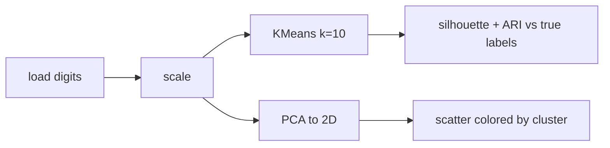

# Mini Project: Digit Clustering Explorer

> **What you'll build:** An unsupervised pipeline that clusters the `digits`
> dataset and shows, via PCA, how well the discovered clusters line up with the
> true digits.

---

## Objective

Unsupervised learning finds structure without labels. Using the `digits` dataset
(which *has* labels you deliberately hide), you'll cluster the images and then use
the hidden labels only to *validate* how meaningful your clusters are.

## Learning Goals

- Apply k-means and evaluate clusters with silhouette and label-based scores.
- Use PCA to visualize high-dimensional data in 2-D.
- Understand what clustering can recover without supervision.

---

## Prerequisites

- [Clustering](../lessons/clustering.md), [Dimensionality Reduction](../lessons/dimensionality-reduction.md)
- `scikit-learn` (ships the `digits` dataset).

## Architecture

---

## Steps

### 1. Load & scale
Load `load_digits()`; scale the pixel features.

### 2. Cluster
Run k-means with `k=10`; also try DBSCAN and compare.

### 3. Validate
Hold out the true labels until now — compute silhouette (unsupervised) and
Adjusted Rand Index / homogeneity (vs true labels) to judge cluster quality.

### 4. Visualize
Project to 2-D with PCA and scatter, colored by predicted cluster and by true
digit side by side.

### 5. Write up
Discuss which digits get confused and why clustering can't perfectly recover labels.

---

## Deliverables

- [ ] Clustering script/notebook with silhouette + ARI scores.
- [ ] PCA 2-D visualizations (cluster vs true label).
- [ ] `README.md` interpreting the results and confusions.

## Success Criteria

Clusters achieve a clearly-better-than-random ARI, and your visualization and
write-up explain where and why clustering struggles.

---

## Extensions (Optional)

- 🚀 Replace PCA with t-SNE/UMAP for the visualization and compare.
- 🚀 Use cluster labels as features for a downstream classifier.

## Further Reading

- [scikit-learn clustering](https://scikit-learn.org/stable/modules/clustering.html)
- Cross-topic: [Eigenvalues and Eigenvectors](../../02-mathematics-foundations/lessons/eigenvalues-and-eigenvectors.md)

---

## Navigation

- ⬆️ [Module 3 Mini Projects](README.md)
- 📚 [Module 3 — Machine Learning](../README.md)
- 🏠 [Knowledge Base Home](../../README.md)
