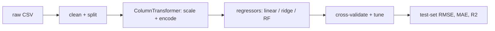

# Mini Project: House Price Regressor

> **What you'll build:** A reproducible regression pipeline that predicts house
> prices from tabular features and reports RMSE / $R^2$ on a held-out set.

---

## Objective

Regression is the "hello world" of supervised ML. You'll take a tabular housing
dataset end to end — clean it, engineer features, train and compare regressors,
and report error the way a stakeholder would want to see it.

## Learning Goals

- Assemble a leak-free preprocessing + regression pipeline.
- Compare linear and tree-based regressors with cross-validation.
- Interpret RMSE, MAE, and $R^2$ in the units of the problem.

---

## Prerequisites

- [Regression](../lessons/regression.md), [The scikit-learn Workflow](../lessons/scikit-learn-workflow.md)
- A tabular housing dataset (any public one).

## Architecture

---

## Steps

### 1. Load & split
Read the data, hold out a test set immediately, and inspect distributions/missing values.

### 2. Pipeline
Build a `ColumnTransformer` (scale numerics, encode categoricals) inside a `Pipeline`.

### 3. Model & tune
Compare `LinearRegression`/`Ridge` with a `RandomForestRegressor` via cross-validation; tune the best.

### 4. Evaluate
Report RMSE, MAE, and $R^2$ on the test set; plot predicted vs actual and residuals.

### 5. Write up
Explain which features matter and where the model errs most.

---

## Deliverables

- [ ] A reproducible pipeline script/notebook.
- [ ] Test-set metrics + a predicted-vs-actual plot.
- [ ] `README.md` with results and feature-importance notes.

## Success Criteria

The pipeline trains without leakage and produces sensible, reproducible metrics;
your write-up interprets the error in real units.

---

## Extensions (Optional)

- 🚀 Add gradient boosting (or XGBoost) and compare.
- 🚀 Log-transform a skewed target and discuss the effect.

## Further Reading

- [scikit-learn regression](https://scikit-learn.org/stable/supervised_learning.html)
- An Introduction to Statistical Learning — James, Witten, Hastie & Tibshirani (https://www.statlearning.com/)

---

## Navigation

- ⬆️ [Module 3 Mini Projects](README.md)
- 📚 [Module 3 — Machine Learning](../README.md)
- 🏠 [Knowledge Base Home](../../README.md)
