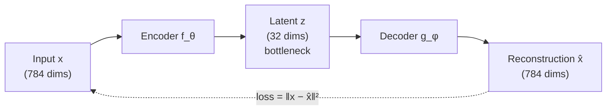

# Autoencoders

> **TL;DR:** An autoencoder squeezes its input through a narrow bottleneck and tries to reconstruct the original — the squeeze forces it to learn a compact, useful representation, with no labels required.

---

## Overview

Autoencoders are neural networks trained to copy their input to their output through a constrained intermediate representation. Because the target is the input itself, they learn from unlabeled data — a form of self-supervised representation learning. You will see how the bottleneck forces compression, how variants like denoising and variational autoencoders extend the idea, and how reconstruction error powers practical applications such as anomaly detection.

**By the end, you will be able to:**
- Explain how the encoder–bottleneck–decoder architecture and reconstruction loss force useful representations
- Implement and train a basic autoencoder in PyTorch
- Apply autoencoders to dimensionality reduction, denoising, and anomaly detection

---

## Intuition

Imagine summarizing a 500-page novel in one paragraph, then handing that paragraph to a friend who must rewrite the whole novel. If the friend's version captures the plot, your paragraph must have encoded what *matters*. That is an autoencoder: the **encoder** writes the summary (a low-dimensional **latent vector**), and the **decoder** attempts the reconstruction.

The trick is the constraint. If the summary could be as long as the book, the friend could copy it verbatim and learn nothing. By making the **bottleneck** smaller than the input — an **undercomplete** autoencoder — copying becomes impossible, and the network is forced to discover structure: the factors of variation that explain the data most efficiently.

This is why autoencoders need no labels. The supervision signal is the data itself: "reconstruct me." Anything the network learns along the way — edges, shapes, styles, correlations — is a byproduct of trying to compress well.

---

## Details

### Mathematics

An autoencoder consists of an encoder $f_\theta$ and a decoder $g_\phi$:

$$
\mathbf{z} = f_\theta(\mathbf{x}), \qquad \hat{\mathbf{x}} = g_\phi(\mathbf{z})
$$

where $\mathbf{x} \in \mathbb{R}^d$ is the input, $\mathbf{z} \in \mathbb{R}^k$ is the **latent code** with $k < d$ (undercomplete), $\hat{\mathbf{x}}$ is the reconstruction, and $\theta, \phi$ are the learnable parameters of encoder and decoder.

Training minimizes a **reconstruction loss**. For real-valued inputs, mean squared error (MSE):

$$
\mathcal{L}_{\text{MSE}}(\theta, \phi) = \frac{1}{n} \sum_{i=1}^{n} \left\lVert \mathbf{x}^{(i)} - g_\phi\!\big(f_\theta(\mathbf{x}^{(i)})\big) \right\rVert_2^2
$$

where $n$ is the number of training examples. For inputs scaled to $[0, 1]$ (e.g., pixel intensities), binary cross-entropy (BCE) per dimension is common:

$$
\mathcal{L}_{\text{BCE}} = -\frac{1}{n} \sum_{i=1}^{n} \sum_{j=1}^{d} \left[ x_j^{(i)} \log \hat{x}_j^{(i)} + \big(1 - x_j^{(i)}\big) \log\big(1 - \hat{x}_j^{(i)}\big) \right]
$$

**Relation to PCA.** If the encoder and decoder are single linear layers and the loss is MSE, the optimal autoencoder spans the same subspace as the top-$k$ principal components of the data (though the individual latent directions need not be orthogonal or ordered). Nonlinear activations are what let autoencoders capture structure PCA cannot.

**Denoising autoencoders.** Instead of feeding the clean input, corrupt it — e.g., add Gaussian noise $\tilde{\mathbf{x}} = \mathbf{x} + \boldsymbol{\epsilon}$ with $\boldsymbol{\epsilon} \sim \mathcal{N}(\mathbf{0}, \sigma^2 \mathbf{I})$, or randomly zero out entries — and train the network to reconstruct the **clean** $\mathbf{x}$:

$$
\mathcal{L}_{\text{DAE}} = \frac{1}{n} \sum_{i=1}^{n} \left\lVert \mathbf{x}^{(i)} - g_\phi\!\big(f_\theta(\tilde{\mathbf{x}}^{(i)})\big) \right\rVert_2^2
$$

The corruption prevents identity-copying even without a narrow bottleneck and pushes the model to learn robust features that capture the data manifold.

**Variational autoencoders (conceptual).** A VAE makes the latent space probabilistic: the encoder outputs the parameters of a distribution — typically a mean $\boldsymbol{\mu}$ and variance $\boldsymbol{\sigma}^2$ of a Gaussian $q(\mathbf{z} \mid \mathbf{x})$ — rather than a single point. The loss adds a **Kullback–Leibler (KL) divergence** term that pulls $q(\mathbf{z} \mid \mathbf{x})$ toward a simple prior $p(\mathbf{z}) = \mathcal{N}(\mathbf{0}, \mathbf{I})$:

$$
\mathcal{L}_{\text{VAE}} = \underbrace{\text{reconstruction loss}}_{\text{fit the data}} + \underbrace{D_{\mathrm{KL}}\big(q(\mathbf{z} \mid \mathbf{x}) \,\|\, p(\mathbf{z})\big)}_{\text{regularize the latent space}}
$$

Sampling $\mathbf{z} \sim q(\mathbf{z} \mid \mathbf{x})$ is made differentiable by the **reparameterization trick**: draw $\boldsymbol{\epsilon} \sim \mathcal{N}(\mathbf{0}, \mathbf{I})$ and compute $\mathbf{z} = \boldsymbol{\mu} + \boldsymbol{\sigma} \odot \boldsymbol{\epsilon}$, so gradients flow through $\boldsymbol{\mu}$ and $\boldsymbol{\sigma}$. The payoff: a smooth, structured latent space you can sample from to *generate* new data — something a plain autoencoder does not guarantee.

### Python implementation

```python
import torch
import torch.nn as nn


class Autoencoder(nn.Module):
    """Undercomplete autoencoder for flattened 28x28 images (e.g., MNIST)."""

    def __init__(self, input_dim: int = 784, latent_dim: int = 32) -> None:
        super().__init__()
        self.encoder = nn.Sequential(
            nn.Linear(input_dim, 256),
            nn.ReLU(),
            nn.Linear(256, latent_dim),          # bottleneck
        )
        self.decoder = nn.Sequential(
            nn.Linear(latent_dim, 256),
            nn.ReLU(),
            nn.Linear(256, input_dim),
            nn.Sigmoid(),                        # outputs in [0, 1]
        )

    def forward(self, x: torch.Tensor) -> torch.Tensor:
        z = self.encoder(x)
        return self.decoder(z)


model = Autoencoder()
optimizer = torch.optim.Adam(model.parameters(), lr=1e-3)
criterion = nn.MSELoss()

# One training step on a dummy batch (replace with a real DataLoader)
x = torch.rand(64, 784)                          # batch of 64 "images"
x_hat = model(x)
loss = criterion(x_hat, x)                       # reconstruct the input itself

optimizer.zero_grad()
loss.backward()
optimizer.step()
print(f"reconstruction loss: {loss.item():.4f}")
```

For a **denoising** variant, change two lines: feed `x_noisy = x + 0.2 * torch.randn_like(x)` into the model, but keep the loss target as the clean `x`.

## Diagram



## Worked Example

**Anomaly detection on sensor data.** Suppose you monitor industrial equipment with 100-dimensional sensor readings, almost all of which are normal operation.

1. **Train** an undercomplete autoencoder (100 → 16 → 100) on *normal* readings only, minimizing MSE.
2. **Calibrate**: compute reconstruction error $\lVert \mathbf{x} - \hat{\mathbf{x}} \rVert_2^2$ on a held-out set of normal data; set a threshold, e.g., the 99th percentile of these errors.
3. **Deploy**: for each new reading, compute its reconstruction error. Normal readings lie on the manifold the autoencoder learned, so they reconstruct well. A failing bearing produces a sensor pattern the model has never compressed — reconstruction error spikes above the threshold, and you flag an anomaly.

The key insight: the autoencoder never saw a labeled "anomaly." It only learned what *normal* looks like, and anything it cannot compress is, by definition, abnormal.

## Best Practices

- ✅ Match the loss to the data: MSE for real-valued inputs, BCE for inputs normalized to $[0, 1]$ (with a sigmoid output layer).
- ✅ Start with a strongly undercomplete bottleneck and widen it only if reconstructions are unusably poor — too wide and the model learns to copy.
- ✅ For image data, use convolutional encoders and decoders (`nn.Conv2d` / `nn.ConvTranspose2d`) instead of flattening — they preserve spatial structure and need fewer parameters.
- ✅ For anomaly detection, train on normal data only and calibrate the error threshold on a held-out normal set.

## Common Mistakes

- ⚠️ **Bottleneck too large** — the network approaches an identity function and the latent code is uninformative. Fix: shrink `latent_dim` until reconstruction quality just starts to degrade.
- ⚠️ **Evaluating reconstruction on training data** — reconstruction error must be measured on held-out data, or your anomaly threshold will be optimistically low.
- ⚠️ **Sampling a plain autoencoder's latent space to "generate" data** — nothing forces the latent space to be smooth or filled; decoded random vectors are often garbage. Fix: use a VAE if you need generation.
- ⚠️ **Denoising setup with noisy targets** — the loss target must be the *clean* input, not the corrupted one, or you just train an identity map on noise.

## Industry Tips

- 💡 Reconstruction-error anomaly detection is one of the most widely deployed autoencoder patterns in industry (fraud, network intrusion, predictive maintenance) because it needs no labeled anomalies.
- 💡 Layer-wise autoencoder pretraining was historically important for initializing deep networks before better initializations and normalization made end-to-end training routine; the intuition — unsupervised structure discovery before supervised fine-tuning — survives in modern self-supervised pretraining.
- 💡 A trained encoder is a free feature extractor: freeze it and feed $\mathbf{z}$ to a lightweight downstream classifier when labels are scarce.

## Real-World Use Cases

- **Anomaly and fraud detection** — flag transactions or sensor readings with high reconstruction error.
- **Dimensionality reduction and visualization** — a nonlinear alternative to PCA for compressing high-dimensional data before clustering or plotting.
- **Image and signal denoising** — denoising autoencoders remove noise from photos, audio, and medical scans.
- **Data compression for downstream models** — store or transmit compact latent codes instead of raw inputs.

---

## Summary

- An autoencoder learns by reconstructing its own input through a bottleneck; the undercomplete constraint — not the loss alone — is what forces useful compressed representations.
- Variants extend the idea: denoising autoencoders corrupt the input to learn robust features, and VAEs make the latent space a distribution (KL term + reparameterization) so you can sample and generate.
- Reconstruction error is a practical signal: high error on new data means "unlike anything seen in training," which powers anomaly detection.

## Practice

- [ ] Exercises: [Module 4 Exercises](../exercises/README.md)
- [ ] Self-check: why does a linear autoencoder with MSE loss recover (up to rotation) the PCA subspace, and what do nonlinear activations add?

## Further Reading

- 📘 Deep Learning — Goodfellow, Bengio & Courville (https://www.deeplearningbook.org/)
- 📘 Dive into Deep Learning — Zhang, Lipton, Li & Smola (https://d2l.ai/)
- 📄 [PyTorch documentation](https://pytorch.org/docs/stable/)

## Related

- [Convolutional Neural Networks](cnn.md)
- [Generative Adversarial Networks](gans.md)
- [Dimensionality Reduction](../../03-machine-learning/lessons/dimensionality-reduction.md)

---

## Navigation

- ⬆️ [Lessons](README.md)
- 📚 [Module 4 — Deep Learning](../README.md)
- 🏠 [Knowledge Base Home](../../README.md)
