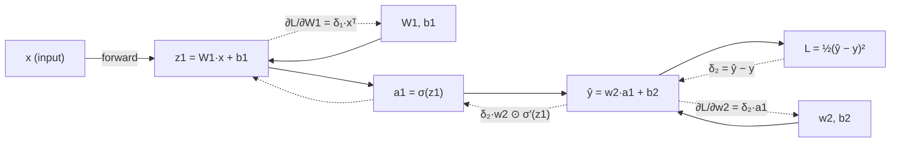

# Backpropagation

> **TL;DR:** Backpropagation is the chain rule of calculus applied systematically and efficiently over a network's computation graph: a forward pass caches intermediate values, then a backward pass reuses them to compute the gradient of the loss with respect to every parameter in one sweep.

---

## Overview

Training a neural network means adjusting millions of weights so the loss goes down. Backpropagation answers the *credit-assignment problem* — which weight is responsible for how much of the error — by computing exact gradients efficiently. This lesson builds the idea from intuition, derives it for a small network, and shows how PyTorch's autograd does it for you.

**By the end, you will be able to:**
- Explain backpropagation as the chain rule applied over a computation graph
- Derive gradients by hand for a two-layer network with MSE loss
- Use PyTorch autograd (`requires_grad`, `.backward()`, `.grad`) and verify gradients numerically

---

## Intuition

Imagine a factory assembly line. A defective product comes out the end, and you must decide how much each station contributed to the defect. You walk the line *backwards*: the final station tells you how its input affected the output, the station before that tells you how *its* input affected *its* output, and multiplying these local sensitivities together tells you how any early station influenced the final defect.

A neural network is such an assembly line. Each layer is a station that transforms its input. The loss is the "defect measurement." Backpropagation walks from the loss back toward the inputs, multiplying *local derivatives* along the way. Two facts make it efficient rather than merely correct:

1. **The forward pass caches every intermediate value** (activations). Local derivatives usually depend on these values, so caching avoids recomputation.
2. **Gradients are shared.** The gradient flowing into a layer is computed once and reused for every parameter inside that layer — the algorithm never re-derives a path from scratch.

This is why backprop costs roughly the same as *one extra forward pass*, instead of one forward pass *per parameter* (which naive finite differences would require).

---

## Details

### Mathematics

**Chain rule.** For composed functions $z = f(y)$ and $y = g(x)$, the derivative of $z$ with respect to $x$ is

$$
\frac{dz}{dx} = \frac{dz}{dy} \cdot \frac{dy}{dx},
$$

where $\frac{dz}{dy}$ is the local sensitivity of $f$ and $\frac{dy}{dx}$ that of $g$. Backpropagation applies this repeatedly, from the loss backwards.

**Setup: a two-layer network with MSE.** Take a single training pair $(\mathbf{x}, y)$, where $\mathbf{x} \in \mathbb{R}^{d}$ is the input and $y \in \mathbb{R}$ the target. Define:

$$
\mathbf{z}_1 = W_1 \mathbf{x} + \mathbf{b}_1, \qquad
\mathbf{a}_1 = \sigma(\mathbf{z}_1), \qquad
\hat{y} = \mathbf{w}_2^\top \mathbf{a}_1 + b_2, \qquad
L = \tfrac{1}{2}(\hat{y} - y)^2
$$

Symbols: $W_1 \in \mathbb{R}^{h \times d}$ and $\mathbf{b}_1 \in \mathbb{R}^{h}$ are the first layer's weights and bias, $\sigma$ is an elementwise activation (e.g. the sigmoid), $\mathbf{a}_1 \in \mathbb{R}^h$ is the hidden activation, $\mathbf{w}_2 \in \mathbb{R}^{h}$ and $b_2 \in \mathbb{R}$ are the output layer's parameters, $\hat{y}$ is the prediction, and $L$ is the loss (the $\tfrac{1}{2}$ just cancels the exponent when differentiating).

**Backward pass.** Work from $L$ toward the parameters, defining the *error signal* $\delta$ at each stage:

$$
\delta_2 \;=\; \frac{\partial L}{\partial \hat{y}} \;=\; \hat{y} - y
$$

Output-layer gradients follow immediately:

$$
\frac{\partial L}{\partial \mathbf{w}_2} = \delta_2 \, \mathbf{a}_1, \qquad
\frac{\partial L}{\partial b_2} = \delta_2
$$

Propagate the error through the output layer and the activation ($\odot$ is elementwise product, $\sigma'$ the derivative of the activation):

$$
\boldsymbol{\delta}_1 \;=\; \frac{\partial L}{\partial \mathbf{z}_1} \;=\; \left(\delta_2 \, \mathbf{w}_2\right) \odot \sigma'(\mathbf{z}_1)
$$

First-layer gradients:

$$
\frac{\partial L}{\partial W_1} = \boldsymbol{\delta}_1 \, \mathbf{x}^\top, \qquad
\frac{\partial L}{\partial \mathbf{b}_1} = \boldsymbol{\delta}_1
$$

Notice the pattern: every gradient is a product of (a) an error signal flowing backward and (b) a cached forward value ($\mathbf{a}_1$, $\mathbf{z}_1$, $\mathbf{x}$). That is the whole algorithm.

**Computation-graph view.** Generalize by viewing the network as a directed acyclic graph whose nodes are operations. Each node knows only its *local* derivative. Reverse-mode automatic differentiation traverses the graph in reverse topological order, multiplying and summing local derivatives — summing because a value used in multiple places receives gradient contributions from each consumer. Backpropagation is exactly reverse-mode autodiff applied to a scalar loss.

### Python implementation

Manual backprop for the two-layer network, then the autograd equivalent.

```python
import torch

torch.manual_seed(0)
d, h = 3, 4                       # input dim, hidden dim
x = torch.randn(d)
y = torch.tensor(1.5)

W1 = torch.randn(h, d, requires_grad=True)
b1 = torch.zeros(h, requires_grad=True)
w2 = torch.randn(h, requires_grad=True)
b2 = torch.zeros((), requires_grad=True)

# ---- forward pass (activations are cached by autograd) ----
z1 = W1 @ x + b1
a1 = torch.sigmoid(z1)
y_hat = w2 @ a1 + b2
loss = 0.5 * (y_hat - y) ** 2

# ---- backward pass: autograd fills .grad on every leaf ----
loss.backward()

# ---- manual backprop, mirroring the derivation ----
with torch.no_grad():
    delta2 = y_hat - y                            # dL/dy_hat
    grad_w2 = delta2 * a1                         # dL/dw2
    grad_b2 = delta2                              # dL/db2
    delta1 = (delta2 * w2) * a1 * (1 - a1)        # dL/dz1  (sigmoid')
    grad_W1 = torch.outer(delta1, x)              # dL/dW1
    grad_b1 = delta1                              # dL/db1

print(torch.allclose(W1.grad, grad_W1))   # True
print(torch.allclose(w2.grad, grad_w2))   # True
```

**Numerical gradient checking** approximates each derivative with a centered finite difference, where $\epsilon$ is a small step size:

$$
\frac{\partial L}{\partial \theta} \approx \frac{L(\theta + \epsilon) - L(\theta - \epsilon)}{2\epsilon}
$$

```python
def numerical_grad(f, theta: torch.Tensor, eps: float = 1e-4) -> torch.Tensor:
    """Centered finite-difference gradient of scalar f wrt tensor theta."""
    grad = torch.zeros_like(theta)
    flat = theta.view(-1)
    for i in range(flat.numel()):
        orig = flat[i].item()
        flat[i] = orig + eps
        plus = f().item()
        flat[i] = orig - eps
        minus = f().item()
        flat[i] = orig
        grad.view(-1)[i] = (plus - minus) / (2 * eps)
    return grad

def loss_fn() -> torch.Tensor:
    with torch.no_grad():
        a = torch.sigmoid(W1 @ x + b1)
        return 0.5 * (w2 @ a + b2 - y) ** 2

print(torch.allclose(numerical_grad(loss_fn, W1), W1.grad, atol=1e-3))  # True
```

Use gradient checking to validate hand-written layers; it is far too slow for training (one forward pass *per parameter per step*).

## Diagram



Solid arrows: forward pass (values cached). Dashed arrows: backward pass (gradients).

## Worked Example

Track one number end-to-end with scalars. Let $x = 2$, target $y = 1$, one hidden unit with identity activation for clarity: $z_1 = w_1 x$, $\hat{y} = w_2 z_1$, $w_1 = 0.5$, $w_2 = 3$.

1. **Forward:** $z_1 = 0.5 \cdot 2 = 1$, $\hat{y} = 3 \cdot 1 = 3$, $L = \tfrac{1}{2}(3 - 1)^2 = 2$.
2. **Backward:** $\delta_2 = \hat{y} - y = 2$. Then
   $\frac{\partial L}{\partial w_2} = \delta_2 \, z_1 = 2 \cdot 1 = 2$ and
   $\frac{\partial L}{\partial w_1} = \delta_2 \, w_2 \, x = 2 \cdot 3 \cdot 2 = 12$.
3. **Interpretation:** $w_1$ receives *six times* the gradient of $w_2$ because its influence is amplified by both $w_2 = 3$ and $x = 2$ downstream/upstream. That is credit assignment in action.

```python
import torch

w1 = torch.tensor(0.5, requires_grad=True)
w2 = torch.tensor(3.0, requires_grad=True)
x, y = torch.tensor(2.0), torch.tensor(1.0)

loss = 0.5 * (w2 * (w1 * x) - y) ** 2
loss.backward()
print(w1.grad, w2.grad)   # tensor(12.) tensor(2.)
```

## Best Practices

- ✅ Call `optimizer.zero_grad()` (or `p.grad = None`) before each `backward()` — PyTorch *accumulates* gradients into `.grad`.
- ✅ Wrap evaluation code in `torch.no_grad()` so no graph is built and memory stays flat.
- ✅ Gradient-check any custom `autograd.Function` or hand-written layer against finite differences before trusting it.
- ✅ Keep the loss a scalar before calling `.backward()`; reduce with `.mean()` or `.sum()`.

## Common Mistakes

- ⚠️ Forgetting `zero_grad()` — gradients from previous steps silently add up. Fix: zero them at the top of every training iteration.
- ⚠️ Calling `.backward()` twice on the same graph — raises a runtime error because intermediate buffers are freed. Fix: recompute the forward pass, or pass `retain_graph=True` only when you genuinely need it.
- ⚠️ Reading `.grad` on a non-leaf tensor and getting `None`. Fix: call `.retain_grad()` on the intermediate tensor, or restructure so the tensor is a leaf.
- ⚠️ Breaking the graph with `.item()`, `.detach()`, or NumPy conversion mid-computation — gradients stop flowing there. Fix: only detach where you *intend* to stop gradients.

## Industry Tips

- 💡 Backward pass memory is dominated by cached activations, not parameters. Activation (gradient) checkpointing trades recomputation for memory on large models — see `torch.utils.checkpoint` in the PyTorch docs.
- 💡 Debug exploding/vanishing gradients by logging per-layer gradient norms; a single layer's norm collapsing to ~0 or blowing up localizes the problem fast.
- 💡 Building a tiny scalar autograd engine yourself (as Karpathy does in his "from scratch" videos) is the single highest-leverage exercise for internalizing this lesson.

## Real-World Use Cases

- Every gradient-trained deep model — CNNs, transformers, diffusion models — is trained with backpropagation via reverse-mode autodiff.
- Frameworks (PyTorch, JAX, TensorFlow) build their entire training APIs around automatic differentiation of computation graphs.
- Gradient-based interpretability methods (saliency maps, integrated gradients) reuse the backward pass to attribute predictions to inputs.

---

## Summary

- Backpropagation solves credit assignment by applying the chain rule in reverse over the computation graph, reusing cached forward activations.
- The cost is roughly one extra forward pass regardless of parameter count — the reason deep learning is trainable at all.
- PyTorch autograd automates it: mark leaves with `requires_grad=True`, compute a scalar loss, call `.backward()`, read `.grad`; verify custom code with numerical gradient checking.

## Practice

- [ ] Exercises: [Module 4 Exercises](../exercises/README.md)
- [ ] Self-check: In the two-layer derivation, why does $\boldsymbol{\delta}_1$ include the factor $\sigma'(\mathbf{z}_1)$, and what happens to learning if $\sigma$ saturates?

## Further Reading

- 📘 Deep Learning — Goodfellow, Bengio & Courville (https://www.deeplearningbook.org/)
- 📘 Dive into Deep Learning — Zhang, Lipton, Li & Smola (https://d2l.ai/)
- 📄 [PyTorch documentation](https://pytorch.org/docs/stable/)
- ▶️ Andrej Karpathy (https://www.youtube.com/@AndrejKarpathy)
- ▶️ 3Blue1Brown (https://www.youtube.com/@3blue1brown)

## Related

- [Neural Networks and the Perceptron](neural-networks.md)
- [Optimizers](optimizers.md)
- [Calculus for Machine Learning](../../02-mathematics-foundations/lessons/calculus.md)

---

## Navigation

- ⬆️ [Lessons](README.md)
- 📚 [Module 4 — Deep Learning](../README.md)
- 🏠 [Knowledge Base Home](../../README.md)
