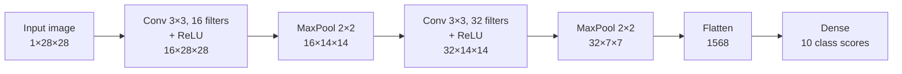

# Convolutional Neural Networks

> **TL;DR:** CNNs replace dense layers with small sliding filters that share weights across the image, exploiting locality and translation structure to learn visual features with far fewer parameters.

---

## Overview

Dense networks treat an image as a flat list of pixels, which destroys spatial structure and explodes the parameter count. Convolutional neural networks (CNNs) fix both problems with one idea: learn small filters and slide them across the input. This lesson builds the convolution operation from intuition to math, derives the output-size formula, and ends with a runnable PyTorch classifier.

**By the end, you will be able to:**
- Explain why parameter sharing and locality make CNNs efficient for images
- Compute the output size of any conv or pooling layer from kernel, stride, and padding
- Build and train a small CNN in PyTorch with `nn.Conv2d` and `nn.MaxPool2d`

---

## Intuition

Start with why dense layers fail on images. A modest 224×224 RGB image has $224 \times 224 \times 3 = 150{,}528$ input values. Connect that to a single dense layer of 1,000 units and you need over 150 million weights — for one layer. Worse, a dense layer has no notion of *where* a pixel is: shift the cat two pixels to the right and every weight sees a completely different input. The network would have to re-learn "cat" at every position.

Images have two properties a good architecture should exploit:

1. **Locality.** Meaningful patterns (edges, corners, textures) are local — a pixel is explained mostly by its neighbors, not by pixels on the far side of the image.
2. **Translation structure.** An edge detector useful in the top-left corner is equally useful in the bottom-right. Features should be detected regardless of position.

A convolutional layer bakes both in. Think of a **kernel** (also called a filter) as a tiny stencil — say 3×3 — holding 9 learned weights. You slide it across the image; at each position you multiply the stencil against the patch of pixels underneath, sum the results, and write one number to an output grid called a **feature map**. A high value means "my pattern is here." One kernel, reused everywhere: that reuse is **parameter sharing**, and it is why the same edge detector works at every location for the price of 9 weights.

A layer learns many kernels in parallel, producing one feature map per kernel. Early layers learn edges and blobs; deeper layers combine those maps into textures, parts, and eventually whole objects. **Pooling** layers then shrink the maps, summarizing each small neighborhood so the network becomes progressively more tolerant to small shifts while getting cheaper to compute.

---

## Details

### Mathematics

**The convolution operation.** For a 2D input $X$ and a kernel $K$ of size $k \times k$, the output feature map $Y$ (what deep learning libraries compute is technically *cross-correlation*, but the term "convolution" has stuck) is:

$$
Y_{i,j} = b + \sum_{u=0}^{k-1} \sum_{v=0}^{k-1} K_{u,v} \, X_{i+u,\; j+v}
$$

where $Y_{i,j}$ is the output at row $i$, column $j$; $K_{u,v}$ is the kernel weight at offset $(u, v)$; $X_{i+u, j+v}$ is the input pixel under that weight; and $b$ is a scalar bias shared across all positions.

**Channels.** Real inputs have $C_{\text{in}}$ channels (3 for RGB). Each kernel is then a $C_{\text{in}} \times k \times k$ volume that sums over all input channels, and a layer with $C_{\text{out}}$ kernels produces $C_{\text{out}}$ output channels. The parameter count is:

$$
\text{params} = C_{\text{out}} \times (C_{\text{in}} \times k \times k + 1)
$$

**Stride and padding.** The **stride** $s$ is how many pixels the kernel jumps between positions ($s > 1$ downsamples). **Padding** $p$ adds a border of zeros around the input, letting the kernel cover edge pixels and control output size.

**Output-size formula.** For input size $n$ (one spatial dimension), kernel size $k$, padding $p$, and stride $s$:

$$
n_{\text{out}} = \left\lfloor \frac{n + 2p - k}{s} \right\rfloor + 1
$$

Worked calculation: a 32×32 input, $k = 5$, $p = 2$, $s = 1$ gives $\lfloor (32 + 4 - 5)/1 \rfloor + 1 = 31 + 1 = 32$ — size is preserved ("same" padding). Follow with a 2×2 max pool at stride 2: $\lfloor (32 - 2)/2 \rfloor + 1 = 16$. Each pooling stage halves the spatial size.

**Pooling.** Max pooling outputs the maximum of each window, $Y_{i,j} = \max_{(u,v) \in \text{window}} X_{su+i,\, sv+j}$ applied per channel; average pooling outputs the mean. Pooling has no learned parameters — it only summarizes and downsamples.

**The classic pattern.** A CNN stacks blocks of *conv → activation (ReLU) → pool*, growing the channel count while shrinking spatial size, then flattens the final feature maps into a vector for one or more dense layers that produce class scores.

### Python implementation

```python
import torch
from torch import nn


class SmallCNN(nn.Module):
    """Conv -> ReLU -> Pool twice, then flatten -> dense. For 1x28x28 inputs (e.g. MNIST-like)."""

    def __init__(self, num_classes: int = 10) -> None:
        super().__init__()
        self.features = nn.Sequential(
            nn.Conv2d(in_channels=1, out_channels=16, kernel_size=3, padding=1),  # 28x28 -> 28x28
            nn.ReLU(),
            nn.MaxPool2d(kernel_size=2),                                          # 28x28 -> 14x14
            nn.Conv2d(16, 32, kernel_size=3, padding=1),                           # 14x14 -> 14x14
            nn.ReLU(),
            nn.MaxPool2d(kernel_size=2),                                           # 14x14 -> 7x7
        )
        self.classifier = nn.Sequential(
            nn.Flatten(),
            nn.Linear(32 * 7 * 7, num_classes),
        )

    def forward(self, x: torch.Tensor) -> torch.Tensor:
        return self.classifier(self.features(x))


model = SmallCNN()
x = torch.randn(8, 1, 28, 28)          # (batch, channels, height, width)
logits = model(x)
print(logits.shape)                     # torch.Size([8, 10])
print(sum(p.numel() for p in model.parameters()))  # ~20k params, vs millions for dense
```

Training uses the same loop as any classifier — `nn.CrossEntropyLoss` on the logits, an optimizer such as `torch.optim.Adam`, and mini-batches shaped `(batch, channels, height, width)`.

## Diagram



## Worked Example

Trace one input through `SmallCNN`, checking every size with the formula $n_{\text{out}} = \lfloor (n + 2p - k)/s \rfloor + 1$:

1. **Input:** a grayscale digit, shape $1 \times 28 \times 28$.
2. **Conv1** ($k=3$, $p=1$, $s=1$): $\lfloor (28 + 2 - 3)/1 \rfloor + 1 = 28$. Output $16 \times 28 \times 28$. Parameters: $16 \times (1 \times 3 \times 3 + 1) = 160$.
3. **Pool1** ($k=2$, $s=2$, $p=0$): $\lfloor (28 - 2)/2 \rfloor + 1 = 14$. Output $16 \times 14 \times 14$. No parameters.
4. **Conv2** ($k=3$, $p=1$, $s=1$): stays $14$. Output $32 \times 14 \times 14$. Parameters: $32 \times (16 \times 9 + 1) = 4{,}640$.
5. **Pool2:** $14 \to 7$. Output $32 \times 7 \times 7 = 1{,}568$ values.
6. **Flatten + Dense:** $1{,}568 \times 10 + 10 = 15{,}690$ parameters, giving 10 class logits.

Total: about 20.5k parameters. A single dense layer mapping the raw $784$ pixels to just $1{,}000$ hidden units would already need $785{,}000$ — the CNN is over an order of magnitude smaller *and* translation-aware.

**Landmark architectures** (worth knowing by name): **LeNet** (LeCun et al., 1998) established the conv → pool → dense pattern for digit recognition. **AlexNet** (Krizhevsky et al., 2012) scaled the idea up with ReLU and GPUs and won the 2012 ImageNet challenge by a wide margin, igniting the deep learning era. **ResNet** (He et al., 2015) introduced **skip connections** — adding a layer block's input to its output, $\mathbf{y} = F(\mathbf{x}) + \mathbf{x}$ — which lets gradients flow through very deep networks and made training networks with over a hundred layers practical.

## Best Practices

- ✅ Prefer stacked 3×3 kernels over one large kernel — two 3×3 convs cover a 5×5 receptive field with fewer parameters and an extra nonlinearity.
- ✅ Use `padding=1` with 3×3 kernels to preserve spatial size, and let pooling (or strided convs) do the downsampling deliberately.
- ✅ Grow channels as spatial size shrinks (e.g. 16 → 32 → 64) so each stage keeps roughly comparable capacity.
- ✅ Add batch normalization after conv layers and use data augmentation (flips, crops) — CNNs overfit small image datasets quickly.

## Common Mistakes

- ⚠️ **Wrong input shape.** PyTorch expects `(batch, channels, height, width)`, not `(batch, H, W, C)`. Fix: `x.permute(0, 3, 1, 2)` when loading channel-last data.
- ⚠️ **Miscomputing the flatten size.** Hard-coding `nn.Linear(32 * 7 * 7, ...)` breaks when you change the input size. Fix: apply the output-size formula layer by layer, or use `nn.LazyLinear` / `nn.AdaptiveAvgPool2d` to make the classifier size-independent.
- ⚠️ **Forgetting that pooling has no parameters but strides do downsample.** Stacking too many stride-2 stages can shrink a small input to 0×0 (PyTorch raises an error). Fix: count your downsampling stages against the input resolution.
- ⚠️ **Flattening too early.** Flattening after the first conv throws away the spatial structure the network exists to exploit. Fix: keep tensors 4D until the final classifier head.

## Industry Tips

- 💡 In practice you rarely train CNNs from scratch — start from a pretrained backbone (e.g. a ResNet from `torchvision.models`) and fine-tune on your data.
- 💡 Modern classification backbones often replace the big flatten-dense head with global average pooling, which slashes parameters and works at any input resolution.
- 💡 Vision Transformers now rival or beat CNNs on large datasets, but CNNs remain a strong default for small datasets and latency-constrained deployment because their inductive biases substitute for data.

## Real-World Use Cases

- Image classification and tagging (product catalogs, content moderation)
- Object detection and segmentation in autonomous driving and robotics
- Medical imaging analysis (X-ray, CT, and MRI screening support)
- Optical character recognition — LeNet's original job — in document processing
- Non-image grid data: audio spectrograms and 1D convolutions over sensor or time-series data

---

## Summary

- CNNs exploit **locality** and **translation structure** via small kernels whose weights are **shared** across all positions, cutting parameters from millions to thousands.
- Every layer's spatial output follows $\lfloor (n + 2p - k)/s \rfloor + 1$; convs learn features while pooling summarizes and downsamples.
- The classic pipeline — conv → ReLU → pool, repeated, then flatten → dense — is the backbone of LeNet and AlexNet, and ResNet's skip connections extended it to very deep networks.

## Practice

- [ ] Exercises: [Module 4 Exercises](../exercises/README.md)
- [ ] Self-check: A 64×64 input goes through a conv with $k=5$, $p=0$, $s=2$. What is the output size, and how many parameters does the layer have with 3 input channels and 8 filters?

## Further Reading

- 📘 Deep Learning — Goodfellow, Bengio & Courville (https://www.deeplearningbook.org/)
- 📘 Dive into Deep Learning — Zhang, Lipton, Li & Smola (https://d2l.ai/)
- 📄 [PyTorch documentation](https://pytorch.org/docs/stable/)
- 🌐 Stanford CS231n notes (https://cs231n.github.io/)
- 🎥 StatQuest with Josh Starmer (https://www.youtube.com/@statquest)

## Related

- [Regularization and Training Techniques](regularization-and-training.md)
- [Autoencoders](autoencoders.md)
- [Transformers](../../06-transformers/README.md) — Vision Transformers as the successor to CNNs on large-scale vision tasks

---

## Navigation

- ⬆️ [Lessons](README.md)
- 📚 [Module 4 — Deep Learning](../README.md)
- 🏠 [Knowledge Base Home](../../README.md)
