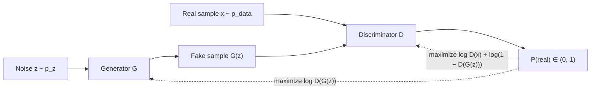

# Generative Adversarial Networks

> **TL;DR:** A GAN pits a generator that fabricates data against a discriminator that detects fakes; trained as adversaries, the generator learns to produce samples the discriminator cannot tell from real data.

---

## Overview

Generative Adversarial Networks (Goodfellow et al., 2014) frame generative modeling as a two-player game rather than a likelihood-maximization problem. A generator maps random noise to synthetic samples; a discriminator scores samples as real or fake; each network improves by exploiting the other's weaknesses. You will learn the minimax objective, why training is notoriously unstable, and the standard tricks that make it workable.

**By the end, you will be able to:**
- Write down the GAN minimax objective and explain every term in it
- Implement the alternating two-network training loop in PyTorch
- Diagnose the classic failure modes — mode collapse, vanishing gradients, non-convergence — and name the standard mitigations

---

## Intuition

Picture a currency counterfeiter and a bank inspector locked in an arms race. The counterfeiter (the **generator**) starts out producing laughably bad notes. The inspector (the **discriminator**) easily spots them and, in doing so, reveals *what gave them away* — wrong paper, blurry ink. The counterfeiter uses that feedback to improve. The inspector, now facing better fakes, must sharpen their detection. Round after round, both improve, until — ideally — the fakes are indistinguishable from real currency and the inspector is reduced to guessing.

Two things make this framing powerful:

1. **The loss function is learned.** Instead of hand-crafting a similarity measure between generated and real data (which is hard for images), the discriminator *is* the measure, and it adapts as the generator improves.
2. **No explicit density.** The generator never writes down a probability distribution; it only learns to *sample* — transform noise into data — which is often all you need.

The catch: an arms race has no referee. Nothing guarantees both players improve in lockstep, and most GAN pathologies come from one player overpowering or outmaneuvering the other.

---

## Details

### Mathematics

Let $p_{\text{data}}$ be the real data distribution and $p_z$ a simple noise prior (e.g., $\mathcal{N}(\mathbf{0}, \mathbf{I})$). The **generator** $G$ maps a noise vector $\mathbf{z} \sim p_z$ to a sample $G(\mathbf{z})$. The **discriminator** $D$ maps a sample $\mathbf{x}$ to a scalar $D(\mathbf{x}) \in (0, 1)$, its estimated probability that $\mathbf{x}$ came from the real data rather than from $G$.

The two networks play a **minimax game** on the value function $V(D, G)$:

$$
\min_G \max_D \; V(D, G) = \mathbb{E}_{\mathbf{x} \sim p_{\text{data}}}\big[\log D(\mathbf{x})\big] + \mathbb{E}_{\mathbf{z} \sim p_z}\big[\log\big(1 - D(G(\mathbf{z}))\big)\big]
$$

- The **discriminator maximizes** $V$: it wants $D(\mathbf{x}) \to 1$ on real data and $D(G(\mathbf{z})) \to 0$ on fakes. This is exactly binary cross-entropy classification with labels real = 1, fake = 0.
- The **generator minimizes** $V$: it can only influence the second term, so it wants $D(G(\mathbf{z})) \to 1$ — fooling the discriminator.

For a fixed $G$, the optimal discriminator is $D^*(\mathbf{x}) = \frac{p_{\text{data}}(\mathbf{x})}{p_{\text{data}}(\mathbf{x}) + p_g(\mathbf{x})}$, where $p_g$ is the distribution of generated samples. Substituting $D^*$ back in shows that the generator is then minimizing (up to constants) the Jensen–Shannon divergence between $p_{\text{data}}$ and $p_g$; the global optimum is $p_g = p_{\text{data}}$, at which point $D^*(\mathbf{x}) = \tfrac{1}{2}$ everywhere — the inspector is guessing.

**The non-saturating generator loss.** Early in training, fakes are obviously fake, so $D(G(\mathbf{z})) \approx 0$ and the generator's term $\log(1 - D(G(\mathbf{z})))$ is nearly flat — its gradient vanishes exactly when the generator most needs learning signal. The standard fix, proposed in the original paper, is to have the generator instead **maximize** $\log D(G(\mathbf{z}))$. Same fixed point, much stronger gradients when the generator is losing.

**Training alternation.** Each iteration: (1) update $D$ on a batch of real and fake samples (fakes held fixed via `detach()`), then (2) update $G$ through the discriminator's judgment of fresh fakes. The two optimizers touch disjoint parameter sets.

**Why training is unstable.**

- **Mode collapse:** the generator finds a few outputs (or one) that reliably fool the current discriminator and maps many different $\mathbf{z}$ to them, ignoring whole modes of $p_{\text{data}}$. The discriminator eventually catches on, the generator jumps to another mode, and the pair can cycle without ever covering the distribution.
- **Vanishing discriminator gradients:** if $D$ becomes too strong too fast, it confidently rejects all fakes; the generator's loss surface flattens and learning stalls (the saturation problem above, which the non-saturating loss mitigates but does not eliminate).
- **Non-convergence:** simultaneous gradient descent on a two-player game is not ordinary loss minimization — the players' updates can orbit or oscillate around an equilibrium instead of settling into it. There is no single scalar loss whose steady decrease certifies progress, which also makes GANs hard to monitor.

**Practical stabilizers (conceptual).** One-sided **label smoothing** (train $D$ against a real-label target of, e.g., 0.9 instead of 1.0) discourages overconfident discriminators; the **non-saturating loss** keeps generator gradients alive; balancing network capacities and learning rates keeps either player from dominating. **DCGAN** (Radford et al.) is the influential convolutional variant: an architecture recipe — strided convolutions instead of pooling, batch normalization in both networks, ReLU/LeakyReLU activations — that made image GANs train far more reliably.

A note on the landscape: for image synthesis, **diffusion models** have largely superseded GANs as the state of the art — they train more stably and cover modes better, at the cost of slower sampling. GANs remain relevant where one-shot, fast generation matters, and the adversarial idea itself recurs across deep learning.

### Python implementation

```python
import torch
import torch.nn as nn

latent_dim = 64

G = nn.Sequential(                      # noise z -> fake sample (784 dims)
    nn.Linear(latent_dim, 256), nn.ReLU(),
    nn.Linear(256, 784), nn.Tanh(),     # outputs in [-1, 1]
)
D = nn.Sequential(                      # sample -> P(real)
    nn.Linear(784, 256), nn.LeakyReLU(0.2),
    nn.Linear(256, 1), nn.Sigmoid(),
)

opt_g = torch.optim.Adam(G.parameters(), lr=2e-4)
opt_d = torch.optim.Adam(D.parameters(), lr=2e-4)
bce = nn.BCELoss()


def train_step(real: torch.Tensor) -> tuple[float, float]:
    """One alternating update. `real` is a batch scaled to [-1, 1]."""
    b = real.size(0)
    ones, zeros = torch.ones(b, 1), torch.zeros(b, 1)

    # --- 1. Discriminator step: real -> 1, fake -> 0 ---
    z = torch.randn(b, latent_dim)
    fake = G(z).detach()                       # do NOT backprop into G here
    loss_d = bce(D(real), ones * 0.9) + bce(D(fake), zeros)  # label smoothing
    opt_d.zero_grad(); loss_d.backward(); opt_d.step()

    # --- 2. Generator step: non-saturating loss, maximize log D(G(z)) ---
    z = torch.randn(b, latent_dim)
    loss_g = bce(D(G(z)), ones)                # pretend fakes are real
    opt_g.zero_grad(); loss_g.backward(); opt_g.step()

    return loss_d.item(), loss_g.item()


real_batch = torch.rand(32, 784) * 2 - 1       # dummy data in [-1, 1]
d_loss, g_loss = train_step(real_batch)
print(f"D loss: {d_loss:.3f} | G loss: {g_loss:.3f}")
```

## Diagram



## Worked Example

**Generating handwritten digits.** You train the skeleton above on 28×28 digit images flattened to 784 dimensions and scaled to $[-1, 1]$ (matching the generator's `Tanh` output).

1. **Epoch 1:** $G(\mathbf{z})$ is structured noise. $D$ separates real from fake almost perfectly; without the non-saturating loss, $G$ would barely learn. With it, $G$ receives a strong gradient toward whatever features $D$ used — digits are darker in the center, so generated blobs migrate centerward.
2. **Epochs 5–20:** stroke-like structures emerge. Watch the losses: $D$ loss near zero for many steps means the discriminator is dominating (weaken it or slow its learning rate); $G$ producing near-identical samples for different $\mathbf{z}$ signals mode collapse — for instance, every sample looks like a "1" because thin vertical strokes fooled $D$ early.
3. **Convergence check:** loss curves alone cannot certify quality (non-convergence caveat), so you inspect grids of samples for fixed noise vectors across epochs and check that varying $\mathbf{z}$ varies the digit identity and style — evidence against mode collapse.

Swapping the MLPs for a DCGAN-style convolutional generator and discriminator is the single biggest quality upgrade for this task.

## Best Practices

- ✅ Use the non-saturating generator loss (train $G$ against real labels) rather than the raw minimax term — it is the default in virtually all implementations.
- ✅ `detach()` generated samples during the discriminator step so its update never flows into the generator.
- ✅ Apply one-sided label smoothing (real target ≈ 0.9) to keep the discriminator from becoming overconfident.
- ✅ Monitor generated samples visually (fixed noise grid per epoch), not just loss curves — GAN losses do not certify sample quality.
- ✅ For images, use a DCGAN-style architecture: strided convolutions, batch normalization, LeakyReLU in the discriminator.

## Common Mistakes

- ⚠️ **Forgetting `detach()` in the discriminator step** — the discriminator's loss then updates generator parameters in the wrong direction. Fix: detach fakes (or use `torch.no_grad()` around generation) for the $D$ update.
- ⚠️ **Interpreting a decreasing generator loss as improving samples** — in a two-player game the loss scale shifts as the opponent changes. Fix: evaluate samples directly.
- ⚠️ **Letting the discriminator win outright** — near-zero $D$ loss starves $G$ of gradient. Fix: reduce $D$ capacity or learning rate, or update $D$ less frequently.
- ⚠️ **Missing mode collapse because averages look fine** — a generator emitting one perfect digit has excellent per-sample realism and terrible coverage. Fix: check sample *diversity* across many noise vectors.
- ⚠️ **Mismatched output range** — a `Tanh` generator with data scaled to $[0, 1]$ (or vice versa) hands the discriminator a trivial tell. Fix: match data preprocessing to the generator's output activation.

## Industry Tips

- 💡 Reach for a GAN when you need *fast, single-forward-pass* generation (real-time image-to-image translation, super-resolution); reach for diffusion models when you need maximum fidelity and mode coverage and can afford iterative sampling.
- 💡 The adversarial *pattern* outlives image GANs: a learned critic providing training signal to another model appears in adversarial robustness, some speech synthesis vocoders, and perceptual-quality losses.
- 💡 Budget engineering time for training babysitting: GAN projects routinely spend more effort on stabilization and evaluation than on the model definition itself.

## Real-World Use Cases

- **Image super-resolution and restoration** — adversarial losses push outputs toward sharp, photorealistic textures instead of blurry MSE-optimal averages.
- **Image-to-image translation** — sketches to photos, day to night, style transfer between domains.
- **Data augmentation** — synthesizing extra training samples for domains where data collection is expensive or restricted.
- **Face and avatar synthesis** — high-fidelity face generation was a signature GAN achievement and drove much of the stabilization research.

## Summary

- A GAN trains a generator and a discriminator as adversaries in the minimax game $\min_G \max_D \mathbb{E}[\log D(\mathbf{x})] + \mathbb{E}[\log(1 - D(G(\mathbf{z})))]$; at the optimum the generator's distribution matches the data and the discriminator outputs $\tfrac{1}{2}$.
- Instability is structural, not incidental: mode collapse, vanishing discriminator gradients, and the non-convergent dynamics of simultaneous two-player optimization all stem from the game formulation.
- The non-saturating loss, label smoothing, capacity balancing, and DCGAN-style architectures make training workable; diffusion models now lead image synthesis, but GANs keep the edge in one-shot sampling speed.

## Practice

- [ ] Exercises: [Module 4 Exercises](../exercises/README.md)
- [ ] Self-check: why does the generator's original loss term $\log(1 - D(G(\mathbf{z})))$ produce vanishing gradients early in training, and how does the non-saturating loss fix this without changing the game's fixed point?

## Further Reading

- 📘 Deep Learning — Goodfellow, Bengio & Courville (https://www.deeplearningbook.org/)
- 📘 Dive into Deep Learning — Zhang, Lipton, Li & Smola (https://d2l.ai/)
- 📄 Goodfellow et al., 2014 — "Generative Adversarial Networks" (https://arxiv.org/abs/1406.2661)
- 📄 [PyTorch documentation](https://pytorch.org/docs/stable/)

## Related

- [Autoencoders](autoencoders.md)
- [Large Language Models](../../07-large-language-models/README.md) — generative modeling at scale

---

## Navigation

- ⬆️ [Lessons](README.md)
- 📚 [Module 4 — Deep Learning](../README.md)
- 🏠 [Knowledge Base Home](../../README.md)
