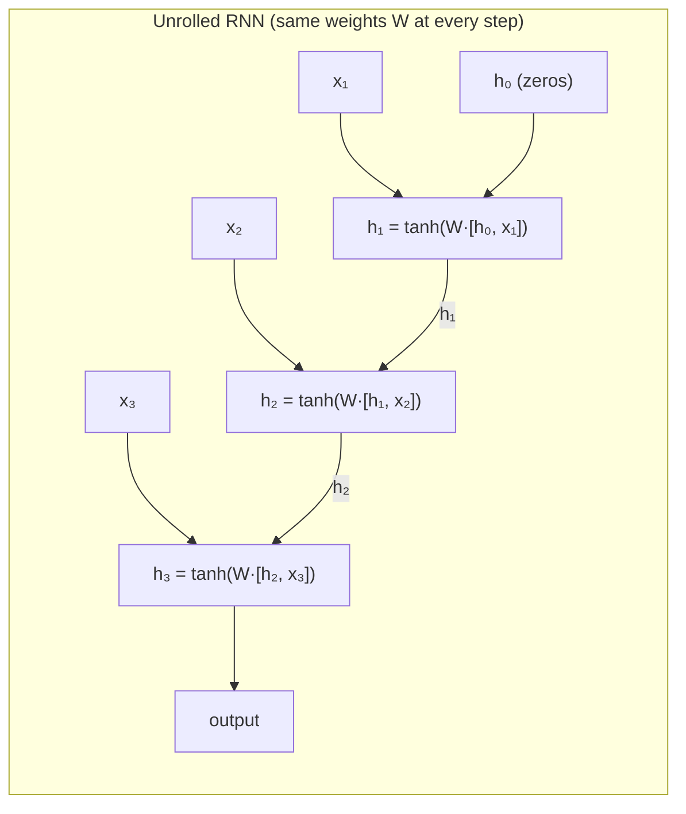

# RNNs, LSTMs and GRUs

> **TL;DR:** RNNs process sequences one step at a time through a shared hidden state, but gradients vanish over long spans; LSTMs and GRUs add learned gates that let information flow unchanged, making long-range memory trainable.

---

## Overview

Text, audio, sensor logs, and stock prices are sequences: order matters and length varies, two things a plain feedforward network cannot handle. Recurrent neural networks (RNNs) solve this with a hidden state that is updated at every time step. This lesson covers the vanilla RNN recurrence, why its gradients vanish or explode, and how the gated LSTM and GRU architectures fix that — ending with correct PyTorch usage.

**By the end, you will be able to:**
- Write down the RNN recurrence and explain how backpropagation through time trains it
- Explain each LSTM gate's role and how the cell state combats vanishing gradients
- Use `nn.RNN`, `nn.LSTM`, and `nn.GRU` in PyTorch with the correct input shapes

---

## Intuition

A feedforward network is a pure function: same input, same output, no memory. That fails for sequences in two ways. First, its input size is fixed, but sentences have 5 words or 50. Second, it has no notion of order — feed it a bag of word vectors and "dog bites man" equals "man bites dog."

An RNN reads a sequence the way you read a sentence: one token at a time, while maintaining a running summary. That summary is the **hidden state** — a vector that acts as the network's working memory. At each step the network combines "what I remembered so far" with "what I just saw" to produce an updated memory. Crucially, the *same* weights are applied at every step (parameter sharing across time, just as CNNs share across space), so one network handles sequences of any length.

The catch: at every step the old memory is squashed through a `tanh` and multiplied by a weight matrix. After 50 steps, the influence of step 1 has been multiplied 50 times — if those factors are slightly less than 1, the signal fades to nothing (vanishing gradients); if slightly more, it blows up (exploding gradients). Plain RNNs therefore remember only a short window.

The **LSTM** fixes this with a conveyor belt: a separate **cell state** that runs through time almost untouched, plus **gates** — small learned switches between 0 and 1 — that control what gets removed from the belt, what gets added, and what gets read off it. Because information can ride the belt without repeated squashing, gradients survive across long spans. The **GRU** is a streamlined version: two gates instead of three, no separate cell state, similar behavior in practice.

---

## Details

### Mathematics

**Vanilla RNN.** At each time step $t$, the hidden state $\mathbf{h}_t \in \mathbb{R}^d$ is computed from the previous state and the current input $\mathbf{x}_t \in \mathbb{R}^m$:

$$
\mathbf{h}_t = \tanh(W_h \mathbf{h}_{t-1} + W_x \mathbf{x}_t + \mathbf{b})
$$

where $W_h \in \mathbb{R}^{d \times d}$ is the recurrent (hidden-to-hidden) weight matrix, $W_x \in \mathbb{R}^{d \times m}$ maps the input, and $\mathbf{b} \in \mathbb{R}^d$ is a bias. $\mathbf{h}_0$ is typically zeros. An output layer (e.g. $\mathbf{y}_t = W_y \mathbf{h}_t$) can be read out at each step (sequence labeling) or only at the last step (sequence classification). All weights are shared across time steps.

**Backpropagation through time (BPTT).** Training unrolls the recurrence over the sequence and applies ordinary backpropagation to the unrolled graph. The gradient of the loss with respect to an early hidden state contains a product of Jacobians:

$$
\frac{\partial \mathbf{h}_T}{\partial \mathbf{h}_t} = \prod_{i=t+1}^{T} \frac{\partial \mathbf{h}_i}{\partial \mathbf{h}_{i-1}}, \qquad \frac{\partial \mathbf{h}_i}{\partial \mathbf{h}_{i-1}} = \mathrm{diag}\!\left(1 - \mathbf{h}_i^2\right) W_h
$$

If the norms of these Jacobians are typically below 1, the product shrinks exponentially in $T - t$ (**vanishing gradients**: the network cannot learn long-range dependencies); if above 1, it grows exponentially (**exploding gradients**: training diverges). Exploding gradients are handled by gradient clipping; vanishing gradients require an architectural fix.

**LSTM.** The long short-term memory network (Hochreiter & Schmidhuber, 1997) maintains a **cell state** $\mathbf{c}_t$ alongside $\mathbf{h}_t$, regulated by three gates, each a sigmoid ($\sigma$, output in $(0,1)$) of the same inputs:

$$
\begin{aligned}
\mathbf{f}_t &= \sigma(W_f [\mathbf{h}_{t-1}, \mathbf{x}_t] + \mathbf{b}_f) && \text{forget gate: what to erase from the cell} \\
\mathbf{i}_t &= \sigma(W_i [\mathbf{h}_{t-1}, \mathbf{x}_t] + \mathbf{b}_i) && \text{input gate: what new information to write} \\
\tilde{\mathbf{c}}_t &= \tanh(W_c [\mathbf{h}_{t-1}, \mathbf{x}_t] + \mathbf{b}_c) && \text{candidate values to write} \\
\mathbf{c}_t &= \mathbf{f}_t \odot \mathbf{c}_{t-1} + \mathbf{i}_t \odot \tilde{\mathbf{c}}_t && \text{cell update} \\
\mathbf{o}_t &= \sigma(W_o [\mathbf{h}_{t-1}, \mathbf{x}_t] + \mathbf{b}_o) && \text{output gate: what to expose} \\
\mathbf{h}_t &= \mathbf{o}_t \odot \tanh(\mathbf{c}_t)
\end{aligned}
$$

Here $[\mathbf{h}_{t-1}, \mathbf{x}_t]$ is the concatenation of the previous hidden state and current input, and $\odot$ is elementwise multiplication. The key is the cell update: it is **additive**. When the forget gate is near 1 and the input gate near 0, $\mathbf{c}_t \approx \mathbf{c}_{t-1}$ — information (and gradient) passes through unchanged, so long-range dependencies become learnable.

**GRU.** The gated recurrent unit (Cho et al., 2014) merges the cell and hidden state and uses two gates:

$$
\begin{aligned}
\mathbf{z}_t &= \sigma(W_z [\mathbf{h}_{t-1}, \mathbf{x}_t] + \mathbf{b}_z) && \text{update gate: keep old state vs. take new} \\
\mathbf{r}_t &= \sigma(W_r [\mathbf{h}_{t-1}, \mathbf{x}_t] + \mathbf{b}_r) && \text{reset gate: how much past to use for the candidate} \\
\tilde{\mathbf{h}}_t &= \tanh(W_x \mathbf{x}_t + W_h (\mathbf{r}_t \odot \mathbf{h}_{t-1}) + \mathbf{b}) \\
\mathbf{h}_t &= (1 - \mathbf{z}_t) \odot \mathbf{h}_{t-1} + \mathbf{z}_t \odot \tilde{\mathbf{h}}_t
\end{aligned}
$$

Fewer gates means fewer parameters than an LSTM at the same hidden size; the two often perform comparably, so the choice is usually empirical.

**Variants.** A **bidirectional** RNN runs one pass left-to-right and another right-to-left and concatenates the hidden states, so each position sees both past and future context (useful for tagging, not for autoregressive generation). **Stacked** RNNs feed one layer's hidden-state sequence as the next layer's input sequence for deeper representations.

### Python implementation

```python
import torch
from torch import nn


class SentimentGRU(nn.Module):
    """Many-to-one sequence classifier: embed -> GRU -> last hidden state -> logits."""

    def __init__(self, vocab_size: int, embed_dim: int = 64,
                 hidden_dim: int = 128, num_classes: int = 2) -> None:
        super().__init__()
        self.embedding = nn.Embedding(vocab_size, embed_dim)
        self.gru = nn.GRU(input_size=embed_dim, hidden_size=hidden_dim,
                          num_layers=1, batch_first=True)
        self.head = nn.Linear(hidden_dim, num_classes)

    def forward(self, token_ids: torch.Tensor) -> torch.Tensor:
        # token_ids: (batch, seq_len) -> embedded: (batch, seq_len, embed_dim)
        embedded = self.embedding(token_ids)
        # output: (batch, seq_len, hidden_dim) — hidden state at every step
        # h_n:    (num_layers, batch, hidden_dim) — final hidden state per layer
        output, h_n = self.gru(embedded)
        return self.head(h_n[-1])          # classify from the last layer's final state


# The three recurrent modules share the same interface. With batch_first=True,
# inputs are (batch, seq_len, features); default is (seq_len, batch, features).
x = torch.randn(4, 20, 32)                  # batch=4, seq_len=20, features=32
rnn = nn.RNN(input_size=32, hidden_size=64, batch_first=True)
lstm = nn.LSTM(input_size=32, hidden_size=64, batch_first=True)
gru = nn.GRU(input_size=32, hidden_size=64, batch_first=True)

out, h_n = rnn(x)                # h_n: (1, 4, 64)
out, (h_n, c_n) = lstm(x)        # LSTM also returns the cell state c_n
out, h_n = gru(x)
print(out.shape)                 # torch.Size([4, 20, 64])

model = SentimentGRU(vocab_size=10_000)
logits = model(torch.randint(0, 10_000, (4, 20)))
print(logits.shape)              # torch.Size([4, 2])
```

Note the LSTM's extra return value: it yields `(output, (h_n, c_n))` because it tracks both hidden and cell state, while `nn.RNN` and `nn.GRU` return `(output, h_n)`.

## Diagram



## Worked Example

Classify the sentiment of the 20-token review batch from the code above, step by step:

1. **Tokenize:** each review becomes a tensor of token IDs, padded to length 20 — shape `(4, 20)`.
2. **Embed:** `nn.Embedding` maps each ID to a 64-dim vector — shape `(4, 20, 64)`.
3. **Recur:** the GRU starts from $\mathbf{h}_0 = \mathbf{0}$ and applies its gated update 20 times. At the token "not", the update gate can swing toward the new candidate (rewriting the sentiment summary); over neutral filler words, it can stay near 0 and carry the state through unchanged.
4. **Read out:** `h_n[-1]` is the final hidden state, shape `(4, 128)` — a fixed-size summary of each variable-length review.
5. **Classify:** the linear head maps it to 2 logits; train end-to-end with `nn.CrossEntropyLoss`.

Why not a vanilla RNN here? If the decisive phrase ("would not recommend") appears at token 2 of a 200-token review, its gradient must survive ~198 multiplications by $\mathrm{diag}(1-\mathbf{h}^2)W_h$ — it effectively vanishes. The GRU's additive, gated update path lets that early signal persist.

## Best Practices

- ✅ Reach for `nn.LSTM` or `nn.GRU` by default — plain `nn.RNN` is mainly pedagogical.
- ✅ Clip gradients (`torch.nn.utils.clip_grad_norm_`) — exploding gradients are common in recurrent training.
- ✅ Set `batch_first=True` and keep every tensor `(batch, seq, features)` to avoid silent shape bugs.
- ✅ Use `nn.utils.rnn.pack_padded_sequence` for variable-length batches so padding tokens don't pollute the final hidden state.
- ✅ Use bidirectional RNNs when the full sequence is available at once (tagging, classification); never for step-by-step generation.

## Common Mistakes

- ⚠️ **Wrong tensor layout.** Forgetting `batch_first=True` means PyTorch reads your `(batch, seq, feat)` tensor as `(seq, batch, feat)` — no error, just garbage. Fix: set the flag and assert shapes early.
- ⚠️ **Unpacking the LSTM return value like a GRU.** `out, h_n = lstm(x)` silently binds `h_n` to the tuple `(h_n, c_n)`. Fix: `out, (h_n, c_n) = lstm(x)`.
- ⚠️ **Classifying from `output[:, -1]` with padded sequences.** For padded batches the last time step is padding, not the last real token. Fix: use packed sequences or index each sequence at its true length.
- ⚠️ **Expecting a vanilla RNN to learn long dependencies.** No amount of training fixes vanishing gradients over hundreds of steps. Fix: use gated units, and consider truncated BPTT for very long sequences.

## Industry Tips

- 💡 Be honest about the landscape: transformers have largely superseded RNNs for NLP because they process all positions in parallel and handle long-range dependencies via attention. Learn RNNs as a foundation, not as the default NLP tool.
- 💡 RNNs still earn their keep where transformers are awkward: streaming and online inference (constant memory per step, no growing context), low-latency on-device models, and modest-sized time-series tasks.
- 💡 GRU vs. LSTM is rarely worth agonizing over — try the GRU first (fewer parameters, faster), switch if validation metrics disagree.
- 💡 The ideas survive: gating lives on in modern architectures, and recent recurrent state-space models revive the "constant memory per step" advantage at scale.

## Real-World Use Cases

- Time-series forecasting and anomaly detection on sensor, telemetry, and financial data
- Streaming speech processing where audio arrives frame by frame
- Lightweight on-device text classification and next-keystroke prediction
- Sequence labeling (NER, part-of-speech) in resource-constrained settings
- Historically: machine translation and language modeling — the encoder-decoder RNNs whose limitations motivated attention and the transformer

---

## Summary

- An RNN applies one shared update, $\mathbf{h}_t = \tanh(W_h \mathbf{h}_{t-1} + W_x \mathbf{x}_t + \mathbf{b})$, at every step, giving it memory and variable-length inputs — but BPTT's repeated Jacobian products make gradients vanish or explode over long spans.
- LSTMs add an additively updated cell state controlled by forget, input, and output gates; GRUs achieve similar gating with reset and update gates and fewer parameters.
- In PyTorch, `nn.RNN`/`nn.LSTM`/`nn.GRU` take `(batch, seq, features)` with `batch_first=True`; the LSTM additionally returns its cell state.

## Practice

- [ ] Exercises: [Module 4 Exercises](../exercises/README.md)
- [ ] Self-check: In the LSTM cell update $\mathbf{c}_t = \mathbf{f}_t \odot \mathbf{c}_{t-1} + \mathbf{i}_t \odot \tilde{\mathbf{c}}_t$, what gate configuration preserves a memory unchanged for many steps, and why does that help gradients?

## Further Reading

- 📘 Deep Learning — Goodfellow, Bengio & Courville (https://www.deeplearningbook.org/)
- 📘 Dive into Deep Learning — Zhang, Lipton, Li & Smola (https://d2l.ai/)
- 📄 [PyTorch documentation](https://pytorch.org/docs/stable/)
- 🌐 Stanford CS231n notes (https://cs231n.github.io/)
- 🎥 StatQuest with Josh Starmer (https://www.youtube.com/@statquest)

## Related

- [Convolutional Neural Networks](cnn.md)
- [NLP](../../05-nlp/README.md) — where sequence models are applied to language
- [Transformers](../../06-transformers/README.md) — the attention-based successor to RNNs for most NLP tasks

---

## Navigation

- ⬆️ [Lessons](README.md)
- 📚 [Module 4 — Deep Learning](../README.md)
- 🏠 [Knowledge Base Home](../../README.md)
