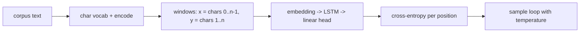

# Mini Project: Character-Level Text Generator

> **What you'll build:** An LSTM that learns to write text character by
> character from any corpus you feed it — the classic sequence-modeling project,
> and a direct ancestor of how LLMs generate tokens.

---

## Objective

Next-character prediction is the smallest possible version of what language
models do. Building it teaches sequence batching, hidden-state handling, and
sampling with temperature — concepts that transfer directly to
[LLMs](../../07-large-language-models/README.md).

## Learning Goals

- Prepare sequential training data (input/target shifted by one).
- Train an LSTM with proper hidden-state and shape handling.
- Generate text with temperature-controlled sampling.

---

## Prerequisites

- [RNNs, LSTMs and GRUs](../lessons/rnn-lstm-gru.md), [PyTorch Essentials](../lessons/pytorch.md)
- Any plain-text corpus (a public-domain book works well).

## Architecture

---

## Steps

### 1. Data
Build the character vocabulary; encode the corpus as integers; cut into
fixed-length windows where the target is the input shifted by one character.

### 2. Model
`nn.Embedding → nn.LSTM (1–2 layers) → nn.Linear(vocab)`. Handle `(h, c)`
explicitly; use `batch_first=True`.

### 3. Train
Cross-entropy over all positions (flatten batch × seq). Clip gradients
(`clip_grad_norm_`) — recurrent nets are exactly where exploding gradients bite.

### 4. Generate
Write a sampling loop: seed string → predict next-char distribution → sample with
**temperature** (divide logits by $T$) → append → repeat. Compare $T=0.5, 1.0, 1.5$.

### 5. Observe
Save samples at several checkpoints (untrained, early, late) to show structure
emerging — words, punctuation, formatting.

---

## Deliverables

- [ ] Data pipeline, model, and training code with gradient clipping.
- [ ] Loss curve and generated samples at multiple checkpoints and temperatures.
- [ ] `README.md` explaining temperature's effect and the shift-by-one setup.

## Success Criteria

Generated text progresses from noise to clearly corpus-like structure, and your
temperature comparison correctly explains the randomness/coherence trade-off.

---

## Extensions (Optional)

- 🚀 Swap LSTM → GRU and compare convergence.
- 🚀 Add top-k sampling and compare against pure temperature sampling.

## Further Reading

- Andrej Karpathy (https://www.youtube.com/@AndrejKarpathy) — builds language models from scratch.
- Dive into Deep Learning — Zhang, Lipton, Li & Smola (https://d2l.ai/)

---

## Navigation

- ⬆️ [Module 4 Mini Projects](README.md)
- 📚 [Module 4 — Deep Learning](../README.md)
- 🏠 [Knowledge Base Home](../../README.md)
