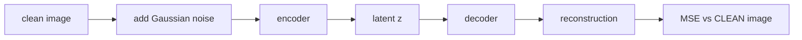

# Mini Project: Denoising Autoencoder

> **What you'll build:** An autoencoder trained to reconstruct clean images from
> noisy inputs — then repurposed, unchanged, as a simple anomaly detector.

---

## Objective

Autoencoders click when you watch one clean up an image it has never seen. You'll
corrupt images with noise, train the network to restore them, and then exploit
the reconstruction error as an anomaly signal — two real use cases from one model.

## Learning Goals

- Build an encoder–decoder in PyTorch and train with a reconstruction loss.
- Understand the bottleneck's role by varying its size.
- Use reconstruction error for anomaly detection.

---

## Prerequisites

- [Autoencoders](../lessons/autoencoders.md), [PyTorch Essentials](../lessons/pytorch.md)
- `torchvision` for MNIST/FashionMNIST.

## Architecture

The key detail: the loss compares the reconstruction to the **clean** image, not
the noisy input — that's what forces denoising.

---

## Steps

### 1. Data + corruption
Load MNIST; write a transform that adds Gaussian noise (clamp to [0,1]).

### 2. Model
Encoder (conv or dense) → small latent → decoder with sigmoid output.

### 3. Train
MSE (or BCE) between output and the clean image; visualize noisy / denoised /
clean triplets each few epochs.

### 4. Probe the bottleneck
Train with latent sizes (e.g. 8, 32, 128) and compare reconstruction quality —
the compression/fidelity trade-off made visible.

### 5. Anomaly detection
Feed a *different* dataset (e.g. FashionMNIST into the MNIST-trained model) and
show its reconstruction error distribution separates from in-distribution error;
pick a threshold and report simple precision/recall.

---

## Deliverables

- [ ] Training code + noisy/denoised/clean image grids.
- [ ] Bottleneck-size comparison.
- [ ] Anomaly-detection histogram + threshold results.
- [ ] `README.md` with results and interpretation.

## Success Criteria

Denoised outputs are visibly cleaner than inputs; anomaly errors are clearly
separable; the write-up explains both through the lens of the learned manifold.

---

## Extensions (Optional)

- 🚀 Swap in a variational autoencoder and sample new digits from the prior.
- 🚀 Try structured corruption (occlusion blocks) instead of Gaussian noise.

## Further Reading

- Deep Learning — Goodfellow, Bengio & Courville (https://www.deeplearningbook.org/)
- Related: [Dimensionality Reduction](../../03-machine-learning/lessons/dimensionality-reduction.md)

---

## Navigation

- ⬆️ [Module 4 Mini Projects](README.md)
- 📚 [Module 4 — Deep Learning](../README.md)
- 🏠 [Knowledge Base Home](../../README.md)
