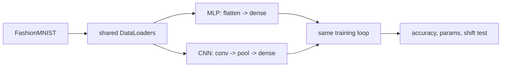

# Mini Project: MLP vs CNN Bake-Off

> **What you'll build:** A controlled comparison of an MLP and a CNN on the same
> image dataset — same budget, same loop — showing how architectural inductive
> bias earns accuracy.

---

## Objective

"CNNs are better for images" is a claim; this project makes it a measurement.
You'll hold everything constant except the architecture and compare accuracy,
parameter count, and robustness to shifted inputs.

## Learning Goals

- Implement both architectures cleanly in PyTorch.
- Run fair comparisons (same data, epochs, optimizer, seeds).
- Connect results to parameter sharing and locality.

---

## Prerequisites

- [CNNs](../lessons/cnn.md), [PyTorch Essentials](../lessons/pytorch.md)
- `torchvision` for FashionMNIST.

## Architecture

---

## Steps

### 1. Data
Load FashionMNIST with normalization; fixed train/val/test splits and seeds.

### 2. Models
Build an MLP and a small CNN with **roughly comparable parameter counts**
(report both via a parameter-counting helper).

### 3. Train identically
Same optimizer, schedule, epochs, and loop for both. Log curves.

### 4. Evaluate
Test accuracy for both; then a **translation-robustness probe** — shift test
images by a few pixels (padding + crop) and measure the accuracy drop of each.

### 5. Write up
Explain the gap using parameter sharing and locality; note where the MLP holds up.

---

## Deliverables

- [ ] Both models + shared training code.
- [ ] Comparison table: params, test accuracy, shifted-input accuracy.
- [ ] Training curves and a short analysis.

## Success Criteria

The comparison is fair (documented identical budgets), reproducible, and the
write-up correctly attributes the difference to architectural bias — not luck.

---

## Extensions (Optional)

- 🚀 Add a third contender: the CNN without pooling (stride-2 convs).
- 🚀 Repeat on CIFAR-10 and see the gap widen.

## Further Reading

- Stanford CS231n notes (https://cs231n.github.io/)
- Dive into Deep Learning — Zhang, Lipton, Li & Smola (https://d2l.ai/)

---

## Navigation

- ⬆️ [Module 4 Mini Projects](README.md)
- 📚 [Module 4 — Deep Learning](../README.md)
- 🏠 [Knowledge Base Home](../../README.md)
