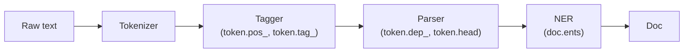

# POS Tagging and Named Entity Recognition

> **TL;DR:** POS tagging labels every token with its grammatical role (noun, verb, adjective, …); NER finds and classifies real-world entities (people, organizations, places, dates). Both are sequence-labeling tasks, and spaCy gives you strong pretrained models for each in a few lines of code.

---

## Overview

Tokenized text is still just a list of strings — it carries no grammar and no meaning. POS tagging and NER are the first two steps that add *linguistic structure*: which words are doing what, and which spans refer to real-world things. They power search, information extraction, de-identification of sensitive data, and feature engineering for downstream models.

**By the end, you will be able to:**
- Explain what POS tags are, why word ambiguity makes tagging non-trivial, and how statistical taggers resolve it
- Describe standard entity types and hand-annotate a sentence in the BIO scheme
- Run POS tagging and NER with spaCy, evaluate NER with entity-level F1, and decide between rules (`EntityRuler`) and fine-tuning for custom entities

---

## Intuition

Think of a sentence as a stage play. POS tagging assigns each word a *role in the grammar of the play*: this word is an actor (noun), this one is an action (verb), this one describes an actor (adjective). NER goes further and asks: which of these actors are *named characters* — and is each a person, a company, a city, or a date?

The catch is that words moonlight in multiple roles. "Book" is a noun in *read a book* but a verb in *book a flight*. You cannot tag a word by looking it up in a dictionary; you must look at its neighbors. That single observation — **the tag of a word depends on context** — is why both tasks are framed as *sequence labeling*: assign a label to every token, using the whole sentence as evidence.

---

## Details

### Part-of-speech tags

A POS tag records a token's grammatical category. spaCy exposes two granularities:

- **Coarse tags** (`token.pos_`) — the Universal POS set: `NOUN`, `VERB`, `ADJ`, `ADV`, `PRON`, `ADP` (preposition), `DET`, `PROPN` (proper noun), and a few more.
- **Fine-grained tags** (`token.tag_`) — treebank-specific tags that add detail, e.g. for English: `NN` (singular noun), `NNS` (plural noun), `VBD` (past-tense verb), `VBZ` (3rd-person-singular present verb), `JJ` (adjective).

Why bother tagging at all?

- **Disambiguation** — "book" (NOUN) vs "book" (VERB) changes what a sentence means and what a lemmatizer should do with the word (`books/NOUN → book`, `booked/VERB → book`).
- **Feature extraction** — "count of adjectives", "does a proper noun follow a title word", "extract only noun phrases" are cheap, interpretable features for classifiers and rule systems.
- **Downstream prerequisites** — lemmatization, dependency parsing, and many extraction rules consume POS tags as input.

### Ambiguity and how taggers resolve it

Compare:

- *"Please **book** a flight."* — "book" follows "please" and precedes a determiner + noun; the context says VERB.
- *"I read a good **book**."* — "book" follows a determiner and an adjective; the context says NOUN.

A large fraction of English word types are ambiguous like this, and ambiguous types tend to be the *frequent* ones. Modern taggers are **statistical or neural sequence labelers**: they are trained on hand-annotated corpora (treebanks) to predict, for each token, the tag with the highest probability *given the surrounding words and predicted tags*. Classic approaches used Hidden Markov Models and conditional models over tag sequences; current systems (including spaCy's) use neural networks over word and subword representations. The unifying idea is the same: score whole label sequences in context rather than tagging words in isolation. See Jurafsky & Martin (chapter on sequence labeling) for the formal treatment.

### Named entity recognition

NER locates spans of text that name real-world entities and assigns each a type. Common types in spaCy's English models (OntoNotes-based):

| Type | Meaning | Example |
|------|---------|---------|
| `PERSON` | People, incl. fictional | *Ada Lovelace* |
| `ORG` | Companies, agencies, teams | *Anthropic*, *the UN* |
| `GPE` | Geopolitical entity: countries, cities, states | *India*, *Berlin* |
| `LOC` | Non-GPE locations | *the Alps* |
| `DATE` / `TIME` | Absolute or relative dates and times | *last Tuesday* |
| `MONEY` / `PERCENT` | Monetary values, percentages | *$3.5 million*, *20%* |
| `PRODUCT`, `EVENT`, `NORP` | Products, named events, nationalities/groups | *iPhone*, *World Cup*, *French* |

Unlike POS tagging (one label per token), entities are **spans** that may cover several tokens, so NER needs a way to encode span boundaries as per-token labels.

### The BIO tagging scheme

BIO converts span labeling into token labeling: **B-**`TYPE` marks the *beginning* of an entity, **I-**`TYPE` marks a token *inside* (continuing) that entity, and **O** marks a token *outside* any entity. Worked sentence:

```text
Tim       B-PERSON
Cook      I-PERSON
visited   O
New       B-GPE
Delhi     I-GPE
in        O
September B-DATE
.         O
```

The B/I distinction matters when entities are adjacent: in "*Apple Google rivalry*", tagging both companies `I-ORG` would merge them into one entity; `B-ORG B-ORG` keeps them separate.

Two honest caveats:

- **Nested entities** — in "*Bank of England Governor*", *England* (GPE) sits inside *Bank of England* (ORG). Flat BIO tagging can represent only one layer; standard pipelines keep the outermost entity.
- **Ambiguous entities** — "*Washington*" may be a PERSON, GPE, or ORG; only context decides. This is why NER, like POS tagging, is learned as contextual sequence labeling.

### Evaluating NER

NER is scored at the **entity level**, conventionally with **exact match**: a predicted entity counts as correct only if *both* its span boundaries *and* its type match the gold annotation.

- **Precision** = correct predicted entities / all predicted entities
- **Recall** = correct predicted entities / all gold entities
- **F1** = harmonic mean of the two

Exact match is strict: predicting "*New Delhi in*" instead of "*New Delhi*" scores zero for that entity — a boundary error and a miss. Report per-type F1 too; models are usually much better on `PERSON`/`GPE` than on rarer types.

### Custom entities: rules vs fine-tuning

You will often need entity types the pretrained model does not know (SKUs, drug names, internal project codenames).

- **Rules first.** If the entities follow patterns or come from a known vocabulary, add a [spaCy `EntityRuler`](https://spacy.io/) with token patterns or phrase lists. Deterministic, cheap, no training data needed.
- **Fine-tune when rules break down.** If entities are open-ended and context-dependent (new company names, misspelled drug names), annotate a few hundred to a few thousand examples and train/fine-tune a statistical NER component. Rules and a learned model can coexist in one pipeline.

### Python: POS tagging and NER with spaCy

```bash
pip install spacy
python -m spacy download en_core_web_sm
```

```python
import spacy
from spacy.tokens import Doc

nlp = spacy.load("en_core_web_sm")

def analyze(text: str) -> Doc:
    """Run the full spaCy pipeline and print tags and entities."""
    doc = nlp(text)

    print(f"{'TOKEN':<12} {'POS':<6} {'TAG':<5} EXPLANATION")
    for token in doc:
        print(f"{token.text:<12} {token.pos_:<6} {token.tag_:<5} "
              f"{spacy.explain(token.tag_)}")

    print("\nEntities:")
    for ent in doc.ents:
        print(f"  {ent.text!r:<20} {ent.label_:<8} {spacy.explain(ent.label_)}")
    return doc

analyze("Please book a flight to New Delhi for next Tuesday.")
```

To render entities visually (in a notebook or browser):

```python
from spacy import displacy

doc = nlp("Tim Cook visited New Delhi in September.")
displacy.render(doc, style="ent")   # use displacy.serve(...) outside notebooks
```

## Diagram

The spaCy pipeline applies components in order; each enriches the shared `Doc` object.



## Worked Example

Annotate a realistic sentence by hand, then verify with spaCy.

Sentence: *"Apple acquired the London startup for $2 billion in March 2024."*

BIO annotation:

```text
Apple    B-ORG      | the entity is the company, not the fruit — context decides
acquired O
the      O
London   B-GPE
startup  O
for      O
$        B-MONEY
2        I-MONEY
billion  I-MONEY
in       O
March    B-DATE
2024     I-DATE
.        O
```

```python
import spacy

nlp = spacy.load("en_core_web_sm")
doc = nlp("Apple acquired the London startup for $2 billion in March 2024.")

for ent in doc.ents:
    print(ent.text, "->", ent.label_)
# Expected entities: Apple/ORG, London/GPE, $2 billion/MONEY, March 2024/DATE
```

Note how "Apple" is tagged `ORG` here because "acquired" makes the company reading overwhelmingly likely — the same string in "*apple pie*" would be tagged nothing at all.

## Best Practices

- ✅ Run NER on **raw, properly cased text** — lowercasing and aggressive preprocessing destroy the capitalization cues NER models rely on.
- ✅ Use `spacy.explain("NNP")` / `spacy.explain("GPE")` whenever a tag is unfamiliar instead of guessing.
- ✅ Evaluate with entity-level F1 on a held-out annotated sample of *your* data before trusting a pretrained model in production.
- ✅ Disable pipeline components you do not need (`nlp.pipe(..., disable=["parser"])`) for large-scale processing speedups.

## Common Mistakes

- ⚠️ **Judging NER by token accuracy.** Most tokens are `O`, so token accuracy looks great even when the model misses entities — use entity-level precision/recall/F1 instead.
- ⚠️ **Assuming pretrained types cover your domain.** `en_core_web_sm` knows `ORG` and `GPE`, not `DRUG` or `SKU` — add an `EntityRuler` or fine-tune for custom types.
- ⚠️ **Treating tagger output as ground truth.** Taggers err on informal text, headlines, and domain jargon; sample and inspect outputs before building rules on top of them.
- ⚠️ **Writing `I-TYPE` without a preceding `B-TYPE`** when hand-annotating BIO data — most training tools reject or silently mangle such sequences.

## Industry Tips

- 💡 De-identification (scrubbing `PERSON`, `DATE`, locations from medical or legal text) is one of the most common commercial NER applications — and one where recall failures carry real compliance risk, so keep a human review step.
- 💡 A phrase-list `EntityRuler` covering your product catalog often beats weeks of annotation effort; start there and only fine-tune once you have measured where rules fail.
- 💡 For high-throughput pipelines, batch documents with `nlp.pipe(texts)` rather than calling `nlp(text)` in a loop.

## Real-World Use Cases

- Extracting companies, amounts, and dates from financial news for market-monitoring systems
- Anonymizing personal data (names, dates, locations) in medical records before analysis
- Powering "people, places, organizations" facets in enterprise search
- Resume parsing: pulling out names, employers, and dates of employment

---

## Summary

- POS tagging assigns a grammatical category per token; because words like "book" are ambiguous, taggers are trained sequence labelers that use context, not dictionaries.
- NER finds typed entity spans (`PERSON`, `ORG`, `GPE`, `DATE`, `MONEY`, …); the BIO scheme encodes spans as per-token B-/I-/O labels, and evaluation uses exact-match entity-level F1.
- spaCy provides both in one pipeline (`token.pos_`, `doc.ents`); extend it with `EntityRuler` rules for pattern-like custom entities and fine-tune only when rules cannot cope.

## Practice

- [ ] Exercises: [Module 5 Exercises](../exercises/README.md)
- [ ] Self-check: Hand-annotate "*Sundar Pichai flew to San Francisco on 3 May*" in BIO format. Why must "Pichai" be `I-PERSON` and not `B-PERSON`?

## Further Reading

- 📘 Speech and Language Processing — Jurafsky & Martin (https://web.stanford.edu/~jurafsky/slp3/)
- 📄 [spaCy documentation](https://spacy.io/)

## Related

- [Dependency Parsing](dependency-parsing.md)
- [Text Classification](text-classification.md)
- [Attention and Token Representations — Module 6 Transformers](../../06-transformers/README.md)

---

## Navigation

- ⬆️ [Lessons](README.md)
- 📚 [Module 5 — Natural Language Processing](../README.md)
- 🏠 [Knowledge Base Home](../../README.md)
