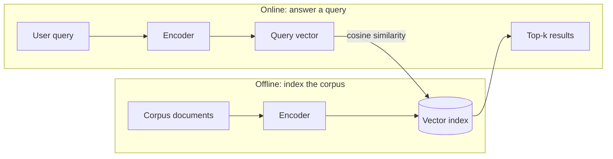

# Sentence Embeddings and Semantic Similarity

> **TL;DR:** Sentence embedding models map an entire sentence or paragraph to one dense vector so that cosine similarity between vectors tracks similarity in meaning. Sentence-BERT made this practical, and the `sentence-transformers` library makes it three lines of Python — this is the machinery behind semantic search and RAG retrieval.

---

## Overview

Word embeddings give you one vector per word, but most tasks compare *texts*: is this support ticket a duplicate of that one? Which document answers this question? This lesson explains why naive averaging of word vectors falls short, how Sentence-BERT trains encoders whose output vectors can be compared directly with cosine similarity, and how to build semantic search with the `sentence-transformers` library.

**By the end, you will be able to:**
- Explain why averaged word vectors and raw BERT outputs are weak sentence representations, and how Sentence-BERT's siamese training fixes this
- Encode texts with `sentence-transformers` and compute meaningful cosine similarities
- Implement top-k semantic search over a corpus and state the practical trade-offs (model size, sequence length, normalization)

---

## Intuition

Averaging word vectors is like describing a movie by averaging the colors of its frames: you get *something*, but negation, word order, and emphasis vanish. "The food was good, not the service" and "The service was good, not the food" average to nearly identical vectors.

What you actually want is a function that maps any text to a point in space such that **paraphrases land close together and unrelated texts land far apart** — a "meaning GPS coordinate". Then comparing two texts is just measuring the angle between two vectors, and searching a million documents is finding nearest neighbors in that space.

The catch: an off-the-shelf BERT produces contextual vectors for *tokens*, not a comparison-ready vector for the *sentence*. Reimers & Gurevych (2019) showed that naively pooling BERT outputs performs poorly for similarity, and that a small amount of targeted training — showing the model pairs of sentences and teaching it to place similar ones together — transforms it into an excellent sentence encoder. That work is Sentence-BERT (SBERT), and its descendants power the `sentence-transformers` library.

---

## Details

### From word vectors to sentence vectors

The baseline: given word vectors $\vec{v}_{w_1}, \dots, \vec{v}_{w_n}$ for a sentence of $n$ words, take the mean $\frac{1}{n}\sum_i \vec{v}_{w_i}$. This is a real (and fast) baseline, but it is a bag-of-words at heart: order-insensitive, dominated by frequent words, blind to negation and syntax.

### Sentence-BERT: siamese networks with a similarity objective

Sentence-BERT (Reimers & Gurevych, 2019) fine-tunes a pretrained transformer inside a **siamese architecture**: the *same* encoder (shared weights) processes sentence $a$ and sentence $b$ independently, each output is pooled (typically the mean over token vectors) into fixed-size embeddings $\vec{u}$ and $\vec{v}$, and a training objective pushes embeddings of related sentences together. Training pairs come from labeled datasets such as natural language inference (entailment pairs should be close, contradictions far).

Because the objective directly shapes the geometry, **cosine similarity between the embeddings becomes meaningful**:

$$
\text{sim}(\vec{u}, \vec{v}) = \cos\theta = \frac{\vec{u} \cdot \vec{v}}{\lVert \vec{u} \rVert \, \lVert \vec{v} \rVert} \in [-1, 1]
$$

where $\vec{u} \cdot \vec{v}$ is the dot product and $\lVert \cdot \rVert$ the Euclidean norm. Crucially, each sentence is encoded *once*, independently. Comparing a query against $N$ pre-encoded documents costs $N$ cheap vector operations instead of $N$ full transformer passes — this is what makes search over large corpora feasible.

### Using sentence-transformers

`all-MiniLM-L6-v2` is a small, widely used general-purpose model that outputs 384-dimensional vectors (see the Sentence-Transformers docs for the model catalog).

```python
from sentence_transformers import SentenceTransformer, util

model = SentenceTransformer("all-MiniLM-L6-v2")

sentences: list[str] = [
    "A man is eating food.",
    "A man is eating a piece of bread.",
    "The girl is carrying a baby.",
    "A cheetah is running behind its prey.",
]

embeddings = model.encode(sentences, convert_to_tensor=True)
print(embeddings.shape)  # (4, 384)

sim = util.cos_sim(embeddings[0], embeddings[1:])
print(sim)  # bread-eating scores far above baby-carrying or cheetah
```

### Semantic search: embed once, query fast

Semantic search has two phases:

1. **Indexing (offline):** encode every document in the corpus once and store the vectors.
2. **Querying (online):** encode the query, compute cosine similarity against all stored vectors, return the top-k.

```python
import torch
from sentence_transformers import SentenceTransformer, util

model = SentenceTransformer("all-MiniLM-L6-v2")

corpus: list[str] = [
    "How do I reset my password?",
    "Refund policy for cancelled orders",
    "Shipping times for international deliveries",
    "Troubleshooting login failures",
]
corpus_emb = model.encode(corpus, convert_to_tensor=True, normalize_embeddings=True)

def search(query: str, top_k: int = 2) -> list[tuple[str, float]]:
    q_emb = model.encode(query, convert_to_tensor=True, normalize_embeddings=True)
    scores = util.cos_sim(q_emb, corpus_emb)[0]
    top = torch.topk(scores, k=top_k)
    return [(corpus[i], float(s)) for s, i in zip(top.values, top.indices)]

print(search("I can't sign in to my account"))
# Top hits: login troubleshooting and password reset — zero shared keywords required
```

For corpora beyond roughly a million vectors, exhaustive comparison gets slow and you move to approximate nearest neighbor (ANN) indexes — the same pipeline, faster lookup.

### Semantic similarity vs lexical overlap

Lexical methods (BM25, TF-IDF) match *strings*; semantic embeddings match *meaning*:

- "I can't sign in" vs "login failure troubleshooting" — zero word overlap, high semantic similarity.
- "apple pie recipe" vs "Apple quarterly earnings" — shared word, low semantic similarity.

Lexical search still wins on exact identifiers, rare names, and codes ("error TLS-4012"), which embeddings may blur. Production systems often run **hybrid** retrieval: lexical + semantic, scores merged.

### Normalization and metrics

If you L2-normalize embeddings ($\lVert \vec{u} \rVert = 1$), then cosine similarity equals the dot product, and Euclidean distance becomes a monotonic function of cosine similarity:

$$
\lVert \vec{u} - \vec{v} \rVert^2 = 2 - 2\,(\vec{u} \cdot \vec{v})
$$

so all three metrics produce the same ranking. Passing `normalize_embeddings=True` to `.encode()` handles this and lets you use fast dot-product search. Interpret scores relatively (for ranking), not as calibrated probabilities — the absolute value of "0.62" means nothing outside the model that produced it.

### Practical notes

- **Batching:** `.encode()` accepts a list and batches internally (`batch_size` parameter); encoding one text at a time in a loop wastes most of your throughput.
- **Sequence length:** models truncate long inputs (for `all-MiniLM-L6-v2`, at 256 word pieces per its model card). Text beyond the limit is silently ignored — chunk long documents before encoding.
- **Model choice:** smaller models (like MiniLM variants) are faster and cheaper but somewhat less accurate; larger models (like MPNet-based ones) rank higher on quality benchmarks at higher latency. Start small, upgrade only if retrieval quality measurably falls short. Multilingual variants exist for cross-language search — see the Sentence-Transformers docs for current model comparisons.

## Diagram



## Worked Example

Build a duplicate-question detector for a forum:

1. **Encode the archive.** Take 10,000 existing questions and run `model.encode(questions, normalize_embeddings=True)` once, in batches. Store the 10,000 × 384 matrix.
2. **On new question:** "Why won't my Python virtual environment activate on Windows?" — encode it (one forward pass).
3. **Compare:** dot product against the matrix gives 10,000 scores in milliseconds. The top hit, "venv activation fails in PowerShell", scores far above the rest despite sharing few words.
4. **Threshold:** you flag pairs above a cutoff you tuned on a small labeled sample of known duplicates — never a universal constant, because score scales vary by model.
5. **Result:** the new question is auto-linked to the existing answer instead of creating a duplicate thread.

The same skeleton — encode corpus, encode query, top-k by cosine — is exactly the retrieval step of a RAG system, with an LLM consuming the top-k passages afterward.

## Best Practices

- ✅ Normalize embeddings and use dot-product/cosine ranking; tune any similarity threshold on your own labeled data.
- ✅ Encode in batches and cache corpus embeddings — re-encoding unchanged documents is pure waste.
- ✅ Chunk documents to fit the model's sequence limit; embed chunks, not whole books.
- ✅ Evaluate retrieval on your own queries (e.g., does the correct document appear in the top-k?) rather than trusting benchmark rankings alone.

## Common Mistakes

- ⚠️ Feeding raw BERT `[CLS]` vectors into cosine similarity — without similarity-oriented fine-tuning, results are poor (the core finding of the SBERT paper). Fix: use a model trained for embeddings.
- ⚠️ Embedding multi-page documents in one call and wondering why matches are vague — everything past the token limit was truncated. Fix: chunk first.
- ⚠️ Treating cosine scores as probabilities or reusing a threshold across models. Fix: thresholds are model-specific; calibrate on labeled pairs.
- ⚠️ Using pure semantic search where exact matching matters (SKUs, error codes, names). Fix: hybrid lexical + semantic retrieval.

## Industry Tips

- 💡 `all-MiniLM-L6-v2` is a strong default for prototypes: small enough for CPU inference, good enough to validate whether semantic search helps your product at all.
- 💡 Mismatched query/document phrasing (short queries vs long passages) is a common quality drain; some model families provide instructions or prefixes for queries vs passages — read the model card.
- 💡 Sentence embeddings are the foundation of the retriever in RAG. If your RAG answers are bad, debug retrieval first: inspect the actual top-k passages before blaming the LLM.

## Real-World Use Cases

- Semantic search over documentation, tickets, and knowledge bases
- Retrieval step of RAG pipelines (see [RAG](../../09-rag/README.md))
- Duplicate detection and clustering of user-generated content
- Zero-shot-ish classification by comparing texts to label descriptions

---

## Summary

- Averaged word vectors ignore order and negation; Sentence-BERT fine-tunes a transformer in a siamese setup so that one vector per sentence supports meaningful cosine comparison.
- Semantic search = encode corpus once, encode each query, rank by cosine similarity; with L2-normalized vectors, cosine, dot product, and Euclidean distance give identical rankings.
- Model choice is a size–quality trade-off, sequence limits demand chunking, and thresholds must be calibrated per model — and this whole pipeline is the retrieval backbone of RAG.

## Practice

- [ ] Exercises: [Module 5 Exercises](../exercises/README.md)
- [ ] Self-check: Why does Sentence-BERT's independent encoding of each sentence make large-scale search feasible, compared with feeding both sentences through the transformer together?

## Further Reading

- 📘 Speech and Language Processing — Jurafsky & Martin (https://web.stanford.edu/~jurafsky/slp3/)
- 📄 Reimers & Gurevych 2019, "Sentence-BERT: Sentence Embeddings using Siamese BERT-Networks" (https://arxiv.org/abs/1908.10084)
- 📄 Sentence-Transformers documentation (https://www.sbert.net/)
- 📄 Hugging Face documentation (https://huggingface.co/docs)

## Related

- [Word Embeddings](word-embeddings.md)
- [Text Classification](text-classification.md)
- [RAG](../../09-rag/README.md) — retrieval built on these embeddings
- [Mini Vector Search](../../01-python-languages/projects/mini-vector-search.md) — build the search index yourself

---

## Navigation

- ⬆️ [Lessons](README.md)
- 📚 [Module 5 — Natural Language Processing](../README.md)
- 🏠 [Knowledge Base Home](../../README.md)
