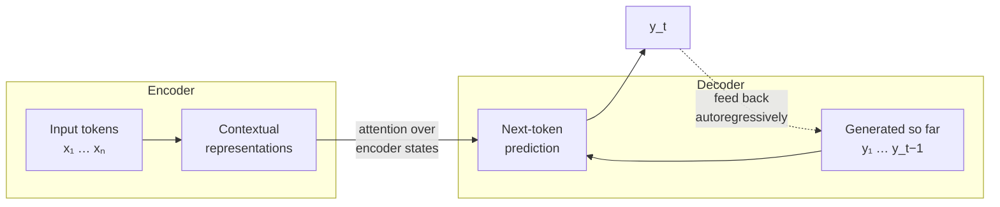

# Sequence-to-Sequence Tasks: Summarization, Translation and QA

> **TL;DR:** Sequence-to-sequence models map variable-length text to variable-length text: an encoder compresses the input into a representation, a decoder generates the output token by token. Summarization, translation, and question answering are all instances of this one framing.

---

## Overview

Classification maps text to a fixed label. Many of NLP's most valuable tasks don't fit that mold: a summary, a translation, or an answer is itself *text* of unpredictable length. This lesson introduces the sequence-to-sequence (seq2seq) framing that unifies these tasks, the encoder–decoder architecture behind it, and the practical trade-offs of each task — then runs all three with Hugging Face pipelines.

**By the end, you will be able to:**
- Explain the encoder–decoder idea and why it generalizes classification to text-to-text tasks.
- Contrast extractive vs abstractive summarization and extractive vs generative QA, including their failure modes.
- Run summarization, translation, and question-answering with Hugging Face `pipeline()` and interpret the outputs.

---

## Intuition

Think of a professional interpreter at a conference. She does not swap words one-for-one — that produces gibberish, because languages differ in word order, idiom, and grammar. Instead she **listens to a whole sentence, forms an internal understanding, then re-expresses that understanding** in the target language.

That two-phase process *is* the encoder–decoder architecture:

1. **Encoder** — read the entire input and compress it into a rich internal representation ("understanding").
2. **Decoder** — generate the output one token at a time, each token conditioned on that representation *and* on what has been generated so far ("re-expression").

Once you see this shape, summarization ("re-express, but shorter"), translation ("re-express, in another language"), and question answering ("re-express the relevant part as an answer") are the same machine pointed at different data.

---

## Details

### The seq2seq framing

A seq2seq model learns a mapping from an input token sequence $x = (x_1, \dots, x_n)$ to an output sequence $y = (y_1, \dots, y_m)$, where $n$ and $m$ vary per example. Generation is autoregressive — each output token is predicted from the input and the previously generated tokens:

$$P(y \mid x) = \prod_{t=1}^{m} P(y_t \mid y_{<t},\, x)$$

where $y_{<t}$ denotes the tokens generated before step $t$.

Historically, encoder and decoder were recurrent networks (RNNs), which squeezed the whole input into a single fixed vector — a bottleneck for long inputs. **Attention** let the decoder look back at all encoder states, and the **Transformer** architecture then replaced recurrence with attention entirely. Modern seq2seq models (BART, T5, translation models like Marian) are transformer encoder–decoders — the architecture is covered in depth in [Module 6 — Transformers](../../06-transformers/README.md).

### Summarization

Two fundamentally different strategies:

| | Extractive | Abstractive |
|---|---|---|
| **Mechanism** | Select and concatenate existing sentences | Generate new sentences |
| **Faithfulness** | High — every sentence is verbatim from the source | At risk — the model can **hallucinate** facts |
| **Fluency** | Can be choppy, redundant | Fluent, concise |
| **Typical method** | Sentence scoring/ranking | Encoder–decoder transformer |

**Faithfulness is the central risk of abstractive summarization**: the model may state things the source never said (wrong numbers, invented names, merged entities). This risk carries directly into LLM applications — treat any generated summary as unverified until checked against the source.

```python
from transformers import pipeline

summarizer = pipeline("summarization", model="facebook/bart-large-cnn")
article: str = (
    "The city council voted on Tuesday to approve a new cycling "
    "infrastructure plan. The plan allocates funding for 40 kilometres "
    "of protected bike lanes over five years, following two years of "
    "public consultation. Local business groups had initially opposed "
    "the plan, citing parking concerns, but withdrew objections after "
    "amendments preserved loading zones on commercial streets."
)
summary = summarizer(article, max_length=45, min_length=15, do_sample=False)
print(summary[0]["summary_text"])
```

`min_length`/`max_length` are in *tokens*, not words. `do_sample=False` gives deterministic beam-search output — start there for reproducibility.

### Machine translation

Three eras, each subsuming the last:

1. **Rule-based (1950s–1990s):** hand-written bilingual dictionaries and grammar rules. Brittle, endless exceptions.
2. **Statistical MT (1990s–2015):** learn phrase-level translation probabilities from parallel corpora. Better, but assembled translations from fragments with limited context.
3. **Neural MT (2015–):** seq2seq models translate whole sentences in context; today the dominant approach.

Why does context matter so much?

- **Idioms:** "it's raining cats and dogs" must not be translated word-for-word.
- **Gender and agreement:** translating "the doctor said she..." into a language with grammatical gender requires resolving who *she* is.
- **Word order:** English subject–verb–object vs Japanese subject–object–verb — you cannot translate the verb until you've read the whole clause.

```python
from transformers import pipeline

translator = pipeline("translation", model="Helsinki-NLP/opus-mt-en-fr")
result = translator("The agreement was signed after months of negotiation.")
print(result[0]["translation_text"])
```

The `Helsinki-NLP/opus-mt-*` family covers hundreds of language pairs; pick the model for your pair explicitly.

### Question answering

Two distinct formulations:

- **Extractive QA:** given a *question* and a *context* passage, select the answer **span** inside the context — the model predicts a start and end position, SQuAD-style. The answer is guaranteed to be verbatim text from the context (no hallucinated wording), but it must exist there.
- **Generative / open-book QA:** the model *generates* an answer conditioned on retrieved context. More flexible (can synthesize across passages, rephrase), but inherits the hallucination risk of generation. This retrieve-then-generate pattern is the foundation of **Retrieval-Augmented Generation** — see [Module 9 — RAG](../../09-rag/README.md).

```python
from transformers import pipeline

qa = pipeline("question-answering", model="distilbert-base-cased-distilled-squad")
result = qa(
    question="How many kilometres of bike lanes does the plan fund?",
    context=(
        "The city council approved a cycling plan that allocates funding "
        "for 40 kilometres of protected bike lanes over five years."
    ),
)
print(result)  # {'score': ..., 'start': ..., 'end': ..., 'answer': '40 kilometres'}
```

The `score` is the model's span confidence — threshold it to abstain instead of returning garbage when the context does not contain an answer.

## Diagram



The decoder attends to *all* encoder states at every step — this attention link is what freed seq2seq models from the single-vector bottleneck of early RNN designs.

---

## Worked Example

One document, all three tasks — a mini multilingual news assistant.

```python
from transformers import pipeline

article: str = (
    "Researchers at the university announced a low-cost water filter made "
    "from rice husks. In laboratory tests the filter removed 99 percent of "
    "lead from contaminated samples. The team plans field trials next year "
    "and estimates a production cost of under two dollars per unit."
)

summarizer = pipeline("summarization", model="facebook/bart-large-cnn")
translator = pipeline("translation", model="Helsinki-NLP/opus-mt-en-fr")
qa = pipeline("question-answering", model="distilbert-base-cased-distilled-squad")

# 1. Summarize
summary: str = summarizer(article, max_length=30, min_length=10, do_sample=False)[0]["summary_text"]
print("SUMMARY:", summary)

# 2. Translate the summary to French
print("FRENCH:", translator(summary)[0]["translation_text"])

# 3. Ask a question against the original article
answer = qa(question="How much will one filter cost to produce?", context=article)
print(f"ANSWER: {answer['answer']}  (confidence {answer['score']:.2f})")
```

Three checks to make on the output:

1. **Summary faithfulness** — does the summary contain only facts from the article? Verify "99 percent" and "lead" were not altered; abstractive models sometimes mangle numbers.
2. **Translation of the summary, not the article** — chaining tasks compounds errors: a hallucination in step 1 gets faithfully translated in step 2. Keep chains short and validate intermediate outputs.
3. **QA grounding** — the answer "under two dollars" is a verbatim span, and the confidence score tells you how much to trust it.

---

## Best Practices

- ✅ Pin exact model names in `pipeline()` calls — defaults change between library versions and break reproducibility.
- ✅ For summarization, verify numbers, names, and negations against the source; these are the most-hallucinated details.
- ✅ Use extractive QA when answers must be verbatim and auditable; use generative QA when synthesis across sources is required.
- ✅ Set `do_sample=False` (deterministic decoding) while developing and evaluating; add sampling only when you deliberately want variety.
- ✅ Chunk long inputs — every model has a maximum input length, and silent truncation of the input is a silent quality bug.

## Common Mistakes

- ⚠️ **Feeding inputs longer than the model's context window.** The tail is truncated silently and the summary misses it. Fix: check token counts and chunk or use a long-context model.
- ⚠️ **Trusting abstractive summaries as ground truth.** They read fluently even when wrong. Fix: spot-check against the source; consider extractive methods for high-stakes domains.
- ⚠️ **Using one translation model for every language pair.** Quality varies enormously by pair and direction. Fix: evaluate per pair; pick pair-specific models.
- ⚠️ **Returning extractive QA answers without a confidence threshold.** The model always returns *some* span, even for unanswerable questions. Fix: threshold `score` and abstain below it.

## Industry Tips

- 💡 In regulated domains (legal, medical, finance), extractive approaches survive audits that abstractive ones fail — "show me where the source says that" must have an answer.
- 💡 Latency scales with *output* length in autoregressive decoding; capping `max_length` is your cheapest performance lever.
- 💡 Most production QA today is generative QA over retrieved documents (RAG); the extractive span-selection skills in this lesson become the "grounding and citation" layer of those systems.

## Real-World Use Cases

- News and meeting summarization: condense articles, transcripts, and email threads into briefs.
- Localization: neural MT with human post-editing for product content across markets.
- Customer-facing QA: answer questions grounded in help-center documents, with confidence-based escalation to humans.
- Report drafting: summarize structured findings across many documents (with faithfulness review).

---

## Summary

- Seq2seq maps variable-length text to variable-length text via an encoder (understand) and a decoder (generate), with attention connecting them; modern implementations are transformers.
- Summarization splits into extractive (faithful, choppy) and abstractive (fluent, hallucination-prone); translation went rule-based → statistical → neural because context — idioms, gender, word order — demands whole-sequence understanding.
- QA is either extractive (span selection, auditable) or generative (flexible, foundation of RAG); Hugging Face `pipeline()` gives you working versions of all three tasks in a few lines.

## Practice

- [ ] Exercises: [Module 5 Exercises](../exercises/README.md)
- [ ] Self-check: Why can an abstractive summarizer hallucinate while an extractive one cannot — and what does that imply for which you'd deploy in a medical setting?

## Further Reading

- 📘 Speech and Language Processing — Jurafsky & Martin (https://web.stanford.edu/~jurafsky/slp3/)
- 📄 [Hugging Face documentation](https://huggingface.co/docs)

## Related

- [Sentiment Analysis](sentiment-analysis.md)
- [NLP Evaluation Metrics](nlp-evaluation-metrics.md)
- [Module 6 — Transformers](../../06-transformers/README.md)
- [Module 9 — RAG](../../09-rag/README.md)

---

## Navigation

- ⬆️ [Lessons](README.md)
- 📚 [Module 5 — Natural Language Processing](../README.md)
- 🏠 [Knowledge Base Home](../../README.md)
