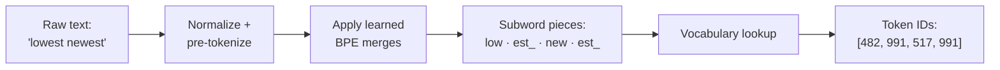

# Tokenization

> **TL;DR:** Tokenization splits text into the units a model actually sees. Word-level splitting breaks on unknown words, character-level makes sequences too long — subword tokenization (BPE, WordPiece, SentencePiece) is the modern compromise used by essentially every LLM.

---

## Overview

A model never sees "text" — it sees a sequence of integer IDs, one per token. The tokenizer defines that mapping, so it is the contract between raw language and the model. For AI engineering this is not a detail: tokenizer choice determines vocabulary size, how well a model handles typos, rare words, code, and non-English text, and even how much an API call costs (LLM pricing is per token).

**By the end, you will be able to:**
- Compare word-, character-, and subword-level tokenization and their trade-offs
- Trace the BPE merge algorithm by hand on a tiny corpus
- Use Hugging Face tokenizers to inspect how real models split text

---

## Intuition

Imagine building a dictionary for a model. One extreme: an entry per *word*. The dictionary is huge, and the first time someone writes "untokenizable" — a word not in it — you are stuck. Other extreme: an entry per *character*. Only ~100 entries and nothing is ever unknown, but "internationalization" becomes 20 tiny pieces and the model must relearn spelling before it can learn meaning.

Subword tokenization splits the difference: keep frequent words whole ("the", "and"), and break rare words into frequent, meaningful chunks ("untokenizable" → "un" + "token" + "izable"). Frequency decides the pieces. Nothing is ever out-of-vocabulary, the vocabulary stays manageable (~30k–100k), and pieces often align with morphemes for free.

---

## Details

### What is a token?

A **token** is the atomic unit of text a model processes — a word, a character, a punctuation mark, or a subword fragment, depending on the tokenizer. Tokenization maps a string to a token sequence; a companion vocabulary maps each token to an integer ID.

### Word-level tokenization and its problems

Split on whitespace/punctuation; each distinct word is a vocabulary entry.

- **OOV (out-of-vocabulary):** any word unseen at training time becomes a useless `<UNK>` token — typos, new slang, names, and rare inflections all break.
- **Huge vocabulary:** large corpora contain hundreds of thousands of distinct word forms; the embedding matrix (vocab size × embedding dim) dominates memory.
- **Morphology is invisible:** "run", "runs", "running" get unrelated IDs, so the model cannot share what it learns between them.
- **Language-dependent:** whitespace splitting fails for languages without spaces (Chinese, Japanese, Thai).

### Character-level tokenization

Every character is a token. Vocabulary is tiny and OOV disappears, but:

- Sequences get several times longer, and attention cost in transformers grows quadratically with sequence length.
- Individual characters carry almost no meaning, so the model spends capacity reconstructing words.

### Subword tokenization: BPE

**Byte-Pair Encoding (BPE)** (adapted for NLP by Sennrich et al., 2016; see Jurafsky & Martin ch. on tokenization) learns a vocabulary bottom-up: start from characters, repeatedly merge the most frequent adjacent pair, record each merge as a rule.

Walk through it by hand. Tiny corpus (word: count), with `_` marking end-of-word:

```text
low: 5      lower: 2      newest: 6      widest: 3
```

Initial symbol sequences:

```text
l o w _         (×5)
l o w e r _     (×2)
n e w e s t _   (×6)
w i d e s t _   (×3)
```

Count adjacent pairs, merge the most frequent, repeat:

1. `(e, s)` appears 6 + 3 = 9 times → merge into `es`
   - `n e w es t _` (×6), `w i d es t _` (×3)
2. `(es, t)` appears 9 times → merge into `est`
3. `(est, _)` appears 9 times → merge into `est_`
4. `(l, o)` appears 5 + 2 = 7 times → merge into `lo`
5. `(lo, w)` appears 7 times → merge into `low`
6. ... and so on until you reach the target vocabulary size.

The learned merges are the tokenizer. At inference, apply them in the same order to new text: "lowest" (never seen as a word!) becomes `low` + `est_` — two meaningful, known pieces instead of `<UNK>`. GPT-family models use byte-level BPE, which starts from raw bytes so *any* string is tokenizable.

### WordPiece and SentencePiece

- **WordPiece** (used by BERT) is similar to BPE but chooses merges that maximize the training-data likelihood under a language model rather than raw pair frequency. Word-internal continuation pieces are marked with `##`: "playing" → `play` + `##ing`.
- **SentencePiece** is a library that treats input as a raw character stream — no whitespace pre-splitting — encoding spaces as a visible symbol (`▁`). That makes it language-agnostic (works for Japanese and English alike) and exactly reversible. It implements BPE and the **Unigram** algorithm (which starts from a large candidate vocabulary and prunes it). Used by T5, Llama, and many multilingual models.

### Special tokens

Real tokenizers add control tokens with reserved IDs — conceptually:

- `[CLS]` — sequence-level slot prepended by BERT; its final hidden state is used for classification
- `[SEP]` / `</s>` — separates or ends segments (e.g., question vs. context)
- `<s>` — beginning-of-sequence in GPT/Llama-style models
- `[PAD]`, `[UNK]`, `[MASK]` — padding, unknown fallback, masked-LM training

You rarely add these yourself; the tokenizer inserts them, but you must know they exist when counting tokens or slicing sequences.

### Why tokenization matters for LLMs

Tokenizers are trained once, on a particular corpus, and frozen — the model inherits every bias. English-centric tokenizers fragment other languages into many more tokens, making them slower and more expensive per sentence. Numbers split inconsistently ("2024" may be one token, "20 24" two), which affects arithmetic. Context windows and API pricing are measured in tokens, not words. See [Large Language Models](../../07-large-language-models/README.md) for how this plays out at scale.

### Python: from regex to real tokenizers

A minimal whitespace/regex tokenizer:

```python
import re

def simple_tokenize(text: str) -> list[str]:
    """Split into words and standalone punctuation."""
    return re.findall(r"\w+|[^\w\s]", text)

print(simple_tokenize("Don't panic — it's fine."))
# ['Don', "'", 't', 'panic', '—', 'it', "'", 's', 'fine', '.']
```

Now a real subword tokenizer via Hugging Face (`pip install transformers`):

```python
from transformers import AutoTokenizer

tok = AutoTokenizer.from_pretrained("bert-base-uncased")

text = "Tokenization handles unseen words gracefully."
pieces: list[str] = tok.tokenize(text)
print(pieces)
# e.g. ['token', '##ization', 'handles', 'unseen', 'words', 'gracefully', '.']

encoded = tok(text)
print(encoded["input_ids"])       # integer IDs, with [CLS]/[SEP] added
print(tok.decode(encoded["input_ids"]))
# '[CLS] tokenization handles unseen words gracefully. [SEP]'
```

Note the `##` continuation marks (WordPiece) and the automatically inserted special tokens. Always load the tokenizer that matches your model checkpoint — IDs are meaningless across vocabularies.

## Diagram



## Worked Example

Train-time corpus contained "low", "lower", "newest", "widest" — never "lowest". A word-level tokenizer maps "lowest" to `<UNK>` and the model learns nothing. The BPE tokenizer trained above instead applies its merges:

```text
"lowest" → l o w e s t _
         → l o w es t _      (merge 1: e+s)
         → l o w est _       (merge 2: es+t)
         → l o w est_        (merge 3: est+_)
         → lo w est_         (merge 4: l+o)
         → low est_          (merge 5: lo+w)
```

Result: `low` + `est_`. The model already has rich representations for both pieces — "low" from 7 training occurrences, "est_" from 9 superlative endings — so it can generalize to a word it never saw. This compositionality is exactly why every modern LLM uses subword tokenization.

## Best Practices

- ✅ Always use the tokenizer shipped with your model checkpoint (`AutoTokenizer.from_pretrained` with the same name) — never mix vocabularies.
- ✅ Count tokens (not characters or words) when budgeting for context windows and API cost.
- ✅ Pass near-raw text to subword tokenizers; they expect natural casing and punctuation.
- ✅ For multilingual or space-free languages, prefer SentencePiece-based tokenizers.

## Common Mistakes

- ⚠️ Tokenizing with one model's tokenizer and feeding IDs to another — IDs are vocabulary-specific; always pair tokenizer and model.
- ⚠️ Estimating "1 token = 1 word" — English averages roughly 1.3+ tokens per word and other languages more; measure with the actual tokenizer.
- ⚠️ Forgetting special tokens when computing sequence lengths — `[CLS]`/`[SEP]` consume slots from your maximum length.
- ⚠️ Aggressively preprocessing (stemming, stopword removal) before a subword tokenizer — this destroys patterns the tokenizer was trained on.

## Industry Tips

- 💡 The Hugging Face `tokenizers` library (Rust-backed) is what runs under `AutoTokenizer` "fast" tokenizers — use it directly to train a custom BPE vocabulary on domain text (legal, medical, code).
- 💡 When latency or cost bites, inspect token counts per language/domain in your traffic: verbose tokenization of non-English text is a common hidden cost multiplier.
- 💡 Odd model behavior on numbers, URLs, or rare strings is often a tokenization artifact — print `tok.tokenize(problem_string)` before blaming the model.

## Real-World Use Cases

- Every LLM API call: prompt and completion are billed and window-limited in tokens
- Training domain-specific models where a custom subword vocabulary shrinks sequences (e.g., code models keeping `def` and `self` whole)
- Multilingual search and translation systems using SentencePiece for consistent handling across scripts
- Estimating and controlling context usage in RAG pipelines (chunk sizes are token budgets)

---

## Summary

- Word-level tokenization suffers OOV and huge vocabularies; character-level yields tiny vocabularies but impractically long sequences.
- Subword algorithms (BPE by pair frequency, WordPiece by likelihood, SentencePiece over raw streams) keep frequent words whole and split rare words into known pieces — no token is ever unknown.
- Tokenizer and model are inseparable: use the matching tokenizer, count tokens for cost/limits, and remember the tokenizer's training data biases everything downstream.

## Practice

- [ ] Exercises: [Module 5 Exercises](../exercises/README.md)
- [ ] Self-check: Given the corpus `{low×5, lower×2, newest×6, widest×3}`, what are the first three BPE merges and why?

## Further Reading

- 📘 Speech and Language Processing — Jurafsky & Martin (https://web.stanford.edu/~jurafsky/slp3/)
- 📄 [Hugging Face documentation](https://huggingface.co/docs)
- 📄 [spaCy documentation](https://spacy.io/)
- 📄 [NLTK documentation](https://www.nltk.org/)

## Related

- [Text Preprocessing](text-preprocessing.md)
- [Word Embeddings](word-embeddings.md)
- [Large Language Models](../../07-large-language-models/README.md) — tokenizers at LLM scale

---

## Navigation

- ⬆️ [Lessons](README.md)
- 📚 [Module 5 — Natural Language Processing](../README.md)
- 🏠 [Knowledge Base Home](../../README.md)
