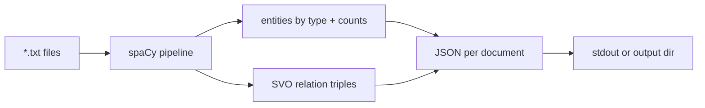

# Mini Project: Entity Extractor CLI

> **What you'll build:** `extract-entities` — a CLI that reads text files and
> emits structured JSON: entities by type, their counts, and simple
> subject–verb–object relations.

---

## Objective

Turning unstructured documents into structured data is one of NLP's most
commercially useful moves. You'll combine spaCy's NER and dependency parser into
a practical extraction tool with clean, testable output.

## Learning Goals

- Drive spaCy's pipeline programmatically over many documents.
- Combine NER spans with dependency-tree navigation for relations.
- Design structured, machine-readable output for downstream use.

---

## Prerequisites

- [POS Tagging and NER](../lessons/pos-tagging-and-ner.md), [Dependency Parsing](../lessons/dependency-parsing.md)
- spaCy + `en_core_web_sm`.

## Architecture

---

## Steps

### 1. CLI skeleton
`extract-entities <path> [--json-out DIR]` reading one file or a folder;
process with `nlp.pipe(...)` for efficiency.

### 2. Entity extraction
Collect entities grouped by label with frequencies; deduplicate surface forms
(case-fold, strip whitespace).

### 3. Relations
Reuse the SVO-triple logic from the
[extraction exercise](../exercises/extract-entities-and-triples.md), expanding
subjects/objects to entity spans where they overlap.

### 4. Output
Emit stable, documented JSON: `{file, entities: {ORG: [...], PERSON: [...]},
relations: [[s, v, o], ...]}`.

### 5. Test
Unit-test the pure extraction functions on fixed sentences; add a golden-file
test for one sample document.

---

## Deliverables

- [ ] Installable CLI with `nlp.pipe` batch processing.
- [ ] Documented JSON schema + golden-file test.
- [ ] `README.md` with usage and example output.

## Success Criteria

Running the CLI on a folder of news articles produces correct, deduplicated
entities and plausible relations, with tests pinning the output format.

---

## Extensions (Optional)

- 🚀 Add an `EntityRuler` for a custom domain entity (e.g. product codes).
- 🚀 Aggregate entities across a corpus into a simple co-occurrence graph.

## Further Reading

- [spaCy documentation](https://spacy.io/)
- Related: [Knowledge graphs in RAG](../../09-rag/README.md)

---

## Navigation

- ⬆️ [Module 5 Mini Projects](README.md)
- 📚 [Module 5 — Natural Language Processing](../README.md)
- 🏠 [Knowledge Base Home](../../README.md)
