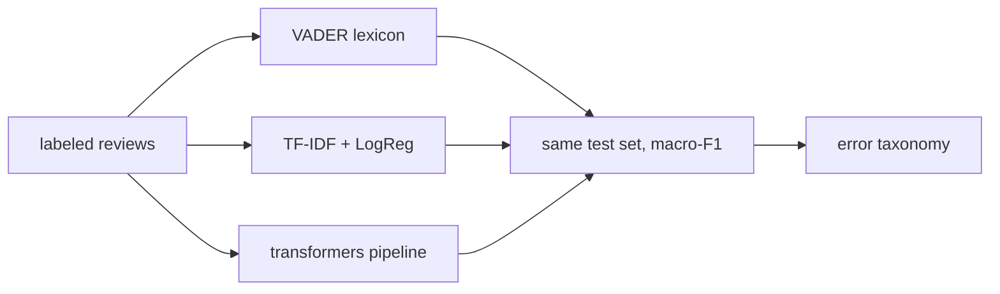

# Mini Project: Review Sentiment Analyzer

> **What you'll build:** A three-way comparison of sentiment approaches — VADER,
> TF-IDF + logistic regression, and a transformer pipeline — on real product or
> movie reviews, ending in an error taxonomy.

---

## Objective

Sentiment analysis looks trivial until you meet negation, sarcasm, and "the
battery life is great but everything else is trash." You'll measure how three
approach families really behave on the same data and build a taxonomy of what
still fails.

## Learning Goals

- Run lexicon, classical, and transformer sentiment methods side by side.
- Quantify their trade-offs (accuracy vs cost vs data needs).
- Produce an error taxonomy from real misclassifications.

---

## Prerequisites

- [Sentiment Analysis](../lessons/sentiment-analysis.md), [Text Classification](../lessons/text-classification.md)
- A labeled review dataset (e.g. IMDB or any public review corpus).

## Architecture

---

## Steps

### 1. Data
Sample a manageable subset (e.g. 2–5k reviews); fixed stratified test set.

### 2. Three systems
(a) NLTK **VADER** compound score with a threshold; (b) leak-free TF-IDF +
logistic regression trained on your training split; (c) Hugging Face
`pipeline("sentiment-analysis")` out of the box.

### 3. Compare
Macro-F1 on the identical test set; also note qualitative costs — VADER needs no
training, the transformer needs no labels but the most compute.

### 4. Error taxonomy
Collect misclassifications from the best system; hand-label 30 of them into
categories (negation, sarcasm, mixed aspects, neutral-mislabeled, domain
polarity); report the distribution.

### 5. Write up
When would you ship each system? Tie the answer to data availability, latency,
and the error taxonomy.

---

## Deliverables

- [ ] Three working systems evaluated on one test set.
- [ ] Comparison table (macro-F1 + qualitative costs).
- [ ] A 30-example error taxonomy with counts.
- [ ] `README.md` with the ship-it recommendation.

## Success Criteria

The comparison is apples-to-apples, the taxonomy is grounded in real examples,
and the recommendation follows from the evidence rather than hype.

---

## Extensions (Optional)

- 🚀 Add aspect-based extraction (dependency parse) for "great X but terrible Y".
- 🚀 Fine-tune a small transformer on your training split and add it as system (d).

## Further Reading

- Speech and Language Processing — Jurafsky & Martin (https://web.stanford.edu/~jurafsky/slp3/)
- [Hugging Face documentation](https://huggingface.co/docs)

---

## Navigation

- ⬆️ [Module 5 Mini Projects](README.md)
- 📚 [Module 5 — Natural Language Processing](../README.md)
- 🏠 [Knowledge Base Home](../../README.md)
