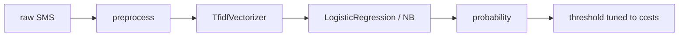

# Mini Project: SMS Spam Classifier

> **What you'll build:** A spam filter for SMS messages using the classical NLP
> recipe, evaluated the right way for imbalanced classes.

---

## Objective

Spam filtering is the "hello world" of NLP with a twist that makes it
instructive: the classes are imbalanced and the cost of errors is asymmetric
(blocking a real message is worse than letting one spam through). You'll build
the classical pipeline end to end and defend a decision threshold.

## Learning Goals

- Apply the preprocess → vectorize → classify recipe cleanly.
- Evaluate with precision/recall on the minority class, not accuracy.
- Choose and justify a decision threshold from error costs.

---

## Prerequisites

- [Text Classification](../lessons/text-classification.md), [Classical Text Representation](../lessons/text-representation.md)
- A public SMS spam dataset (e.g. the UCI SMS Spam Collection).

## Architecture

---

## Steps

### 1. Explore
Load the data; measure the ham/spam imbalance; read 20 messages of each class.

### 2. Pipeline
`TfidfVectorizer` (with word + char n-grams — char n-grams are robust to
obfuscations like "fr33") + logistic regression, in one leak-free `Pipeline`.

### 3. Evaluate properly
Stratified CV with macro-F1; then a held-out test report: precision, recall, F1
per class and the confusion matrix. Compare against a majority-class baseline.

### 4. Tune the threshold
Pick an operating point that keeps ham-precision very high (justify the cost
reasoning); show the resulting trade-off.

### 5. Inspect
Top spam-indicative features (model coefficients) and the misclassified messages.

---

## Deliverables

- [ ] Leak-free pipeline + evaluation script.
- [ ] Test report with per-class metrics and confusion matrix.
- [ ] Threshold justification and top-feature analysis.
- [ ] `README.md` with results.

## Success Criteria

Clearly beats the majority baseline on spam recall while keeping ham precision
near-perfect, with the trade-off argued from costs — not from accuracy.

---

## Extensions (Optional)

- 🚀 Swap in sentence embeddings and compare (short texts favor them).
- 🚀 Package it behind a `classify(text)` API with the preprocessing baked in.

## Further Reading

- [scikit-learn — working with text data](https://scikit-learn.org/stable/)
- Related: [the misleading-accuracy debug exercise](../../03-machine-learning/exercises/debug-imbalanced-accuracy.md)

---

## Navigation

- ⬆️ [Module 5 Mini Projects](README.md)
- 📚 [Module 5 — Natural Language Processing](../README.md)
- 🏠 [Knowledge Base Home](../../README.md)
